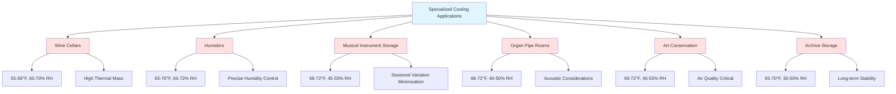

Specialized cooling applications require precision environmental control far exceeding standard comfort HVAC systems. These applications demand simultaneous control of temperature, humidity, air velocity, and air quality to protect valuable materials, ensure process quality, or maintain cultural artifacts.

## Fundamental Heat Transfer Considerations

Specialized cooling systems must address three heat transfer modes with exceptional precision:

**Conduction** through building envelope affects baseline cooling load:

$$Q_{cond} = \frac{k \cdot A \cdot \Delta T}{L}$$

Where:
- $Q_{cond}$ = conductive heat transfer (W)
- $k$ = thermal conductivity (W/m·K)
- $A$ = surface area (m²)
- $\Delta T$ = temperature difference (K)
- $L$ = material thickness (m)

**Convection** from internal air movement must be minimized to prevent localized temperature variations:

$$Q_{conv} = h \cdot A \cdot (T_s - T_\infty)$$

Where:
- $h$ = convective heat transfer coefficient (W/m²·K)
- $T_s$ = surface temperature (K)
- $T_\infty$ = ambient air temperature (K)

**Radiation** heat gains from lighting and solar exposure require careful management:

$$Q_{rad} = \epsilon \cdot \sigma \cdot A \cdot (T_1^4 - T_2^4)$$

Where:
- $\epsilon$ = emissivity (dimensionless)
- $\sigma$ = Stefan-Boltzmann constant (5.67 × 10⁻⁸ W/m²·K⁴)

## Psychrometric Precision Requirements

Humidity control represents the critical challenge in specialized cooling. The relationship between temperature and moisture content determines material stability:

$$RH = \frac{P_v}{P_{sat}(T)} \times 100\%$$

Where:
- $RH$ = relative humidity (%)
- $P_v$ = partial pressure of water vapor (Pa)
- $P_{sat}$ = saturation pressure at temperature T (Pa)

The absolute moisture content remains constant during sensible cooling, but relative humidity increases as temperature decreases:

$$W = 0.622 \cdot \frac{P_v}{P_{atm} - P_v}$$

Where $W$ = humidity ratio (kg water/kg dry air).

This fundamental relationship explains why specialized cooling systems require coordinated temperature and humidity control. Cooling alone increases relative humidity, potentially causing condensation, mold growth, or material damage.

## Cooling Load Calculation Methodology

Total cooling load for specialized applications includes sensible and latent components:

$$Q_{total} = Q_{sensible} + Q_{latent}$$

**Sensible Heat Ratio (SHR)** determines equipment selection:

$$SHR = \frac{Q_{sensible}}{Q_{total}}$$

Specialized applications typically have high SHR (0.85-0.95) because internal moisture generation is minimal. This requires cooling equipment optimized for sensible cooling rather than standard comfort cooling equipment.

**Ventilation load** must account for outdoor air infiltration and required air exchange:

$$Q_{vent} = \dot{m} \cdot c_p \cdot \Delta T + \dot{m} \cdot h_{fg} \cdot \Delta W$$

Where:
- $\dot{m}$ = mass flow rate (kg/s)
- $c_p$ = specific heat of air (1.006 kJ/kg·K)
- $h_{fg}$ = latent heat of vaporization (2501 kJ/kg at 0°C)
- $\Delta W$ = humidity ratio difference (kg/kg)

## Temperature Stability and Control

Precision applications require temperature stability within ±0.5°C to ±2°C depending on application. This demands:

**Proportional-Integral-Derivative (PID) control** for minimizing temperature oscillations. The control signal responds to:

$$u(t) = K_p \cdot e(t) + K_i \int_0^t e(\tau)d\tau + K_d \frac{de(t)}{dt}$$

Where:
- $e(t)$ = error signal (setpoint - measured temperature)
- $K_p$, $K_i$, $K_d$ = tuning constants

**Thermal mass utilization** dampens temperature swings. The temperature rate of change depends on thermal capacitance:

$$\frac{dT}{dt} = \frac{Q_{net}}{m \cdot c_p}$$

High thermal mass spaces (wine cellars with stone walls) naturally resist temperature fluctuations, reducing cooling system cycling.

## Air Distribution Principles

Specialized cooling requires laminar, low-velocity air distribution to prevent:
- Local temperature stratification
- Moisture condensation on cold surfaces
- Material damage from direct air impingement

**Maximum recommended air velocity** near sensitive materials: 0.1-0.25 m/s

**Supply air temperature differential** should be minimal (3-6°C) to reduce temperature gradients and prevent overcooling.

**Air change rate** varies by application but typically ranges from 2-6 ACH for enclosed specialty spaces.

## System Architecture Approaches

## Specialty Cooling Requirements Comparison

| Application | Temperature (°F) | Humidity (%RH) | Stability | Air Changes/Hr | Critical Factor |
|-------------|------------------|----------------|-----------|----------------|-----------------|
| Wine Cellar | 55-58 | 60-70 | ±2°F | 2-4 | Vibration-free, darkness |
| Cigar Humidor | 65-70 | 65-72 | ±1°F | 3-5 | Precise RH control |
| Musical Instruments | 68-72 | 45-55 | ±1°F | 4-6 | Seasonal stability |
| Organ Pipe Rooms | 68-72 | 40-50 | ±0.5°F | 3-5 | Acoustic isolation |
| Art Conservation | 68-72 | 45-55 | ±2°F | 4-8 | Filtration, UV control |
| Archive Storage | 65-70 | 30-50 | ±3°F | 2-4 | Low RH, air quality |
| Museum Displays | 70-72 | 45-55 | ±1°F | 6-10 | Display case microclimate |
| Photography Storage | 65-68 | 30-40 | ±2°F | 2-3 | Very low RH |

## Equipment Selection Criteria

Specialized cooling equipment must provide:

1. **Modulating capacity control** - Prevents temperature overshoot and excessive cycling
2. **Integrated humidity control** - Simultaneous temperature/humidity management
3. **Low noise operation** - Critical for occupied spaces and acoustic sensitivity
4. **Minimal vibration** - Protects sensitive materials and wine sediment
5. **Air quality features** - Filtration, activated carbon, UV sterilization
6. **Redundancy options** - Backup systems for high-value applications

Equipment oversizing is particularly problematic in specialized cooling because:
- Short cycling increases humidity fluctuations
- Poor latent heat removal at part-load
- Temperature overshoot from excessive capacity
- Reduced equipment lifespan

**Proper sizing guideline**: Equipment should run 60-80% of design load during peak conditions.

## Monitoring and Alarming

Precision applications require continuous monitoring with:
- Temperature sensors: ±0.1°C accuracy, multiple locations
- Humidity sensors: ±2% RH accuracy, calibrated annually
- Dew point monitoring for condensation prevention
- Data logging for trend analysis
- Remote alarming for equipment failure or condition deviation

The relationship between monitored conditions and material preservation depends on cumulative exposure, not instantaneous readings. Time-weighted average conditions matter more than brief excursions.

## Energy Efficiency Considerations

Specialized cooling systems typically consume 2-4× the energy per square foot of standard HVAC due to:
- Continuous operation requirements
- High outdoor air humidity rejection (latent load)
- Tight setpoint tolerances requiring constant adjustment
- Refrigerant reheat for humidity control

Energy optimization strategies include:
- High-efficiency compressors with variable speed drives
- Heat recovery for reheat applications
- Thermal storage to shift load to off-peak hours
- Enhanced building envelope insulation
- Vapor barriers to minimize moisture infiltration

These specialized cooling applications represent the intersection of precision engineering, thermodynamics, and material science, requiring expert design and careful commissioning to achieve performance objectives.
