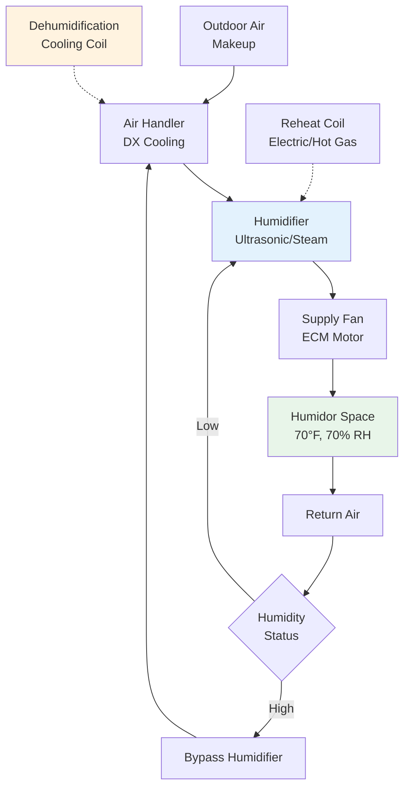

Commercial humidor HVAC systems maintain the precise environmental conditions required for proper cigar storage and aging through simultaneous control of temperature, relative humidity, and air circulation. The critical parameters—relative humidity between 65-75% and temperature between 68-72°F (20-22°C)—preserve tobacco moisture content, prevent mold growth, and ensure optimal aging chemistry while protecting inventory valued at hundreds of dollars per box.

## Cigar Storage Environmental Requirements

The physics of tobacco moisture equilibrium dictates humidor conditions. Cigar tobacco maintains moisture content through sorption isotherms that relate equilibrium moisture content to ambient relative humidity:

$$M_e = f(\text{RH}, T)$$

where $M_e$ is equilibrium moisture content (% dry basis), RH is relative humidity (decimal), and $T$ is temperature (°C).

**Standard Storage Conditions:**

| Parameter | Range | Optimal Setpoint | Tolerance |
|-----------|-------|------------------|-----------|
| Temperature | 68-72°F | 70°F (21°C) | ±1°F |
| Relative Humidity | 65-75% | 70% | ±2% RH |
| Air Velocity | < 50 fpm | 25-30 fpm | Avoid stagnation |
| Temperature Gradient | N/A | < 2°F vertical | Minimize stratification |

These conditions prevent three primary failure modes:

1. **Beetle infestation** (Lasioderma serricorne) above 72°F with adequate humidity
2. **Mold growth** (Aspergillus, Penicillium species) above 75% RH
3. **Tobacco desiccation** below 62% RH causing wrapper cracking and flavor deterioration

The water activity ($a_w$) at 70% RH is 0.70, which inhibits most microbial growth while maintaining pliable tobacco structure.

## Psychrometric Considerations

Maintaining stable RH during temperature swings requires understanding the inverse relationship between temperature and relative humidity at constant absolute moisture content.

The humidity ratio remains constant during sensible cooling or heating:

$$W = 0.622 \cdot \frac{P_v}{P_{atm} - P_v}$$

where $W$ is humidity ratio (lb water/lb dry air), $P_v$ is water vapor partial pressure (psia), and $P_{atm}$ is atmospheric pressure (psia).

However, relative humidity changes significantly:

$$\text{RH} = \frac{P_v}{P_{sat}(T)} \times 100\%$$

A temperature increase from 68°F to 72°F at constant humidity ratio reduces RH from 70% to approximately 62%, demonstrating the need for active humidification control.

## HVAC System Configuration

Commercial humidor systems employ specialized equipment to achieve simultaneous temperature and humidity control.

### System Architecture

**Key Components:**

1. **Precision cooling system** with variable capacity (inverter-driven compressor or hot gas bypass)
2. **Humidification equipment** (ultrasonic, evaporative, or steam)
3. **Dehumidification capability** through cooling coil condensation
4. **Reheat system** to maintain temperature after dehumidification
5. **High-accuracy sensors** (±2% RH, ±0.5°F)

### Cooling Load Calculation

Total cooling load includes transmission, infiltration, lighting, and occupancy:

$$Q_{total} = Q_{transmission} + Q_{infiltration} + Q_{internal}$$

**Transmission Load:**

$$Q_{transmission} = U \cdot A \cdot \Delta T$$

where $U$ is overall heat transfer coefficient (Btu/hr·ft²·°F), $A$ is surface area (ft²), and $\Delta T$ is temperature difference (°F).

For a walk-in humidor with insulated walls (R-20):

$$U = \frac{1}{R} = \frac{1}{20} = 0.05 \text{ Btu/hr·ft²·°F}$$

A 10 ft × 12 ft × 8 ft humidor at 70°F with 75°F ambient:

$$Q_{transmission} = 0.05 \times 496 \times 5 = 124 \text{ Btu/hr}$$

**Infiltration Load:**

$$Q_{infiltration} = \dot{V} \cdot \rho \cdot c_p \cdot \Delta T + \dot{V} \cdot \rho \cdot h_{fg} \cdot \Delta W$$

where $\dot{V}$ is volumetric infiltration rate (cfm), $\rho$ is air density (0.075 lb/ft³), $c_p$ is specific heat (0.24 Btu/lb·°F), $h_{fg}$ is latent heat (1060 Btu/lb), and $\Delta W$ is humidity ratio difference.

For commercial applications with controlled access, infiltration typically accounts for 0.5-1.0 air changes per hour.

## Humidification and Dehumidification Systems

Maintaining 70% RH requires bidirectional moisture control.

### Humidification Methods

**Ultrasonic Humidifiers:**
- Generate fog particles (1-5 micron diameter) through piezoelectric transducers
- Low energy consumption (40-60 watts per gallon/day capacity)
- Require demineralized water to prevent white dust accumulation
- Response time: 30-60 seconds

**Steam Humidifiers:**
- Direct steam injection or electrode boiler systems
- Sterile moisture addition
- Energy consumption: 1000 Btu per lb water evaporated
- Response time: 2-5 minutes

**Evaporative Humidifiers:**
- Water absorption into cellulose or synthetic media
- Energy-efficient but slower response
- Risk of microbial growth in media

### Dehumidification Control

Dehumidification occurs when cooling coil surface temperature drops below supply air dew point:

$$T_{coil} < T_{dp}$$

The condensate removal rate is:

$$\dot{m}_w = \dot{m}_a \cdot (W_{in} - W_{out})$$

where $\dot{m}_a$ is air mass flow (lb/hr) and $W$ values are humidity ratios.

**Challenges:**
- Overcooling requires energy-intensive reheat
- Hot gas reheat improves efficiency by recovering condenser heat
- Variable capacity systems modulate cooling to minimize temperature swings

## Walk-In Humidor Construction

Walk-in humidors require comprehensive envelope design to minimize transmission loads and vapor diffusion.

**Insulation Requirements:**
- Walls and ceiling: R-20 to R-30 minimum
- Floor: R-10 to R-15 (less critical with controlled basement)
- Thermal breaks at penetrations

**Vapor Barrier:**
Vapor diffusion through building envelope is governed by:

$$\dot{m}_v = \frac{P \cdot A \cdot \Delta p}{d}$$

where $P$ is permeability (perm), $A$ is area (ft²), $\Delta p$ is vapor pressure difference (in Hg), and $d$ is thickness (inches).

A 6-mil polyethylene vapor barrier (0.06 perms) on the warm side of insulation prevents moisture migration that degrades insulation and causes mold.

**Spanish Cedar Lining:**
Spanish cedar (Cedrela odorata) provides three functions:
1. Moisture buffering capacity (sorption/desorption)
2. Aromatic compounds that enhance cigar aging
3. Natural pest resistance

The wood's hygroscopic properties stabilize short-term RH fluctuations, acting as a passive humidity buffer.

## Control Systems and Sensors

Precision control requires high-accuracy sensors and sophisticated control algorithms.

**Sensor Specifications:**

| Sensor Type | Accuracy | Response Time | Location |
|-------------|----------|---------------|----------|
| Capacitive RH | ±2% RH | 8-30 seconds | Multiple zones |
| Resistance Temperature | ±0.5°F | 15-45 seconds | Supply/return/space |
| Dew Point | ±3°F dp | 60 seconds | Outdoor air |

**Control Strategy:**
- PID control loops for temperature and humidity
- Dead bands: ±1°F temperature, ±3% RH humidity
- Proportional humidification/dehumidification to prevent oscillation
- Night setback contraindicated (disrupts equilibrium)

## Maintenance and Monitoring

Commercial humidor systems require routine maintenance:

**Weekly:**
- Verify hygrometer readings against calibrated reference (saturated salt solutions)
- Inspect humidifier water quality and fill level
- Check condensate drain operation

**Monthly:**
- Clean humidifier components (descaling, sanitizing)
- Inspect evaporator coil for frost or debris
- Test high/low limit alarms

**Quarterly:**
- Calibrate RH sensors using certified reference standards
- Clean/replace air filters
- Verify control sequence operation

**Annual:**
- Comprehensive refrigeration system service
- Inspect insulation and vapor barrier integrity
- Replace sensor elements as needed

The total installed cost for walk-in humidor HVAC systems ranges from $8,000 to $25,000 depending on size (100-1000 ft²), capacity requirements, and control sophistication. Operating costs are dominated by humidification energy (0.5-2.0 kWh/day) and cooling loads during summer (2-5 kWh/day for small installations).

## Troubleshooting Common Issues

**Problem: RH drops below 65%**
- Check humidifier operation and water supply
- Verify vapor barrier integrity (thermal imaging)
- Measure infiltration rates (tracer gas or blower door test)
- Increase humidification capacity if design inadequate

**Problem: Mold growth despite 70% RH setpoint**
- Verify actual RH in all zones (gradients indicate poor circulation)
- Check for condensation on cold surfaces (thermal bridging)
- Reduce air velocity to < 50 fpm (high velocity concentrates spores)
- Inspect HVAC system for standing water or wet insulation

**Problem: Temperature stratification > 3°F**
- Increase supply air circulation (destratification fans)
- Redesign supply diffuser locations for better mixing
- Reduce supply air temperature differential (< 10°F)

Commercial humidor HVAC design demands integration of refrigeration, humidification, and building envelope technologies to achieve the stringent stability required for premium cigar storage. Proper system sizing, construction detailing, and maintenance protocols ensure long-term performance and product quality.

---

**References:**
- ASHRAE Handbook—HVAC Applications, Chapter on Retail Food Storage
- ASHRAE Standard 55: Thermal Environmental Conditions for Human Occupancy
- Tobacco Merchants Association: Cigar Storage Guidelines
