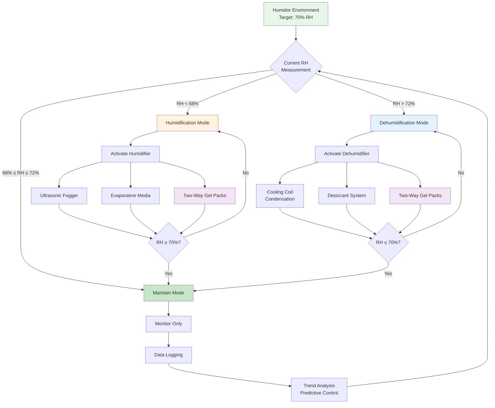

The relative humidity range of 65-75% RH represents the critical control band for commercial tobacco storage, governing moisture equilibrium, microbial stability, and organoleptic quality through fundamental water activity relationships. This narrow band balances three competing requirements: maintaining pliable tobacco structure (requiring adequate moisture), preventing mold proliferation (requiring limited moisture availability), and enabling proper aging chemistry (requiring specific water activity levels).

## Moisture Equilibrium Fundamentals

Tobacco leaf material exhibits hygroscopic behavior, absorbing or desorbing moisture until reaching equilibrium with ambient relative humidity. This relationship is quantified through sorption isotherms.

### Sorption Isotherm Relationship

The equilibrium moisture content of tobacco follows the Guggenheim-Anderson-de Boer (GAB) equation:

$$M_e = \frac{C \cdot K \cdot M_0 \cdot a_w}{(1 - K \cdot a_w) \cdot (1 - K \cdot a_w + C \cdot K \cdot a_w)}$$

where:
- $M_e$ = equilibrium moisture content (% dry basis)
- $M_0$ = monolayer moisture content (typically 8-12% for tobacco)
- $C$ = Guggenheim constant (energy parameter, typically 5-15)
- $K$ = multilayer constant (typically 0.7-0.9)
- $a_w$ = water activity (dimensionless, equal to RH/100)

**At 70% RH (a_w = 0.70):**

For typical cigar wrapper tobacco with $M_0 = 10\%$, $C = 8$, and $K = 0.85$:

$$M_e = \frac{8 \times 0.85 \times 10 \times 0.70}{(1 - 0.85 \times 0.70) \times (1 - 0.85 \times 0.70 + 8 \times 0.85 \times 0.70)}$$

$$M_e = \frac{47.6}{0.405 \times 5.165} = \frac{47.6}{2.092} \approx 22.8\%$$

This equilibrium moisture content maintains tobacco flexibility while preventing excessive wetness that promotes mold growth.

### Water Activity and Microbial Stability

Water activity determines microbial growth potential independently of total moisture content:

$$a_w = \frac{p}{p_0} = \frac{\text{RH}}{100}$$

where $p$ is vapor pressure of water in the product and $p_0$ is vapor pressure of pure water at the same temperature.

**Critical Water Activity Thresholds:**

| Organism Type | Minimum $a_w$ | RH Equivalent | Implication |
|---------------|---------------|---------------|-------------|
| Bacteria (most) | 0.90 | 90% RH | No growth at humidor conditions |
| Yeasts | 0.88 | 88% RH | No growth at humidor conditions |
| Molds (Aspergillus) | 0.75-0.80 | 75-80% RH | Growth possible above 75% RH |
| Tobacco beetles | 0.65+ | 65%+ RH | Requires >72°F temperature also |

The 65-75% RH range maintains $a_w$ between 0.65-0.75, which:
1. Prevents bacterial and yeast proliferation
2. Minimizes mold risk (especially when T < 72°F)
3. Provides sufficient moisture for tobacco pliability
4. Enables controlled aging reactions

## Humidity Effects on Tobacco Quality

Relative humidity directly impacts multiple quality parameters through moisture content and water activity mechanisms.

### Comprehensive Quality Impact Analysis

| RH Level | Moisture Content | Physical Quality | Chemical Stability | Microbial Risk | Aging Characteristics |
|----------|------------------|------------------|-------------------|----------------|----------------------|
| <60% RH | <18% db | Brittle wrapper, cracking | Reduced enzyme activity | Minimal | Arrested aging, flavor loss |
| 60-65% RH | 18-22% db | Firm but acceptable | Low aging rate | Very low | Slow aging, good preservation |
| **65-70% RH** | **22-25% db** | **Optimal flexibility** | **Moderate aging** | **Low** | **Balanced aging, flavor development** |
| **70-75% RH** | **25-28% db** | **Excellent pliability** | **Active aging** | **Moderate** | **Enhanced aging, complex flavors** |
| 75-80% RH | 28-32% db | Soft, spongy texture | Accelerated reactions | High (mold) | Rapid aging, mold risk |
| >80% RH | >32% db | Wet, swollen | Fermentation risk | Very high | Uncontrolled reactions, spoilage |

**Note:** Moisture content on dry basis (db) calculated using GAB equation with typical cigar tobacco parameters.

### Physical Property Relationships

The mechanical properties of tobacco wrapper leaf depend on moisture content through plasticization effects:

**Tensile Strength:**

$$\sigma_t = \sigma_0 \cdot e^{-k_m \cdot M}$$

where $\sigma_t$ is tensile strength (psi), $\sigma_0$ is dry strength constant, $k_m$ is moisture coefficient (typically 0.05-0.08), and $M$ is moisture content (% db).

At optimal 70% RH (M ≈ 24% db):
$$\sigma_t = \sigma_0 \cdot e^{-0.06 \times 24} = \sigma_0 \cdot 0.237$$

This 76% reduction from dry strength provides the flexibility needed for rolling and handling without tearing.

**Elasticity Modulus:**

$$E = E_0 \cdot (1 - k_e \cdot M)$$

where $E$ is elastic modulus (psi), $E_0$ is dry modulus, and $k_e$ is elasticity coefficient.

Moisture content above 20% db dramatically reduces stiffness, preventing wrapper cracking during rolling operations.

## Bidirectional Humidity Control Systems

Maintaining 65-75% RH requires both humidification and dehumidification capabilities to counteract environmental fluctuations.

### Humidification Technologies

**Ultrasonic Humidifiers:**

Generate microscopic water droplets through piezoelectric vibration at 1.7 MHz frequency:

$$d_p = \left(\frac{8\pi\sigma}{\rho f^2}\right)^{1/3}$$

where $d_p$ is particle diameter (μm), $\sigma$ is surface tension (72 dyne/cm for water), $\rho$ is density (1 g/cm³), and $f$ is frequency (Hz).

For $f = 1.7 \times 10^6$ Hz:

$$d_p = \left(\frac{8\pi \times 72}{1 \times (1.7 \times 10^6)^2}\right)^{1/3} = 0.63 \text{ μm}$$

These submicron droplets evaporate rapidly, providing precise humidity control with minimal temperature impact.

**Evaporative Systems:**

Passive evaporation from saturated media follows:

$$\dot{m}_w = h_m \cdot A \cdot (W_s - W_{\infty})$$

where $\dot{m}_w$ is water evaporation rate (lb/hr), $h_m$ is mass transfer coefficient (ft/hr), $A$ is surface area (ft²), $W_s$ is humidity ratio at saturated surface, and $W_{\infty}$ is ambient humidity ratio.

The mass transfer coefficient relates to air velocity:

$$h_m = k \cdot v^{0.8}$$

where $v$ is air velocity (fpm) and $k$ is a constant depending on media geometry.

**Two-Way Humidity Control Packs:**

Polymer gel systems (such as Boveda) maintain specific RH through reversible sorption:

- **Below setpoint:** Gel releases absorbed water vapor
- **Above setpoint:** Gel absorbs excess water vapor

Capacity limited to 60-100g water per 60g pack, requiring periodic replacement (3-6 months depending on humidor volume and air exchange rate).

### Dehumidification Technologies

**Cooling Coil Condensation:**

When coil surface temperature drops below dew point, condensation removes moisture:

$$T_{coil} < T_{dp}$$

Dew point at 70% RH and 70°F:

$$T_{dp} \approx 59°F$$

Coil must operate below 59°F to dehumidify, requiring subsequent reheat to maintain 70°F setpoint.

**Moisture Removal Rate:**

$$\dot{m}_{cond} = \dot{m}_a \cdot (W_{in} - W_{out})$$

For air flow $\dot{m}_a = 50$ lb/hr, reducing from 70% to 68% RH at 70°F:

- $W_{in} = 0.0111$ lb water/lb dry air (70% RH)
- $W_{out} = 0.0106$ lb water/lb dry air (68% RH)

$$\dot{m}_{cond} = 50 \times (0.0111 - 0.0106) = 0.025 \text{ lb/hr} = 0.3 \text{ oz/hr}$$

Small removal rates require precise control to avoid overshooting.

**Desiccant Systems:**

Silica gel or molecular sieve materials adsorb water vapor through:

$$q = q_{\max} \cdot \frac{K \cdot P}{1 + K \cdot P}$$

where $q$ is moisture uptake (lb water/lb desiccant), $q_{\max}$ is saturation capacity, $K$ is equilibrium constant, and $P$ is vapor pressure.

Desiccants require regeneration when saturated, typically through heating to 200-300°F to drive off absorbed moisture.

## Temperature Interaction Effects

Relative humidity varies inversely with temperature at constant absolute humidity (humidity ratio), creating control challenges.

### RH-Temperature Coupling

From psychrometric relationships:

$$\frac{d(\text{RH})}{dT} \approx -\text{RH} \cdot \frac{1}{T} \cdot \frac{d \ln(P_{sat})}{dT}$$

Using Clausius-Clapeyron equation:

$$\frac{d \ln(P_{sat})}{dT} = \frac{h_{fg}}{R \cdot T^2}$$

where $h_{fg} = 1060$ Btu/lb, $R = 85.76$ ft·lbf/(lb·°R), and $T$ in absolute temperature (°R).

At 70°F (530°R):

$$\frac{d \ln(P_{sat})}{dT} = \frac{1060}{85.76 \times 530^2} \approx 0.044 \text{ °F}^{-1}$$

Therefore:

$$\frac{d(\text{RH})}{dT} \approx -70\% \times \frac{1}{530} \times 0.044 = -0.0058 \text{ or } -5.8\% \text{ RH per °F}$$

**Practical Example:**

Temperature increase from 68°F to 72°F (4°F swing) at constant humidity ratio:

$$\Delta \text{RH} \approx -5.8\% \times 4 = -23\%$$

This demonstrates why temperature stability (±1°F) is essential for maintaining RH within the 65-75% band.

### Coupled Control Strategy

Effective humidor control requires simultaneous temperature and humidity loops:

**Temperature Control:**
- Primary: Cooling system with ±0.5°F accuracy
- Setpoint: 70°F
- Dead band: 69.5-70.5°F

**Humidity Control:**
- Primary: Humidification system
- Secondary: Dehumidification through cooling
- Setpoint: 70% RH
- Dead band: 68-72% RH
- Compensation: Adjust for temperature deviations

**Feedforward Control:**

Anticipate humidity changes from temperature setpoint adjustments:

$$\Delta \text{RH}_{predicted} = -k_T \cdot \Delta T$$

where $k_T \approx 5.8\%$ RH/°F near 70°F.

Preemptively activate humidification/dehumidification to counteract predicted RH deviation.

## Sensor Requirements and Calibration

Maintaining 65-75% RH requires high-accuracy sensors and regular calibration protocols.

### Sensor Specifications

**Capacitive RH Sensors:**
- Accuracy: ±2% RH (required minimum)
- Resolution: 0.1% RH
- Response time: 8-30 seconds (90% step change)
- Drift: <1% RH per year
- Operating range: 0-100% RH, 14-140°F

**Placement Strategy:**
- Multiple sensors in humidors >100 ft³ (verify uniformity)
- Location: Return air stream for control, space for verification
- Avoid direct airflow impingement (causes reading errors)
- Shield from direct moisture injection (temporarily saturated readings)

### Calibration Methods

**Saturated Salt Solution Reference:**

Specific salts create known equilibrium RH at given temperatures:

| Salt | Chemical Formula | RH at 68°F | RH at 77°F | Accuracy |
|------|------------------|------------|------------|----------|
| Magnesium chloride | MgCl₂·6H₂O | 33.0% | 32.8% | ±0.3% |
| Sodium chloride | NaCl | 75.5% | 75.3% | ±0.1% |
| Potassium chloride | KCl | 85.1% | 84.2% | ±0.2% |

For humidor applications, sodium chloride provides verification near the upper control limit (75% RH).

**Calibration Procedure:**
1. Place saturated salt solution in sealed container
2. Allow 24 hours for equilibration
3. Place sensor in container without touching solution
4. Record reading after 2-4 hours
5. Adjust sensor offset if deviation exceeds ±2% RH

**Electronic Calibration:**

High-end systems use chilled mirror hygrometers ($a_w$ meters) as laboratory standards:

$$\text{RH} = \frac{P_{sat}(T_{mirror})}{P_{sat}(T_{air})} \times 100\%$$

Accuracy: ±0.5% RH, providing traceable calibration for field sensors.

## Long-Term Aging Considerations

The 65-75% RH range enables controlled aging chemistry that develops complexity in premium cigars over months to years.

### Aging Reaction Kinetics

Maillard reactions between reducing sugars and amino acids proceed according to:

$$r = k \cdot [S] \cdot [A] \cdot a_w^n$$

where $r$ is reaction rate, $k$ is temperature-dependent rate constant, $[S]$ is sugar concentration, $[A]$ is amino acid concentration, $a_w$ is water activity, and $n$ is water activity exponent (typically 2-3).

**Optimal Aging Conditions:**
- RH: 68-72% ($a_w = 0.68-0.72$)
- Temperature: 68-70°F (minimizes beetle risk while allowing reactions)
- Time: 6 months to 5+ years depending on initial tobacco condition

**Water Activity Role:**
- Too low (<0.65): Insufficient molecular mobility, reactions arrested
- Optimal (0.68-0.72): Moderate reaction rates, controlled flavor development
- Too high (>0.75): Excessive rates, off-flavor development, mold risk

### Storage Duration Effects

| Storage Period | RH Recommendation | Temperature | Expected Changes |
|----------------|-------------------|-------------|------------------|
| Short-term (0-3 months) | 70% | 68-72°F | Equilibration, minimal aging |
| Medium-term (3-12 months) | 68-70% | 68-70°F | Moderate mellowing, flavor integration |
| Long-term (1-5 years) | 65-68% | 65-68°F | Complex aging, refined character |
| Archive (>5 years) | 65% | 65°F | Preservation, slow continued development |

Lower RH for long-term storage reduces aging rate and beetle infestation risk while preventing over-maturation.

## System Performance Metrics

Quantifying humidity control performance ensures consistent product quality.

### Control Performance Indices

**Standard Deviation:**

$$\sigma_{RH} = \sqrt{\frac{1}{N-1} \sum_{i=1}^{N} (\text{RH}_i - \overline{\text{RH}})^2}$$

Target: $\sigma_{RH} < 2\%$ for commercial humidors.

**Time in Range:**

$$\text{TIR} = \frac{\text{Time when } 65\% \leq \text{RH} \leq 75\%}{\text{Total time}} \times 100\%$$

Target: TIR > 95% for commercial applications.

**Recovery Time:**

Time to return within control band after disturbance (door opening):

$$t_{recovery} < 15 \text{ minutes (preferred)}$$

### Energy Consumption Analysis

**Humidification Energy:**

For ultrasonic humidifiers adding 0.5 lb water/day at 70% RH:

$$E_{humid} = 0.5 \text{ lb/day} \times 0.05 \text{ kWh/lb} = 0.025 \text{ kWh/day}$$

**Dehumidification Energy:**

Removing 0.3 lb water/day through cooling (including reheat):

$$E_{dehum} = 0.3 \text{ lb/day} \times 2.0 \text{ kWh/lb} = 0.6 \text{ kWh/day}$$

Dehumidification dominates energy consumption due to cooling + reheat requirement.

**Annual Operating Cost:**

For mixed climate with 60% humidification days, 40% dehumidification days:

$$\text{Cost} = (0.60 \times 0.025 + 0.40 \times 0.6) \times 365 \times \$0.12/\text{kWh}$$
$$\text{Cost} = (0.015 + 0.24) \times 365 \times \$0.12 = \$11.17/\text{year}$$

Small-scale humidor operating costs are minimal; precision equipment represents primary investment.

## Troubleshooting Humidity Deviations

**RH consistently below 65%:**
- Verify humidifier operation and water supply
- Check vapor barrier integrity (thermal imaging to locate leaks)
- Measure infiltration rate (should be <0.5 ACH)
- Increase humidification capacity or reduce air exchange
- Inspect for thermal bridging creating localized cold spots

**RH consistently above 75%:**
- Verify dehumidification system operation
- Check cooling coil condensate drainage
- Reduce humidifier output (may be oversized)
- Increase ventilation rate (controlled fresh air)
- Inspect for external moisture sources (damp walls, leaking pipes)

**RH fluctuations >±5% within 24 hours:**
- Reduce temperature fluctuations (improve cooling control)
- Increase system response speed (reduce dead bands)
- Add thermal mass (water containers) to buffer temperature swings
- Improve air circulation (reduce stratification)
- Consider proportional control vs. on/off operation

The 65-75% RH control band represents the fundamental requirement for commercial tobacco storage, balancing moisture equilibrium physics, microbial stability, and aging chemistry. Achieving consistent performance requires integrated temperature-humidity control, high-accuracy sensors, and proper system sizing based on load calculations and infiltration rates.

---

**References:**
- ASHRAE Handbook—Fundamentals, Chapter 19: Sorbents and Desiccants
- Brunauer, S., et al. "Adsorption of Gases in Multimolecular Layers." Journal of the American Chemical Society (1938)
- Labuza, T.P. "Sorption Phenomena in Foods." Food Technology (1968)
- Tobacco Merchants Association: Proper Cigar Storage Guidelines
