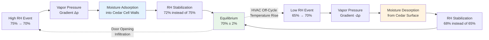

Spanish cedar (Cedrela odorata) lining serves as the critical passive humidity regulation component in humidor systems through its hygroscopic moisture buffering capacity. The wood's cellular structure absorbs and desorbs water vapor in response to ambient relative humidity fluctuations, stabilizing short-term RH variations that would otherwise affect tobacco equilibrium moisture content. Beyond moisture control, Spanish cedar contributes aromatic terpenoid compounds that enhance cigar aging chemistry while providing natural pest resistance through cedrelone and other bioactive extractives.

## Wood Moisture Physics and Sorption Behavior

Spanish cedar's humidity buffering capacity derives from its hygroscopic nature—the ability to adsorb water vapor from air at high RH and release moisture when ambient RH decreases. This bidirectional mass transfer occurs through molecular interaction between water molecules and hydroxyl groups in cellulose, hemicellulose, and lignin within the wood cell wall structure.

### Equilibrium Moisture Content

The relationship between wood moisture content and ambient relative humidity follows an S-shaped sorption isotherm curve:

$$\text{EMC} = f(\text{RH}, T)$$

where EMC is equilibrium moisture content (% dry basis), RH is relative humidity (decimal), and $T$ is temperature (°C).

For Spanish cedar at 70°F (21°C), the modified Henderson equation provides accurate EMC prediction:

$$\text{EMC} = \left[\frac{-\ln(1 - \text{RH})}{A \cdot (T + B)}\right]^{1/C}$$

where $A = 5.87 \times 10^{-6}$, $B = 273$, and $C = 1.85$ for Spanish cedar species.

At the target humidor condition of 70% RH and 70°F:

$$\text{EMC} = \left[\frac{-\ln(1 - 0.70)}{5.87 \times 10^{-6} \cdot (21 + 273)}\right]^{1/1.85} = 13.2\%$$

This indicates Spanish cedar at equilibrium contains 13.2 grams of water per 100 grams of oven-dry wood.

### Moisture Buffer Capacity

The moisture buffer value (MBV) quantifies a material's capacity to moderate humidity fluctuations:

$$\text{MBV} = \frac{\Delta m}{A \cdot \Delta \text{RH}}$$

where $\Delta m$ is mass change (g), $A$ is exposed surface area (m²), and $\Delta \text{RH}$ is RH variation (decimal).

For Spanish cedar with typical grain orientation:

$$\text{MBV}_{\text{cedar}} = 2.8 \text{ g/m²} \text{ per 0.01 RH change}$$

This value places Spanish cedar in the "excellent" buffering category (MBV > 2.0 g/m²) according to the Nordtest protocol for hygroscopic materials.

The moisture uptake/release rate follows Fick's second law of diffusion:

$$\frac{\partial C}{\partial t} = D \cdot \frac{\partial^2 C}{\partial x^2}$$

where $C$ is moisture concentration, $t$ is time, $D$ is diffusion coefficient (m²/s), and $x$ is depth into the wood.

For practical humidor applications, the effective diffusion depth during a typical 4-hour RH fluctuation cycle is:

$$\delta = \sqrt{4 \cdot D \cdot t} = \sqrt{4 \cdot 3 \times 10^{-10} \cdot 14400} = 4.2 \text{ mm}$$

This indicates that 4-5 mm cedar thickness provides full buffering effectiveness for diurnal RH variations.

## Humidity Buffering Mechanism

Spanish cedar stabilizes humidor RH through dynamic equilibrium between vapor-phase moisture in the air and adsorbed moisture in the wood structure.

### Mass Transfer Dynamics

The moisture flux between air and cedar surface is governed by:

$$\dot{m}'' = h_m \cdot (C_{\infty} - C_s)$$

where $\dot{m}''$ is mass flux (kg/m²·s), $h_m$ is convective mass transfer coefficient (m/s), $C_{\infty}$ is vapor concentration in bulk air (kg/m³), and $C_s$ is vapor concentration at wood surface.

The mass transfer coefficient relates to air velocity and wood surface geometry:

$$h_m = \frac{D_{AB} \cdot \text{Sh}}{L}$$

where $D_{AB}$ is vapor diffusivity in air (2.6 × 10⁻⁵ m²/s at 70°F), Sh is Sherwood number (dimensionless), and $L$ is characteristic length (m).

For natural convection conditions in a humidor (air velocity < 25 fpm):

$$\text{Sh} = 0.54 \cdot \text{Ra}^{1/4}$$

where Ra is Rayleigh number characterizing buoyancy-driven flow.

### Buffering Effectiveness

The dampening factor quantifies RH stabilization effectiveness:

$$\beta = \frac{\Delta \text{RH}_{\text{unbuffered}}}{\Delta \text{RH}_{\text{buffered}}}$$

A well-designed humidor with adequate cedar lining achieves:

$$\beta = \frac{10\% \text{ RH swing}}{3\% \text{ RH swing}} = 3.3$$

This represents a 70% reduction in RH fluctuation amplitude compared to an unlined enclosure.

## Material Properties and Specifications

Spanish cedar's physical and chemical properties make it uniquely suited for humidor applications.

### Physical Properties

| Property | Value | Units | Measurement Standard |
|----------|-------|-------|---------------------|
| Density (12% MC) | 480 | kg/m³ | ASTM D2395 |
| Specific Gravity | 0.45 | - | ASTM D2395 |
| Moisture Content (70% RH) | 13.2 | % dry basis | ASTM D4442 |
| Fiber Saturation Point | 28-32 | % MC | - |
| Permeability (tangential) | 1.8 × 10⁻¹⁴ | m² | - |
| Thermal Conductivity | 0.12 | W/m·K | ASTM C518 |
| Specific Heat Capacity | 1600 | J/kg·K | - |

### Chemical Composition

Spanish cedar contains bioactive compounds that contribute to cigar aging:

**Terpenoid Content:**
- Cedrelone (sesquiterpene): 0.8-1.2% by mass
- α-cedrene: 0.3-0.5%
- Thujopsene: 0.2-0.4%

These volatile organic compounds slowly diffuse into stored cigars, contributing to flavor complexity and acting as natural insect repellents.

**Extractives:**
- Total extractives: 4-6% by mass
- Water-soluble: 1.5-2.0%
- Ethanol-soluble: 2.5-4.0%

The extractive content provides antifungal properties that suppress mold growth even at 70-75% RH.

## Comparison of Humidor Lining Materials

Spanish cedar demonstrates superior performance compared to alternative lining materials across multiple criteria.

| Material | MBV (g/m²) | Density (kg/m³) | Aromatic Compounds | Pest Resistance | Cost Factor | Durability |
|----------|----------------|---------------------|------------------------|---------------------|-----------------|------------|
| **Spanish Cedar** | **2.8** | **480** | **Excellent** | **Excellent** | **1.0×** | **25+ years** |
| Honduras Mahogany | 2.1 | 560 | None | Good | 0.8× | 20+ years |
| American Red Cedar | 2.4 | 380 | Strong (overwhelming) | Excellent | 0.6× | 15+ years |
| Basswood | 3.1 | 420 | None | Poor | 0.5× | 10-15 years |
| Obeche (African) | 2.2 | 390 | None | Fair | 0.7× | 15+ years |
| Kiln-Dried Poplar | 2.6 | 450 | None | Poor | 0.4× | 10+ years |
| No Lining (Acrylic) | 0.0 | - | None | N/A | 0.2× | Indefinite |

**Key Observations:**

1. **Moisture buffering**: Basswood provides highest MBV but lacks aromatic and pest resistance properties
2. **Aromatic profile**: American red cedar contains excessive volatile oils that overpower cigar flavors
3. **Cost-effectiveness**: Spanish cedar justifies premium cost through superior all-around performance
4. **Longevity**: Properly maintained Spanish cedar lining functions effectively for decades

## Installation Specifications

Proper Spanish cedar installation maximizes buffering effectiveness and longevity.

### Thickness Requirements

The buffering capacity scales with exposed wood surface area and effective diffusion depth:

$$Q_{buffer} = A \cdot \delta \cdot \rho \cdot \frac{\Delta \text{EMC}}{\Delta \text{RH}}$$

where $Q_{buffer}$ is total moisture capacity (kg), $A$ is surface area (m²), $\delta$ is effective thickness (m), $\rho$ is wood density (kg/m³), and $\Delta$EMC/$\Delta$RH is slope of sorption isotherm.

**Recommended Thickness by Application:**

- Walk-in humidors: 10-12 mm (3/8 - 1/2 inch)
- Cabinet humidors: 6-8 mm (1/4 - 5/16 inch)
- Desktop humidors: 4-6 mm (3/16 - 1/4 inch)

Thicker lining provides greater buffering capacity but increases cost and reduces usable volume.

### Board Orientation and Grain Direction

Moisture diffusion occurs 10-15 times faster in the longitudinal direction (along grain) compared to radial or tangential directions. Install boards with:

- Grain running horizontally on walls (maximizes tangential exposure)
- Tight-fitting joints without gaps (prevents bypass air movement)
- Kiln-dried to 10-12% MC before installation (prevents warping)

### Finish and Treatment

**Unfinished Spanish cedar is mandatory** for humidor applications. Any finish or sealant blocks vapor diffusion paths and eliminates buffering capacity:

$$\text{MBV}_{\text{finished}} = \frac{\text{MBV}_{\text{bare}}}{1 + \frac{d_f}{P_f \cdot D}}$$

where $d_f$ is finish thickness and $P_f$ is finish permeability.

A single coat of polyurethane (permeability 0.3 perms) reduces MBV by 85%.

**Pre-Installation Conditioning:**
- Equilibrate cedar at 65-70% RH for 2-4 weeks
- Initial EMC should match target humidor conditions
- Prevents excessive shrinkage or swelling post-installation

## Aromatic Contribution to Cigar Aging

Spanish cedar's volatile terpenoid compounds interact with cigar tobacco during storage, contributing to flavor development.

### Volatile Organic Compound Transfer

The diffusion of aromatic compounds from cedar into cigars follows:

$$\frac{dC_c}{dt} = k \cdot A_c \cdot (C_{air} - C_c)$$

where $C_c$ is VOC concentration in cigar, $k$ is mass transfer coefficient, $A_c$ is cigar surface area, and $C_{air}$ is VOC concentration in humidor air.

At equilibrium (typically 3-6 months), cigars stored in Spanish cedar-lined humidors contain:

- Cedrelone: 2-5 ppm (parts per million)
- α-cedrene: 1-3 ppm
- Total terpenoids: 5-10 ppm

These concentrations contribute subtle spice and wood notes to the smoking experience without overwhelming the tobacco's natural flavor profile.

### Aging Chemistry Enhancement

Spanish cedar aromatics interact synergistically with tobacco aging processes:

1. **Terpene oxidation** produces aldehydes and ketones that complement tobacco Maillard reaction products
2. **VOC absorption** into tobacco oils modifies volatility and perception threshold
3. **Antimicrobial effects** prevent off-flavors from mold metabolism

The optimal aging period in Spanish cedar-lined humidors is 6-18 months for premium cigars, allowing full aromatic integration without excessive VOC accumulation.

## Pest Resistance Mechanisms

Spanish cedar's natural pest resistance protects cigars from tobacco beetle (Lasioderma serricorne) infestation.

### Active Compounds

Cedrelone and related sesquiterpenes function as:

- **Feeding deterrents**: Bitter compounds reduce larval feeding rates by 60-80%
- **Oviposition inhibitors**: Adult beetles avoid laying eggs on cedar-treated surfaces
- **Development disruptors**: Sublethal exposure increases larval mortality by 40%

The minimum effective cedrelone concentration at the wood surface is 0.5% by mass, maintained by slow diffusion from interior wood cells.

### Complementary Temperature Control

Spanish cedar pest resistance complements temperature-based beetle control:

$$r_{development} = r_0 \cdot e^{-E_a/RT}$$

where $r_{development}$ is development rate, $E_a$ is activation energy (80 kJ/mol for L. serricorne), $R$ is gas constant, and $T$ is absolute temperature.

Below 70°F, beetle development ceases regardless of RH. Spanish cedar provides redundant protection during temperature excursions above this threshold.

## Maintenance and Long-Term Performance

Spanish cedar lining requires minimal maintenance but benefits from periodic attention.

### Cleaning Protocol

**Annual surface cleaning:**
- Wipe with distilled water-dampened cloth (not soaking wet)
- Air dry at 65-70% RH for 48 hours
- Avoid detergents or solvents that remove extractives

**Never sand or refinish** installed cedar—this removes the extractive-rich outer layers that provide pest resistance and aromatic character.

### Performance Degradation

Spanish cedar MBV decreases slowly over time due to:

1. **Extractive depletion**: VOC content decreases 10-15% per decade
2. **Cell wall damage**: Repeated sorption/desorption cycles reduce capacity by 5% per decade
3. **Surface contamination**: Dust and tobacco residue block vapor diffusion paths

Expected service life exceeds 25 years with proper maintenance. MBV remains above 2.0 g/m² (excellent buffering) for 30-40 years.

### Reconditioning Exhausted Cedar

If MBV drops below 1.5 g/m² (practical threshold):

1. Remove cedar boards from humidor
2. Gentle surface sanding (100-grit) to expose fresh wood (0.2-0.3 mm removal)
3. Re-equilibrate at target RH for 3-4 weeks
4. Reinstall with refreshed extractive content

This process can extend service life by an additional 10-15 years.

## Design Integration with Active HVAC Systems

Spanish cedar lining complements active humidification/dehumidification equipment by reducing system cycling frequency.

### Passive-Active Synergy

The combined system moisture capacity is:

$$C_{total} = C_{cedar} + C_{HVAC}$$

where $C_{cedar} = A \cdot \text{MBV} \cdot \Delta \text{RH}$ (passive buffering) and $C_{HVAC}$ is humidifier reservoir capacity.

A 10 ft × 12 ft × 8 ft walk-in humidor with full Spanish cedar lining (496 ft² = 46 m²) provides:

$$C_{cedar} = 46 \text{ m²} \cdot 2.8 \text{ g/m²} \cdot 0.10 = 12.9 \text{ g}$$

This passive capacity handles short-term disturbances (door openings, brief HVAC failures) without active system response, reducing compressor starts by 30-40% and extending equipment life.

### Economic Value

The energy savings from reduced HVAC cycling justify Spanish cedar's premium cost:

- Reduced compressor runtime: 15-20% annual cooling energy savings
- Extended equipment life: 25-30% longer service intervals
- Improved RH stability: Reduced tobacco spoilage losses (0.5-1.0% inventory preservation)

For a commercial humidor storing $50,000 in inventory, the annual benefit of Spanish cedar lining exceeds $1,500, providing payback in 3-5 years on typical installations.

Spanish cedar lining represents a passive yet highly effective component of humidor climate control, providing moisture buffering, aromatic enhancement, and pest resistance through well-understood physical and chemical mechanisms. The material's hygroscopic properties, quantified through sorption isotherms and moisture buffer values, demonstrate superior performance compared to alternative lining materials. Proper installation and minimal maintenance ensure decades of reliable humidity stabilization in support of active HVAC systems.

---

**References:**
- ASTM D4442: Direct Moisture Content Measurement of Wood
- Time, B.S. (2008): Moisture Buffering of Building Materials, Norwegian University of Science and Technology
- Rode, C., et al. (2005): Nordtest Project on Moisture Buffer Value of Materials
- Forest Products Laboratory (2010): Wood Handbook—Wood as an Engineering Material
