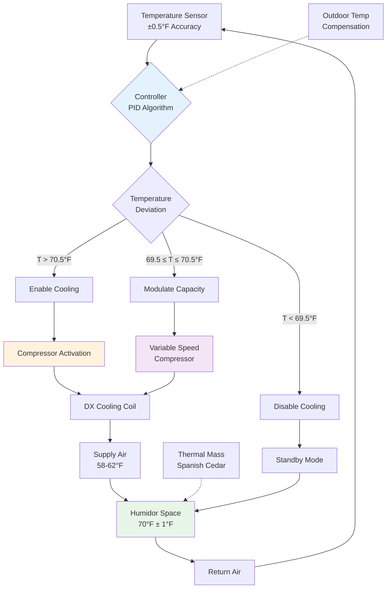

Temperature control within the narrow band of 68-72°F (20-22.2°C) represents the fundamental parameter for commercial humidor operation, governing three critical physical processes: prevention of tobacco beetle (Lasioderma serricorne) infestation, optimization of enzymatic aging reactions, and maintenance of stable equilibrium moisture content in stored cigars. This temperature range balances biological pest suppression against the acceleration of desirable chemical transformations while minimizing energy consumption for climate control.

## Thermodynamic Basis for Temperature Selection

The 68-72°F temperature specification derives from empirical observations of tobacco beetle activity thresholds and tobacco chemistry kinetics rather than human comfort considerations.

### Tobacco Beetle Activity Temperature Dependence

The tobacco beetle (Lasioderma serricorne) exhibits exponential population growth above specific temperature thresholds. The beetle development rate follows Arrhenius kinetics:

$$r(T) = A \cdot e^{-\frac{E_a}{R \cdot T}}$$

where $r(T)$ is development rate (days⁻¹), $A$ is pre-exponential factor (days⁻¹), $E_a$ is activation energy (cal/mol), $R$ is gas constant (1.987 cal/mol·K), and $T$ is absolute temperature (K).

Empirical data demonstrates that beetle development effectively ceases below 18°C (64.4°F), accelerates significantly above 22°C (71.6°F), and reaches maximum reproductive rates at 30°C (86°F).

**Temperature-Dependent Beetle Lifecycle Duration:**

$$t_{lifecycle}(T) = \frac{1}{r(T)} = \frac{1}{A \cdot e^{-\frac{E_a}{R \cdot T}}}$$

For Lasioderma serricorne with experimental parameters $E_a \approx 12,000$ cal/mol and $A \approx 0.15$ days⁻¹:

| Temperature | Lifecycle (days) | Relative Activity | Risk Level |
|-------------|------------------|-------------------|------------|
| 64°F (17.8°C) | >180 | <0.01 | Negligible |
| 68°F (20.0°C) | 125 | 0.08 | Very Low |
| 70°F (21.1°C) | 95 | 0.15 | Low |
| 72°F (22.2°C) | 72 | 0.28 | Threshold |
| 75°F (23.9°C) | 48 | 0.65 | Moderate |
| 80°F (26.7°C) | 28 | 1.00 | High |
| 85°F (29.4°C) | 18 | 1.85 | Very High |

The 72°F upper limit provides a safety margin below the rapid acceleration zone while maintaining conditions favorable for tobacco aging.

### Enzymatic Aging Reaction Rates

Desirable tobacco aging involves enzymatic breakdown of chlorophyll, degradation of ammonia compounds, and polymerization of sugars. These reactions also follow temperature-dependent kinetics:

$$k(T) = k_0 \cdot e^{-\frac{E_a}{R \cdot T}}$$

where $k(T)$ is reaction rate constant at temperature $T$.

The temperature coefficient (Q₁₀) for tobacco aging reactions typically ranges from 2.0-2.5, meaning reaction rates double for every 10°C increase:

$$\frac{k(T + 10°C)}{k(T)} = Q_{10}$$

At 70°F (21.1°C), aging reactions proceed at moderate rates that develop complexity over months to years. Higher temperatures (>75°F) accelerate aging but produce harsh flavor profiles through excessive degradation.

## Temperature Stability Requirements

Maintaining setpoint temperature within ±1°F requires understanding heat transfer mechanisms and control system response characteristics.

### Heat Load Components

Total heat gain to humidor space equals:

$$Q_{total} = Q_{conduction} + Q_{infiltration} + Q_{equipment} + Q_{occupancy}$$

**Conduction Through Envelope:**

$$Q_{conduction} = U \cdot A \cdot (T_{ambient} - T_{humidor})$$

where $U$ is overall heat transfer coefficient (Btu/hr·ft²·°F), $A$ is surface area (ft²).

For R-20 insulated walls at 75°F ambient and 70°F setpoint:

$$Q_{conduction} = \frac{1}{20} \times A \times 5 = 0.25A \text{ Btu/hr}$$

**Infiltration Heat Gain:**

$$Q_{infiltration,sensible} = 1.08 \cdot \text{CFM} \cdot \Delta T$$

where CFM is infiltration airflow rate and $\Delta T$ is temperature difference (°F).

For a 10×12×8 ft humidor with 0.5 ACH infiltration:

$$\text{CFM} = \frac{10 \times 12 \times 8 \times 0.5}{60} = 8 \text{ CFM}$$

$$Q_{infiltration,sensible} = 1.08 \times 8 \times 5 = 43.2 \text{ Btu/hr}$$

### Temperature Control System Architecture

**Control Strategy Elements:**

1. **Dead band**: ±0.5°F prevents excessive cycling
2. **Proportional control**: Modulates compressor speed between 69.5-70.5°F
3. **Integral term**: Eliminates steady-state offset
4. **Derivative term**: Dampens oscillations from door openings

### Thermal Response Characteristics

The time constant for temperature recovery after disturbance is:

$$\tau = \frac{m \cdot c_p}{UA + \dot{m}_a \cdot c_{p,air}}$$

where $m$ is thermal mass (lb), $c_p$ is specific heat (Btu/lb·°F), $UA$ is overall conductance (Btu/hr·°F), and $\dot{m}_a$ is infiltration mass flow (lb/hr).

For a humidor with 2000 lb Spanish cedar lining ($c_p = 0.4$ Btu/lb·°F):

$$\tau = \frac{2000 \times 0.4}{0.25 \times 496 + 8 \times 60 \times 0.075 \times 0.24} \approx 5.2 \text{ hours}$$

This long time constant provides significant thermal inertia that buffers short-duration disturbances.

## Temperature Effects on Tobacco Storage Quality

Temperature directly influences multiple quality parameters through distinct physical and chemical mechanisms.

### Moisture Content Equilibrium

Tobacco moisture content at equilibrium depends on both temperature and relative humidity through sorption isotherms. Even at constant RH, higher temperatures reduce equilibrium moisture content:

$$\text{EMC}(T, \text{RH}) = f_1(\text{RH}) + f_2(T) + f_3(\text{RH} \times T)$$

where EMC is equilibrium moisture content (% dry basis).

**Temperature Impact on Moisture (at 70% RH):**

| Temperature | EMC (%) | Wrapper Condition | Draw Resistance |
|-------------|---------|-------------------|-----------------|
| 64°F | 14.2% | Slightly brittle | Normal |
| 68°F | 13.8% | Optimal pliability | Optimal |
| 70°F | 13.5% | Excellent | Excellent |
| 72°F | 13.2% | Good | Good |
| 75°F | 12.7% | Softening trend | Slightly loose |
| 80°F | 11.8% | Too soft | Loose |

### Volatile Compound Retention

Aromatic compounds exhibit temperature-dependent vapor pressures following the Clausius-Clapeyron equation:

$$\ln\left(\frac{P_2}{P_1}\right) = -\frac{\Delta H_{vap}}{R} \left(\frac{1}{T_2} - \frac{1}{T_1}\right)$$

where $P$ is vapor pressure, $\Delta H_{vap}$ is enthalpy of vaporization, and $T$ is absolute temperature.

Essential oils and flavor compounds evaporate more rapidly at elevated temperatures. The 68-72°F range minimizes volatile losses while maintaining adequate molecular mobility for aging reactions.

### Mold Growth Kinetics

Fungal growth on tobacco requires both adequate moisture (water activity $a_w > 0.70$) and favorable temperature. Common mold species (Aspergillus, Penicillium) exhibit optimal growth at 77-86°F but can proliferate slowly at 68-72°F if RH exceeds 75%.

$$\text{Growth Rate} = k_{max} \cdot \frac{a_w - a_{w,min}}{a_{w,opt} - a_{w,min}} \cdot \frac{T - T_{min}}{T_{opt} - T_{min}}$$

At 70°F and 70% RH ($a_w = 0.70$), mold growth is suppressed by the combination of marginal water activity and sub-optimal temperature.

## Precision Cooling System Design

Achieving ±1°F stability requires specialized refrigeration equipment and control strategies.

### Variable Capacity Refrigeration

Traditional on-off cycling creates temperature oscillations. Three technologies provide modulated cooling:

**1. Inverter-Driven Compressor:**

Compressor speed varies with cooling demand:

$$\text{Capacity}(\%) = \left(\frac{\text{RPM}}{\text{RPM}_{max}}\right)^{0.7} \times 100\%$$

Operating range typically 30-100% of nominal capacity.

**2. Hot Gas Bypass:**

Diverts discharge gas around condenser to reduce net cooling:

$$Q_{net} = Q_{evap} - Q_{bypass}$$

Less efficient than variable speed but provides continuous operation.

**3. Staged Capacity:**

Multiple compressors or unloaders provide step-wise capacity control.

### Supply Air Temperature Differential

Minimizing temperature difference between supply and return air reduces stratification:

$$\Delta T_{supply} = \frac{Q_{total}}{1.08 \times \text{CFM}}$$

For 500 Btu/hr load:

$$\text{CFM} = \frac{500}{1.08 \times \Delta T_{supply}}$$

With $\Delta T_{supply} = 10°F$:

$$\text{CFM} = \frac{500}{10.8} = 46.3 \text{ CFM}$$

This moderate airflow provides adequate circulation without excessive air velocity that could dry cigars.

## Temperature Monitoring and Alarming

Commercial installations require continuous monitoring with alarm notification for excursions.

**Sensor Placement:**

- **Supply air**: Verify cooling system output
- **Return air**: Measure actual space temperature
- **Multiple zones**: Detect stratification in large humidors
- **Outdoor**: Enable temperature compensation control

**Alarm Thresholds:**

| Parameter | Warning | Critical |
|-----------|---------|----------|
| High Temperature | 73°F | 75°F |
| Low Temperature | 67°F | 65°F |
| Sensor Failure | 2 minutes | Immediate |
| Compressor Runtime | >20 min/hr | >40 min/hr |

**Data Logging Requirements:**

Sample temperature every 1-5 minutes with minimum 30-day retention. This historical data enables:

- Verification of control system performance
- Identification of degrading equipment
- Validation of warranty claims for damaged inventory
- Documentation for insurance purposes

## Energy Efficiency Considerations

Maintaining 68-72°F year-round consumes energy for cooling (summer), heating (winter), and humidification (both seasons).

### Cooling Energy

Annual cooling energy in mixed climates:

$$E_{cooling} = \frac{Q_{avg,cooling} \times \text{CDD}_{65} \times 24}{\text{COP}}$$

where CDD₆₅ is cooling degree days base 65°F.

For Miami (CDD₆₅ = 4000) with 1000 Btu/hr average load and COP = 3.0:

$$E_{cooling} = \frac{1000 \times 4000 \times 24}{3000} = 32,000 \text{ kWh/year}$$

### Insulation Value

Higher R-values reduce temperature-driven heat flow:

**Transmission Load Comparison:**

| Insulation | U-value | Heat Gain (Btu/hr) | Annual Energy (kWh) |
|------------|---------|---------------------|---------------------|
| R-10 | 0.10 | 248 | 800 |
| R-15 | 0.067 | 166 | 535 |
| R-20 | 0.05 | 124 | 400 |
| R-30 | 0.033 | 82 | 265 |

The incremental cost of R-30 versus R-20 insulation typically has a 3-5 year payback through reduced operating costs.

## Temperature-Related Failure Modes

Understanding common temperature control failures enables rapid diagnosis and correction.

### Insufficient Cooling Capacity

**Symptoms**: Temperature consistently above 72°F with continuous compressor operation.

**Causes**:
- Undersized cooling system (design error)
- Degraded refrigerant charge (leak)
- Dirty condenser coil (reduced heat rejection)
- Failed condenser fan motor

**Diagnosis**:

Measure compressor suction and discharge pressures. Compare to manufacturer's performance curves at actual operating conditions.

### Excessive Temperature Cycling

**Symptoms**: Temperature oscillates ±2-3°F around setpoint.

**Causes**:
- Oversized cooling capacity (short cycling)
- Inadequate thermal mass
- Poorly tuned PID controller
- Dead band too narrow

**Correction**:

Increase dead band to ±1°F and implement variable capacity control.

### Temperature Stratification

**Symptoms**: Vertical temperature gradient >3°F from floor to ceiling.

**Causes**:
- Insufficient air circulation
- Supply air velocity too low
- Poor diffuser placement
- Excessive ceiling height

**Solution**:

Increase supply CFM or add destratification fans (ceiling-mounted, low-speed circulation).

## Integration with Humidity Control

Temperature and humidity control systems interact through psychrometric relationships.

### Simultaneous Control Challenges

Cooling for temperature control removes moisture (dehumidification), while maintaining 70% RH requires moisture addition. This creates competing loads:

$$Q_{latent,removal} = 1060 \times \dot{m}_a \times (W_{in} - W_{out})$$

where $W$ is humidity ratio (lb water/lb dry air).

Overcooling to meet sensible load followed by reheat wastes energy:

$$\text{COP}_{effective} = \frac{\text{COP}_{cooling}}{1 + \frac{Q_{reheat}}{Q_{cooling}}}$$

### Optimal Control Strategy

Sequence cooling and humidification to minimize energy penalty:

1. **Priority to temperature**: Maintain 68-72°F first
2. **Modulated cooling**: Vary capacity to minimize overcooling
3. **Hot gas reheat**: Recover condenser heat when reheat needed
4. **Dew point control**: Maintain coil temperature above dew point when possible

## Comparative Analysis: Temperature Setpoints

While 70°F is standard, some operators use alternative setpoints.

| Setpoint | Beetle Risk | Aging Rate | Energy Use | Application |
|----------|-------------|------------|------------|-------------|
| 65°F | None | 0.75× | Low | Long-term archive |
| 68°F | Very Low | 0.90× | Medium-Low | Premium aging |
| 70°F | Low | 1.00× | Medium | Standard commercial |
| 72°F | Threshold | 1.15× | Medium-High | Fast turnover retail |
| 75°F | Moderate | 1.35× | High | Not recommended |

**Aging Rate Relative to 70°F:**

Based on Q₁₀ = 2.2 for tobacco chemistry:

$$\text{Relative Rate} = 2.2^{(T - 70)/10}$$

For 68°F: $2.2^{-0.2} \approx 0.90$

For 72°F: $2.2^{0.2} \approx 1.15$

The 70°F setpoint balances aging chemistry against pest risk and energy consumption, making it the optimal choice for most commercial applications.

## Advanced Topics: Thermal Transient Analysis

Temperature excursions from door openings or equipment failures propagate through humidor space following transient heat transfer principles.

### Door Opening Heat Pulse

When door opens, warm ambient air enters:

$$Q_{door} = \rho \cdot V \cdot c_p \cdot (T_{ambient} - T_{humidor})$$

For 30 ft² door area × 8 ft height opened for 30 seconds with 0.5 ft/sec inflow velocity:

$$V = 30 \times 0.5 \times 30/60 = 7.5 \text{ ft}^3$$

$$Q_{door} = 0.075 \times 7.5 \times 0.24 \times 5 = 0.068 \text{ Btu}$$

This pulse raises space temperature by:

$$\Delta T = \frac{Q_{door}}{m_{air} \cdot c_p + m_{cedar} \cdot c_{p,cedar}}$$

With 960 ft³ air and 2000 lb cedar:

$$\Delta T = \frac{0.068}{(960 \times 0.075 \times 0.24) + (2000 \times 0.4)} \approx 0.00008°F$$

The negligible impact demonstrates the buffering capacity of thermal mass.

## Conclusion

Temperature control at 68-72°F with ±1°F stability represents a precisely engineered compromise between biological pest suppression (tobacco beetle prevention below 72°F), optimization of enzymatic aging chemistry, and practical energy efficiency. Achieving this narrow temperature band requires insulated construction (R-20 minimum), variable capacity refrigeration systems, precision temperature sensors (±0.5°F), and PID control algorithms with appropriate dead bands. The significant thermal mass from Spanish cedar lining provides valuable buffering against short-duration disturbances, while continuous monitoring ensures rapid response to equipment failures or environmental excursions that could damage valuable cigar inventory.

