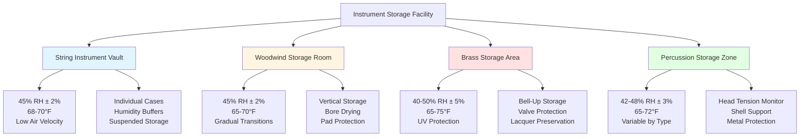

Different instrument families exhibit distinct responses to environmental conditions based on their material composition, construction methods, and acoustic design. Understanding the physical mechanisms governing dimensional stability, material degradation, and tonal preservation enables precise HVAC system specification for each instrument category.

## Hygroscopic Material Behavior

Wood instruments respond to relative humidity changes through moisture adsorption and desorption. The equilibrium moisture content (EMC) of wood relates directly to ambient relative humidity through the Hailwood-Horrobin sorption isotherm:

$$EMC = \frac{1800}{W} \cdot \frac{K_1 \cdot h}{1 - K_1 \cdot h} + \frac{1800}{W} \cdot \frac{K_1 \cdot K_2 \cdot h}{1 + K_1 \cdot K_2 \cdot h}$$

Where:
- $EMC$ = equilibrium moisture content (%)
- $h$ = relative humidity (decimal fraction)
- $W$ = fiber saturation point moisture content (approximately 1800% for most woods)
- $K_1$, $K_2$ = temperature-dependent constants

For practical instrument storage, the dimensional change follows:

$$\Delta L = L_0 \cdot \alpha_t \cdot \Delta EMC$$

Where:
- $\Delta L$ = dimensional change
- $L_0$ = original dimension
- $\alpha_t$ = tangential or radial shrinkage coefficient (0.15-0.35 for tonewood species)
- $\Delta EMC$ = change in equilibrium moisture content

A 10% decrease in relative humidity (from 50% to 40%) reduces EMC by approximately 2%, causing 0.3-0.7% dimensional shrinkage in the tangential direction. For a 16-inch violin top plate, this represents 0.048-0.112 inch contraction, sufficient to open glue joints designed with minimal clearance.

## Instrument Category Comparison

| Instrument Family | Temperature (°F) | RH Range (%) | Max Daily RH Change | Critical Materials | Primary Failure Mode |
|-------------------|------------------|--------------|---------------------|-------------------|----------------------|
| **String Instruments** | 68-72 | 42-48 | ±2% | Spruce, maple, hide glue | Seam separation, soundboard cracks |
| **Woodwinds** | 65-72 | 40-50 | ±3% | Grenadilla, boxwood, pads | Bore cracking, pad deterioration |
| **Brass** | 60-75 | 35-55 | ±5% | Brass alloys, valve felts | Lacquer degradation, valve corrosion |
| **Percussion** | 65-72 | 40-50 | ±3% | Calfskin, maple shells | Head cracking, shell delamination |

## String Instrument Requirements

String instruments constructed from carved wood components exhibit extreme sensitivity to moisture variations. The violin family (violin, viola, cello, bass) and classical guitars share common vulnerabilities:

**Soundboard Physics:**

The soundboard operates under compressive stress from string tension (approximately 50-90 lbs for violins, 200+ lbs for cellos). Moisture loss reduces wood stiffness following:

$$E_{moisture} = E_0 \cdot e^{-\beta \cdot \Delta EMC}$$

Where $E_{moisture}$ represents the modulus of elasticity at altered moisture content, $E_0$ is the baseline modulus, and $\beta$ approximates 0.04 for spruce. A 3% EMC decrease reduces stiffness by 11%, altering resonant frequencies and compromising tonal projection.

**Glue Joint Integrity:**

Hide glue joints rely on mechanical interlocking with wood fibers. Differential expansion between quarter-sawn and slab-sawn sections creates shear stress:

$$\tau = \frac{F}{A} = \frac{\Delta L \cdot E \cdot A}{L_0 \cdot A} = \frac{E \cdot \alpha_t \cdot \Delta EMC}{1}$$

When shear stress exceeds glue bond strength (800-1200 psi for hot hide glue), seams open along the soundboard perimeter.

**Storage Zone Specifications:**

- Maintain 45% RH ±2% to balance crack prevention and swelling avoidance
- Limit temperature to 68-70°F to prevent accelerated aging of varnish
- Restrict air velocity to <25 fpm at instrument surfaces preventing localized drying
- Provide case storage with internal humidity buffers (Dampit systems, humidification packs)

## Woodwind Requirements

Wooden clarinets, oboes, and bassoons constructed from African blackwood (Dalbergia melanoxylon) experience bore dimensional changes affecting tuning and intonation.

**Bore Stability:**

The cylindrical or conical bore diameter determines acoustic impedance and resonant frequency. Radial shrinkage from moisture loss increases pitch:

$$f = \frac{c}{2L} \cdot \sqrt{1 + \left(\frac{d}{2L}\right)^2}$$

For cylindrical bores where $f$ = frequency, $c$ = speed of sound, $L$ = effective length, $d$ = bore diameter. A 0.5% bore reduction raises pitch approximately 3-5 cents (0.03-0.05 semitones), requiring embouchure compensation.

**Critical Control Parameters:**

- RH range 42-50% prevents both bore cracking (low RH) and pad swelling (high RH)
- Temperature 65-70°F balances wood stability with pad longevity
- Gradual seasonal transitions (<3% RH change per week) prevent thermal shock cracking
- Instrument warming period: 15-30 minutes before performance prevents condensation

Pad and cork components require slightly higher humidity (48-52%) than wooden bodies, creating design conflict resolved through compromise conditions and frequent maintenance.

## Brass Instrument Requirements

Brass instruments tolerate broader environmental ranges but face corrosion and mechanical degradation under extreme conditions.

**Lacquer Preservation:**

Cellulose nitrate lacquer finishes deteriorate through:
1. Thermal cycling causing expansion coefficient mismatch with brass substrate
2. UV exposure breaking down polymer chains
3. High humidity enabling subsurface oxidation

Optimal storage maintains 40-50% RH at 65-70°F with UV-filtered lighting (<50 fc).

**Valve Mechanism Protection:**

Piston and rotary valves require:
- <60% RH to prevent condensation in valve casings during temperature fluctuations
- >35% RH to maintain felt and cork cushion integrity
- Stable temperature preventing valve clearance changes exceeding 0.001 inch

**Material Stability:**

Brass (Cu-Zn alloy) exhibits negligible dimensional change across normal environmental ranges. Primary concerns involve:
- Dezincification in high-humidity environments with condensation
- Green patina formation from organic acid exposure
- Spring fatigue acceleration at elevated temperatures (>80°F)

## Percussion Requirements

Percussion instruments span enormous material diversity requiring category-specific control:

**Timpani and Drum Heads:**

Calfskin and synthetic heads respond oppositely to humidity. Natural skin heads:

$$T_{head} = k \cdot \frac{1}{1 + \alpha_{skin} \cdot \Delta RH}$$

Where head tension $T_{head}$ decreases with increasing RH. A 10% RH increase reduces natural head tension by 15-20%, lowering pitch approximately one semitone. Optimal storage at 42-48% RH provides tuning stability.

**Wooden Shell Instruments:**

Marimba, xylophone, and drum shell bodies require 40-50% RH similar to string instruments. Laminated shells tolerate broader ranges (35-55%) than solid wood construction.

**Metal Percussion:**

Cymbals, gongs, and bells require:
- <50% RH preventing tarnish and oxidation
- Temperature control preventing thermal expansion affecting mounting hardware
- Vibration isolation during storage preventing metal fatigue

## Storage Zone Design Strategy

## Multi-Zone HVAC Implementation

Facilities storing diverse instrument collections implement zoned environmental control:

**Zone 1 - Stringed Instruments:** Tight control (45% RH ±2%, 68-70°F ±1°F) serves violins, violas, cellos, guitars. Dedicated humidification and dehumidification with bypass control maintains precision regardless of load variations.

**Zone 2 - Woodwinds:** Moderate control (45% RH ±3%, 65-70°F ±2°F) accommodates clarinets, oboes, bassoons, flutes. Slightly lower temperature reduces pad degradation while maintaining bore stability.

**Zone 3 - Brass/Percussion:** Relaxed control (45% RH ±5%, 65-75°F ±3°F) provides adequate protection without precision systems. Standard commercial HVAC with good filtration suffices.

This stratified approach optimizes capital and operating costs while providing appropriate environmental quality for each instrument category's material sensitivity and replacement value.

## Monitoring and Documentation

Instrument-specific environmental control requires continuous verification:

- **Distributed sensors:** Minimum one sensor per 500 ft² at instrument height (3-4 feet above floor)
- **Data logging intervals:** 5-minute sampling for string vaults, 15-minute for other zones
- **Alarm thresholds:** ±3% RH from setpoint for strings, ±5% for woodwinds/brass
- **Calibration frequency:** Quarterly sensor verification against NIST-traceable standards

Environmental logs provide documentation for insurance claims, demonstrating proper care and identifying damage causation during humidity excursions or equipment failures.
