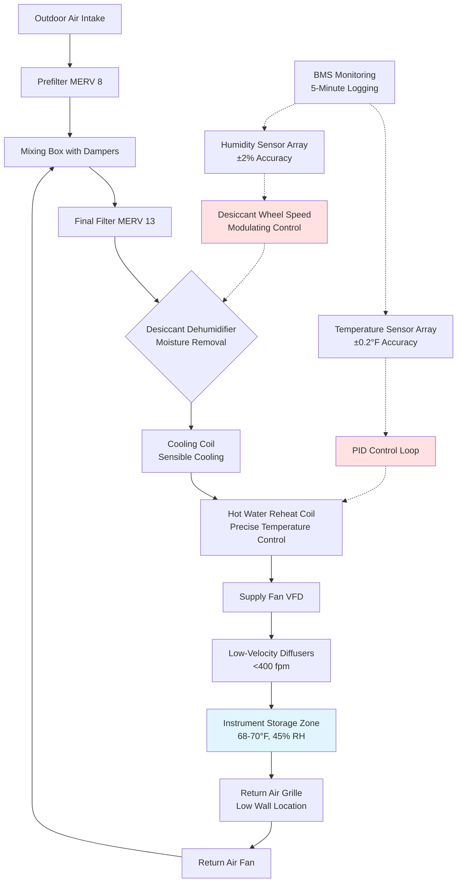

Temperature stability within the 65-75°F range represents a critical environmental parameter for musical instrument preservation. This narrow band balances human comfort during access periods with the thermodynamic requirements of wood, metal, and composite materials under mechanical stress. Temperature fluctuations drive dimensional changes through thermal expansion, alter material properties, and accelerate chemical degradation processes that compromise structural integrity and acoustic performance.

## Physical Basis for Temperature Control

Musical instruments experience thermal expansion and contraction governed by the coefficient of linear thermal expansion (α), which quantifies dimensional change per degree of temperature variation:

$$
\Delta L = L_0 \cdot \alpha \cdot \Delta T
$$

where:
- $\Delta L$ = change in length (inches or mm)
- $L_0$ = original length at reference temperature
- $\alpha$ = coefficient of linear thermal expansion (in/in·°F or mm/mm·°C)
- $\Delta T$ = temperature change from reference (°F or °C)

**Material-specific thermal expansion coefficients at 70°F:**

| Material | α (×10⁻⁶ in/in·°F) | α (×10⁻⁶ mm/mm·°C) |
|----------|---------------------|---------------------|
| Spruce (longitudinal) | 2.1 | 3.8 |
| Spruce (tangential) | 18.9 | 34.0 |
| Maple (longitudinal) | 3.6 | 6.5 |
| Maple (tangential) | 14.2 | 25.6 |
| Ebony (tangential) | 11.5 | 20.7 |
| Steel (piano wire) | 6.5 | 11.7 |
| Brass (valve mechanisms) | 10.4 | 18.7 |
| Nylon (guitar strings) | 45.0 | 81.0 |

The anisotropic expansion of wood creates differential stress at glued joints between perpendicular grain orientations. For a violin top plate 14 inches wide (tangential grain), a 10°F temperature increase causes:

$$
\Delta L = 14 \text{ in} \times 18.9 \times 10^{-6} \text{ in/in·°F} \times 10°F = 0.0026 \text{ in}
$$

While 0.0026 inches appears negligible, this expansion occurs against the longitudinal stability of ribs and back plate, generating internal stress that can separate hide glue joints or cause finish cracking.

## Temperature Effects on String Tension

String instruments maintain acoustic properties through precise tension across the bridge and soundboard. Steel and nylon strings exhibit temperature-dependent tension changes described by:

$$
\frac{\Delta T_s}{T_{s0}} = -\alpha \cdot \Delta T
$$

where:
- $T_s$ = string tension
- $T_{s0}$ = reference string tension at $T_0$
- $\alpha$ = linear thermal expansion coefficient
- $\Delta T$ = temperature change

For a piano with 200 strings at average tension of 165 lbf per string, a 10°F temperature drop increases total soundboard stress by:

$$
\Delta T_{total} = 200 \times 165 \text{ lbf} \times 6.5 \times 10^{-6} \text{/°F} \times 10°F = 215 \text{ lbf}
$$

This 215 lbf increase adds to the existing 33,000 lbf total string tension, causing soundboard crown changes and pitch instability. Temperature fluctuations exceeding ±5°F from the reference tuning temperature produce audible pitch variations across the instrument's range.

## Thermal Stress in Composite Structures

Musical instruments combine materials with differing thermal expansion coefficients, creating interfacial stress during temperature changes. The thermal stress (σ) at a bimetallic interface follows:

$$
\sigma = \frac{E \cdot \Delta \alpha \cdot \Delta T}{1 - \nu}
$$

where:
- $E$ = elastic modulus (psi or MPa)
- $\Delta \alpha$ = difference in thermal expansion coefficients
- $\Delta T$ = temperature change
- $\nu$ = Poisson's ratio

For a spruce soundboard (tangential) glued to maple ribs (longitudinal):
- $\Delta \alpha = (18.9 - 3.6) \times 10^{-6}$ = 15.3 × 10⁻⁶ in/in·°F
- $E_{spruce}$ = 1.6 × 10⁶ psi (tangential)
- $\nu$ = 0.37 (spruce)

A 10°F temperature swing generates interfacial stress:

$$
\sigma = \frac{1.6 \times 10^6 \text{ psi} \times 15.3 \times 10^{-6} \text{/°F} \times 10°F}{1 - 0.37} = 388 \text{ psi}
$$

This 388 psi stress approaches the shear strength of hide glue (500-800 psi), explaining why temperature cycling causes joint separation in historically constructed instruments.

## Temperature Sensitivity Comparison by Instrument Type

Different instrument families exhibit varying susceptibility to temperature fluctuations based on construction materials, structural tension, and thermal mass:

| Instrument Type | Critical Components | Temperature Tolerance | Thermal Time Constant | Primary Failure Mode |
|-----------------|--------------------|-----------------------|----------------------|----------------------|
| Grand Piano | Soundboard, pin block, strings | ±3°F | 8-12 hours | Tuning instability, soundboard stress |
| Violin Family | Hide glue joints, varnish | ±4°F | 20-30 minutes | Joint separation, finish checking |
| Acoustic Guitar | Neck joint, bridge, bracing | ±5°F | 1-2 hours | Neck angle shift, bridge lifting |
| Woodwinds | Tone holes, pad adhesion, bore | ±6°F | 10-15 minutes | Pad sealing failure, bore cracking |
| Brass Instruments | Valve alignment, slide fit | ±8°F | 5-10 minutes | Valve sluggishness, slide binding |
| Harpsichord | Soundboard, string tension | ±2°F | 4-6 hours | Tuning instability, voicing changes |

Grand pianos exhibit the lowest temperature tolerance due to massive soundboard area under sustained tension, while brass instruments tolerate wider fluctuations because metal components expand uniformly without glued joints.

## Museum-Quality Temperature Control Requirements

Conservation-grade instrument storage facilities implement temperature stability protocols derived from museum standards (ASHRAE Chapter 24, AIC Guidelines):

**Primary temperature parameters:**
- **Setpoint range:** 68-70°F (20-21°C) for year-round stability
- **Daily variation:** ±2°F maximum to prevent thermal cycling stress
- **Seasonal drift:** ±3°F total annual variation acceptable
- **Rate of change:** <2°F per hour during HVAC transitions
- **Spatial uniformity:** ±1°F between measurement points within storage room

The 68-70°F setpoint selection balances:
1. **Material stability** at moderate temperatures reducing chemical reaction rates
2. **Human comfort** during instrument handling and inspection
3. **Energy efficiency** minimizing heating/cooling loads
4. **Humidity control** allowing stable RH maintenance in the 40-50% range

## HVAC System Design for Temperature Stability

Maintaining ±2°F temperature stability requires HVAC strategies that eliminate cycling, prevent temperature overshoot, and provide continuous steady-state operation:

**Critical design elements:**

1. **Constant volume air delivery** eliminates temperature fluctuations from VAV hunting behavior and maintains consistent heat removal rates.

2. **Modulating hot water reheat coils** provide precise temperature control through proportional-integral-derivative (PID) loops with ±0.5°F deadband. Reheat capacity sized at 125% of sensible cooling to enable independent humidity and temperature control.

3. **High thermal mass construction** using interior insulation, massive walls, and sealed envelopes reduces external load fluctuations. Time constant >12 hours dampens outdoor temperature swings.

4. **Dedicated outdoor air system (DOAS)** with energy recovery handles ventilation loads separately from space conditioning, preventing supply air temperature variations during occupancy changes.

5. **Redundant temperature sensors** (minimum 3 per zone) with ±0.2°F accuracy enable averaging algorithms that filter false readings and prevent unnecessary system responses.

6. **Night setback prohibition** maintains 24/7 stable conditions. Temperature recovery from setback causes 4-8 hour periods of elevated thermal stress as instruments equilibrate.

## Thermal Load Calculation Considerations

Instrument storage facilities require detailed load analysis accounting for thermal mass effects and transient heat transfer:

**Envelope heat transfer:**
$$
Q_{envelope} = U \cdot A \cdot \Delta T
$$

**Solar heat gain through windows:**
$$
Q_{solar} = A_{window} \cdot SHGC \cdot I_{solar}
$$

**Internal heat generation:**
$$
Q_{internal} = Q_{lighting} + Q_{occupants} + Q_{equipment}
$$

Target U-values for envelope components:
- Walls: U ≤ 0.050 Btu/hr·ft²·°F (R-20 continuous insulation)
- Roof: U ≤ 0.030 Btu/hr·ft²·°F (R-33 continuous insulation)
- Windows: U ≤ 0.25 Btu/hr·ft²·°F with SHGC ≤ 0.25
- Slab: R-15 perimeter insulation extending 4 feet

High-performance envelopes reduce outdoor temperature coupling, allowing HVAC systems to maintain tighter indoor temperature stability with lower equipment cycling frequency.

## Temperature Monitoring and Documentation

Museum-standard instrument preservation requires continuous environmental documentation providing evidence of stable conditions:

**Data acquisition parameters:**
- **Sampling interval:** 5-15 minutes for trending analysis
- **Sensor accuracy:** ±0.2°F for research-grade documentation
- **Calibration frequency:** Annual verification against NIST-traceable standards
- **Alarm thresholds:** ±3°F from setpoint triggers immediate notification
- **Data retention:** Minimum 5-year archive for insurance and conservation records

Temperature data reveals HVAC system performance degradation before instrument damage occurs. Gradual increase in daily temperature range indicates failing damper actuators, fouled coils, or refrigerant charge loss requiring maintenance intervention.

## Long-Term Material Stability

Temperature stability extends instrument lifespan by reducing cumulative thermal stress cycles. The Coffin-Manson relationship from materials science predicts fatigue life under thermal cycling:

$$
N_f = C \cdot (\Delta T)^{-m}
$$

where:
- $N_f$ = cycles to failure
- $C$ = material-specific constant
- $\Delta T$ = temperature range per cycle
- $m$ = fatigue exponent (typically 2-3 for polymers and adhesives)

Reducing daily temperature variation from ±5°F to ±2°F increases joint fatigue life by factor of 4-8, demonstrating the preservation value of precision temperature control.

## Conclusion

Temperature stability within 65-75°F, maintained at ±2°F daily variation, prevents thermal expansion stress, stabilizes string tension, and preserves glued joints in musical instrument collections. The physics of thermal expansion, differential material properties, and stress accumulation justify museum-grade HVAC systems with modulating controls, redundant sensors, and continuous monitoring. Instruments represent irreplaceable cultural artifacts and significant financial investments; precision environmental control protects these assets from the cumulative degradation caused by temperature cycling.

Proper implementation of temperature-stable storage conditions requires integration of high-performance building envelopes, dedicated HVAC equipment, and comprehensive monitoring systems. The 68-70°F setpoint balances material conservation requirements with practical access needs, while ±2°F stability prevents the mechanical stress that accelerates aging and damage in wood, metal, and composite instrument construction.
