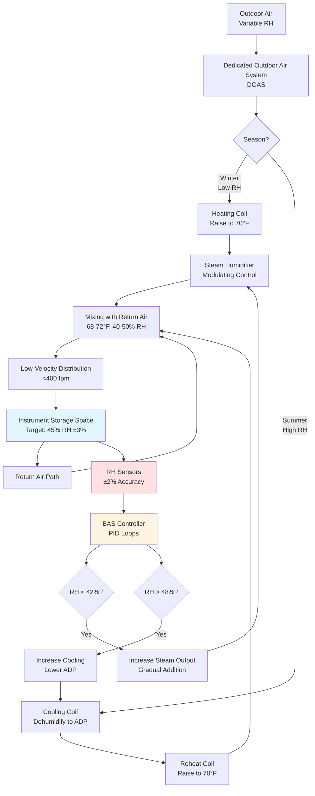

Wood musical instruments—violins, cellos, guitars, woodwinds, and acoustic pianos—require precise relative humidity control between 40-50% to prevent dimensional instability, structural damage, and acoustic degradation. This narrow range balances the hygroscopic nature of wood with the structural demands of instruments under constant mechanical stress from string tension, air pressure, and adhesive joints.

## Wood Moisture Equilibrium Physics

Wood behaves as a hygroscopic material, continuously exchanging moisture with surrounding air until reaching equilibrium moisture content (EMC). The relationship between relative humidity, temperature, and EMC governs dimensional stability in wood instruments.

**Hailwood-Horrobin sorption isotherm** for wood EMC:

$$
\text{EMC} = \frac{1800}{W} \cdot \frac{K_1 \cdot h}{1 - K_1 \cdot h} + \frac{K_1 \cdot K_2 \cdot h + 2 \cdot K_1 \cdot K_2^2 \cdot h^2}{1 + K_1 \cdot K_2 \cdot h + K_1 \cdot K_2^2 \cdot h^2}
$$

Where:
- EMC = Equilibrium moisture content (%)
- h = Relative humidity (decimal, 0.40-0.50 for instruments)
- W = Molecular weight of water (18.02 g/mol)
- K₁, K₂ = Temperature-dependent constants

**Simplified EMC approximation** (valid for 30-70% RH, 60-80°F):

$$
\text{EMC} \approx 0.04 + 0.16 \cdot h + 0.10 \cdot h^2 - 0.0015 \cdot (T - 70)
$$

Where:
- EMC = Equilibrium moisture content (% dry basis)
- h = Relative humidity (decimal)
- T = Temperature (°F)

**At 45% RH and 70°F:**

$$
\text{EMC} = 0.04 + 0.16(0.45) + 0.10(0.45)^2 - 0.0015(0) = 0.132 = 8.3\%
$$

This 8.3% moisture content represents the stable equilibrium for most instrument woods. Deviations from this RH cause moisture migration and dimensional change.

## Hygroscopic Dimensional Change

Wood expands and contracts perpendicular to grain direction as moisture content changes. The coefficient of hygroscopic expansion varies by wood species and grain orientation.

**Linear dimensional change:**

$$
\frac{\Delta L}{L_0} = \alpha_h \cdot \Delta(\text{EMC})
$$

Where:
- ΔL/L₀ = Fractional dimensional change
- αₕ = Hygroscopic expansion coefficient
- ΔEMC = Change in equilibrium moisture content (%)

**Typical hygroscopic expansion coefficients:**

| Wood Species | Tangential (%) | Radial (%) | Longitudinal (%) |
|--------------|----------------|------------|------------------|
| Spruce (soundboards) | 0.32 per 1% MC | 0.16 per 1% MC | 0.01 per 1% MC |
| Maple (backs, necks) | 0.37 per 1% MC | 0.19 per 1% MC | 0.01 per 1% MC |
| Rosewood (fretboards) | 0.42 per 1% MC | 0.22 per 1% MC | 0.01 per 1% MC |
| Ebony (fingerboards) | 0.38 per 1% MC | 0.18 per 1% MC | 0.01 per 1% MC |

**Example calculation for violin top plate:**

Violin soundboard: Spruce, tangential dimension = 200 mm

RH drops from 45% to 35%:
- ΔEMC = 8.3% - 6.8% = 1.5% moisture content change
- ΔL = 200 mm × 0.32%/1%MC × 1.5% = 0.96 mm shrinkage

This 0.96 mm shrinkage creates sufficient stress to open glue joints along the top plate seam, requiring professional restoration.

## Critical RH Range: 40-50%

The 40-50% RH specification derives from balancing opposing failure mechanisms:

**Lower limit (40% RH minimum):**
- Below 40% RH, wood moisture content drops below 7.5%
- Shrinkage stresses exceed glue joint tensile strength (500-800 psi for hide glue)
- Crack initiation in thin soundboards under string tension
- Neck warping and fingerboard separation in guitars

**Upper limit (50% RH maximum):**
- Above 50% RH, wood moisture content exceeds 9.5%
- Swelling raises string action height, degrading playability
- Reduced acoustic velocity in soundboards (velocity ∝ 1/√density)
- Increased susceptibility to mold growth (>65% RH at wood surface)

**Optimal target: 45% RH** provides maximum safety margin from both failure modes.

## Wood Type Comparison: RH Sensitivity

Different wood species exhibit varying sensitivity to humidity fluctuations based on anatomical structure, density, and grain orientation.

| Wood Type | Density (lb/ft³) | Tangential Movement | RH Sensitivity | Common Uses |
|-----------|------------------|---------------------|----------------|-------------|
| Spruce | 27-30 | High (0.32%/1%MC) | Very High | Soundboards, tops |
| Maple | 40-45 | High (0.37%/1%MC) | High | Backs, necks, sides |
| Rosewood | 50-65 | Very High (0.42%/1%MC) | Very High | Backs, fretboards |
| Ebony | 60-70 | High (0.38%/1%MC) | High | Fingerboards, bridges |
| Mahogany | 35-40 | Moderate (0.28%/1%MC) | Moderate | Necks, bodies |
| Cedar | 25-28 | High (0.35%/1%MC) | Very High | Classical guitar tops |

**RH Sensitivity Rating:**
- Very High: >0.015% dimensional change per 1% RH variation
- High: 0.010-0.015% change per 1% RH
- Moderate: <0.010% change per 1% RH

Instruments combining multiple wood species (violin: spruce top, maple back) face additional stress from **differential expansion**, where dissimilar materials expand at different rates, concentrating stress at glue joints.

## Moisture Transport Kinetics

Wood moisture content does not change instantaneously with ambient RH. Moisture diffusion follows Fick's second law:

$$
\frac{\partial C}{\partial t} = D \cdot \frac{\partial^2 C}{\partial x^2}
$$

Where:
- C = Moisture concentration
- t = Time
- D = Moisture diffusivity (typically 10⁻⁶ to 10⁻⁷ cm²/s for wood)
- x = Distance through wood thickness

**Characteristic diffusion time:**

$$
\tau = \frac{L^2}{D}
$$

For a violin top plate (L = 3 mm thickness, D = 2×10⁻⁷ cm²/s):

$$
\tau = \frac{(0.3 \text{ cm})^2}{2 \times 10^{-7} \text{ cm}^2/\text{s}} = 450,000 \text{ s} = 5.2 \text{ days}
$$

This 5-day equilibration time means sudden RH changes create **moisture gradients** through wood thickness, inducing internal stress even before full dimensional change occurs. HVAC systems must limit RH rate of change to <5% per 24 hours to prevent gradient-induced cracking.

## HVAC Control Strategy for 40-50% RH

## Temperature-RH Interaction

Absolute humidity (moisture content of air) determines wood EMC more directly than relative humidity, but RH provides the practical control parameter.

**Psychrometric relationship:**

$$
\text{RH} = \frac{P_v}{P_{vs}} \times 100\%
$$

Where:
- RH = Relative humidity (%)
- Pᵥ = Actual water vapor partial pressure
- Pᵥₛ = Saturation vapor pressure at air temperature

**Saturation pressure (Antoine equation):**

$$
\log_{10}(P_{vs}) = A - \frac{B}{C + T}
$$

For water vapor (T in °F, Pᵥₛ in psi):
- A = 7.196, B = 1750.3, C = 235.0

**At 70°F:**

$$
P_{vs} = 10^{7.196 - \frac{1750.3}{235 + 70}} = 0.3631 \text{ psi}
$$

**At 45% RH and 70°F:**

$$
P_v = 0.45 \times 0.3631 = 0.1634 \text{ psi}
$$

Temperature variations affect RH even with constant absolute humidity. A 5°F drop from 70°F to 65°F with constant moisture:

$$
P_{vs,65} = 0.3056 \text{ psi}
$$

$$
\text{RH}_{65} = \frac{0.1634}{0.3056} \times 100\% = 53.5\%
$$

This **8.5% RH increase** from temperature reduction alone demonstrates why temperature stability (±2°F) is essential alongside RH control.

## Violin-Specific Considerations

Violins present the most demanding humidity requirements due to thin soundboards (2.5-3.5 mm spruce) under high bending stress from bridge pressure and internal arching.

**Soundboard stress analysis:**

Bridge applies approximately 20 lb downward force on 2 cm² contact area:

$$
\sigma = \frac{F}{A} = \frac{20 \text{ lb}}{2 \text{ cm}^2} = \frac{20 \text{ lb}}{0.31 \text{ in}^2} = 64.5 \text{ psi}
$$

This constant compressive stress, combined with bending from arching curvature, creates a stress field approaching 500 psi in the soundboard. When RH drops:

1. Wood shrinks tangentially (width direction)
2. Internal tensile stress adds to existing stress field
3. Total stress exceeds wood tensile strength perpendicular to grain (~600 psi for spruce)
4. Crack propagation initiates, typically along grain lines

**Critical RH threshold for violin cracking:**

Research indicates violin soundboards crack when RH drops below 35% for extended periods (>2 weeks), or when RH decreases >15% within 48 hours. The 40-50% RH specification provides:
- 5% buffer from crack initiation threshold (40% minimum)
- Gradual rate of change preventing shock damage
- Margin for minor HVAC control deviations

## Guitar Humidity Requirements

Classical and steel-string acoustic guitars face similar challenges with additional sensitivity in:

**Neck geometry:**
- Steel-string tension: 150-200 lb total on neck
- Neck relief (curvature) changes 0.010-0.020" per 10% RH variation
- Action height affected by both neck relief and soundboard swelling

**Bracing system:**
- X-bracing or fan-bracing glued to soundboard underside
- Differential expansion between braces and soundboard
- Brace separation observed below 38% RH in older instruments

**Target RH for guitars:** 45-50% (slightly higher than violins)
- Wider tolerance reflects thicker soundboards (2.5-3.5 mm typical)
- Lower string tension per unit area compared to violins
- Modern PVA glues more moisture-resistant than hide glue

## Implementation Requirements

**HVAC system specifications for wood instrument storage:**

**Humidity control equipment:**
- Desiccant dehumidification: Required for <50% RH control in humid climates
- Steam humidification: Electrode or gas-fired, modulating 0-100%
- Control accuracy: ±2% RH via high-quality humidity transmitters
- Response time: <15 minutes to 50% correction of deviation

**Air distribution:**
- Supply air velocity at instruments: <30 fpm to prevent localized drying
- Air changes per hour: 4-6 ACH for adequate mixing
- Diffuser selection: Perforated ceiling panels or low-velocity displacement
- Temperature stratification: <2°F floor to ceiling

**Monitoring and alarms:**
- Multiple RH sensors (minimum 3 per zone) with continuous data logging
- Alarm thresholds: 38% RH low, 52% RH high
- Temperature alarm: ±3°F from 70°F setpoint
- Automated notification: Email/SMS to facility manager and HVAC contractor

**Seasonal adjustments:**

| Season | Outdoor Condition | Primary Load | Control Strategy |
|--------|------------------|--------------|------------------|
| Winter | 30°F, 40% RH | Humidification | Steam addition after heating |
| Spring | 55°F, 60% RH | Dehumidification | Cooling coil + reheat |
| Summer | 85°F, 70% RH | Cooling + Dehumidification | Low ADP + desiccant assist |
| Fall | 60°F, 50% RH | Minimal | Maintain 45% RH setpoint |

## Economic Justification

High-value instrument collections justify precision humidity control based on damage prevention:

**Repair cost analysis:**
- Violin soundboard crack repair: $1,500-$5,000
- Guitar bridge reglue: $300-$800
- Piano soundboard restoration: $3,000-$15,000
- Complete instrument devaluation from cracking: 30-70% of market value

**HVAC system incremental cost:**
- Desiccant dehumidification: +$8,000-$15,000 for 2,000 CFM system
- Precision steam humidifier: +$3,000-$6,000 vs. evaporative
- Enhanced controls and monitoring: +$2,000-$4,000
- **Total premium: $13,000-$25,000**

For a collection valued at $100,000+, the HVAC investment represents 13-25% of asset value while preventing irreversible damage. Professional conservators universally recommend the 40-50% RH range for wood instruments, making precision environmental control the industry standard for serious collections.

The physics of wood moisture equilibrium, hygroscopic expansion, and stress concentration in instruments under tension demands HVAC systems capable of year-round stability within narrow tolerances. Proper implementation preserves instrument value, maintains acoustic performance, and prevents costly structural damage.
