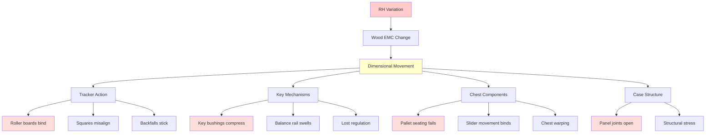
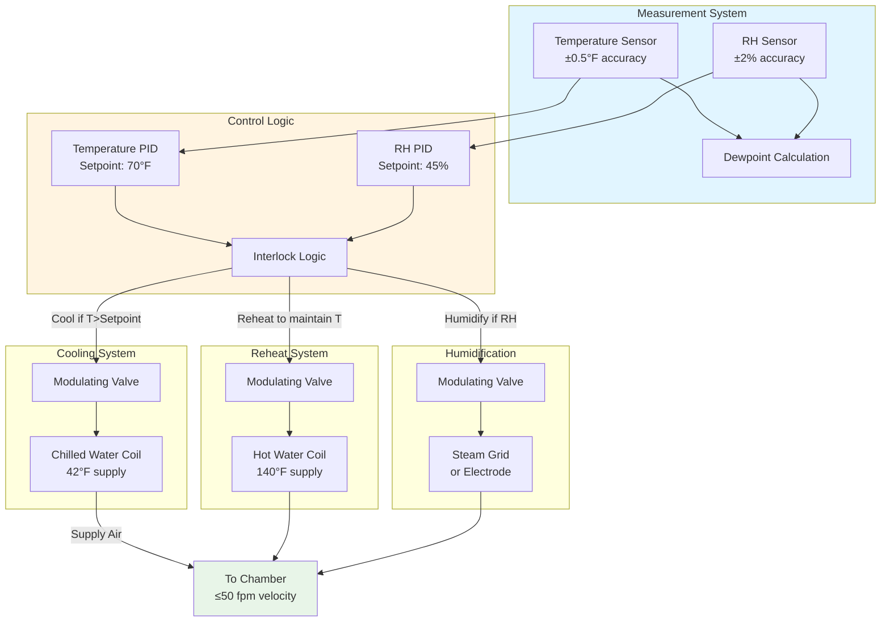

# RH 40-50% Stability for Organ Chambers

Pipe organ mechanical systems contain extensive hygroscopic materials—wood actions, felt bushings, and leather pneumatics—that undergo dimensional changes in response to relative humidity variations. The 40-50% RH control range represents the equilibrium point where wood moisture content stabilizes at 8-10%, minimizing dimensional movement while preventing material degradation from excessive dryness or humidity. Humidity excursions beyond this range cause tracker action binding, key regulation loss, and leather deterioration, requiring precise HVAC control to maintain mechanical reliability throughout the organ's service life.

## Wood Moisture Equilibrium

### Equilibrium Moisture Content Relationship

Wood components in organ mechanisms exchange water vapor with surrounding air until reaching equilibrium moisture content (EMC). This relationship follows the Hailwood-Horrobin sorption isotherm:

**EMC as function of relative humidity:**

$$EMC = \frac{1800}{W} \cdot \frac{K \cdot h}{1 - K \cdot h} + \frac{K_1 \cdot K \cdot h + 2 \cdot K_1 \cdot K_2 \cdot K^2 \cdot h^2}{1 + K_1 \cdot K \cdot h + K_1 \cdot K_2 \cdot K^2 \cdot h^2}$$

Where:
- $EMC$ = Equilibrium moisture content (%)
- $h$ = Relative humidity (decimal fraction)
- $W$ = 349 for most wood species
- $K$, $K_1$, $K_2$ = Temperature-dependent coefficients

**Simplified EMC approximation for organ wood at 68-72°F:**

$$EMC \approx 0.00867 + 0.0684 \cdot h + 0.114 \cdot h^2$$

For RH in percentage:

$$EMC \approx 0.00867 + 0.0000684 \cdot RH + 0.0000114 \cdot RH^2$$

**Target RH range and corresponding EMC:**

| Relative Humidity | EMC (Softwood) | EMC (Hardwood) | Dimensional Stability |
|-------------------|----------------|----------------|----------------------|
| 35% | 7.0% | 6.8% | Risk of shrinkage cracking |
| 40% | 8.0% | 7.8% | Lower acceptable limit |
| 45% | 8.9% | 8.7% | **Optimal setpoint** |
| 50% | 9.8% | 9.6% | Upper acceptable limit |
| 55% | 10.6% | 10.4% | Risk of swelling binding |
| 60% | 11.4% | 11.2% | Excessive moisture, corrosion risk |

The 40-50% RH range maintains EMC between 8-10%, the stability zone for dimensional consistency and mechanical performance.

## Hygroscopic Dimensional Changes

### Wood Movement Across Grain

Wood exhibits anisotropic expansion with moisture content changes, with minimal longitudinal movement but significant radial and tangential expansion:

**Dimensional change relationship:**

$$\frac{\Delta W}{W} = \alpha_{moisture} \cdot \Delta EMC$$

Where:
- $\Delta W/W$ = Fractional dimensional change (%)
- $\alpha_{moisture}$ = Moisture expansion coefficient
- $\Delta EMC$ = Change in equilibrium moisture content (%)

**Moisture expansion coefficients (per 1% EMC change):**

| Wood Type | Radial Direction | Tangential Direction | Application |
|-----------|------------------|---------------------|-------------|
| Sitka spruce | 0.34% | 0.67% | Soundboards, pallets |
| Sugar pine | 0.36% | 0.50% | Wind chest components |
| White oak | 0.51% | 0.95% | Key frames, benches |
| Hard maple | 0.43% | 0.83% | Key levers, tracker parts |
| Basswood | 0.62% | 0.92% | Pipe stoppers, chest slides |

**Example calculation for tracker action binding:**

Consider a basswood stop action slide, 12 inches wide (tangential orientation), experiencing RH change from 45% to 60%:

EMC change:
$$\Delta EMC = 11.4\% - 8.9\% = 2.5\%$$

Dimensional expansion:
$$\Delta W = 12 \text{ in} \times 0.0092 \times 2.5 = 0.276 \text{ in}$$

This 0.276-inch expansion in a close-tolerance sliding mechanism causes complete binding failure.

**Critical organ components and RH sensitivity:**

### Rate of EMC Change

Wood moisture content responds to RH changes with time lag determined by diffusion physics:

**Fick's second law of diffusion:**

$$\frac{\partial MC}{\partial t} = D \frac{\partial^2 MC}{\partial x^2}$$

Where:
- $MC$ = Moisture content at position and time
- $t$ = Time
- $D$ = Moisture diffusivity (ft²/day)
- $x$ = Distance from surface

**Time constant for moisture equilibration:**

$$\tau \approx \frac{L^2}{D}$$

For typical organ wood components (0.5-1.0 inch thickness) with D ≈ 0.001-0.003 ft²/day:

$$\tau \approx 2-20 \text{ days for 63\% equilibration}$$

**Practical implications:**

- Sudden RH changes create moisture gradients causing internal stress
- Rapid drying (winter heating startup) causes surface shrinkage cracking
- Rapid humidification (summer) causes surface swelling and warping
- Gradual RH transitions (< 5% per week) minimize stress development

## Material-Specific RH Effects

### Comparison of Organ Materials

Different organ materials respond uniquely to relative humidity variations:

| Material | Optimal RH Range | <40% RH Effects | >50% RH Effects | Critical Failure Mode |
|----------|-----------------|-----------------|-----------------|----------------------|
| **Wood (actions)** | 40-50% | Shrinkage, joint separation, cracking | Swelling, binding, warping | Tracker action seizure |
| **Leather (pneumatics)** | 35-50% | Hardening, cracking, stiffening | Softening, stretching, mold | Loss of pneumatic seal |
| **Felt (bushings)** | 40-55% | Compression set, lost cushioning | Expansion, excessive friction | Key regulation loss |
| **Glue (hide glue)** | 40-50% | Brittleness, joint failure | Softening, creep, joint slip | Structural disassembly |
| **Metal pipes** | Non-critical | Minimal effect | Surface oxidation, verdigris | Cosmetic only at <65% |
| **Wood pipes** | 40-50% | Shrinkage cracks, air leaks | Swelling, stopped pipes | Loss of wind seal |

### Leather Component Preservation

Leather pneumatics and valve facings exhibit complex hygroscopic behavior:

**Leather moisture content relationship:**

$$MC_{leather} = a + b \cdot RH + c \cdot RH^2$$

For vegetable-tanned organ leather:
- a ≈ 4.5
- b ≈ 0.095
- c ≈ 0.0008

At RH = 45%:
$$MC_{leather} = 4.5 + 0.095(45) + 0.0008(45)^2 = 10.4\%$$

**Leather mechanical properties vs. RH:**

| RH Level | Leather MC | Tensile Strength | Stiffness | Seal Quality |
|----------|-----------|------------------|-----------|--------------|
| 30% | 7.3% | High | Brittle/stiff | Cracking, poor seal |
| 40% | 8.8% | Optimal | Flexible | Good seal retention |
| 45% | 10.4% | Optimal | Ideal flexibility | Excellent seal |
| 50% | 12.1% | Reduced | Softening begins | Good, monitor mold |
| 60% | 15.4% | Weakened | Excessive softness | Seal deformation, mold |

Leather preservation requires:
- Minimum 35% RH to prevent desiccation cracking
- Maximum 55% RH to prevent mold growth (Aspergillus at >60% RH)
- Stable RH to minimize fatigue from expansion/contraction cycling

## Humidity Control Strategies

### HVAC System Design for ±3% RH Stability

Achieving ±3% RH control requires decoupled temperature-humidity regulation:

**Control sequence for RH stability:**

1. **Dehumidification mode (RH > 48%):**
   - Cool supply air below dewpoint to condense moisture
   - Reheat to maintain 70°F supply temperature
   - Reduce humidifier output to zero

2. **Humidification mode (RH < 42%):**
   - Maintain cooling for temperature control
   - Inject steam into supply airstream
   - Monitor supply duct RH to prevent condensation

3. **Stable mode (42% < RH < 48%):**
   - Minimal cooling/reheat adjustment for temperature
   - Humidifier idle or minimal output
   - Coast through dead band

**Psychrometric process analysis:**

For chamber requiring 2000 CFM at 70°F, 45% RH:

Chamber dewpoint at setpoint:
$$T_{dp} = 47.7°F$$

Cooling coil leaving condition for dehumidification:
$$T_{coil} = 42°F \text{ (below dewpoint)}$$

Reheat requirement:
$$\dot{Q}_{reheat} = 2000 \times 60 \times 0.075 \times 0.24 \times (70 - 42) = 60,480 \text{ Btu/hr}$$

Humidification requirement (winter, 20% outdoor RH):
$$\Delta W = 0.0077 - 0.0029 = 0.0048 \text{ lb water/lb dry air}$$

$$\dot{m}_{steam} = 2000 \times 60 \times 0.075 \times 0.0048 = 43.2 \text{ lb/hr}$$

### Setpoint Selection: 45% RH Optimal

The 45% RH setpoint balances competing material requirements:

**Decision matrix for RH setpoint:**

| Consideration | Favors Lower RH (40%) | Favors Higher RH (50%) | Optimal Compromise |
|---------------|----------------------|----------------------|-------------------|
| Wood dimensional stability | ✓ Less swelling risk | Higher EMC variation | 45% (midpoint) |
| Leather flexibility | ✗ Increased brittleness | ✓ Maintains suppleness | 45-48% |
| Glue joint strength | ✓ Higher strength | ✗ Creep risk | 42-45% |
| Metal corrosion | ✓ Lower oxidation | ✗ Tarnishing begins | <48% |
| Dust/felt attraction | ✓ Less static | ✗ More moisture | 45% |
| Energy consumption | ✓ Less humidification | ✗ Higher steam cost | 45% |
| **Recommended Setpoint** | — | — | **45% ±3%** |

**Seasonal adjustment strategy:**

Some organ builders recommend gradual seasonal drift within 40-50% range:

- Winter setpoint: 42% RH (reduced humidification load, lower infiltration moisture)
- Summer setpoint: 48% RH (reduced cooling for dehumidification, leverages outdoor humidity)
- Transition rate: Maximum 1% RH per week to allow wood gradual adjustment

This approach reduces energy consumption while maintaining wood EMC within 8-10% year-round.

## Monitoring and Verification

### Sensor Placement and Accuracy

Proper RH measurement requires strategic sensor location:

**Sensor location criteria:**

| Location | Distance from Source | Mounting Height | Rationale |
|----------|---------------------|-----------------|-----------|
| Primary control sensor | >8 ft from diffusers | Mid-chamber elevation | Avoid supply air stratification |
| Verification sensor | Opposite wall from primary | Same elevation | Confirm uniform distribution |
| Near leather pneumatics | Within organ case | Adjacent to sensitive parts | Monitor actual material conditions |
| Supply duct | Post-humidifier | Centerline of duct | Prevent supply condensation |

**Sensor accuracy requirements:**

High-precision RH measurement essential for ±3% control:

- Sensor accuracy: ±2% RH or better
- Drift: <1% RH per year
- Response time: <30 seconds to 90% of step change
- Calibration: Annual verification against NIST-traceable standard

**Calculation of control dead band:**

With ±2% sensor accuracy and ±3% control tolerance:

$$\text{Total uncertainty} = \sqrt{(\pm 2\%)^2 + (\pm 1\%)^2} = \pm 2.24\%$$

Dead band setting:
$$\text{Dead band} = 45\% \pm 1.5\% \text{ (triggers at 43.5% and 46.5%)}$$

This prevents control oscillation while maintaining ±3% operational range.

### Long-Term Stability Verification

**Data logging protocol:**

Continuous monitoring over minimum 12-month period:

1. **Data collection:**
   - Temperature and RH: 5-minute intervals
   - Chamber pressure differential: 1-minute intervals
   - HVAC equipment status: State changes
   - Outdoor conditions: Hourly averages

2. **Statistical analysis:**
   - Daily range: Max - Min for each 24-hour period
   - Hourly rate of change: °F/hr and %RH/hr
   - Seasonal drift: Monthly average setpoint
   - Control compliance: Percentage of time within ±3% RH

3. **Acceptance criteria:**
   - 95% of time within 42-48% RH
   - Maximum hourly change: 2% RH
   - Maximum daily range: 6% RH (43.5-49.5% extreme limits)
   - No excursions below 38% or above 52% RH

**Correlation with organ performance:**

Document tuning stability in parallel with environmental data:

- Tuning frequency required (intervals between regulation)
- Specific mechanical failures and corresponding RH excursions
- Seasonal pitch drift patterns
- Organ builder service call log with environmental correlation

Establishing this correlation validates HVAC performance and identifies improvement opportunities for long-term organ preservation.

## Design Recommendations

**HVAC system configuration for RH 40-50% stability:**

1. **Dedicated system:** Isolated AHU serving organ chamber only
2. **Cooling capacity:** Sized for dewpoint control, not sensible load alone
3. **Reheat:** Hot water coil with modulating control, 60-80% of cooling capacity
4. **Humidification:** Steam grid or electrode boiler, 30-50 lb/hr capacity typical
5. **Control system:** DDC with independent temperature and RH PIDs
6. **Monitoring:** Dual RH sensors with automatic switchover on failure
7. **Alarming:** After-hours notification for RH excursions beyond 38-52%

**Commissioning verification checklist:**

- [ ] RH sensor calibration verified against reference hygrometer
- [ ] Control sequence tested through all operating modes
- [ ] Dehumidification capacity verified (ability to reach 40% RH on humid day)
- [ ] Humidification capacity verified (ability to reach 50% RH during dry conditions)
- [ ] Supply air condensation check (no moisture on duct interior)
- [ ] 48-hour stability test with continuous data logging
- [ ] Organ builder environmental acceptance signoff

Proper RH control between 40-50% with ±3% stability preserves organ mechanical integrity, minimizes tuning maintenance, and ensures reliable performance throughout the instrument's multi-decade service life.
