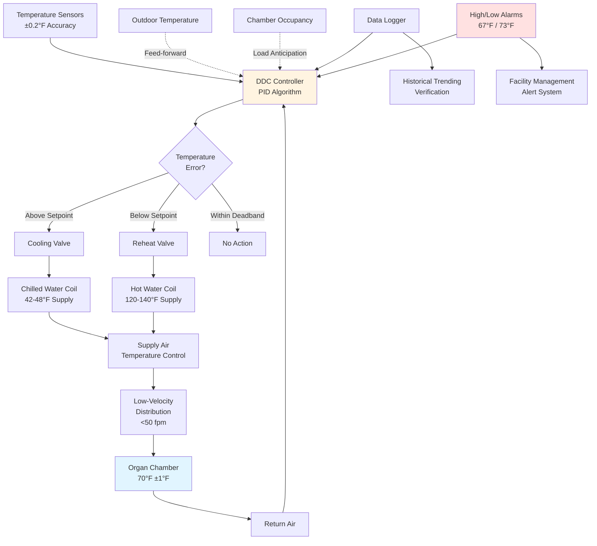

# Organ Chamber Temperature Control: 68-72°F

Pipe organ tuning exhibits extreme temperature sensitivity through fundamental thermoacoustic relationships between air temperature, sound velocity, and pipe resonant frequency. The standard temperature range of 68-72°F represents a compromise between human comfort, tuning stability, and material preservation. Deviations beyond ±2°F produce audible pitch changes that disrupt musical performance, while longer-term temperature variations cause differential thermal expansion in multi-material pipe construction.

## Thermoacoustic Relationships

### Speed of Sound Temperature Dependence

The fundamental frequency of an organ pipe depends directly on the speed of sound in air, which varies with absolute temperature according to kinetic theory:

$$c = \sqrt{\gamma \frac{R T}{M}}$$

Where:
- $c$ = Speed of sound (ft/s)
- $\gamma$ = Specific heat ratio for air = 1.4 (dimensionless)
- $R$ = Universal gas constant = 1545 ft·lbf/(lbmol·°R)
- $T$ = Absolute temperature (°R)
- $M$ = Molecular weight of air = 28.97 lbm/lbmol

**Simplified temperature relationship:**

$$c = 49.03 \sqrt{T_{abs}} = 49.03 \sqrt{T_F + 459.67}$$

At standard organ chamber temperature (70°F = 529.67°R):

$$c_{70°F} = 49.03 \sqrt{529.67} = 1128.3 \text{ ft/s}$$

### Pipe Frequency Equation

Open pipe fundamental frequency derives from standing wave condition where pipe length equals half-wavelength:

$$f = \frac{c}{2L_{eff}}$$

Where:
- $f$ = Fundamental frequency (Hz)
- $L_{eff}$ = Effective pipe length including end correction (ft)

**End correction for open cylindrical pipe:**

$$L_{eff} = L_{physical} + 0.6d$$

Where $d$ = pipe diameter

### Tuning Sensitivity to Temperature

Differentiating frequency with respect to temperature:

$$\frac{df}{dT} = \frac{\partial}{\partial T}\left(\frac{c}{2L}\right) = \frac{1}{2L} \frac{dc}{dT}$$

From speed of sound equation:

$$\frac{dc}{dT} = \frac{49.03}{2\sqrt{T_{abs}}} = \frac{c}{2T_{abs}}$$

Therefore:

$$\frac{df}{dT} = \frac{f}{2T_{abs}}$$

**Fractional frequency change per degree:**

$$\frac{1}{f}\frac{df}{dT} = \frac{1}{2T_{abs}}$$

At 70°F (529.67°R):

$$\frac{1}{f}\frac{df}{dT} = \frac{1}{1059.34} = 9.44 \times 10^{-4} \text{ per °F} = 0.094\% \text{ per °F}$$

**Musical cents conversion:**

Musical pitch is measured logarithmically in cents, where 100 cents = 1 semitone:

$$\text{Cents} = 1200 \log_2\left(\frac{f_2}{f_1}\right)$$

For small frequency changes:

$$\Delta\text{Cents} \approx 1731 \times \frac{\Delta f}{f}$$

Therefore, temperature-induced pitch change:

$$\frac{\Delta\text{Cents}}{\Delta T} = 1731 \times 0.000944 = 1.63 \text{ cents per °F}$$

### Perceptual Thresholds

| Temperature Change | Frequency Shift | Pitch Change (Cents) | Musical Perception |
|-------------------|-----------------|---------------------|-------------------|
| ±0.5°F | ±0.047% | ±0.8 cents | Below detection threshold |
| ±1°F | ±0.094% | ±1.6 cents | Trained musicians detect |
| ±2°F | ±0.188% | ±3.3 cents | Clearly audible beating |
| ±3°F | ±0.282% | ±4.9 cents | Unacceptable to audience |
| ±4°F | ±0.376% | ±6.5 cents | Severely out-of-tune |
| ±5°F | ±0.470% | ±8.2 cents | Unplayable with other instruments |

**Critical thresholds:**
- **5 cents:** Universally recognized as out-of-tune
- **3 cents:** Professional musicians find objectionable
- **2 cents:** Detectable beating between organ ranks

**Design conclusion:** Maximum ±2°F daily variation preserves tuning within ±3.3 cents, approaching but not exceeding the professional acceptability threshold.

## Thermal Expansion Effects

### Metal Pipe Expansion

Organ pipes constructed from lead-tin alloys exhibit linear thermal expansion:

$$\Delta L = L_0 \alpha \Delta T$$

Where:
- $\Delta L$ = Length change (inches)
- $L_0$ = Original length (inches)
- $\alpha$ = Linear expansion coefficient (in/in/°F)
- $\Delta T$ = Temperature change (°F)

**Common organ pipe metals:**

| Alloy Composition | Linear Expansion Coefficient α | Typical Application |
|-------------------|-------------------------------|---------------------|
| Common metal (75% Pb, 25% Sn) | 16.0 × 10⁻⁶ per °F | Principals, flutes |
| Spotted metal (50% Pb, 50% Sn) | 14.5 × 10⁻⁶ per °F | Façade pipes, reeds |
| Pure tin (100% Sn) | 12.3 × 10⁻⁶ per °F | High-pressure reeds |
| Zinc | 17.4 × 10⁻⁶ per °F | Large pedal pipes |
| Copper (reed resonators) | 9.4 × 10⁻⁶ per °F | Reed pipe resonators |

**Example calculation for 8-foot principal pipe:**

Given:
- Pipe length: $L_0 = 96$ inches (8 feet)
- Material: Common metal, $\alpha = 16 \times 10^{-6}$ per °F
- Temperature change: $\Delta T = 4°F$

$$\Delta L = 96 \times 16 \times 10^{-6} \times 4 = 0.00614 \text{ inches}$$

**Fractional length change:**

$$\frac{\Delta L}{L_0} = 16 \times 10^{-6} \times 4 = 64 \times 10^{-6} = 0.0064\%$$

### Combined Temperature Effects

Total frequency shift combines two opposing mechanisms:

1. **Air density effect** (increases frequency): $+0.094\%$ per °F
2. **Pipe expansion** (decreases frequency): $-0.0016\%$ per °F

**Net frequency change:**

$$\frac{\Delta f}{f} = \left(\frac{1}{2T_{abs}} - \alpha\right) \Delta T$$

$$\frac{\Delta f}{f} = (0.000944 - 0.000016) \times \Delta T = 0.000928 \times \Delta T$$

For practical purposes, the air density effect dominates (98% of total), and pipe expansion contributes only 2% correction.

### Wood Pipe Thermal Response

Wooden organ pipes (typically 16-foot and 32-foot pedal stops) exhibit more complex behavior:

**Parallel-to-grain expansion:**

$$\alpha_{parallel} = 2-3 \times 10^{-6} \text{ per °F}$$

Wood expansion along grain negligibly affects pipe length.

**Perpendicular-to-grain expansion:**

$$\alpha_{perpendicular} = 20-40 \times 10^{-6} \text{ per °F}$$

Cross-grain expansion affects pipe cross-section, modifying acoustic impedance and frequency through complex wave propagation effects beyond simple length scaling.

## Temperature Control Strategies

### Setpoint Selection

**Standard setpoint: 70°F**

Justification:
1. **Musical convention:** Historical tuning temperature (20°C = 68°F in Europe, 70°F in North America)
2. **Human comfort:** Organists and maintenance personnel comfort during extended periods
3. **Building compatibility:** Matches adjacent performance space temperatures, reducing infiltration heat transfer
4. **Energy efficiency:** Moderate setpoint minimizes heating/cooling loads

**Alternative setpoints:**

| Temperature | Application | Considerations |
|------------|-------------|----------------|
| 68°F | European practice | Matches A=440 Hz tuning at lower temperature |
| 70°F | North American standard | Better human comfort |
| 72°F | Theater organs | Higher pressure systems, higher ambient heat |
| 65°F | Storage/mothballed organs | Reduced energy cost, requires re-tuning for performance |

### Control Tolerance Requirements

**Hourly stability:** ±0.5°F maximum

Prevents perceptible tuning drift during single performance (typical 1-2 hour duration).

**Daily stability:** ±2°F maximum

Maintains tuning within 3.3 cents, approaching professional acceptability limit.

**Seasonal variation:** ±4°F acceptable

Gradual seasonal drift (over weeks) allows voicers to re-tune instrument. Abrupt changes cause material stress.

### HVAC System Response Time

Temperature control system must balance responsiveness against overshoot:

**Thermal time constant of organ chamber:**

$$\tau = \frac{mC}{UA}$$

Where:
- $m$ = Total mass of air and organ components (lbm)
- $C$ = Specific heat (Btu/lbm·°F)
- $U$ = Overall heat transfer coefficient (Btu/hr·ft²·°F)
- $A$ = Surface area for heat exchange (ft²)

**Typical chamber:** $\tau = 2-4$ hours

**Control implications:**

1. PID controller with slow integral time (15-30 minutes) prevents oscillation
2. Proportional band: 4-6°F (allows gradual approach to setpoint)
3. Avoid rapid reheat cycles (thermal shock to pipes)

### Temperature Distribution Uniformity

Vertical stratification creates tuning problems in multi-level organ chambers:

**Natural convection temperature gradient:**

$$\frac{dT}{dz} \approx 0.5-1.0 °F \text{ per 10 feet of height}$$

For chamber with 30-foot height:
- Floor level: 69°F
- Mid-level (15 feet): 70°F
- Ceiling level: 71.5°F

**Vertical tuning differential:**

Pipes at different elevations experience different temperatures, creating relative pitch shifts between stops.

**Mitigation strategies:**
1. **Destratification fans:** Low-velocity ceiling fans (50-100 rpm) create gentle mixing
2. **Multiple supply zones:** Separate temperature control for upper/lower chamber regions
3. **Displacement ventilation:** Supply cool air at floor, return at ceiling, natural mixing reduces gradient

## Control System Design

### Sensor Placement

**Primary control sensor:**
- Location: Chamber geometric center, at mid-height of primary pipe work (typically 8-12 feet above floor)
- Mounting: Aspirated shield to prevent radiant heat effects
- Accuracy: ±0.2°F or better
- Response time: < 30 seconds

**Verification sensors:**
- Upper chamber: Near ceiling, monitoring stratification
- Lower chamber: Near floor, monitoring displacement ventilation effectiveness
- Pipe level: Multiple locations throughout chamber, documenting spatial uniformity

### Cooling-Reheat Coordination

Independent cooling and reheat coils enable simultaneous dehumidification and temperature control:

**Summer operation:**

1. Cooling coil: Chill supply air to 55-60°F (below chamber dewpoint for dehumidification)
2. Reheat coil: Elevate supply air to 68-69°F (slightly below setpoint)
3. Supply air absorbs sensible heat in chamber, reaching 70°F setpoint

**Supply air temperature calculation:**

$$T_{supply} = T_{setpoint} - \frac{\dot{Q}_{sensible}}{\dot{m}_{air} c_p}$$

Where:
- $\dot{Q}_{sensible}$ = Sensible heat gain (Btu/hr)
- $\dot{m}_{air}$ = Air mass flow rate (lbm/hr)
- $c_p$ = Specific heat of air = 0.24 Btu/lbm·°F

**Winter operation:**

1. Cooling coil: Minimal or no cooling
2. Reheat coil: Primary temperature control
3. Humidification: Steam injection to maintain RH setpoint

### Load Calculations

**Sensible heat gains:**

| Heat Source | Typical Magnitude | Notes |
|-------------|------------------|-------|
| Envelope conduction | 5,000-15,000 Btu/hr | Depends on chamber insulation, adjacent space temperature |
| Infiltration | 2,000-8,000 Btu/hr | Reduced if chamber positively pressurized |
| Lighting | 1,000-3,000 Btu/hr | Minimal in chamber, primarily access lighting |
| Organ blower heat | 3,000-10,000 Btu/hr | Depends on blower motor size (5-15 HP typical) |
| Occupancy (tuning/maintenance) | 500-1,500 Btu/hr | Intermittent, 2-4 people maximum |

**Total sensible load:** 11,500-37,500 Btu/hr (1-3 tons cooling)

**Latent load:** Primarily dehumidification during humid months, 5,000-15,000 Btu/hr

**System sizing:** 1.5-4.0 ton dedicated AHU typical for most organ chambers

## Temperature Verification Protocol

### Commissioning Measurements

**Spatial temperature survey:**

Deploy calibrated data loggers (±0.2°F accuracy) at minimum 12 locations throughout chamber:

1. **Vertical profile:** Floor, 8 feet, 16 feet, 24 feet, ceiling (document stratification)
2. **Horizontal distribution:** Four corners, center, at primary pipe level (document uniformity)
3. **Recording interval:** 5 minutes
4. **Duration:** Minimum 7 consecutive days covering full week of operation

**Acceptance criteria:**
- All locations within ±1.5°F of setpoint at steady-state
- Vertical gradient < 0.5°F per 10 feet
- Temporal variation < ±2°F over 24-hour period at any single location

### Long-Term Monitoring

**Permanent monitoring system:**

Install dedicated temperature sensor with continuous data logging:
- Web-accessible dashboard for facility management
- Historical trending with 1-year data retention
- Automated alarms for out-of-range conditions
- Export capability for organ builder verification

**Alarm setpoints:**
- Low temperature alarm: 67°F (3°F below setpoint)
- High temperature alarm: 73°F (3°F above setpoint)
- Rate-of-change alarm: > 2°F per hour (indicates HVAC malfunction)

### Correlation with Tuning Stability

**Organ builder verification:**

During tuning visits, organ technicians document:
1. Overall pitch level compared to previous tuning (indicates seasonal drift)
2. Differential pitch between ranks (indicates non-uniform temperature)
3. Stability over tuning session duration (indicates hourly control quality)

**Example documentation:**

Temperature log shows 2°F daily variation → Organ builder reports minimal re-tuning required (acceptable).

Temperature log shows 5°F daily variation → Organ builder reports extensive re-tuning, recommends HVAC system improvement (unacceptable).

## Material-Specific Considerations

### Pipe Material Temperature Effects Summary

| Material | Expansion Coefficient | Dominant Effect | Temperature Sensitivity |
|----------|----------------------|-----------------|------------------------|
| Lead-tin alloy (75/25) | 16 × 10⁻⁶ /°F | Air density | 0.094% per °F |
| Spotted metal (50/50) | 14.5 × 10⁻⁶ /°F | Air density | 0.094% per °F |
| Pure tin | 12.3 × 10⁻⁶ /°F | Air density | 0.094% per °F |
| Zinc | 17.4 × 10⁻⁶ /°F | Air density + expansion | 0.092% per °F |
| Wood (parallel grain) | 2-3 × 10⁻⁶ /°F | Air density | 0.094% per °F |
| Wood (cross-grain) | 20-40 × 10⁻⁶ /°F | Complex acoustic impedance effects | Variable |
| Copper (reed resonators) | 9.4 × 10⁻⁶ /°F | Air density | 0.094% per °F |

**Key finding:** Air density dominates tuning response for all metallic pipes. Physical expansion contributes < 2% of frequency shift.

### Reed Pipe Temperature Response

Reed pipes exhibit additional temperature sensitivity through reed tongue stiffness:

**Reed tongue effective stiffness:**

$$k_{eff}(T) = k_0 \left[1 + \beta(T - T_0)\right]$$

Where:
- $k_0$ = Stiffness at reference temperature
- $\beta$ = Temperature coefficient (negative for most brass/bronze alloys)
- Typical: $\beta \approx -200$ ppm/°F

**Reed frequency temperature dependence:**

$$f_{reed} = \frac{1}{2\pi}\sqrt{\frac{k_{eff}}{m_{eff}}}$$

Temperature affects both air column resonance (in resonator) and reed tongue vibration frequency, creating complex tuning behavior requiring separate voicing considerations.

## Energy Efficiency Considerations

### Annual Energy Consumption

**Typical organ chamber (1,500 ft³, 70°F setpoint):**

Cooling energy (annual): 8,000-15,000 kWh
Heating energy (annual): 15,000-30,000 kWh (depends on climate)
Humidification energy (annual): 5,000-10,000 kWh

**Total:** 28,000-55,000 kWh/year = $3,000-$6,000/year at $0.11/kWh

### Efficiency Optimization

**Envelope improvements:**

Insulating organ chamber walls to R-20 minimum reduces conductive heat transfer by 40-60%, proportionally reducing heating/cooling loads.

**Heat recovery:**

Installing energy recovery ventilator (ERV) on chamber ventilation air reduces conditioning load by recovering 60-80% of sensible and latent energy from exhaust air.

**Setpoint optimization:**

Each 1°F increase in cooling setpoint reduces cooling energy by approximately 3-5%. However, tuning stability requirements limit flexibility—maintain 68-72°F range regardless of energy cost.

**Night setback concerns:**

Allowing temperature to float during unoccupied hours saves energy but creates thermal cycling stress on organ materials and requires re-stabilization period before performance. Generally not recommended for performance instruments; acceptable for practice organs with lower stability requirements.

## Conclusion

Maintaining organ chamber temperature at 68-72°F with ±2°F daily stability preserves tuning within professionally acceptable limits through thermoacoustic relationships governing sound velocity and pipe resonant frequency. The dominant temperature effect—0.094% frequency shift per °F—derives from air density changes, while physical pipe expansion contributes negligibly. HVAC system design must provide precise temperature control through low-velocity air distribution, dedicated cooling-reheat capability, and coordinated dehumidification, justified by the extreme sensitivity of pipe organ tuning to environmental conditions and the requirement for multi-decade tuning stability in these specialized musical instruments.
