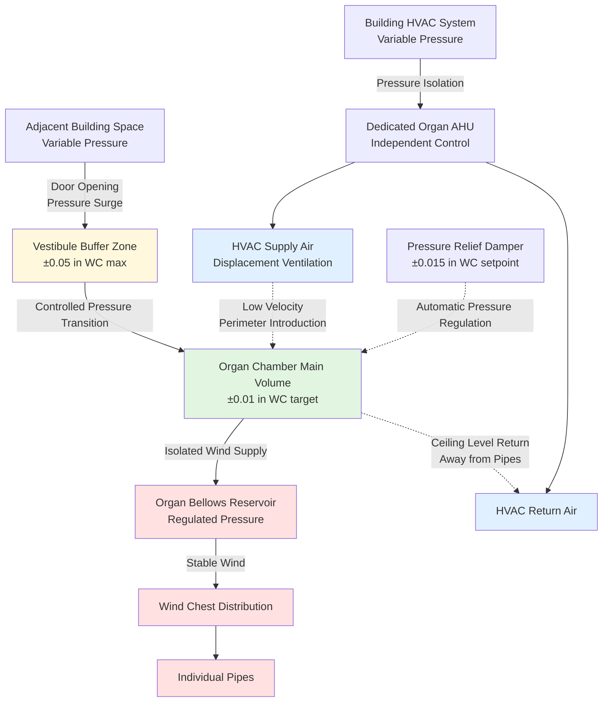

# HVAC Wind Pressure Effects on Organ Wind Supply

Pipe organs operate on precisely regulated low-pressure air systems where static pressure differentials as small as 0.02 inches water column can disrupt tuning stability and tonal production. HVAC systems create pressure fields through supply air momentum, return air suction, and chamber pressurization that interfere with organ wind regulation systems. The fundamental challenge lies in the disparity between organ wind pressures (typically 3-15 inches WC) and HVAC-induced pressure variations (0.01-0.30 inches WC)—a ratio where even 1-2% HVAC interference causes perceivable musical degradation. Proper design requires pressure isolation strategies, strategic air distribution placement, and understanding the fluid mechanics governing both organ wind supply and HVAC air movement.

## Organ Wind System Operating Principles

### Wind Pressure Ranges and Sensitivity

Pipe organ divisions operate across a spectrum of static pressures determined by pipe scaling and tonal requirements:

**Typical wind pressure by division:**

| Organ Division | Static Pressure (in WC) | Static Pressure (Pa) | Pressure Class |
|----------------|-------------------------|----------------------|----------------|
| Great (principals) | 3-4 | 747-996 | Low pressure |
| Swell (enclosed) | 3.5-4.5 | 871-1121 | Low-medium |
| Choir (accompaniment) | 3-3.5 | 747-871 | Low pressure |
| Pedal (large flues) | 4-6 | 996-1494 | Medium pressure |
| Solo (orchestral reeds) | 8-15 | 1992-3735 | High pressure |
| Theater organ | 10-25 | 2490-6225 | Very high pressure |
| Tuba ranks | 15-50 | 3735-12450 | Extreme pressure |

**Pressure regulation tolerance requirements:**

Organ wind regulators (bellows/schwimmers) maintain stable pressure with tight tolerances:

$$\Delta P_{tolerance} = \pm 0.05 \text{ to } \pm 0.10 \text{ in WC}$$

This represents ±1.25% to ±2.5% variation at 4 inches WC—the threshold for perceptible pitch fluctuation.

**Frequency dependence on wind pressure:**

Pipe pitch increases with the square root of pressure:

$$f = k\sqrt{P}$$

Where:
- $f$ = Frequency (Hz)
- $k$ = Pipe constant (geometry-dependent)
- $P$ = Wind pressure (in WC)

**Sensitivity calculation:**

$$\frac{df}{dP} = \frac{k}{2\sqrt{P}} = \frac{f}{2P}$$

At 4 inches WC nominal pressure:

$$\frac{df}{dP} = \frac{f}{8} \text{ per inch WC}$$

A 0.05 inch WC pressure change causes:

$$\frac{\Delta f}{f} = \frac{0.05}{8} = 0.625\% \approx 10.8 \text{ cents}$$

**Musical perception threshold:** 3-5 cents detectable, 10+ cents clearly out-of-tune.

### Bellows and Reservoir Systems

Wind regulation systems buffer pressure fluctuations through mechanical compliance:

**Spring-loaded regulator mechanics:**

The weighted bellows maintains constant pressure through force balance:

$$P_{regulated} = \frac{W_{bellows} + F_{spring}}{A_{bellows}}$$

Where:
- $P_{regulated}$ = Output pressure (lb/ft² or in WC)
- $W_{bellows}$ = Weight of bellows frame (lb)
- $F_{spring}$ = Spring force at operating position (lb)
- $A_{bellows}$ = Effective bellows area (ft²)

**Dynamic response:**

Bellows exhibit second-order dynamic response to pressure disturbances:

$$M\frac{d^2x}{dt^2} + C\frac{dx}{dt} + Kx = A(P_{input} - P_{output})$$

Where:
- $M$ = Bellows mass
- $C$ = Damping coefficient (viscous losses)
- $K$ = Spring constant
- $x$ = Bellows displacement
- $A$ = Bellows area

Typical bellows natural frequency: 0.5-2 Hz, providing low-pass filtering of rapid pressure fluctuations.

**HVAC interference mechanism:**

External chamber pressure superimposes on regulated wind pressure:

$$P_{effective} = P_{bellows} + P_{HVAC}$$

If HVAC creates +0.05 in WC chamber pressure, this adds directly to organ wind pressure, forcing pipes sharp by ~10 cents.

### Wind Chest Pressure Distribution

Wind chests distribute regulated air to pipe ranks:

**Pressure drop through wind chest:**

From reservoir to pipe toe:

$$P_{pipe} = P_{chest} - \Delta P_{pallet} - \Delta P_{channel}$$

**Pallet valve pressure drop:**

$$\Delta P_{pallet} = \frac{\rho V^2}{2} \left(\frac{1}{C_d^2 A_{opening}^2} - \frac{1}{A_{channel}^2}\right)$$

Where:
- $\rho$ = Air density
- $V$ = Volumetric flow rate
- $C_d$ = Discharge coefficient (≈0.6-0.8)
- $A_{opening}$ = Pallet opening area
- $A_{channel}$ = Wind chest channel area

**Uniformity requirement:**

Across entire chest, pressure variation must remain below:

$$\Delta P_{chest} < 0.02 \text{ in WC}$$

HVAC pressure differentials can create non-uniform loading across the chest, causing inconsistent speech between pipes.

## HVAC-Induced Pressure Differential Problems

### Supply Air Momentum Effects

Supply air creates localized positive pressure through momentum transfer:

**Jet impingement pressure:**

A supply air jet striking organ chamber surfaces creates stagnation pressure:

$$P_{stagnation} = \frac{\rho V_{jet}^2}{2}$$

Converting to inches water column:

$$P_{stagnation}(in WC) = \frac{V_{fpm}^2}{4005^2}$$

**Example calculation:**

500 fpm supply jet velocity:

$$P_{stagnation} = \frac{500^2}{4005^2} = 0.0156 \text{ in WC}$$

This 0.016 in WC pressure represents 0.4% of a 4 in WC organ wind pressure—seemingly small but sufficient to cause 6-7 cents sharp tuning.

**Velocity decay from diffuser:**

Jet velocity decays with distance from supply:

$$\frac{V_x}{V_0} = \frac{6.2 d_0}{x}$$

Where:
- $V_x$ = Velocity at distance $x$
- $V_0$ = Initial diffuser velocity
- $d_0$ = Diffuser diameter
- $x$ = Distance from diffuser

**Minimum separation distance:**

To reduce 500 fpm to acceptable 20 fpm near pipework:

$$x = 6.2 d_0 \frac{V_0}{V_x} = 6.2 d_0 \frac{500}{20} = 155 d_0$$

For 8-inch diffuser: minimum 10.3 feet separation.

### Return Air Suction Effects

Return grilles create negative pressure zones through local air acceleration:

**Pressure drop approaching return grille:**

$$\Delta P_{return} = \frac{\rho V_{approach}^2}{2} + K_{grille}\frac{\rho V_{grille}^2}{2}$$

Where:
- $V_{approach}$ = Approach velocity in chamber
- $V_{grille}$ = Face velocity through grille
- $K_{grille}$ = Pressure loss coefficient (0.5-1.5)

**Return grille pressure field:**

Negative pressure extends approximately 1.5-2 times the grille dimension:

$$\Delta P(r) = \Delta P_{max} \left(\frac{r_0}{r}\right)^2$$

Where:
- $r$ = Distance from grille center
- $r_0$ = Grille characteristic dimension

**Design requirement:**

Return grilles must maintain distance from pipework such that induced negative pressure remains below:

$$|\Delta P_{return}| < 0.01 \text{ in WC at pipe locations}$$

### Chamber Pressurization Effects

Sealed organ chambers develop static pressure relative to adjacent spaces:

**Pressure balance equation:**

$$P_{chamber} - P_{adjacent} = \frac{\rho}{2}(V_{supply}^2 - V_{exhaust}^2) + \Delta P_{leakage}$$

**Infiltration/exfiltration flow:**

Pressure differential drives airflow through construction gaps:

$$Q_{leak} = C_{leak}\sqrt{\Delta P}$$

Where:
- $Q_{leak}$ = Leakage airflow (CFM)
- $C_{leak}$ = Leakage coefficient (depends on construction tightness)

**Acceptable chamber pressure differential:**

$$|\Delta P_{chamber}| < 0.02 \text{ in WC}$$

**Pressurization strategies:**

| Strategy | Pressure Effect | Application |
|----------|----------------|-------------|
| Balanced supply/return | ±0.005 in WC | Preferred for all organs |
| Slight positive (infiltration prevention) | +0.01 to +0.015 in WC | Theater organs, dusty environments |
| Slight negative (sound isolation) | -0.01 to -0.015 in WC | Concert halls, minimal if required |
| Uncontrolled pressurization | ±0.05 to ±0.30 in WC | Unacceptable—causes tuning instability |

## Pressure Differential Problems and Solutions

### Comprehensive Comparison Table

| Problem | Pressure Magnitude | Musical Effect | Primary Cause | HVAC Solution | Design Criterion |
|---------|-------------------|----------------|---------------|---------------|------------------|
| Direct supply jet impingement | +0.05 to +0.20 in WC | 12-45 cents sharp, unstable speech | High-velocity diffuser aimed at pipes | Relocate diffuser, reduce velocity, use displacement ventilation | Diffuser separation >12 ft, velocity <50 fpm at pipes |
| Return grille suction near pipes | -0.03 to -0.15 in WC | 8-35 cents flat, weak tone | Return grille proximity to pipework | Relocate return, increase grille area, reduce face velocity | Return separation >15 ft, face velocity <400 fpm |
| Positive chamber pressurization | +0.02 to +0.10 in WC | 5-25 cents sharp across entire organ | Excess supply vs. return airflow | Balance supply/return CFM, add pressure relief path | Chamber differential <0.02 in WC |
| Negative chamber pressurization | -0.02 to -0.08 in WC | 5-20 cents flat, reduced power | Excess return vs. supply airflow | Increase supply CFM, reduce return capacity | Chamber differential <0.02 in WC |
| Door opening surge | ±0.10 to ±0.30 in WC | Temporary severe pitch shift | Adjacent space pressure differential | Install pressure-balanced vestibule, slow-close door mechanisms | Vestibule buffer zone |
| Duct turbulence pulsation | ±0.01 to ±0.05 in WC cyclic | Tremolo effect, pitch wavering | Fan blade-pass frequency, vortex shedding | Increase duct size, reduce velocity, add silencers/dampers | Duct velocity <1200 fpm near chamber |
| Air current across pipe mouths | 0 pressure (velocity effect) | Unstable speech, chiff, failure to speak | High air velocity at pipe level | Displacement ventilation, fabric ducts, ceiling plenum | Air velocity <20 fpm at pipe mouths |
| Seasonal stack effect | ±0.02 to ±0.15 in WC | Tuning drift with outdoor temperature | Chamber vertical position, temperature differential | Seal penetrations, balance ventilation, temperature stability | Minimize vertical temperature gradients |

### Bellows Response to HVAC Disturbances

**Pressure buffering capacity:**

Bellows with properly designed regulation attenuate rapid HVAC pressure fluctuations:

**Transfer function:**

$$\frac{P_{output}}{P_{input}} = \frac{1}{1 + \frac{s^2}{\omega_n^2} + \frac{2\zeta s}{\omega_n}}$$

Where:
- $s$ = Laplace variable
- $\omega_n$ = Natural frequency (rad/s)
- $\zeta$ = Damping ratio

**Attenuation at HVAC fluctuation frequencies:**

HVAC pressure variations typically occur at:
- Fan cycling: 0.01-0.1 Hz (very slow)
- Duct turbulence: 2-20 Hz (rapid)
- Door operations: 0.1-1 Hz (transient)

Bellows with $\omega_n = 1$ Hz (6.28 rad/s) provides:
- Good attenuation above 2 Hz (turbulence)
- Minimal attenuation below 0.5 Hz (slow pressurization)

**Critical finding:** Bellows cannot compensate for steady-state chamber pressurization—HVAC design must prevent sustained pressure differentials.

### Wind Chest Regulation Stability

Multiple-rise wind systems cascade regulation:

**Two-stage regulation:**

$$P_{final} = P_{main\,reservoir} - \Delta P_{regulator\,1} - \Delta P_{regulator\,2}$$

Each stage filters pressure disturbances:

**Cascade attenuation:**

$$Attenuation_{total} = Attenuation_1 \times Attenuation_2$$

Two regulators with 3:1 attenuation each provide 9:1 total suppression of HVAC-induced variations.

**Schwimmer regulator characteristics:**

Modern floating-plate regulators respond to pressure changes within milliseconds but cannot eliminate steady-state offset from chamber pressurization.

## Pressure Isolation Strategies

### Architectural Pressure Buffering

### Vestibule Pressure Buffer Design

**Two-door vestibule pressure staging:**

$$\Delta P_{total} = \Delta P_{vestibule\,1} + \Delta P_{vestibule\,2}$$

Single door opening creates pressure surge:

$$\Delta P_{surge} = \frac{\rho}{2}(V_{rush}^2)$$

For typical 0.10 in WC adjacent space pressure, rush velocity:

$$V_{rush} = \sqrt{\frac{2\Delta P}{\rho}} = \sqrt{\frac{2 \times 5.2\,\text{lb/ft}^2}{0.075\,\text{lb/ft}^3}} = 37.3\,\text{ft/s} = 2238\,\text{fpm}$$

**Vestibule volume sizing:**

Buffer volume allows pressure equilibration before second door opens:

$$V_{vestibule} > 10 \times V_{doorway} \times \frac{\Delta P_{acceptable}}{\Delta P_{adjacent}}$$

For 0.10 in WC adjacent space, 0.01 in WC chamber tolerance:

$$V_{vestibule} > 100 \times V_{doorway}$$

**Pressure relief damper:**

Automatic damper maintains chamber pressure:

$$A_{damper} = \frac{Q_{imbalance}}{4005\sqrt{\Delta P_{setpoint}}}$$

Where:
- $Q_{imbalance}$ = Maximum supply/return imbalance (CFM)
- $\Delta P_{setpoint}$ = Pressure relief activation (in WC)

### Dedicated HVAC System Isolation

**Reasons for dedicated organ chamber system:**

1. **Independent pressure control:** Isolated from building pressure transients
2. **Continuous operation:** 24/7 conditioning regardless of building schedule
3. **Precision control:** Tighter tolerances than comfort systems
4. **Low-velocity distribution:** Incompatible with VAV or high-velocity systems

**System pressure balancing:**

$$Q_{supply} = Q_{return} \pm Q_{controlled\,imbalance}$$

Typical balance: exactly equal CFM ± 5% maximum deviation.

**Pressure monitoring and control:**

Differential pressure transmitter between chamber and adjacent space:

$$P_{chamber} - P_{adjacent} = 0 \pm 0.01 \text{ in WC}$$

Control sequence adjusts supply/return fan speeds or damper positions to maintain neutral pressure.

## Air Distribution Design for Minimal Pressure Impact

### Displacement Ventilation Application

**Principle:** Supply cool air at floor level with minimal momentum, allowing natural convection to distribute air without creating pressure differentials at pipe elevation.

**Supply air temperature depression:**

$$\Delta T_{supply} = T_{chamber} - T_{supply} = 2-4°F$$

**Buoyancy-driven flow:**

Cool supply air spreads across floor, gradually absorbing heat and rising:

$$\rho_{supply} = \rho_{chamber}\left(1 + \beta\Delta T\right)$$

Where $\beta = \frac{1}{T_{abs}} \approx \frac{1}{530}$ per °F

**Vertical velocity profile:**

At pipe elevation (typically 6-20 feet above floor), air movement is predominantly vertical convection with minimal horizontal component:

$$V_{horizontal}(z) < 10 \text{ fpm at pipe level}$$

**Supply diffuser sizing:**

$$A_{diffuser} = \frac{Q_{supply}}{60 \times V_{face}}$$

For 50 fpm maximum face velocity:

$$A_{diffuser} = \frac{Q_{CFM}}{3000} \text{ ft}^2$$

500 CFM chamber requires 0.167 ft² = 24 in² diffuser area.

### Perforated Ceiling Plenum Distribution

**Entire ceiling as low-velocity supply:**

$$V_{ceiling} = \frac{Q_{total}}{A_{ceiling} \times 60}$$

Target velocity through ceiling perforation: 10-15 fpm.

**Example:**

- Chamber: 20 ft × 30 ft = 600 ft²
- Airflow: 800 CFM
- Ceiling velocity: 800/(600 × 60) = 0.022 ft/s = 1.3 fpm

Extremely low velocity eliminates pressure differential effects.

**Perforation pattern:**

$$P_{perforation} = \frac{A_{holes}}{A_{total}} = 2-5\%$$

Pressure drop through ceiling:

$$\Delta P_{ceiling} = K\frac{\rho V^2}{2}$$

At 15 fpm through 3% perforation (500 fpm through holes):

$$\Delta P_{ceiling} \approx 0.015 \text{ in WC}$$

Acceptable for chamber pressurization if return is similarly distributed.

### Strategic Equipment and Grille Placement

**Minimum separation distances from pipework:**

Derived from pressure field decay equations:

| HVAC Component | Minimum Separation | Basis |
|----------------|-------------------|-------|
| Supply diffusers (standard) | 12 feet | Jet decay to <20 fpm |
| Return grilles (standard) | 15 feet | Suction field to <0.01 in WC |
| Access doors to chamber | Vestibule required | Pressure surge isolation |
| Mechanical equipment | Separate room, 50+ feet | Vibration and noise isolation |
| High-velocity ductwork | Outside chamber, silenced penetrations | Pressure pulsation prevention |

**Optimal configuration:**

- Supply: Floor-level displacement or ceiling plenum
- Return: Ceiling level, chamber perimeter, away from organ
- Mechanical equipment: Remote location with vibration isolation
- Ductwork: Oversized (low velocity <1200 fpm) with acoustic treatment

### Duct Velocity and Turbulence Control

**Pressure pulsation from turbulence:**

Turbulent duct flow creates cyclic pressure variations:

$$\Delta P_{turbulence} \approx 0.1 \times \Delta P_{velocity}$$

Where:

$$\Delta P_{velocity} = \frac{\rho V_{duct}^2}{2}$$

**At 2000 fpm duct velocity:**

$$\Delta P_{velocity} = \frac{2000^2}{4005^2} = 0.25 \text{ in WC}$$

Turbulence fluctuation: ±0.025 in WC—exceeding organ tolerance.

**Recommended duct velocity near organ chambers:**

$$V_{duct} < 1200 \text{ fpm}$$

At 1200 fpm:

$$\Delta P_{velocity} = 0.09 \text{ in WC}$$

Turbulence: ±0.009 in WC—acceptable with proper damping.

**Duct sizing for low velocity:**

$$A_{duct} = \frac{Q_{CFM}}{V_{fpm}}$$

800 CFM at 1200 fpm maximum:

$$A_{duct} = \frac{800}{1200} = 0.67 \text{ ft}^2 = 96 \text{ in}^2$$

Equivalent to 11-inch diameter or 10×10 inch rectangular duct.

## Measurement and Verification Protocols

### Differential Pressure Monitoring

**Instrumentation requirements:**

- Differential pressure transmitter: ±0.25 in WC range, ±0.005 in WC accuracy
- Sampling locations: Chamber center referenced to adjacent space
- Data logging: 1-minute intervals minimum
- Alarm setpoints: ±0.02 in WC

**Acceptance criteria:**

During commissioning, demonstrate:

$$|\Delta P_{chamber}| < 0.02 \text{ in WC for 95\% of measurements}$$

During all HVAC operating modes:
- Normal operation
- Night setback/recovery
- Adjacent space door operations
- Building pressure changes (outdoor wind, stack effect)

### Air Velocity Surveys

**Hot-wire anemometry at pipe locations:**

Measure instantaneous air velocity at 5+ locations within organ chamber at pipe mouth elevation:

$$V_{measured} < 20 \text{ fpm at all measurement points}$$

**Measurement protocol:**

1. HVAC system at design airflow
2. Minimum 60-second sampling period per location
3. Record peak velocities (not just average)
4. Map velocity contours throughout chamber

### Tuning Stability Testing

**Ultimate verification method:**

Electronic tuning device monitoring pipe frequency over 24-48 hour period:

$$\Delta f_{measured} < 5 \text{ cents variation}$$

**Test procedure:**

1. Monitor representative pipes from multiple divisions
2. Log frequency at 5-minute intervals
3. Correlate with temperature, humidity, and HVAC operation
4. Isolate HVAC contribution from temperature effects

**Acceptable HVAC-induced pitch variation:**

After correcting for temperature effects:

$$\Delta f_{HVAC} < 3 \text{ cents}$$

## Special Considerations for Theater Organs

Theater organs present unique challenges due to chamber pressurization practices and higher wind pressures:

**Theater organ chamber pressurization:**

Historic practice: maintain slight positive pressure (0.01-0.02 in WC) to reduce infiltration and dust ingress.

**Modern HVAC conflict:**

Deliberate chamber pressurization conflicts with pressure differential minimization principle.

**Resolution strategy:**

1. Maintain controlled positive pressure via precision pressure relief damper
2. HVAC supply exceeds return by calculated amount:
   $$Q_{excess} = C\sqrt{P_{target}}$$
3. Excess air exits through calibrated relief damper maintaining setpoint
4. Isolation from building pressure variations preserved

**Tremulant sensitivity:**

Theater organ tremulants (intentional pressure oscillators) are particularly sensitive to HVAC interference—any external pressure variation compounds with tremulant pulsation, creating irregular vibrato effect.

## Integration with Organ Builder Requirements

**HVAC design review by organ builder:**

Organ contracts typically require:

1. HVAC plans submitted to organ builder for review before construction
2. Pressure differential calculations and predictions
3. Air distribution modeling or CFD analysis for complex chambers
4. Commissioning data demonstrating compliance

**Documentation requirements:**

- Differential pressure: Continuous 30-day baseline
- Air velocity survey: Complete mapping at substantial completion
- Tuning stability: 48-hour monitoring with organ builder verification

**Maintenance coordination:**

- Filter changes: Procedure to minimize chamber disturbance
- Setpoint adjustments: Documented protocol with organ builder approval
- System modifications: Require organ builder consultation

Proper HVAC design for organ installations demands recognition that wind pressure regulation systems operate at precision levels where typical HVAC pressure effects represent significant interference. The physical principles governing organ speech—precise pressure regulation, stable wind supply, and undisturbed air columns—require HVAC approaches fundamentally different from conventional comfort conditioning. Displacement ventilation, pressure isolation, dedicated systems, and comprehensive verification protocols ensure the HVAC system supports rather than compromises the musical mission of these specialized installations.
