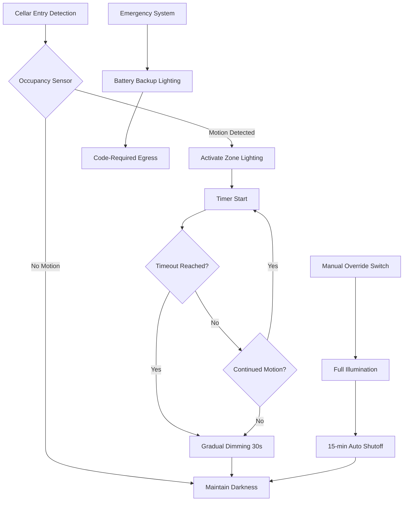

## Light Control for Wine Storage

Wine cellar illumination design represents a critical conflict between operational requirements and preservation science. While complete darkness optimizes wine aging conditions, human access demands sufficient illumination for inventory management, bottle selection, and safety. The photochemistry of light-induced wine degradation centers on UV radiation catalyzing oxidation reactions and generating undesirable flavor compounds—particularly in white wines and Champagnes stored in clear or light-colored glass.

The electromagnetic spectrum's interaction with wine compounds occurs primarily in the ultraviolet (280-400 nm) and short-wavelength visible (400-500 nm) regions. Photon energy at these wavelengths exceeds the bond dissociation energy of key flavor molecules, initiating free radical cascades that degrade wine quality. Professional wine storage facilities maintain darkness as the default condition, activating illumination only during human occupancy through motion sensors or manual controls.

## UV Radiation and Photochemical Degradation

The quantum mechanics of photochemical wine degradation involves light absorption by riboflavin (vitamin B2) and other photosensitive compounds naturally present in wine. When photons with energy $E = h\nu$ (where $h$ is Planck's constant and $\nu$ is frequency) interact with these molecules, electronic transitions to excited states initiate oxidation reactions:

$$E_{photon} = \frac{hc}{\lambda}$$

where $c$ is the speed of light and $\lambda$ is wavelength. For UV-A radiation at 365 nm:

$$E = \frac{(6.626 \times 10^{-34}\text{ J·s})(3.0 \times 10^8\text{ m/s})}{365 \times 10^{-9}\text{ m}} = 5.44 \times 10^{-19}\text{ J/photon}$$

This energy (3.4 eV per photon) exceeds typical C-H bond energies (3.2-4.3 eV), enabling direct photolysis of organic molecules. The resulting free radicals react with dissolved oxygen, producing aldehydes, sulfur compounds, and other off-flavors collectively termed "light-struck" or "lightstruck" character.

### Spectral Sensitivity of Wine Compounds

Wine photodegradation exhibits wavelength-dependent sensitivity, with maximum damage occurring in specific spectral bands:

| Wavelength Range | Region | Primary Effects | Relative Damage Rate |
|------------------|--------|-----------------|---------------------|
| 280-315 nm | UV-B | Direct DNA-like damage to organic compounds | 100% |
| 315-400 nm | UV-A | Riboflavin excitation, sulfur compound formation | 60-80% |
| 400-450 nm | Violet-blue | Secondary oxidation reactions | 20-30% |
| 450-500 nm | Blue | Minimal direct photochemical effects | 5-10% |
| 500-700 nm | Green-red | Negligible photochemical impact | <1% |

Glass bottle color provides the first defense against photodegradation. Dark green and amber glass block UV-B radiation effectively (>95% attenuation) while transmitting 15-30% of UV-A. Clear glass (flint) offers minimal UV protection, explaining its limited use except for wines consumed shortly after bottling.

## Lighting System Selection for Wine Cellars

Artificial illumination for wine storage must balance visibility requirements with photochemical safety. The illuminance levels required for cellar tasks vary by application:

- **General circulation**: 5-10 footcandles (50-100 lux)
- **Bottle identification**: 15-25 footcandles (150-250 lux)
- **Detailed inventory work**: 30-50 footcandles (300-500 lux)

These levels represent minimum acceptable visibility; commercial practice often provides higher illuminance for operational efficiency despite increased photodegradation risk.

### LED Technology Advantages

Light-emitting diode (LED) fixtures offer superior performance for wine cellar applications compared to incandescent or fluorescent alternatives. The spectral power distribution of LED sources can be engineered to minimize UV and short-wavelength visible output while maintaining adequate color rendering for bottle label readability.

**Comparison of Light Source Technologies:**

| Parameter | Incandescent | Fluorescent | LED (Warm White) | LED (Amber) |
|-----------|-------------|-------------|------------------|-------------|
| UV output (% total) | 3-5% | 5-8% | <0.5% | <0.1% |
| Blue light (400-450 nm) | Moderate | High | Low-moderate | Minimal |
| Efficacy (lm/W) | 15-20 | 60-80 | 80-120 | 60-90 |
| Color rendering index | 100 | 70-85 | 80-95 | 60-75 |
| Heat emission (% electrical) | 85-90% | 70-75% | 60-70% | 55-65% |
| Controllability | Poor | Fair | Excellent | Excellent |

LED fixtures with correlated color temperature (CCT) of 2700-3000K and minimal output below 450 nm provide optimal performance. Specialized "wine cellar" LED products filter short wavelengths completely, eliminating photodegradation risk at the cost of reduced color accuracy.

## Automated Lighting Control Systems

Professional wine storage facilities implement automated lighting controls that enforce darkness as the default state. Motion sensors, occupancy detectors, and time-based scheduling minimize cumulative light exposure while maintaining access safety.

### Lighting Control Strategy Components

**Occupancy-based activation**: Passive infrared (PIR) or microwave sensors detect human presence and activate lighting within 0.5-1.0 seconds. Sensor placement must account for wine rack obstruction patterns—multiple sensors ensure complete coverage in larger cellars.

**Zoned illumination**: Large wine cellars benefit from divided lighting circuits that illuminate only occupied areas. A 2,000 square foot cellar might incorporate 6-8 lighting zones, reducing total light exposure by 70-85% compared to full-cellar illumination.

**Automatic timeout**: Programmable timers extinguish lights after preset intervals (typically 5-15 minutes) following last detected motion. Gradual dimming (20-30 second fade) provides visual warning before complete darkness.

**Manual override**: Wall-mounted switches enable temporary full illumination for inventory tasks, with automatic shutoff preventing extended exposure from forgotten switches.

**Emergency egress lighting**: Code-required emergency lighting systems provide 1 footcandle minimum illumination along exit paths during power failures, using battery-powered LED fixtures.

## Architectural Darkness Control

Building envelope design fundamentally determines wine cellar darkness effectiveness. Natural light infiltration—even indirect daylight—provides sufficient UV exposure to accelerate wine degradation over months to years of storage.

### Envelope Light Sealing Strategies

**Window elimination**: Professional wine cellars specify windowless construction. When windows exist in repurposed spaces, complete blocking using opaque panels, blackout curtains, or UV-filtering window films becomes necessary.

**Door light seals**: Weatherstripping and threshold sweeps designed for light exclusion prevent infiltration around cellar doors. Light gap testing using flashlight inspection from inside the darkened cellar reveals sealing deficiencies.

**Penetration sealing**: HVAC ductwork, electrical conduit, and plumbing penetrations require sealed terminations preventing light leakage from adjacent spaces.

**Wall assembly opacity**: Standard drywall construction (½" gypsum board) blocks visible light completely but may transmit UV radiation. Interior cellar finishes should incorporate opaque barriers—aluminum foil facing on insulation, multiple gypsum layers, or UV-opaque membranes.

### Light Exposure Accumulation Model

The cumulative photochemical damage to wine follows first-order reaction kinetics, where degradation rate depends on both light intensity and exposure duration:

$$\frac{dC}{dt} = -k \cdot I \cdot C$$

where $C$ is concentration of light-sensitive compounds, $t$ is time, $I$ is illuminance, and $k$ is the wavelength-dependent rate constant. Integrating this expression yields:

$$C(t) = C_0 \cdot e^{-k \cdot I \cdot t}$$

The characteristic time for 50% degradation (half-life) becomes:

$$t_{1/2} = \frac{\ln(2)}{k \cdot I}$$

For white wine under 100 lux of fluorescent illumination with significant UV content, experimental data suggests $k \approx 0.02$ lux$^{-1}$·day$^{-1}$, yielding $t_{1/2} \approx 350$ days. Reducing illumination to 10 lux (proper wine cellar lighting) extends half-life to nearly 10 years. Complete darkness eliminates photochemical degradation entirely.

## Glass Bottle UV Protection Factors

While cellar lighting control addresses artificial illumination, glass bottle selection provides primary defense against photodegradation. The transmittance of UV radiation through glass follows Beer-Lambert law:

$$T = e^{-\alpha \cdot d}$$

where $T$ is transmittance fraction, $\alpha$ is absorption coefficient (wavelength-dependent), and $d$ is glass thickness. Measured UV transmittance for common bottle glass:

| Glass Color | UV-B (280-315 nm) | UV-A (315-400 nm) | Visible (400-700 nm) |
|-------------|-------------------|-------------------|---------------------|
| Flint (clear) | 20-30% | 45-60% | 90-95% |
| Light green | <1% | 15-25% | 70-80% |
| Dark green | <0.5% | 5-10% | 40-50% |
| Amber/brown | <0.1% | 2-5% | 30-40% |

Dark glass bottles reduce photochemical degradation risk by factors of 10-50 compared to clear glass under identical illumination. This protection remains incomplete—stored wines in dark bottles still benefit from minimal light exposure.

## Design Guidelines for Wine Cellar Illumination

Professional wine storage facility design incorporates these evidence-based lighting specifications:

1. **Default darkness**: Maintain complete darkness except during human occupancy
2. **LED fixtures exclusively**: Specify 2700-3000K CCT with <1% UV output
3. **Occupancy control**: Motion sensors with 5-15 minute timeout on all circuits
4. **Zoned lighting**: Divide cellars into 200-400 sq ft lighting zones
5. **Illuminance limits**: Maximum 30 footcandles (300 lux) at working plane
6. **Natural light exclusion**: Eliminate windows; seal light leaks at penetrations
7. **Emergency lighting**: Battery-powered LED egress lighting per code requirements
8. **Control integration**: BMS interface for logging total light exposure hours

Residential wine cellars often compromise these ideals for aesthetic considerations—decorative fixtures, display lighting, and viewing windows. Such installations accept accelerated aging (5-10 years vs. 20-30+ years for professional storage) as reasonable tradeoff for visual appeal.

The physics of photochemical wine degradation demands darkness as the optimal storage condition. Practical illumination systems minimize UV exposure through LED technology, automated controls, and architectural light exclusion while maintaining safe access for human operations. Installations prioritizing long-term aging potential enforce strict darkness protocols, accepting operational inconvenience to preserve wine quality across decades of storage.
