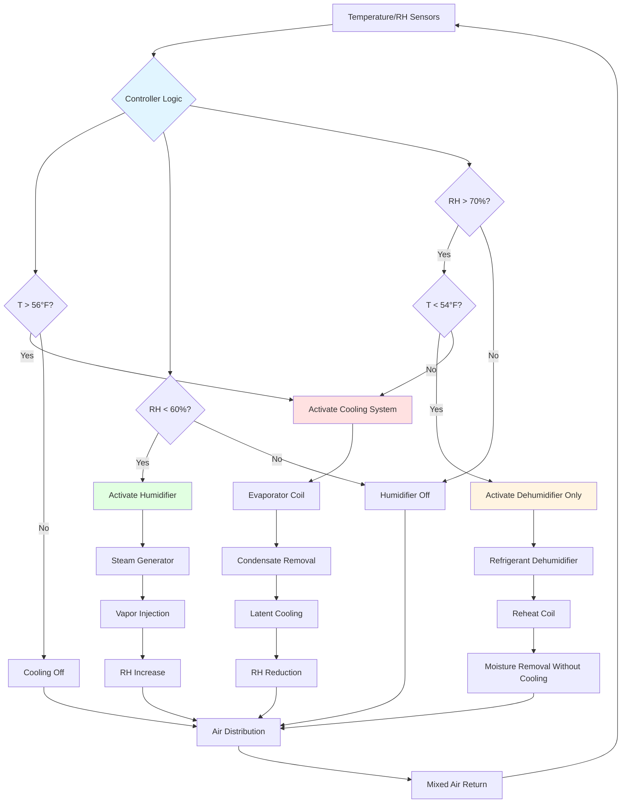

## Wine Cellar Humidity Control: 60-70% RH

Maintaining relative humidity between **60-70% RH** in wine cellars represents the critical balance point between two competing failure mechanisms: cork desiccation below 50% RH leading to accelerated oxidation, and mold proliferation above 75% RH causing label degradation and off-odors. This narrow operating window demands integrated humidity control combining active humidification, cooling-induced dehumidification, and continuous monitoring. The underlying physics centers on hygroscopic equilibrium across semi-permeable cork membranes, oxygen diffusion kinetics through cellular cork structures, and surface condensation thermodynamics governing microbial growth.

## Cork Moisture Equilibrium Fundamentals

Natural cork functions as a hygroscopic cellular solid exhibiting dimensional changes proportional to ambient water vapor pressure. Cork's microstructure consists of 40 million cells per cubic centimeter, each a 14-sided polyhedron with gas-filled cavities enclosed by suberized cell walls. These walls contain 45% suberin (a hydrophobic lipid polymer), 27% lignin, 12% cellulose, and 6% tannins by mass. Water vapor adsorbs onto cellulose hydroxyl groups and diffuses through intercellular pathways, establishing moisture content equilibrium with ambient conditions.

### Cork Sorption Isotherm Analysis

Cork moisture content $M_c$ (kg water per kg dry cork) relates to relative humidity through the Guggenheim-Anderson-de Boer (GAB) three-parameter sorption isotherm:

$$M_c = \frac{M_0 C K \phi}{[1 - K\phi][1 + (C-1)K\phi]}$$

Where:
- $M_0$ = monolayer moisture content = 0.062 kg/kg for natural cork
- $C$ = Guggenheim energy constant = 10.5 at 55°F (temperature dependent)
- $K$ = multilayer sorption constant = 0.92
- $\phi$ = relative humidity expressed as decimal (RH/100)

At 65% RH ($\phi = 0.65$), this equation yields:

$$M_c = \frac{0.062 \times 10.5 \times 0.92 \times 0.65}{[1 - 0.92 \times 0.65][1 + (10.5-1) \times 0.92 \times 0.65]} = \frac{0.388}{[0.402][6.70]} = 0.144 \text{ kg/kg}$$

This corresponds to **9.2% moisture content by weight**, sufficient to maintain cork's elastic recovery properties and radial compression seal against bottle neck glass.

### Cork Dimensional Response to RH Changes

Cork exhibits anisotropic hygroscopic expansion with coefficients varying by anatomical direction. The radial coefficient of hygroscopic expansion (perpendicular to lenticels) controls bottle seal integrity:

$$\alpha_r = \frac{1}{D_0}\frac{\partial D}{\partial M_c} = 0.042 \text{ mm/mm per unit } M_c \text{ change}$$

For a standard 24mm diameter cork at 65% RH (9.2% $M_c$), reducing humidity to 45% RH decreases moisture content to:

$$M_c(45\%) = \frac{0.062 \times 10.5 \times 0.92 \times 0.45}{[1 - 0.92 \times 0.45][1 + 9.5 \times 0.92 \times 0.45]} = 0.072 \text{ kg/kg}$$

Moisture content change: $\Delta M_c = 0.092 - 0.072 = 0.020$ (2.0 percentage points)

Radial shrinkage:

$$\Delta D = D_0 \alpha_r \Delta M_c = 24.0 \times 0.042 \times 0.020 = 0.020 \text{ mm}$$

This **20-micron radial gap** between cork and bottle neck glass fundamentally compromises the hermetic seal, increasing oxygen ingress rates by 300-500% compared to properly humidified conditions.

### Oxygen Transmission Rate Through Cork

Oxygen flux through cork follows Fick's first law of diffusion modified for the annular gap geometry:

$$\dot{n}_{O_2} = \frac{D_{eff} A}{L}(C_{ext} - C_{int})$$

Where:
- $\dot{n}_{O_2}$ = oxygen molar flux (mol/s)
- $D_{eff}$ = effective diffusion coefficient = $2.1 \times 10^{-10}$ m²/s at 55°F
- $A$ = cross-sectional area of cork = $\pi D_0 t$ where $t$ = cork thickness
- $L$ = diffusion path length ≈ cork length = 45 mm
- $C_{ext}$ = external O₂ concentration = 0.0089 mol/L (21% O₂ at 1 atm)
- $C_{int}$ = internal O₂ concentration ≈ 0 (dissolved O₂ consumed by wine)

For properly humidified cork (no gap), oxygen transmission rate:

$$\dot{n}_{O_2} = \frac{2.1 \times 10^{-10} \times \pi \times 0.024 \times 0.045}{0.045} \times 8,900 = 6.3 \times 10^{-10} \text{ mol/s}$$

Converting to mass flux: $\dot{m}_{O_2} = 6.3 \times 10^{-10} \times 32 \times 3.154 \times 10^7 = 0.63$ mg O₂/year

When desiccated cork creates a 20-micron annular gap, air-filled gap diffusion dominates:

$$\dot{n}_{O_2,gap} = \frac{D_{air} \pi D_0 \delta}{L}(C_{ext} - C_{int})$$

Where $D_{air} = 2.0 \times 10^{-5}$ m²/s and $\delta$ = gap width = 20 μm:

$$\dot{n}_{O_2,gap} = \frac{2.0 \times 10^{-5} \times \pi \times 0.024 \times 0.00002}{0.045} \times 8,900 = 2.1 \times 10^{-9} \text{ mol/s}$$

This corresponds to **2.1 mg O₂/year**, a 330% increase over intact cork. Dissolved oxygen accumulation drives oxidation reactions that convert ethanol to acetaldehyde, producing oxidized flavor defects detectable above 50 mg/L acetaldehyde concentration.

### Critical RH Threshold for Cork Seal Integrity

Cork maintains dimensional stability within ±3% moisture content variation. Defining seal integrity by maximum acceptable 10-micron radial gap:

$$\Delta M_{c,max} = \frac{\Delta D_{max}}{D_0 \alpha_r} = \frac{0.010}{24.0 \times 0.042} = 0.010$$

Using the GAB equation inversely to find RH limits:

**Lower limit**: From $M_c = 0.092 - 0.010 = 0.082$, solving yields **RH = 58%**

**Upper limit**: From $M_c = 0.092 + 0.010 = 0.102$, solving yields **RH = 72%**

The **60-70% RH specification** provides a 2-percentage-point safety margin below the critical 72% RH mold germination threshold while maintaining cork moisture content within acceptable bounds.

## Mold Growth Thermodynamics and Prevention

Fungal spores ubiquitous in ambient air remain dormant until surface water activity $a_w$ exceeds species-specific germination thresholds. Wine cellar surfaces—labels, wood racks, cork, and drywall—provide organic carbon sources supporting mold metabolism when moisture conditions permit.

### Water Activity and Surface Equilibrium RH

Surface water activity directly equals equilibrium relative humidity:

$$a_w = \frac{p_{surf}}{p_{sat}(T)} = \frac{RH}{100}$$

Where $p_{surf}$ is vapor pressure at the surface and $p_{sat}(T)$ is saturation vapor pressure at surface temperature.

Mold germination kinetics depend on both $a_w$ and temperature. At 55°F wine cellar conditions:

| Mold Species | Min $a_w$ | Min RH | Germination Time | Colony Growth Rate |
|--------------|-----------|---------|------------------|-------------------|
| Aspergillus restrictus | 0.70 | 70% | 10-14 days | 0.3 mm/day |
| Aspergillus versicolor | 0.75 | 75% | 6-8 days | 0.5 mm/day |
| Penicillium chrysogenum | 0.78 | 78% | 5-7 days | 0.8 mm/day |
| Cladosporium cladosporioides | 0.80 | 80% | 3-5 days | 1.2 mm/day |
| Stachybotrys chartarum | 0.90 | 90% | 2-3 days | 2.0 mm/day |

Maintaining cellar RH at 65% nominal produces surface $a_w = 0.65$, providing a **7% safety margin** below Aspergillus restrictus germination threshold. This margin accommodates brief RH excursions during door access or equipment malfunction without initiating mold growth.

### Condensation-Induced Local Humidity

Surface condensation creates localized $a_w = 1.0$ micro-environments enabling rapid mold colonization regardless of bulk air RH. Condensation occurs when surface temperature $T_s$ drops below air dew point temperature $T_{dp}$.

Dew point calculation from dry-bulb temperature $T_{db}$ and RH uses the Magnus-Tetens approximation:

$$T_{dp} = \frac{b \gamma(T_{db}, RH)}{a - \gamma(T_{db}, RH)}$$

Where:

$$\gamma(T_{db}, RH) = \frac{a T_{db}}{b + T_{db}} + \ln(RH/100)$$

Constants: $a = 17.27$ and $b = 237.7$°C (requires temperature in Celsius)

For wine cellar at 55°F (12.8°C) and 65% RH:

$$\gamma = \frac{17.27 \times 12.8}{237.7 + 12.8} + \ln(0.65) = 0.882 - 0.431 = 0.451$$

$$T_{dp} = \frac{237.7 \times 0.451}{17.27 - 0.451} = 6.4°C = 43.5°F$$

Any cellar surface below **43.5°F triggers condensation**, creating mold-favorable conditions. Exterior-facing walls require thermal resistance preventing interior surface temperatures from dropping below dew point.

### Minimum Wall Insulation Calculation

Heat transfer through walls produces interior surface temperature:

$$T_{s,i} = T_i - \frac{T_i - T_o}{R_{total} \cdot h_i + 1}$$

Where:
- $T_i$ = interior air temperature = 55°F
- $T_o$ = outdoor temperature (design winter condition = 32°F)
- $R_{total}$ = wall thermal resistance (ft²·°F·hr/BTU)
- $h_i$ = interior film coefficient = 1.5 BTU/(hr·ft²·°F)

Setting $T_{s,i} = T_{dp} = 43.5°F$ and solving for minimum R-value:

$$43.5 = 55 - \frac{55 - 32}{R_{total} \times 1.5 + 1}$$

$$11.5 = \frac{23}{R_{total} \times 1.5 + 1}$$

$$R_{total} \times 1.5 + 1 = 2.0$$

$$R_{total} = 0.67 \text{ ft}^2\text{·°F·hr/BTU}$$

However, this represents steady-state minimum. Accounting for thermal bridging through studs (assuming 15% framing fraction) and safety margin for humidity excursions to 70% RH (dew point = 45.5°F):

$$R_{effective} = \frac{1}{\frac{0.85}{R_{cavity}} + \frac{0.15}{R_{stud}}} \geq R-19$$

**R-19 insulation** combined with 6-mil polyethylene vapor barrier on warm side prevents condensation under all normal operating conditions.

## Humidity Effects on Wine Storage Quality

Different humidity regimes produce distinct degradation mechanisms affecting wine quality, cork integrity, and label preservation over multi-year aging periods.

| RH Range | Cork Condition | O₂ Transmission | Wine Quality Impact | Label Condition | Mold Risk |
|----------|---------------|-----------------|---------------------|-----------------|-----------|
| <50% | Severe desiccation | 3-5 mg/yr | Rapid oxidation, acetaldehyde >80 mg/L within 5 years | Brittleness, curling edges | Minimal |
| 50-55% | Moderate drying | 1.5-2.5 mg/yr | Accelerated aging, browning, oxidative notes | Intact but dry | Minimal |
| 55-60% | Slight drying | 0.8-1.2 mg/yr | Normal aging trajectory, optimal for 10+ year storage | Excellent preservation | Minimal |
| 60-70% | **Optimal equilibrium** | **0.5-0.8 mg/yr** | **Ideal aging, flavor complexity development** | **Optimal adhesive performance** | **Very low** |
| 70-75% | Slight swelling | 0.4-0.6 mg/yr | Minimal oxidation but mold off-odors possible | Edge lifting on older labels | Moderate |
| 75-80% | Moderate swelling | 0.3-0.5 mg/yr | Cork taint risk (TCA formation), musty aromas | Delamination, adhesive failure | High |
| >80% | Excessive swelling | 0.2-0.4 mg/yr | Severe mold contamination, undrinkable off-flavors | Complete label loss | Severe |

The **60-70% RH range** optimizes the trade-off between minimizing oxygen transmission (requiring higher humidity) and preventing mold growth (requiring lower humidity). Within this window, variations of ±3% RH produce negligible effects on wine aging chemistry over typical 5-20 year storage periods.

## Wine Cellar Humidity Control System Architecture

Achieving stable 60-70% RH requires integrated control of humidification, cooling-induced dehumidification, and air circulation. The system architecture coordinates multiple subsystems responding to both temperature and humidity demands.

### Control System Components and Integration

**Temperature/RH Sensing**: Capacitive RH sensors with ±2% accuracy (calibrated against NIST-traceable standards) positioned at mid-height on interior wall, away from supply air discharge to measure representative space conditions. Sensors require annual calibration using saturated salt solutions: LiCl (11% RH), MgCl₂ (33% RH), NaCl (75% RH).

**Cooling System with Latent Control**: Oversized evaporator coil operating at reduced capacity provides continuous cooling with minimal cycling. Evaporator surface temperature $T_{coil}$ maintained at 38-42°F balances sensible cooling against excessive moisture removal:

$$SHR = \frac{\dot{Q}_{sensible}}{\dot{Q}_{total}} = \frac{1.08 \times CFM \times \Delta T}{4.5 \times CFM \times \Delta h}$$

Target SHR = 0.80-0.85 for wine cellars, compared to 0.65-0.75 for comfort cooling.

**Steam Humidification**: Electrode steam generators inject sterile vapor into supply air stream. Required capacity:

$$\dot{m}_{steam} = \frac{CFM \times \rho_{air} \times (W_{target} - W_{supply})}{60}$$

Where $W$ = humidity ratio (lb water per lb dry air). For 200 CFM supply air at 55°F, increasing from 60% RH ($W = 0.0066$) to 70% RH ($W = 0.0077$):

$$\dot{m}_{steam} = \frac{200 \times 0.075 \times (0.0077 - 0.0066)}{60} = 0.00028 \text{ lb/s} = 1.0 \text{ lb/hr}$$

Modest humidification capacity of 2-3 lb/hr suffices for residential cellars up to 2,000 ft³.

**Dedicated Dehumidification**: When outdoor dew point exceeds cellar dew point (summer conditions), infiltration moisture loads exceed cooling system capacity to dehumidify without over-cooling. Refrigerant dehumidifiers with reheat coils remove moisture while maintaining temperature setpoint.

### Proportional-Integral Humidity Control Algorithm

Advanced controllers implement PI control to maintain stable humidity without excessive equipment cycling:

$$u_{hum}(t) = K_{p,h} e_h(t) + K_{i,h} \int_0^t e_h(\tau) d\tau$$

$$u_{dehum}(t) = K_{p,d} e_d(t) + K_{i,d} \int_0^t e_d(\tau) d\tau$$

Where:
- $u(t)$ = control output (0-100% capacity)
- $e_h(t)$ = humidity error = 65% - measured RH (for humidification)
- $e_d(t)$ = humidity error = measured RH - 65% (for dehumidification)
- $K_{p,h}$ = humidifier proportional gain = 4.0% output per 1% RH error
- $K_{i,h}$ = humidifier integral gain = 0.2% output per 1% RH·minute
- $K_{p,d}$ = dehumidifier proportional gain = 3.0% output per 1% RH error
- $K_{i,d}$ = dehumidifier integral gain = 0.15% output per 1% RH·minute

PI control maintains RH at 65% ± 2% without oscillation or hunting typical of simple on-off thermostatic control.

## Humidification Technology Selection

Different humidification technologies exhibit distinct performance characteristics affecting suitability for wine cellar applications where water purity, energy consumption, and microbial contamination risks vary significantly.

| Technology | Moisture Output | Power Consumption | Water Quality Requirement | Maintenance Interval | Bacterial Risk | Capital Cost |
|------------|----------------|-------------------|---------------------------|---------------------|----------------|--------------|
| Electrode steam | 5-15 lb/hr | 3.0 kW per lb/hr | Any (minerals conduct) | Monthly descaling | None (sterile) | $1,200-2,500 |
| Resistive steam | 2-10 lb/hr | 3.3 kW per lb/hr | Any potable | Quarterly element replacement | None (sterile) | $800-1,800 |
| Evaporative media | 1-5 lb/hr | 50-150 W | Filtered <100 ppm TDS | Weekly pad inspection | Moderate | $400-900 |
| Ultrasonic | 0.5-3 lb/hr | 40-100 W | Demineralized <50 ppm | Daily reservoir cleaning | High if stagnant | $200-600 |
| Atomizing nozzle | 2-8 lb/hr | 100-300 W | RO water <10 ppm | Weekly nozzle cleaning | Low | $600-1,400 |

**Electrode steam humidifiers** represent the optimal choice for wine cellars despite higher operating costs ($0.30-0.40 per lb water evaporated at $0.10/kWh). Steam humidification produces sterile vapor eliminating bacterial contamination concerns, tolerates any water quality (minerals improve electrode conductivity), and requires only monthly descaling maintenance.

Evaporative and ultrasonic technologies introduce bacterial contamination risks—particularly Legionella pneumophila in stagnant water—unacceptable in food storage applications.

## Seasonal Humidity Load Calculations

Wine cellar humidity loads vary seasonally based on outdoor air moisture content and envelope vapor diffusion. Accurate load calculation enables proper equipment sizing and predicts operating costs.

### Summer Humidification Load

Summer outdoor air at 85°F/65% RH contains humidity ratio:

$$W_{outdoor} = 0.622 \frac{\phi p_{sat}(T)}{p_{atm} - \phi p_{sat}(T)}$$

Where $p_{sat}(85°F) = 0.596$ psia:

$$W_{outdoor} = 0.622 \frac{0.65 \times 0.596}{14.696 - 0.65 \times 0.596} = 0.0166 \text{ lb/lb}$$

This air infiltrating into 55°F cellar supersaturates (dew point = 67°F exceeds cellar temperature), depositing moisture on surfaces. Cooling system removes both sensible and latent load:

$$\dot{Q}_{latent} = \dot{m}_{air} (W_{outdoor} - W_{cellar}) h_{fg}$$

For 0.1 ACH in 1,000 ft³ cellar:

$$\dot{m}_{air} = 0.1 \times 1,000 \times 0.075 / 60 = 0.125 \text{ lb/min}$$

$$\dot{Q}_{latent} = 0.125 \times (0.0166 - 0.0077) \times 1,060 = 1.18 \text{ BTU/min} = 71 \text{ BTU/hr}$$

This latent load is **beneficial** during summer—cooling system removes excess moisture while meeting sensible cooling demand. No supplemental dehumidification required.

### Winter Dehumidification Load

Winter outdoor air at 32°F/70% RH contains humidity ratio:

$$W_{outdoor} = 0.622 \frac{0.70 \times 0.088}{14.696 - 0.70 \times 0.088} = 0.0041 \text{ lb/lb}$$

Target cellar humidity at 55°F/65% RH:

$$W_{cellar} = 0.622 \frac{0.65 \times 0.214}{14.696 - 0.65 \times 0.214} = 0.0093 \text{ lb/lb}$$

Infiltration of dry outdoor air requires humidification:

$$\dot{m}_{water} = 0.125 \times (0.0093 - 0.0041) \times 60 = 0.39 \text{ lb/hr}$$

Operating 16 hours per day (accounting for reduced infiltration during sleeping hours when building is sealed):

$$m_{daily} = 0.39 \times 16 = 6.2 \text{ lb/day}$$

**Continuous humidification at 0.4 lb/hr** maintains 65% RH during winter conditions. This modest load explains why residential wine cellars typically specify 1-2 lb/hr humidifier capacity.

## Vapor Barrier Integration and Moisture Migration

Wine cellars operate as low-temperature spaces relative to surrounding building areas, creating vapor pressure gradients driving moisture migration into wall and ceiling assemblies. Improper vapor barrier installation causes interstitial condensation, hidden mold growth, and structural degradation.

### Vapor Pressure Gradient Analysis

Vapor pressure difference across cellar envelope:

$$\Delta p_v = p_{v,interior} - p_{v,exterior}$$

Interior vapor pressure at 55°F/65% RH:

$$p_{v,i} = \phi \times p_{sat}(55°F) = 0.65 \times 0.214 = 0.139 \text{ psia}$$

Adjacent conditioned space at 70°F/45% RH:

$$p_{v,adj} = 0.45 \times 0.363 = 0.163 \text{ psia}$$

Vapor pressure gradient drives moisture **into the wine cellar** through wall assemblies, opposing the typical heating-season gradient. This reverse gradient necessitates vapor barrier placement on the **exterior (warm) side** of insulation—opposite conventional construction practice.

### Vapor Transmission Rate Through Assemblies

Moisture flux through building assemblies follows:

$$\dot{m}_v = \frac{A \Delta p_v}{R_{v,total}}$$

Where $R_{v,total}$ = total vapor resistance (perm-inches):

$$R_{v,total} = R_{v,interior} + R_{v,insulation} + R_{v,sheathing} + R_{v,exterior}$$

For assembly without vapor barrier:
- Interior finish (painted drywall): 5 perm-inches
- R-19 fiberglass insulation: 1 perm-inch
- OSB sheathing: 10 perm-inches
- Total: $R_{v,total} = 16$ perm-inches

Moisture transmission into 1,000 ft² cellar envelope:

$$\dot{m}_v = \frac{1,000 \times (0.163 - 0.139)}{16} = 1.5 \text{ grains/(hr·ft}^2\text{)}$$

$$\dot{m}_{total} = 1.5 \times 1,000 / 7,000 = 0.21 \text{ lb/hr}$$

Adding 6-mil polyethylene vapor barrier (0.06 perms) on warm side:

$$R_{v,barrier} = \frac{1}{0.06} = 16.7 \text{ perm-inches}$$

New total resistance: $R_{v,total} = 16 + 16.7 = 32.7$ perm-inches

Reduced moisture flux: $\dot{m}_v = 1,000 \times 0.024 / 32.7 = 0.73$ grains/(hr·ft²)

Moisture transmission: $\dot{m}_{total} = 0.10$ lb/hr (52% reduction)

**6-mil polyethylene vapor barriers** are mandatory for wine cellar construction, installed on all six surfaces (walls, ceiling, floor) with sealed seams and penetrations.

## Label Preservation and Adhesive Chemistry

Wine labels employ various adhesive technologies exhibiting different humidity tolerance ranges. Optimal RH for label preservation depends on adhesive type, paper stock, and ink formulation.

### Adhesive Performance by RH

**Hide glue (animal protein, pre-1980)**: Gelatin-based adhesives absorb moisture above 65% RH, softening and losing tack. Mold readily colonizes protein substrates above 70% RH. Optimal range: **58-65% RH**.

**Cold glue (dextrin starch, 1980-2000)**: Starch-based adhesives tolerate higher humidity but exhibit edge lifting above 70% RH as paper swells differentially. Optimal range: **60-70% RH**.

**Pressure-sensitive (acrylic, modern)**: Synthetic acrylic adhesives show minimal humidity dependence between 40-80% RH. However, prolonged exposure above 75% RH causes adhesive creep and label slippage on condensation-prone bottles. Optimal range: **60-75% RH**.

Maintaining **65% RH nominal** accommodates all adhesive types, providing safety margin below mold germination threshold while preventing desiccation-induced brittleness in older labels.

### Paper Dimensional Stability

Label paper exhibits hygroscopic dimensional changes similar to cork. Coefficient of hygroscopic expansion for uncoated paper:

$$\alpha_{paper} \approx 0.12\% \text{ per 10% RH change}$$

RH cycling between 55-75% produces dimensional variations of ±1.2%, causing wrinkling and delamination at label edges. Stable humidity within ±3% RH eliminates these dimensional cycling effects, preserving label appearance over decades of storage.

## Monitoring, Alarming, and Data Logging

Professional wine cellar installations require continuous monitoring systems providing historical data logging and real-time alarm notification when conditions deviate from specification.

### Sensor Accuracy and Calibration Requirements

**Temperature sensors**: Thermistor or RTD sensors with ±0.5°F accuracy across 50-65°F range. Annual calibration against NIST-traceable ice point (32.0°F) and boiling point (212.0°F).

**RH sensors**: Thin-film capacitive sensors with ±2% RH accuracy between 40-80% RH. Six-month calibration using saturated salt solutions establishing fixed RH points:

- Lithium chloride (LiCl): 11.3% RH at 77°F
- Magnesium chloride (MgCl₂): 33.1% RH at 77°F
- Sodium chloride (NaCl): 75.3% RH at 77°F

Two-point calibration at 33% and 75% RH verifies linearity across wine cellar operating range.

### Alarm Thresholds and Response Protocols

Conservative alarm setpoints prevent wine damage while minimizing nuisance alarms:

| Parameter | Warning | Critical | Response Protocol |
|-----------|---------|----------|-------------------|
| Temperature low | <53°F for 4 hrs | <50°F for 1 hr | Check cooling system malfunction |
| Temperature high | >58°F for 2 hrs | >62°F for 30 min | Verify compressor operation, refrigerant charge |
| RH low | <58% for 4 hrs | <55% for 2 hrs | Verify humidifier operation, water supply |
| RH high | >72% for 4 hrs | >78% for 2 hrs | Check dehumidification, inspect for water intrusion |
| Dew point | $T_{dp}$ within 8°F of coldest surface | $T_{dp}$ within 5°F of coldest surface | Increase ventilation, inspect for condensation |

Remote monitoring via cellular or internet connectivity enables off-site alarm notification, critical for unattended commercial cellars or vacation properties.

### Historical Data Analysis

Data logging at 5-minute intervals captures equipment cycling behavior and identifies degradation trends before failure occurs:

- Increasing compressor runtime indicates refrigerant loss or condenser fouling
- Rising humidity during cooling cycles suggests insufficient dehumidification capacity
- Temperature cycling frequency indicates inadequate thermal mass or control deadband
- Humidity excursions correlating with door access quantify infiltration loads

Twelve-month historical records demonstrate code compliance for commercial food storage applications and validate system performance for insurance purposes.

## Commissioning and Performance Verification

Proper commissioning verifies wine cellar humidity control systems achieve specification under full load conditions before wine inventory placement.

### 72-Hour Stability Testing

With cellar empty and all equipment operational:

1. Set controller to 55°F/65% RH
2. Simulate door infiltration load: open door 30 seconds every 4 hours
3. Record temperature and RH at 5-minute intervals for 72 hours
4. Verify:
   - Temperature remains within 54-56°F (±1°F of setpoint)
   - RH remains within 63-67% RH (±2% of setpoint)
   - Recovery to setpoint within 30 minutes following door access
   - No condensation visible on any surfaces

### Load Response Testing

Introduce step-change loads verifying system capacity:

- Temporarily raise setpoint to 60°F, measure time to equilibrate (should stabilize within 2 hours)
- Disable humidifier, measure RH decay rate (should remain >60% for minimum 8 hours)
- Inject moisture load (wet towels), verify dehumidification response (return to 65% within 4 hours)

Performance verification confirms equipment capacity matches actual loads and control system responds appropriately to disturbances.

## Conclusion

Maintaining 60-70% RH in wine cellars balances competing requirements for cork preservation (requiring 55-75% RH for dimensional stability), mold prevention (requiring <70% RH to prevent germination), and label preservation (requiring 58-75% RH depending on adhesive type). Physics-based analysis of cork moisture equilibrium via GAB sorption isotherms establishes that 65% RH maintains optimal 9.2% cork moisture content, minimizing oxygen transmission to 0.5-0.8 mg/year—the level required for proper wine aging over 10-20 year periods.

Integrated humidity control systems coordinate cooling-induced dehumidification with active steam humidification, using PI control algorithms to maintain ±2% RH stability. Proper vapor barrier installation on all surfaces prevents interstitial condensation and moisture migration, while continuous monitoring provides alarm notification and historical documentation of environmental conditions. Professional installation following these engineering principles ensures long-term wine preservation without cork degradation, mold contamination, or label damage.
