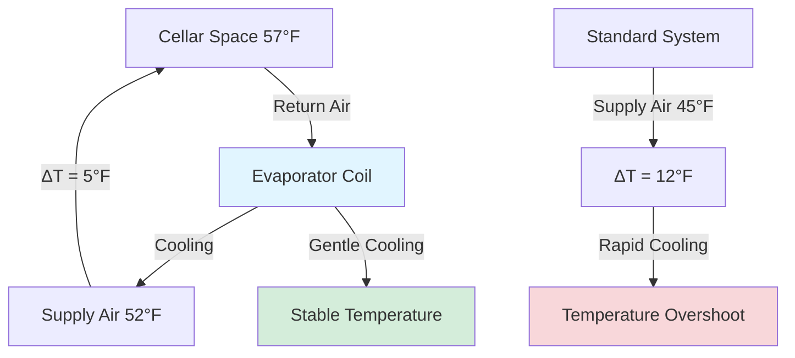

## Optimal Wine Storage Temperature Range

The universally accepted ideal temperature range for wine storage and aging is **55-60°F (12.8-15.6°C)**, with 55°F representing the gold standard for long-term cellaring. This temperature range represents a thermodynamic equilibrium point that minimizes unwanted chemical reactions while permitting controlled aging processes to proceed at optimal rates. The physics underlying this temperature selection involves reaction kinetics, phase stability, and transport phenomena that govern wine evolution over months to decades.

Temperature control in wine cellars demands precision far exceeding typical HVAC applications. While conventional comfort cooling tolerates ±3-5°F variations, wine storage requires stability within **±1°F** or tighter to prevent degradation of complex organic compounds and volatile aromatics that define wine quality.

## Chemistry of Wine Aging and Temperature Dependence

Wine aging involves hundreds of simultaneous chemical reactions including ester formation, tannin polymerization, anthocyanin stabilization, and controlled oxidation. These reactions follow Arrhenius kinetics, where reaction rate depends exponentially on temperature:

$$k = A e^{-E_a/(RT)}$$

Where:
- $k$ = reaction rate constant (s⁻¹)
- $A$ = pre-exponential frequency factor (s⁻¹)
- $E_a$ = activation energy (J/mol)
- $R$ = universal gas constant (8.314 J/mol·K)
- $T$ = absolute temperature (K)

For wine aging reactions with typical activation energies of 50-80 kJ/mol, the reaction rate approximately **doubles for every 10°C (18°F) temperature increase**. This temperature sensitivity explains why wine stored at 75°F ages roughly 2-4 times faster than wine at 55°F—resulting in premature maturation, loss of freshness, and development of cooked flavors.

### Critical Temperature Thresholds

| Temperature | Aging Rate | Storage Implications |
|-------------|------------|---------------------|
| 40-45°F | 0.3-0.5× nominal | Excessively slow aging; tartrate precipitation risk |
| 50-52°F | 0.7-0.9× nominal | Slower than ideal but acceptable short-term |
| **55-60°F** | **1.0× nominal** | **Optimal long-term storage range** |
| 65-70°F | 1.5-2.0× nominal | Accelerated aging; acceptable short-term only |
| 75-80°F | 2.5-4.0× nominal | Rapid degradation; unacceptable for quality storage |

The 55-60°F range provides the optimal balance between aging progression and preservation of delicate volatile compounds. Temperatures below 50°F risk tartrate crystal formation (potassium bitartrate precipitation) and sulfurous off-flavor development due to reduced yeast activity. Temperatures above 65°F accelerate oxidation, promote bacterial growth, and volatilize desirable aromatic esters.

## Temperature Stability: Fluctuation Impacts

Temperature fluctuations pose greater threats to wine quality than minor deviations from ideal setpoint. Thermal cycling creates three destructive mechanisms:

**1. Liquid Expansion and Contraction**

Wine exhibits volumetric thermal expansion following:

$$\Delta V = V_0 \beta \Delta T$$

Where:
- $\Delta V$ = volume change (mL)
- $V_0$ = initial volume (mL)
- $\beta$ = volumetric expansion coefficient for wine ≈ 0.0010 K⁻¹
- $\Delta T$ = temperature change (K)

For a standard 750 mL bottle experiencing a 10°F (5.6 K) temperature swing:

$$\Delta V = 750 \text{ mL} \times 0.0010 \text{ K}^{-1} \times 5.6 \text{ K} = 4.2 \text{ mL}$$

This 4.2 mL expansion forces wine past the cork, potentially breaking the seal and allowing oxygen ingress. The subsequent contraction draws air backward through cork pores, establishing a "breathing" cycle that accelerates oxidation.

**2. Convective Mixing**

Temperature gradients within bottles drive natural convection with velocity:

$$v \approx \sqrt{g \beta L \Delta T}$$

Where:
- $v$ = convective velocity (m/s)
- $g$ = gravitational acceleration (9.81 m/s²)
- $\beta$ = thermal expansion coefficient (K⁻¹)
- $L$ = bottle height (m)
- $\Delta T$ = vertical temperature difference (K)

For a bottle with 2°F (1.1 K) top-to-bottom gradient:

$$v \approx \sqrt{9.81 \times 0.0010 \times 0.30 \times 1.1} \approx 0.057 \text{ m/s}$$

This convection continuously circulates wine past the cork interface, accelerating oxygen dissolution and reaction rates.

**3. Phase Stability Disruption**

Temperature cycling destabilizes colloidal suspensions of tannins and pigments, promoting premature precipitation and color loss. Rapid temperature changes (>2°F/hour) can shock yeast cells remaining in bottle-conditioned wines, causing autolysis and off-flavor development.

## HVAC System Requirements for Temperature Precision

Achieving ±1°F temperature stability requires specialized HVAC design approaches:

### Continuous Capacity Modulation

Traditional on-off cycling creates temperature swings as the system alternates between full cooling and no cooling. The temperature swing magnitude depends on system capacity and space thermal mass:

$$\Delta T_{cycle} = \frac{Q_{cool} \times t_{off}}{m \times c_p}$$

Where:
- $\Delta T_{cycle}$ = temperature swing during cycle (°F)
- $Q_{cool}$ = cooling capacity (BTU/hr)
- $t_{off}$ = off-cycle duration (hr)
- $m$ = thermal mass (lb)
- $c_p$ = specific heat capacity (BTU/lb·°F)

Variable-speed compressors eliminate cycling by continuously adjusting capacity from 25-100%, maintaining nearly constant temperature. Inverter-driven scroll compressors provide the best performance for wine cellar applications.

### Oversized Heat Exchangers

Larger evaporator coils reduce the temperature differential between refrigerant and air, decreasing the cooling intensity that causes rapid temperature drops. A properly sized wine cellar evaporator operates with:

- Evaporator temperature differential (ETD): 8-12°F (vs. 15-20°F for comfort cooling)
- Supply air temperature: 50-52°F (vs. 55-60°F for comfort cooling)
- Airflow rate: 300-400 CFM per ton (vs. 400-450 CFM per ton)

This gentler cooling approach minimizes temperature overshoot during cooling cycles.

### Multi-Stage Temperature Control

Sophisticated wine cellar systems employ cascaded control strategies:

**Primary Stage**: Variable-speed compressor maintaining baseline cooling capacity

**Secondary Stage**: Modulating hot gas bypass or electric reheat trimming final temperature to ±0.5°F

**Tertiary Stage**: Thermal mass buffering through insulated envelope and optional phase-change materials

This three-tier approach separates gross cooling (primary) from precision control (secondary) and thermal stabilization (tertiary).

## Temperature Monitoring and Zoning

Large wine cellars exhibit temperature stratification due to:
- Heat conduction through envelope surfaces
- Thermal mass differences between bottle storage areas
- Air circulation patterns
- External wall exposure variations

Professional installations require multiple temperature measurement points:

| Zone | Sensor Location | Purpose |
|------|----------------|---------|
| Reference | Center of cellar, bottle height | Primary control point |
| Upper rack | Highest storage level | Stratification detection |
| Lower rack | Lowest storage level | Cold air pooling verification |
| Envelope | Near exterior walls | Infiltration impact assessment |
| Supply air | Evaporator discharge | System performance monitoring |

Temperature uniformity specifications for premium wine cellars limit spatial variation to **±2°F maximum** between any two storage locations. This requires careful air distribution design with low-velocity diffusers (200-400 FPM face velocity) positioned to promote gentle mixing without creating drafts that disturb bottle sediment.

## Thermal Mass and Envelope Design

The cellar envelope thermal resistance directly impacts temperature stability. Heat transfer through walls, ceiling, and floor follows:

$$Q_{envelope} = U \times A \times \Delta T$$

Where:
- $Q_{envelope}$ = heat transfer rate (BTU/hr)
- $U$ = overall heat transfer coefficient (BTU/hr·ft²·°F)
- $A$ = surface area (ft²)
- $\Delta T$ = indoor-outdoor temperature difference (°F)

For a cellar maintained at 57°F in a 75°F ambient:

| Construction | U-value | Heat Gain (100 ft²) |
|--------------|---------|---------------------|
| R-13 walls | 0.077 | 139 BTU/hr |
| R-19 walls | 0.053 | 95 BTU/hr |
| R-30 walls | 0.033 | 59 BTU/hr |
| R-38 ceiling | 0.026 | 47 BTU/hr |

Higher thermal resistance (R-30+ walls, R-38+ ceiling) reduces cooling load and improves temperature stability by slowing thermal response to external temperature swings. Continuous vapor barriers (6-mil polyethylene minimum) prevent moisture migration that degrades insulation performance.

Thermal mass stabilizes temperature by absorbing and releasing heat during system cycles. Wine bottles themselves provide substantial thermal mass:

$$m_{thermal} = n_{bottles} \times V_{bottle} \times \rho_{wine} \times c_{p,wine}$$

For a 1,000-bottle cellar:

$$m_{thermal} = 1000 \times 0.75 \text{ L} \times 0.99 \text{ kg/L} \times 3.9 \text{ kJ/kg·K} = 2,893 \text{ kJ/K}$$

This thermal mass dampens temperature fluctuations, providing natural buffering against system cycling and power interruptions.

## Gradual Temperature Adjustment Protocols

When initial cellar commissioning or seasonal adjustments require temperature changes, gradual transitions prevent thermal shock. The recommended rate limits are:

- **Maximum rate**: 1°F per day for temperature increases
- **Maximum rate**: 0.5°F per day for temperature decreases (more critical)
- **Never exceed**: 2°F change in any 24-hour period

Rapid cooling (>2°F/day) risks tartrate precipitation and cork compression that breaks bottle seals. Gradual adjustments allow wine chemistry to equilibrate without phase transitions or pressure differentials.

## Temperature Control System Commissioning

Verification of temperature performance requires multi-day testing under representative conditions:

1. **Initial stabilization**: Operate system for 48 hours to achieve thermal equilibrium
2. **Temperature logging**: Record temperatures at all sensor locations every 15 minutes for 7 days
3. **Cycling analysis**: Verify temperature swing remains within ±1°F during normal cycling
4. **Spatial uniformity**: Confirm temperature variation between zones stays within ±2°F
5. **Recovery testing**: Simulate door opening and verify return to setpoint within 30 minutes

Properly commissioned wine cellar HVAC systems demonstrate remarkable stability—premium installations achieve ±0.5°F control throughout annual seasonal variations, providing optimal conditions for wines aging over decades.

The 55-60°F temperature range, maintained with precision control and minimal fluctuation, represents the fundamental requirement for quality wine storage. This temperature regime slows aging chemistry to appropriate rates, preserves volatile aromatics, maintains cork integrity, and ensures wines develop complexity rather than degradation over time.
