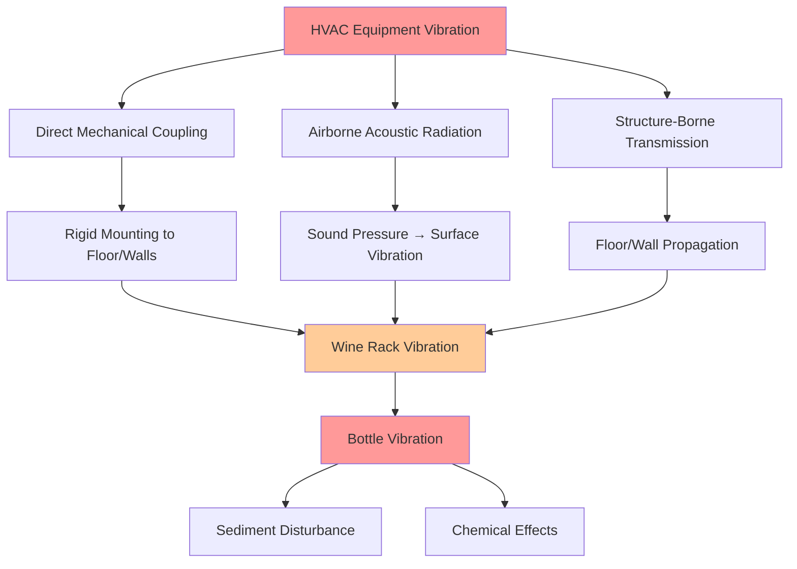

## Vibration Control for Wine Cellar HVAC

Vibration control represents a critical yet often overlooked aspect of wine cellar HVAC design. Mechanical vibration from compressors, fans, and air distribution systems transmits through structural elements to wine storage racks, where it disrupts sediment settling and potentially accelerates aging processes. The physics of vibration transmission involves energy transfer through multiple pathways—direct mechanical coupling, acoustic radiation, and resonance amplification—each requiring specific mitigation strategies.

Premium wine cellars demand vibration levels below **0.002 g (0.02 m/s²)** at storage rack locations, comparable to seismic background noise. Achieving this stringent criterion necessitates careful equipment selection, isolation system design, and structural decoupling of all HVAC components from wine storage areas.

## Physics of Vibration Effects on Wine

Wine aging involves gradual chemical transformations and sediment precipitation. Vibration influences both processes through distinct mechanisms:

**Sediment disturbance**: Particulate matter (tartrate crystals, phenolic compounds, protein-tannin complexes) settles under gravity at rates governed by Stokes' Law:

$$v = \frac{2r^2(\rho_p - \rho_f)g}{9\mu}$$

where $v$ is settling velocity, $r$ is particle radius, $\rho_p$ is particle density, $\rho_f$ is fluid density, $g$ is gravitational acceleration, and $\mu$ is dynamic viscosity. Vibrational accelerations exceeding $0.01g$ generate fluid motion that resuspends settled particles, preventing clarification and potentially creating permanent haze.

**Chemical reaction rates**: Mechanical agitation increases molecular collision frequency, potentially accelerating oxidation and esterification reactions. While the magnitude of this effect remains debated among oenologists, controlled studies demonstrate measurable differences in phenolic compound evolution between vibrated and undisturbed wines over multi-year aging periods.

**Cork integrity**: Cyclic vibration at resonant frequencies (typically 10-50 Hz for wine bottles) induces fatigue in cork-bottle interfaces, potentially compromising seal integrity and accelerating oxidation.

## Vibration Transmission Pathways

HVAC-generated vibration reaches wine storage through three primary pathways:

Effective vibration control requires addressing all three pathways simultaneously. Direct mechanical coupling typically dominates at low frequencies (5-30 Hz), where compressor and fan operating speeds generate fundamental excitation. Structure-borne transmission becomes significant when equipment mounts rigidly to cellar walls or floors. Airborne acoustic radiation matters primarily at higher frequencies (100-500 Hz) associated with fan blade passage and air turbulence.

## Low-Vibration Equipment Selection

Equipment selection forms the first defense against excessive vibration. Compressor technology fundamentally determines baseline vibration characteristics:

| Compressor Type | Vibration Level | Frequency Range | Wine Cellar Suitability |
|-----------------|-----------------|-----------------|-------------------------|
| Reciprocating | 0.2-0.5 g | 10-30 Hz | Poor (avoid) |
| Rotary | 0.05-0.15 g | 20-60 Hz | Marginal |
| **Scroll** | **0.01-0.03 g** | **40-120 Hz** | **Excellent** |
| Inverter scroll | 0.005-0.02 g | Variable | Optimal |

**Scroll compressors** dominate premium wine cellar applications due to inherently balanced rotating motion. Unlike reciprocating compressors with linear piston motion creating cyclic inertial forces, scroll compression involves two intermeshing spiral elements—one stationary, one orbiting—generating smooth, continuous compression with minimal vibration generation.

The fundamental force imbalance in reciprocating compressors follows:

$$F = mr\omega^2\cos(\omega t)$$

where $m$ is reciprocating mass, $r$ is crank radius, and $\omega$ is angular velocity. This sinusoidal force directly excites structural resonances. Scroll compressors eliminate this primary excitation source, reducing vibration by an order of magnitude.

**Variable-speed (inverter) scroll compressors** provide additional vibration benefits by avoiding repetitive start-stop cycling. Continuous operation at modulated capacity eliminates transient vibration spikes during compressor startup and shutdown, which can reach 5-10 times steady-state levels.

## Fan Selection and Air Distribution

Air handling components contribute secondary vibration through blade passage frequencies and airflow-induced turbulence. Design guidelines include:

- **Centrifugal fans** over axial fans (inherently balanced rotation, lower blade passage forces)
- **Direct-drive motors** eliminating belt drive vibration and misalignment
- **Maximum 400 FPM face velocity** at evaporator coils reducing turbulent pressure fluctuations
- **Acoustic duct lining** (1-inch fiberglass minimum) attenuating airborne vibration transmission
- **Flexible duct connectors** (minimum 12 inches length) preventing vibration coupling to ductwork

The blade passage frequency for centrifugal fans is:

$$f_{bp} = \frac{nN}{60}$$

where $n$ is number of blades and $N$ is rotational speed (RPM). Selecting low blade count designs (6-8 blades) operating at lower speeds (≤1200 RPM) minimizes excitation at frequencies where wine bottles exhibit resonant response.

## Vibration Isolation System Design

Even with low-vibration equipment, isolation systems remain essential to prevent transmission to wine storage areas. Isolation effectiveness depends on the natural frequency ratio:

$$TR = \frac{1}{\sqrt{1-\left(\frac{f}{f_n}\right)^2}}$$

where $TR$ is transmissibility ratio, $f$ is excitation frequency, and $f_n$ is isolator natural frequency. Effective isolation requires $f_n < f/\sqrt{2}$, meaning isolator natural frequency must be less than 0.707 times the lowest excitation frequency.

For scroll compressors operating at 3600 RPM (60 Hz), the lowest significant excitation occurs at operating speed:

$$f_n < \frac{60}{\sqrt{2}} \approx 42 \text{ Hz}$$

Achieving this natural frequency requires isolators with sufficient deflection under equipment weight.

### Isolation Mount Types

**Spring isolators**: Steel coil springs provide consistent performance across wide temperature ranges. Required static deflection:

$$\delta_{static} = \frac{1}{(2\pi f_n)^2 g}$$

For $f_n = 10$ Hz (providing excellent isolation at 60 Hz), required deflection is approximately 1 inch (25 mm). Spring isolators handle equipment weight from 50-5000 lbs with minimal stiffness variation.

**Neoprene pads**: Elastomeric isolation suitable for lighter equipment (under 200 lbs). Natural frequencies typically 15-25 Hz, providing moderate isolation. Temperature-dependent stiffness limits performance in variable ambient conditions. Minimum pad thickness of 1 inch recommended; thicker pads (up to 2 inches) improve isolation but reduce lateral stability.

**Combination isolators**: Spring elements with neoprene acoustic barriers optimize both low-frequency isolation (spring) and high-frequency damping (elastomer). These assemblies provide superior performance across the full vibration spectrum relevant to wine storage.

## Installation Best Practices

Proper installation determines isolation system effectiveness:

**Equipment location**: Position compressor-condenser units **minimum 20 feet** from wine storage racks when possible. Vibration amplitude attenuates with distance following:

$$A = \frac{A_0}{r}$$

for surface waves in structural elements, where $A$ is amplitude at distance $r$ and $A_0$ is source amplitude.

**Mounting surface preparation**: Install equipment on **concrete slabs minimum 4 inches thick** providing mass and stiffness to minimize secondary vibration. Suspended wood floors amplify vibration through resonance and should be avoided. When floor mounting is unavoidable, reinforce framing with additional joists to raise natural frequency above excitation range.

**Split system configuration**: Separate compressor-condenser from evaporator by maximum practical distance. Locate compressor units:
- Outside wine cellar in mechanical rooms
- On exterior pads isolated from building structure
- In attic spaces with isolated equipment platforms
- Never mounted directly to cellar walls

**Flexible connections**: Install flexible refrigerant lines and electrical conduit preventing vibration coupling through utilities. Minimum 12-inch flexible sections in all rigid connections to isolated equipment.

**Structural decoupling**: Avoid rigid ductwork connections to cellar walls. Use flexible canvas connectors or install duct supports on separate isolated frames.

## Vibration Monitoring and Verification

Post-installation vibration measurement verifies system performance. Assessment procedures include:

**Measurement locations**: Wine rack structures at representative bottle storage heights (3-5 feet above floor). Minimum three locations distributed throughout cellar.

**Measurement parameters**:
- Peak acceleration (g-force)
- RMS velocity (in/sec or mm/s)
- Frequency spectrum (0-500 Hz)

**Acceptance criteria**:
- Peak acceleration: <0.002 g at all frequencies
- RMS velocity: <0.0005 in/sec (0.013 mm/s)
- No discrete tonal components above background

**Measurement procedure**: Record vibration with all HVAC equipment operating at design conditions. Compare against baseline measurements with equipment off to quantify HVAC contribution.

Portable vibration analyzers with triaxial accelerometers provide adequate resolution for wine cellar verification. Professional commissioning should document vibration levels at all storage locations with certification provided to wine cellar owners.

## Commercial Wine Storage Requirements

Commercial wine storage facilities housing high-value inventory demand enhanced vibration control:

- **Seismic isolation**: Install wine racks on isolated platforms decoupled from building structure
- **Redundant HVAC**: Multiple smaller compressors rather than single large units, reducing per-unit vibration
- **Remote equipment locations**: Dedicated mechanical rooms isolated from storage areas by structural expansion joints
- **Continuous monitoring**: Permanent vibration sensors with alarm notification for abnormal conditions

Large commercial cellars may warrant computational vibration analysis during design phase, modeling transmission pathways and predicting performance before construction. Finite element modeling identifies structural resonances and optimizes isolation system parameters for specific installation conditions.

Proper vibration control ensures optimal wine aging conditions by maintaining sediment stability, preventing mechanical agitation, and creating the tranquil environment essential for developing complex flavor profiles over decades of maturation. Integration of low-vibration equipment selection, comprehensive isolation systems, and careful installation practices achieves vibration levels indistinguishable from natural background, preserving wine quality throughout extended aging periods.
