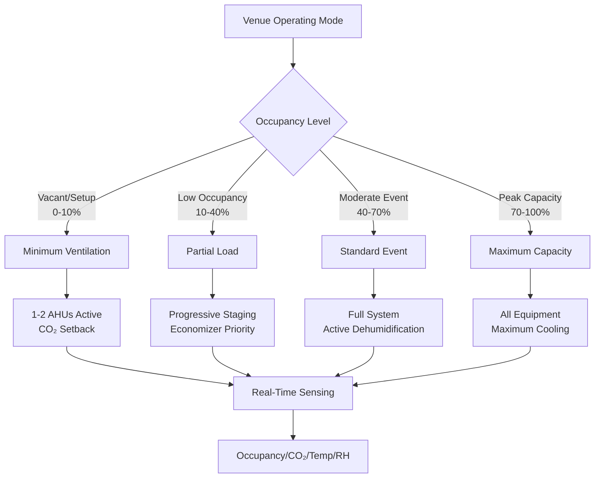

## Thermal Dynamics of Variable-Occupancy Spaces

Specialized venues present unique thermal challenges from extreme variability in internal heat generation and occupancy density fluctuations spanning orders of magnitude. The instantaneous cooling load for a multi-use venue follows:

$$Q_{total}(t) = Q_{envelope} + Q_{occupants}(t) + Q_{lighting}(t) + Q_{equipment}(t) + Q_{infiltration}(t)$$

where time-dependent terms may vary by factors of 10-50× between minimum and peak conditions, creating thermodynamic challenges in maintaining comfort while avoiding gross overcapacity during low-utilization periods.

## Occupancy-Driven Load Profiles

The sensible and latent heat contributions from occupants dominate the thermal dynamics in specialized venues. Each occupant generates heat at rates dependent on metabolic activity level:

| Activity Level | Sensible Heat (W) | Latent Heat (W) | Total (W) |
|----------------|-------------------|-----------------|-----------|
| Seated, quiet | 60 | 40 | 100 |
| Standing, light activity | 70 | 60 | 130 |
| Walking, moderate | 75 | 85 | 160 |
| Dancing, vigorous | 85 | 215 | 300 |
| Athletic activity | 115 | 385 | 500 |

For a venue transitioning from empty (50 people) to full capacity (2000 people) during an event, the occupant load alone increases:

$$\Delta Q_{occupants} = (N_{peak} - N_{base}) \times q_{person} = (2000 - 50) \times 130 = 253,500 \text{ W}$$

This 253.5 kW step change must be absorbed by the HVAC system within a time constant short enough to prevent space temperature drift exceeding comfort thresholds.

## System Response Time Requirements

The space temperature response to a step load change follows:

$$T_{space}(t) = T_{initial} + \Delta T_{ss}(1 - e^{-t/\tau})$$

where $\tau = \frac{mC_p}{\dot{m}_{air}C_{p,air}}$ represents the thermal time constant. Systems must achieve 90% response within $t_{90} = 2.3\tau < 15-20$ minutes, driving air change rates to 8-15 ACH compared to typical 4-6 ACH values.

## Multi-Mode System Architecture

Specialized venues require HVAC systems operating across distinct load regimes without excessive energy penalty during partial-load conditions.

## Ventilation Challenges in Event-Driven Spaces

ASHRAE Standard 62.1 requires outdoor air ventilation rates based on occupancy density. For specialized venues, the ventilation requirement varies dramatically:

$$\dot{V}_{OA} = R_p \times P + R_a \times A$$

where $R_p$ (cfm/person) and $R_a$ (cfm/ft²) are specified by space type. For assembly spaces, typical values are $R_p = 5$ cfm/person and $R_a = 0.06$ cfm/ft².

| Venue State | Occupancy | Area (ft²) | OA Required (cfm) | Supply Air (cfm) |
|-------------|-----------|------------|-------------------|------------------|
| Empty | 50 | 20,000 | 1,450 | 8,000 |
| Partial | 500 | 20,000 | 3,700 | 20,000 |
| Moderate | 1,200 | 20,000 | 7,200 | 40,000 |
| Full | 2,000 | 20,000 | 11,200 | 60,000 |

The 7.7× range in outdoor air requirements creates significant energy implications and necessitates demand-controlled ventilation (DCV) strategies using CO₂ sensing or direct occupancy counting.

## Thermal Stratification Management

Large-volume venues experience thermal stratification where $\frac{dT}{dz} \approx \frac{Q_{internal}}{A \times k_{effective}}$. Without active destratification, temperature differentials of 10-15°F between floor and ceiling reduce effective cooling capacity. Mitigation includes high-velocity air distribution (entrainment ratios 5-8:1), circulation fans at 50-100 fpm, or displacement ventilation systems.

## Flexible Space Zoning Approaches

Multi-use venues require reconfigurable HVAC zoning to accommodate movable walls, simultaneous events with different thermal requirements, and spatially migrating loads. Effective strategies include modular air handling with 3-5 independently controlled zones per configurable space, perimeter VAV boxes serving the outer 15-20 ft, and supplementary fan-coil units for localized boost capacity.

## Humidity Control Under Transient Conditions

Latent load management challenges arise when occupancy surges rapidly. The space moisture balance $\frac{dm_{water}}{dt} = \dot{m}_{latent,generation} - \dot{m}_{latent,removal}$ shows that during the first 30-60 minutes of an event, relative humidity can climb 15-25 percentage points before coil dehumidification responds. Mitigation includes pre-cooling spaces 2-4°F below setpoint, dedicated outdoor air systems (DOAS) with independent latent control, or desiccant dehumidification supplements.

## Energy Recovery Considerations

Extreme outdoor air volumes during peak occupancy make energy recovery economically compelling. Enthalpy wheels recover 60-80% of conditioning energy but risk contamination transfer and effectiveness degradation under rapidly changing airflow rates. Run-around loops with glycol heat transfer provide air stream separation while maintaining 50-65% effectiveness, making them preferable for venues with strict indoor air quality requirements.

## Control System Architecture

Specialized venue HVAC demands advanced controls integrating predictive algorithms (event schedules drive pre-conditioning 2-4 hours ahead), real-time sensors (CO₂, occupancy counters, thermal imaging), adaptive setpoints based on measured occupancy density, prioritized load shedding when demand exceeds capacity, and rapid fault detection. The system must transition smoothly between operating modes while minimizing energy waste during the 85-95% of hours when venues operate below 50% capacity.

## Design Load Determination

Traditional ASHRAE design day methodology proves inadequate for specialized venues. A probabilistic approach uses:

$$Q_{design} = Q_{base} + f_{diversity} \times Q_{peak,occupant} + Q_{peak,other}$$

where $f_{diversity}$ reflects the statistical probability of simultaneous maximum occupancy and envelope load. Values of 0.7-0.85 better represent actual coincident conditions than $f_{diversity} = 1.0$, preventing gross overcapacity while ensuring adequate performance during actual peak events.