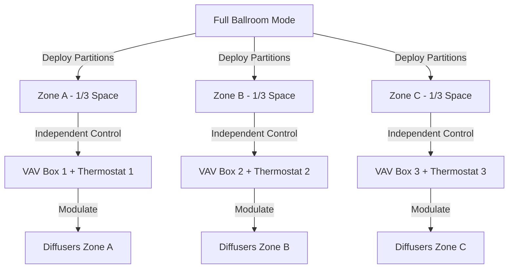

Ballroom and banquet facilities present unique HVAC challenges due to extreme occupancy variations, divisible architectures, aesthetic constraints from chandeliers and high ceilings, and simultaneous requirements for guest comfort and food service operations. These multi-purpose spaces demand flexible climate control systems capable of responding to load swings from 5 occupants during setup to 500+ during peak events, all while maintaining invisible integration with architectural features.

## Load Variability Physics

Ballroom sensible and latent loads exhibit the widest swings of any commercial space type. The total heat gain follows:

$$Q_{total} = Q_{occupants} + Q_{lighting} + Q_{equipment} + Q_{envelope} + Q_{infiltration}$$

During a seated dinner for 400 occupants, the metabolic heat generation dominates:

$$Q_{occupants} = N \times q_{sensible} + N \times q_{latent}$$

Where $N$ = 400 people, $q_{sensible}$ = 250 BTU/hr per person (seated), $q_{latent}$ = 200 BTU/hr per person. This yields 100,000 BTU/hr sensible and 80,000 BTU/hr latent from occupants alone—equivalent to adding seven tons of cooling load instantaneously when guests enter.

The sensible heat ratio (SHR) during high occupancy drops to:

$$SHR = \frac{Q_{sensible}}{Q_{sensible} + Q_{latent}} = \frac{100,000}{180,000} = 0.56$$

This low SHR requires substantial dehumidification capacity beyond standard commercial spaces (SHR typically 0.70-0.80).

## Divisible Space Coordination

Operable partitions subdivide ballrooms into smaller sections, each requiring independent zone control. The challenge lies in air distribution continuity when partitions move.

Each zone requires dedicated VAV terminals with pressure-independent control to prevent airflow interference between active and inactive sections. Return air must be ducted above partitions to maintain proper air balance regardless of partition configuration.

## Ceiling Height and Stratification

Ballrooms typically feature 16-24 foot ceilings, creating significant thermal stratification potential. The temperature gradient in still air follows:

$$\frac{dT}{dz} = -\frac{g}{c_p} \approx -5.4°F/1000ft$$

In practice, with heat sources at floor level (occupants), the gradient reverses, and warm air rises. Without proper air circulation, ceiling temperatures can exceed floor level by 10-15°F, wasting cooling energy and creating uncomfortable drafts when air eventually descends.

Proper air distribution requires high-momentum supply jets to break stratification:

$$X = \frac{V_x}{V_0} = e^{-K\frac{x}{d_0}}$$

Where throw distance $x$ must reach the occupied zone with terminal velocity $V_x$ of 50-75 FPM. For 20-foot ceilings, supply diffusers require 20-30 foot throws, demanding careful nozzle selection and supply velocities of 600-800 FPM at the diffuser face.

## Chandelier Integration

Ornate chandeliers serve as ballroom centerpieces but interfere with air distribution. Three coordination strategies exist:

| Strategy | Supply Location | Return Location | Advantages | Limitations |
|----------|----------------|-----------------|------------|-------------|
| Perimeter High Wall | Upper wall registers | Ceiling between chandeliers | Preserves chandelier visibility | Long throw distances required |
| Ceiling Slot Diffusers | Linear slots parallel to chandeliers | Low sidewall or under-platform | Architectural integration | Complex ductwork routing |
| Chandelier Integration | Supply air through chandelier structure | Distributed ceiling | Maximum throw control | Requires custom chandelier design |

Supply air routed through chandelier mounting structures provides the most effective distribution, with jets directed downward at the perimeter of the fixture. This approach utilizes the chandelier's central location while avoiding direct airflow on the decorative elements.

## Catering and Service Integration

Food service operations introduce additional heat and moisture loads in adjacent pre-function spaces and service corridors. Kitchen exhaust makeup air must not compromise ballroom conditions. The pressure cascade requires:

$$P_{corridor} > P_{ballroom} > P_{kitchen}$$

Maintaining ballroom pressure 0.02-0.03 in. w.c. above corridors prevents odor infiltration while staying below kitchen pressure to contain cooking effluent. This demands precise outside air control:

$$OA_{required} = MAX(V_{ventilation}, V_{pressurization})$$

Where $V_{ventilation}$ follows ASHRAE 62.1 (7.5 CFM/person for assembly spaces) and $V_{pressurization}$ accounts for envelope leakage and door infiltration.

## Occupancy-Based Control

Modern ballroom systems employ CO₂ sensors and occupancy detection to modulate ventilation rates in real-time. During setup (5 occupants), outdoor air can reduce to minimum code requirements (typically 0.06 CFM/ft²), while ramping to 3,000+ CFM during full occupancy events.

The ventilation efficiency method from ASHRAE 62.1 applies:

$$V_{ot} = \frac{V_{oz}}{E_z}$$

Where zone air distribution effectiveness $E_z$ = 1.0 for ceiling supply systems with return air near the floor, or 0.8 for displacement ventilation—rarely used in ballrooms due to high ceilings.

## Acoustic Considerations

Low background noise levels (NC 30-35) are critical for speeches and presentations. Duct velocities must remain below 1,200 FPM in mains and 600 FPM in branch ducts. VAV terminals require sound-attenuated housings, adding 10-15 dB insertion loss.

Return air pathways through ceiling plenums above operable partitions must include acoustic baffles to prevent sound transmission between zones—a 50 STC rating minimum ensures speech privacy when zones operate independently.

## System Recommendations

High-performance ballroom HVAC systems incorporate:

- **Dual-path air handling**: Separate sensible cooling and dehumidification streams allow independent SHR control
- **Staged capacity**: Multiple smaller air handlers instead of single large units enable efficient part-load operation
- **Underfloor air distribution**: Where ceiling aesthetics are paramount, UFAD systems eliminate overhead ductwork while providing excellent stratification control
- **Radiant cooling panels**: Perimeter radiant panels handle base loads, reducing airflow requirements and noise
- **Demand-controlled ventilation**: CO₂-based modulation reduces energy consumption by 30-40% compared to constant outdoor air systems

Properly engineered ballroom HVAC systems balance architectural integration, occupant comfort across extreme load variations, and operational flexibility for diverse event types—all while maintaining invisible operation that supports rather than distracts from the venue experience.

---

**File**: `/Users/evgenygantman/Documents/github/gantmane/hvac/content/specialty-applications-testing/specialty-hvac-applications/specialized-venue-requirements/ballrooms-banquet/_index.md`
