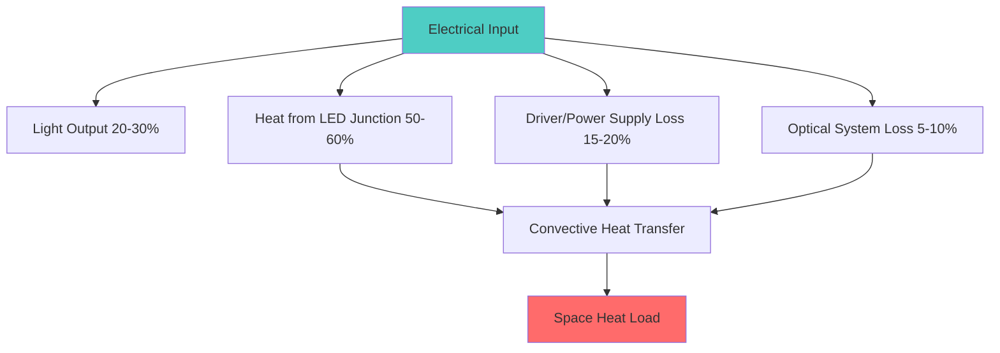
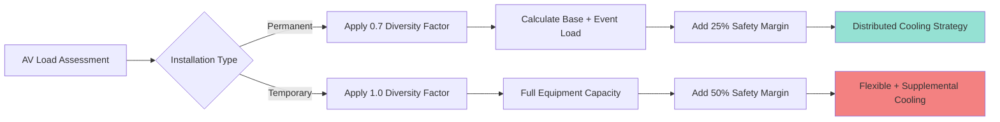

## Physical Basis of AV Heat Generation

Audio-visual equipment converts electrical power into light, sound, and substantial thermal energy through resistive heating and electromagnetic processes. The first law of thermodynamics dictates that energy input equals useful output plus waste heat:

$$Q_{total} = P_{input} - (P_{acoustic} + P_{optical}) \approx P_{input} \times (1 - \eta)$$

Where $\eta$ represents equipment efficiency (typically 0.15-0.40 for projection systems, 0.50-0.70 for amplifiers). Most electrical energy becomes sensible heat that must be removed by the HVAC system.

## Equipment-Specific Heat Load Analysis

### Projection Systems

Modern digital projectors dissipate 400-2000 W depending on brightness output measured in lumens. High-output venue projectors (10,000+ lumens) generate significant localized heat:

$$Q_{projector} = \frac{P_{lamp}}{\eta_{optical}} + P_{electronics}$$

For a 15,000 lumen laser projector:
- Lamp/laser assembly: 1200 W
- Electronics and cooling fans: 300 W
- Total heat rejection: **1500 W (5,100 BTU/hr)**

Ceiling-mounted projectors create thermal plumes that rise and stratify unless specifically addressed with spot cooling or return air grilles positioned above equipment.

### Power Amplifiers

Professional audio amplifiers operate at 50-70% efficiency under typical loading conditions. Heat dissipation follows:

$$Q_{amp} = P_{output} \times \left(\frac{1}{\eta} - 1\right) + P_{idle}$$

| Amplifier Class | Efficiency | Idle Power | Full Load Heat (per 1000W output) |
|-----------------|------------|------------|-----------------------------------|
| Class AB | 50-60% | 100-200 W | 800-1000 W |
| Class D | 65-75% | 30-80 W | 350-500 W |
| Class H | 60-70% | 80-150 W | 450-700 W |

A typical ballroom sound system with 10 kW amplifier capacity generates **6,000-8,000 W** (20,500-27,300 BTU/hr) at moderate operating levels (60-70% utilization).

### Stage Lighting Loads

Lighting heat loads vary dramatically between traditional and LED technology:

**Conventional Tungsten-Halogen:**
- Par 64 (1000W): 3,400 BTU/hr each
- ERS Ellipsoidal (750W): 2,560 BTU/hr each
- Conversion efficiency: ~5-8% to visible light

**LED Moving Lights:**
- 300W LED fixture: 1,020 BTU/hr
- Efficiency: 20-30% to visible light
- Power supply losses: 15-20%

A full ballroom lighting rig might include:
- 40 LED moving heads (300W each): 12,000 W
- 20 LED wash fixtures (200W each): 4,000 W
- Dimmer/control losses (10%): 1,600 W
- **Total: 17,600 W (60,000 BTU/hr)**

### Display Screens and Video Walls

LED video walls and large-format displays generate substantial heat based on pixel pitch and brightness:

$$Q_{display} = A_{screen} \times \rho_{pixel} \times P_{pixel} \times B_{factor}$$

Where:
- $A_{screen}$ = screen area (m²)
- $\rho_{pixel}$ = pixel density (pixels/m²)
- $P_{pixel}$ = power per pixel (W)
- $B_{factor}$ = brightness utilization factor (0.3-0.8)

A 4m × 2m LED wall (3.9mm pitch) at 70% brightness:
- Pixel count: ~500,000 pixels
- Power density: 800 W/m²
- Total heat: **6,400 W (21,800 BTU/hr)**

LCD/OLED displays dissipate 150-400 W per 85" screen depending on brightness settings and backlighting technology.

## Equipment Rack Cooling Requirements

AV equipment racks concentrate heat in confined spaces, creating extreme thermal density. Rack cooling requires:

**Convective Heat Transfer:**
$$Q = h \times A \times \Delta T$$

Where adequate ventilation maintains $\Delta T$ below 15°F (8°C) to prevent equipment throttling or failure.

### Rack Cooling Strategies

| Method | Cooling Capacity | Application | Noise Level |
|--------|------------------|-------------|-------------|
| Natural convection | 2-3 kW | Small racks, open design | Silent |
| Forced ventilation | 5-8 kW | Standard racks | Moderate |
| In-rack heat exchangers | 10-15 kW | High-density equipment | Low |
| Rear-door cooling | 15-25 kW | Extreme density | Very low |
| Spot cooling AC | 3-5 tons | Control rooms | Moderate |

Critical equipment racks should maintain internal temperatures below 85°F (29°C) with redundant cooling paths.

## Temporary vs Permanent Installation Load Profiles

### Permanent Installations

Fixed AV systems operate predictably with:
- Base load: 30-40% of maximum capacity
- Event load: 60-80% of maximum capacity
- Peak duration: 2-6 hours
- Diversity factor: 0.60-0.75

Design cooling for 75% simultaneous operation with 25% safety margin.

### Temporary Productions

Mobile AV equipment introduces variables:
- Unknown equipment specifications
- Variable positioning affecting air distribution
- Concentrated loads in temporary locations
- Setup/strike periods with abnormal loads

**Design approach:** Provide 150-200% of anticipated permanent system capacity through flexible distribution (accessible floor boxes, rigging points with nearby returns, supplemental portable cooling capacity).

## HVAC System Integration

### Air Distribution Considerations

AV heat loads create challenges for conventional displacement ventilation:
1. **Thermal stratification** from elevated equipment requires return air placement above heat sources
2. **Acoustic requirements** limit diffuser velocities to <400 fpm
3. **Aesthetic constraints** dictate concealed grilles and ductwork

**Solution:** Overhead supply with low-velocity radial diffusers (NC 25-30) combined with high-induction returns positioned 2-3 feet above stage/AV equipment.

### Load Calculation Per ASHRAE

ASHRAE Fundamentals Chapter 18 provides guidance:

$$Q_{AV} = 3.41 \times P_{nameplate} \times F_{use} \times F_{diversity}$$

Where:
- $P_{nameplate}$ = rated power consumption (W)
- $F_{use}$ = utilization factor (0.5-0.8)
- $F_{diversity}$ = diversity factor (0.6-1.0)
- Result in BTU/hr

For ballroom design loads:
- **Permanent systems:** Use $F_{diversity}$ = 0.70
- **Temporary provisions:** Use $F_{diversity}$ = 0.90
- **Control rooms:** Use $F_{diversity}$ = 1.00 (continuous operation)

### Supplemental Cooling

When AV loads exceed base building capacity, deploy:
- **Portable spot coolers** (2-5 ton capacity) ducted to equipment racks
- **In-rack cooling units** for control room densities >5 kW/rack
- **Dedicated AV mechanical system** with independent controls
- **Chilled water quick-connects** for temporary production cooling

Ensure electrical infrastructure supports cooling equipment plus AV loads simultaneously.

## Design Recommendations

1. **Survey actual equipment specifications** rather than assuming generic loads
2. **Monitor existing events** with temporary sensors to validate assumptions
3. **Provide accessible cooling infrastructure** at typical AV locations
4. **Maintain internal rack temperatures** below 85°F through all operating conditions
5. **Plan for technology migration** toward higher-efficiency equipment (40% reduction projected over 10 years)
6. **Coordinate with AV consultants** on power and cooling requirements during design phases

Audio-visual equipment represents 25-40% of total ballroom cooling loads during events, making accurate assessment critical for occupant comfort and equipment reliability.
