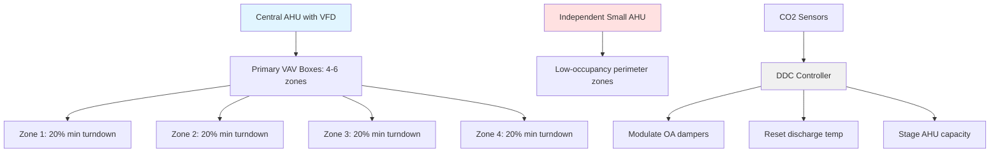
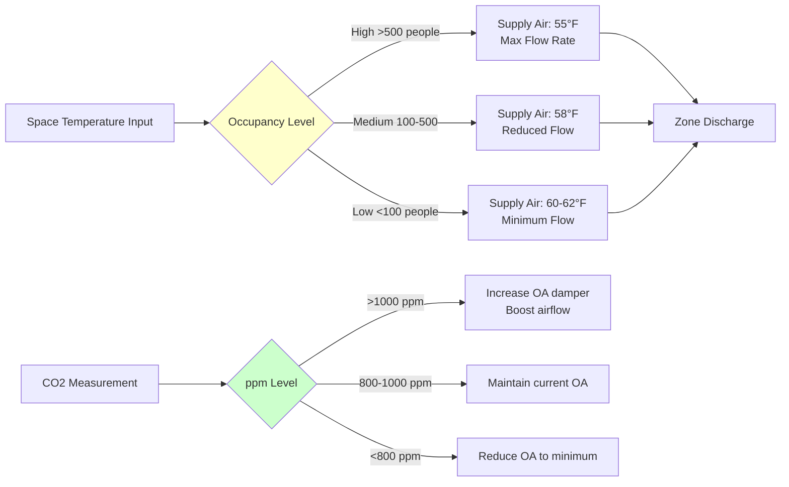

## Engineering Challenge: 100:1 Load Variability

Ballrooms and banquet facilities present one of HVAC design's most demanding challenges: maintaining comfort across occupancy ranges from 10 people during setup to 1000 during peak events. This 100:1 variation creates extreme swings in sensible and latent cooling loads, ventilation requirements, and zone pressurization demands.

The fundamental challenge lies in the non-linear relationship between occupancy and load. While sensible heat from occupants scales linearly at approximately 250 BTU/hr per person, latent loads from respiration and perspiration increase disproportionately during high-density events. System design must prevent overcooling at low occupancy while maintaining capacity for peak loads.

## Ventilation Load Dynamics

The outdoor air requirement dominates system sizing for variable-occupancy spaces. ASHRAE Standard 62.1 prescribes ventilation as:

$$V_{oz} = R_p \times P_z + R_a \times A_z$$

Where:
- $V_{oz}$ = zone outdoor airflow (CFM)
- $R_p$ = people outdoor air rate (5-7.5 CFM/person for assembly spaces)
- $P_z$ = zone population
- $R_a$ = area outdoor air rate (0.06 CFM/ft²)
- $A_z$ = zone floor area (ft²)

For a 10,000 ft² ballroom with 1000-person peak capacity:

**Peak occupancy:** $V_{oz} = 7.5 \times 1000 + 0.06 \times 10000 = 8100$ CFM

**Minimum occupancy (10 people):** $V_{oz} = 7.5 \times 10 + 0.06 \times 10000 = 675$ CFM

This 12:1 ratio in ventilation demand drives the need for CO2-based demand-controlled ventilation rather than fixed outdoor air delivery.

## CO2-Based Demand Ventilation Strategy

Demand-controlled ventilation (DCV) modulates outdoor air intake based on measured CO2 concentration, which serves as a proxy for occupancy. The control strategy exploits the mass balance equation:

$$\frac{dC}{dt} = \frac{G - Q(C - C_o)}{V}$$

Where:
- $C$ = space CO2 concentration (ppm)
- $G$ = CO2 generation rate from occupants (0.005 CFM per person)
- $Q$ = ventilation rate (CFM)
- $C_o$ = outdoor CO2 concentration (~400 ppm)
- $V$ = space volume (ft³)

**DCV System Requirements:**

| Component | Specification | Purpose |
|-----------|---------------|---------|
| CO2 sensors | ±50 ppm accuracy, 3-5 locations | Multiple zones prevent stratification errors |
| Response time | <2 minutes sensor + control lag | Match occupancy ramp rates |
| Setpoint | 1000 ppm design, 1200 ppm alarm | Balance air quality with energy use |
| Minimum OA | 25-30% of design ventilation | Prevent over-reduction |

The control algorithm adjusts outdoor air dampers to maintain setpoint, with the outdoor airflow requirement calculated as:

$$Q_{required} = \frac{N \times G \times 10^6}{C_{setpoint} - C_o}$$

Where $N$ = estimated occupant count based on CO2 rise rate.

## VAV System Sizing for Extreme Turndown

Traditional VAV systems struggle with the 10:1 to 20:1 turndown ratios required for ballroom applications. Terminal unit minimum airflow settings, typically 30% for cooling-only boxes, would deliver excessive air during low occupancy.

**Optimized VAV Architecture:**

**Design Strategy:**

1. **Multiple air handlers:** Deploy a base-load unit (30% capacity) for low occupancy and larger units for peak events
2. **Series fan-powered boxes:** Enable lower minimum flows (15-20%) while maintaining air circulation
3. **Pressure-independent controls:** Ensure accurate flow delivery across the operating range
4. **Zone subdivision:** Divide large ballrooms into 4-6 control zones rather than single-zone treatment

## Part-Load Efficiency Optimization

System efficiency degrades at part load due to component performance curves, fixed losses, and control compromises. The relationship between cooling delivered and energy consumed follows:

$$EER_{part} = EER_{rated} \times PLF \times \frac{1}{1 + CD \times (1-PLR)}$$

Where:
- $PLF$ = part-load factor from manufacturer data
- $PLR$ = part-load ratio (actual load / rated load)
- $CD$ = degradation coefficient (0.1-0.25 for modern equipment)

**Efficiency Enhancement Measures:**

| Strategy | Mechanism | Typical Savings |
|----------|-----------|-----------------|
| VFD on supply fans | Cubic relationship: power ∝ speed³ | 40-60% fan energy at 50% flow |
| Condenser water reset | Lower lift at reduced load | 15-25% chiller energy |
| Multiple smaller chillers | Avoid single large unit at <30% | 20-30% at low loads |
| Economizer integration | Free cooling when $T_{OA} < T_{RA} - 5°F$ | 30-100% during shoulder seasons |
| Discharge air temp reset | Raise from 55°F to 60-62°F at low load | 10-15% cooling energy |

The fan energy relationship is particularly powerful:

$$P_{fan} = \frac{Q \times \Delta P}{\eta_{fan} \times \eta_{motor}} \propto Q^3$$

Reducing airflow to 50% of design (500 CFM vs 1000 CFM per person equivalent) cuts fan power to 12.5% of full load.

## Avoiding Low-Occupancy Overcooling

Overcooling during setup periods or small events creates comfort complaints and wastes energy. The phenomenon occurs when:

1. **Minimum airflow exceeds cooling requirement:** VAV boxes at minimum stops deliver more cooling capacity than the space needs
2. **Discharge air too cold:** Supply temperature sized for peak latent loads overcools at low sensible-only conditions
3. **Thermostat location errors:** Sensors near doors or in dead zones misrepresent space conditions

**Control Solutions:**

**Implementation sequence:**

1. **Occupancy detection:** Deploy CO2 sensors + scheduling system to determine operating mode
2. **Supply temp reset:** Increase discharge temperature from 55°F to 60-62°F when CO2 < 800 ppm
3. **Reduced minimum flows:** Lower VAV minimums to 15-20% or use fan-powered boxes with zero primary air capability
4. **Zone temperature averaging:** Use multiple sensors (3-5 per large ballroom) to prevent single-point control errors
5. **Time-of-day scheduling:** Pre-condition spaces 2 hours before events, setback during setup

The energy impact is substantial. A 10,000 ft² ballroom operating at low occupancy 60% of annual hours can reduce energy consumption by 40-50% with proper controls versus fixed-volume, fixed-temperature operation.

## Quick Response Control Requirements

Event spaces transition rapidly between occupancy states. A ballroom can fill from 50 to 800 people within 30 minutes as guests arrive for dinner service. The thermal mass of air is minimal:

$$\tau = \frac{\rho \times V \times c_p}{Q \times \rho \times c_p} = \frac{V}{Q}$$

For a 10,000 ft² ballroom with 20-foot ceilings and 40,000 CFM airflow: $\tau = \frac{200,000}{40,000} = 5$ minutes.

This five-minute time constant means space conditions respond quickly to occupancy changes, but control system response lags create problems:

**Required Response Characteristics:**

- **Sensor update rate:** 1-minute intervals for CO2, 30-second for temperature
- **Damper/valve actuators:** 60-90 second stroke time maximum
- **Controller PID tuning:** Aggressive with minimal integral action to prevent overshoot
- **Anticipatory control:** Use building management system integration to pre-condition based on event schedule

## Components

- Small Ballroom 100 To 300
- Medium Ballroom 300 To 700
- Large Ballroom 700 To 1500
- Grand Ballroom Over 1500
- Divisible Space Design
- Partition Wall Integration
