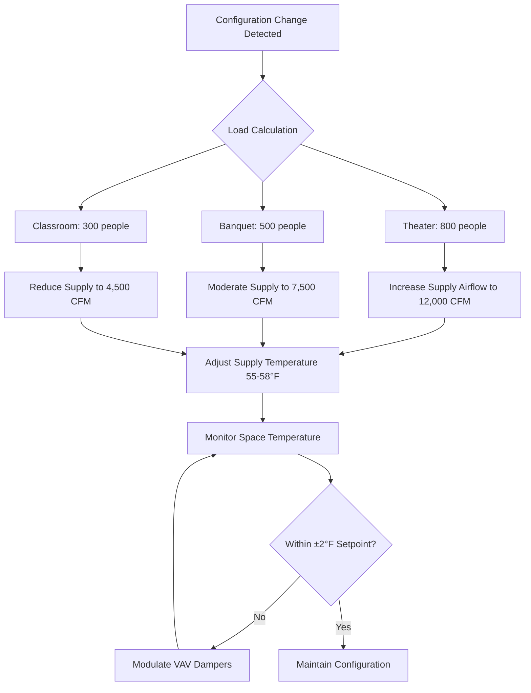

Flexible seating spaces present unique HVAC challenges due to rapidly changing occupant densities, heat loads, and air distribution requirements across different configurations. A ballroom configured for theater seating may accommodate 800 people at 6 ft²/person, while the same space in banquet configuration serves 400 people at 12 ft²/person—a 100% variation in sensible and latent loads requiring immediate system response.

## Load Variability Across Seating Configurations

The fundamental challenge stems from the relationship between occupant density and thermal load generation. Each occupant generates approximately 250 BTU/hr of sensible heat and 200 BTU/hr of latent heat during seated activities, with load equations:

**Sensible Load:**
$$Q_s = N \cdot q_s \cdot CLF$$

**Latent Load:**
$$Q_l = N \cdot q_l$$

Where $N$ is the number of occupants, $q_s$ is sensible heat per person (250 BTU/hr), $q_l$ is latent heat per person (200 BTU/hr), and $CLF$ is the cooling load factor (typically 0.85-0.95 for ballrooms).

### Configuration-Specific Load Analysis

| Configuration | Density (ft²/person) | Typical Capacity | Sensible Load (BTU/hr) | Latent Load (BTU/hr) | Ventilation (CFM) |
|---------------|---------------------|------------------|------------------------|---------------------|-------------------|
| Theater | 6-7 | 800-900 | 212,500 | 170,000 | 12,000-13,500 |
| Classroom | 15-20 | 300-400 | 85,000 | 68,000 | 4,500-6,000 |
| Banquet Rounds | 10-12 | 500-600 | 127,500 | 102,000 | 7,500-9,000 |
| Reception Standing | 8-10 | 600-750 | 153,000 | 122,400 | 9,000-11,250 |
| Dance Floor | 12-15 | 400-500 | 106,250 | 85,000 | 6,000-7,500 |

*Based on 6,000 ft² ballroom per ASHRAE Standard 62.1*

## Air Distribution Strategies

Effective air distribution must address three critical parameters: throw distance, terminal velocity, and diffusion pattern. The relationship between supply air velocity and distance follows:

$$V_x = V_0 \cdot K \cdot \sqrt{\frac{A_0}{x}}$$

Where $V_x$ is velocity at distance $x$, $V_0$ is initial discharge velocity, $K$ is diffuser coefficient (0.8-1.2), and $A_0$ is effective discharge area.

### Theater Configuration

Theater seating creates linear occupied zones with high density. Overhead diffusers positioned above aisles provide vertical air distribution without draft risk. Supply air temperature differential of 15-20°F maintains comfort while meeting high cooling demands.

**Design Parameters:**
- Air changes: 8-12 ACH
- Supply velocity at occupied zone: <50 FPM
- Throw distance: 15-25 feet from ceiling-mounted diffusers
- Return air location: Low wall or floor registers to capture heat plume

### Banquet Configuration

Round tables create discrete occupied zones with significant dead spaces between tables. This geometry demands high induction ratios to ensure complete air mixing. The entrainment ratio for radial diffusers:

$$E = \frac{Q_{total}}{Q_{primary}} = 1 + \frac{K \cdot A_r \cdot x}{A_0}$$

Where $A_r$ is room cross-section area and $K$ is entrainment coefficient (0.1-0.15).

**Design Parameters:**
- Air changes: 6-8 ACH
- Diffuser spacing: 12-15 feet on center
- Supply air ΔT: 18-22°F
- Emphasis on radial throw patterns for table coverage

### Classroom Configuration

Classroom layouts with forward-facing rows require directional airflow aligned with sight lines. Side wall diffusers with horizontal throw prevent cross-drafts while maintaining air quality in occupied zones.

**Design Parameters:**
- Air changes: 5-7 ACH
- Horizontal throw: 20-30 feet from side walls
- Supply velocity: <75 FPM in occupied zone
- Return air: Ceiling-mounted to avoid noise interference

## Dynamic System Response

The critical performance metric for flexible spaces is thermal response time—the period required to achieve setpoint after configuration change. Response time follows first-order dynamics:

$$\tau = \frac{m \cdot c_p}{\dot{m}_{supply} \cdot c_p} = \frac{V \cdot \rho}{Q_{CFM} \cdot \rho}$$

Where $\tau$ is time constant (minutes), $V$ is room volume, and $Q_{CFM}$ is supply airflow rate.

### Control System Requirements

Variable air volume (VAV) systems with demand-controlled ventilation (DCV) provide optimal response. CO₂ sensors positioned at 4-5 feet height trigger ventilation rate adjustments per ASHRAE 62.1:

$$V_{OA} = R_p \cdot P_z + R_a \cdot A_z$$

Where $V_{OA}$ is outdoor air requirement, $R_p$ is 5 CFM/person, $P_z$ is zone population, $R_a$ is 0.06 CFM/ft², and $A_z$ is zone area.

**Control Sequence:**
1. CO₂ threshold exceeded (>1000 ppm) triggers airflow increase
2. VAV dampers modulate to maintain minimum 0.06 CFM/ft² baseline
3. Supply air temperature resets based on zone demand (55-65°F range)
4. Economizer engages when outdoor conditions permit
5. Exhaust fans stage to maintain slight negative pressure

## Quick-Change Operational Strategy

Pre-conditioning protocols reduce thermal lag between events. Purge cycles at maximum airflow (15+ ACH) for 30-45 minutes prior to occupancy establish baseline conditions. This approach reduces the effective time constant by 40-60%.

**Pre-Event Sequence:**
- T-60 minutes: Maximum cooling mode, 58°F supply air
- T-30 minutes: Transition to configuration-specific airflow
- T-15 minutes: Fine-tune zone temperatures ±1°F
- T-0 minutes: Standard operating mode with DCV active

The thermal mass of furniture and finishes introduces additional response delay. Carpet, tables, and chairs represent approximately 15-20 BTU/ft²·°F of thermal capacitance, requiring 25-35% additional cooling capacity during pull-down periods.

## Design Recommendations

**System Sizing:**
- Base capacity on theater configuration (maximum occupancy)
- Size supply fans for 125-150% of calculated airflow
- Provide turndown ratio of 4:1 minimum on VAV boxes
- Install CO₂ sensors at multiple locations (1 per 2,500 ft²)

**Distribution Design:**
- Use high-induction diffusers with adjustable patterns
- Locate supply outlets to serve multiple configurations
- Maintain 15-20 feet maximum diffuser spacing
- Design for ADPI (Air Diffusion Performance Index) >80

**Control Integration:**
- Link BAS to room scheduling system for pre-conditioning
- Implement occupancy-based reset strategies
- Enable manual override with 2-hour automatic revert
- Monitor response time and auto-tune PID loops

Effective HVAC design for flexible seating balances immediate response capability with energy efficiency, ensuring occupant comfort across the full range of space configurations while minimizing operational costs.