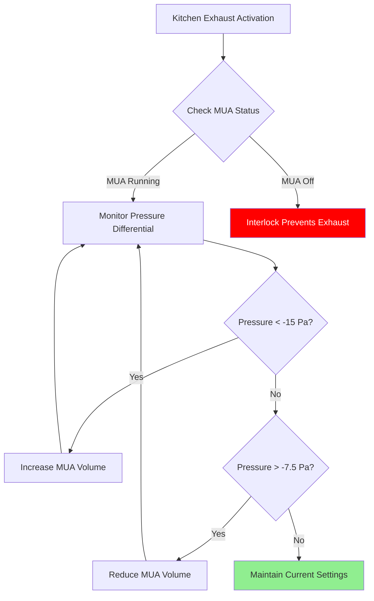

Commercial kitchens adjacent to ballrooms present critical HVAC challenges requiring precise pressure control, makeup air coordination, and contamination prevention. The physical proximity of high-temperature cooking operations to climate-controlled dining spaces demands engineered solutions that address mass flow balance, differential pressure maintenance, and thermal load management.

## Pressure Relationship Fundamentals

The cornerstone of effective kitchen-ballroom separation is establishing the correct pressure cascade. Kitchen spaces must operate at negative pressure relative to dining areas to prevent odor migration, while service corridors function as intermediate buffer zones.

**Target Pressure Differentials:**

| Zone | Pressure Relative to Ballroom | Typical Range |
|------|------------------------------|---------------|
| Ballroom Dining Area | Reference (0 Pa) | — |
| Service Corridor | -2.5 to -5 Pa | Negative |
| Kitchen Prep Area | -7.5 to -10 Pa | More negative |
| Cooking Line | -10 to -15 Pa | Most negative |

The pressure differential $\Delta P$ across a barrier is governed by airflow through openings:

$$\Delta P = \rho \left(\frac{Q}{C_d A}\right)^2 \frac{1}{2}$$

Where:
- $\rho$ = air density (kg/m³)
- $Q$ = volumetric flow rate through opening (m³/s)
- $C_d$ = discharge coefficient (typically 0.6-0.65 for doorways)
- $A$ = effective opening area (m²)

## Makeup Air Integration

Kitchen exhaust systems removing 5,000-15,000 CFM require equivalent makeup air to prevent building depressurization. ASHRAE Standard 90.1 mandates that makeup air systems meet specific efficiency requirements while avoiding uncomfortable air currents in dining areas.

**Makeup Air Delivery Methods:**

1. **Direct Hood-Mounted Supply**: Delivers 50-80% of exhaust volume directly at hood perimeter
2. **Ceiling-Based Displacement**: Provides remaining 20-50% through low-velocity ceiling diffusers
3. **Vestibule Tempering**: Pre-conditions transfer air from dining spaces

The makeup air temperature $T_{MA}$ must be calculated to avoid thermal discomfort:

$$T_{MA} = T_{kitchen} - \frac{Q_{hood}}{Q_{MA} \cdot \rho \cdot c_p}$$

During winter operation, makeup air temperatures below 50°F (10°C) create unacceptable working conditions. ASHRAE Standard 154 recommends minimum delivery temperatures of 60-65°F (15-18°C) in occupied cooking zones.

## Odor Migration Prevention

Odor molecules migrate through three mechanisms: bulk airflow, diffusion, and pressure-driven infiltration. Effective control requires addressing all pathways.

**Control Strategies:**

| Method | Effectiveness | Implementation Cost | Energy Impact |
|--------|---------------|---------------------|---------------|
| Pressure cascade | High (95-98%) | Medium | Medium-High |
| Air curtains at service doors | Medium (70-85%) | Low-Medium | Low-Medium |
| Activated carbon filtration | High (90-95%) | High | High |
| Vestibule pressurization | High (85-95%) | Medium | Medium |

**Service Door Air Curtain Sizing:**

Air curtains at kitchen service doors require sufficient velocity to prevent odor breakthrough. The minimum air velocity $V_{min}$ must exceed the pressure-driven flow velocity:

$$V_{min} = \sqrt{\frac{2\Delta P}{\rho}} \times 1.5$$

For a 10 Pa pressure difference, minimum velocity is approximately 6 m/s (1,180 FPM). Door height dictates required CFM:

$$Q_{curtain} = V \times W \times h \times 60$$

Where $W$ is curtain width (door width + 6 inches) and $h$ is discharge height (typically 6-8 inches).

## Grease Exhaust Routing Constraints

Grease-laden exhaust ducting requires specific routing to comply with IMC Section 506 and NFPA 96. Ductwork penetrating ballroom ceiling spaces introduces fire safety and maintenance access challenges.

**Duct Routing Principles:**

- **Minimum clearance**: 18 inches from combustible materials (NFPA 96)
- **Slope requirement**: 1/4 inch per foot toward hood for grease drainage
- **Access panels**: Every 12 feet and at direction changes
- **Seismic bracing**: Per ASCE 7 for ceiling-mounted runs

Vertical riser routing is preferred to minimize horizontal runs through occupied spaces. When horizontal routing is unavoidable, install within dedicated fire-rated chases with independent ventilation.

**Grease Duct Velocity Sizing:**

Maintain 1,500-2,500 FPM to prevent grease deposition. For exhaust volume $Q$ (CFM):

$$A_{duct} = \frac{Q}{V_{duct} \times 60}$$

A 10,000 CFM hood operating at 2,000 FPM requires 5 square feet of duct area (approximately 30-inch diameter round duct).

## Staging Area Ventilation Coordination

Pre-function spaces and staging corridors connecting kitchens to ballrooms require independent ventilation to prevent thermal migration and maintain odor barriers during food service transitions.

**Staging Area Requirements:**

- **Air changes**: 15-20 ACH minimum during active service
- **Temperature control**: ±2°F of ballroom setpoint
- **Pressure**: -2.5 Pa relative to ballroom, +5 Pa relative to kitchen
- **Humidity**: Match ballroom conditions (45-55% RH)

Rolling carts transferring heated food create transient thermal loads:

$$Q_{transient} = m \cdot c_p \cdot \Delta T \cdot N_{trips}$$

Where $m$ is food mass per trip, and $N_{trips}$ is service frequency. A typical banquet service moving 200 lbs of food at 165°F through a 72°F corridor every 5 minutes generates approximately 8,000 BTU/hr sensible load.

## Control System Integration

Modern kitchen-ballroom interfaces require integrated DDC control managing makeup air, exhaust flow, and pressure monitoring with fail-safe interlocks.

**Critical Control Points:**

1. **Exhaust-MUA Interlock**: Prevents exhaust operation without makeup air
2. **Pressure Monitoring**: Continuous differential pressure sensors at kitchen-corridor and corridor-ballroom interfaces
3. **Variable Speed Control**: Modulates makeup air to maintain pressure setpoints
4. **Demand-Based Exhaust**: Optical or thermal sensors reduce exhaust during idle periods
5. **Fire Safety Integration**: Hood suppression system triggers exhaust fan shutdown and damper closure

ASHRAE Standard 90.1 Section 6.5.7.2 requires kitchen exhaust systems exceeding 5,000 CFM to include automatic demand ventilation controls reducing airflow by at least 50% during idle cooking periods.

---

**Related Topics:**
- [Simultaneous Load Management](/specialty-applications-testing/specialty-hvac-applications/specialized-venue-requirements/ballrooms-banquet/simultaneous-load/)
- [Service Corridor Integration](/specialty-applications-testing/specialty-hvac-applications/specialized-venue-requirements/ballrooms-banquet/service-corridor/)
- [Grease Exhaust System Design](/commercial-kitchen-hvac/grease-exhaust-systems/)
