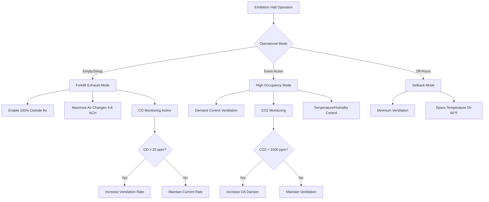

## Overview of Exhibition Hall Climate Control Challenges

Exhibition halls present exceptional HVAC design challenges due to their enormous conditioned volumes (typically 200,000 to 2,000,000 ft³), highly variable occupancy patterns, and unique operational requirements. These spaces must accommodate extreme load swings from empty hall conditions (setup/teardown) to peak occupancy events with thousands of attendees, exhibit lighting, and equipment heat loads.

The fundamental design challenge stems from the $Q = \dot{m} c_p \Delta T$ relationship applied across vastly different operational states. During setup periods, cooling loads may be as low as 0.3-0.5 W/ft² (building envelope only), while peak event loads can reach 8-12 W/ft² when combining occupant sensible heat (255 BTU/hr per person), exhibit lighting (2-4 W/ft²), audio-visual equipment, and booth displays.

## Physical Principles and Load Characteristics

### Thermal Stratification Management

Exhibition halls with ceiling heights of 25-60 ft experience significant thermal stratification due to natural convection. The buoyancy-driven flow velocity can be estimated:

$$v = \sqrt{\frac{2g\beta\Delta T H}{C_d}}$$

where:
- $g$ = gravitational acceleration (32.2 ft/s²)
- $\beta$ = thermal expansion coefficient (≈0.0055 K⁻¹ for air)
- $\Delta T$ = temperature difference between ceiling and floor
- $H$ = ceiling height
- $C_d$ = drag coefficient (typically 0.6-0.8)

Without proper air distribution, temperature gradients of 10-15°F floor-to-ceiling are common, wasting energy on conditioning unused upper volumes while occupants experience discomfort at floor level.

### Variable Occupancy Load Analysis

Exhibition hall loads vary by operational phase:

| Operational Phase | Occupancy Density | Typical Cooling Load | Ventilation Requirement |
|-------------------|-------------------|---------------------|------------------------|
| Empty/Maintenance | 0 people | 0.3-0.5 W/ft² | Minimal (envelope losses only) |
| Setup/Teardown | 0.5-2 people/1000 ft² | 1.5-3 W/ft² | 15 cfm/person + exhaust |
| Light Exhibition | 5-10 people/1000 ft² | 4-6 W/ft² | 15 cfm/person ASHRAE 62.1 |
| Peak Trade Show | 15-30 people/1000 ft² | 8-12 W/ft² | 15 cfm/person (code minimum) |

The sensible heat ratio (SHR) for exhibition halls typically ranges from 0.75-0.85, reflecting moderate latent loads from occupants and minimal moisture-generating processes.

## Forklift and Equipment Exhaust Management

During setup and teardown operations, propane and diesel-powered forklifts introduce carbon monoxide (CO), nitrogen oxides (NOₓ), and particulate matter into the space. A typical 5,000 lb capacity propane forklift produces approximately 200-400 cfm of exhaust containing 1-3% CO by volume.

### Dilution Ventilation Requirements

The required dilution ventilation rate to maintain CO below OSHA's 35 ppm 8-hour TWA:

$$Q_{req} = \frac{Q_{exhaust} \times C_{exhaust}}{C_{allowable} - C_{ambient}}$$

For multiple forklifts operating simultaneously, total ventilation rates of 15,000-50,000 cfm are often necessary during move-in/move-out periods. This represents a separate ventilation mode that must be designed into the system controls.

## Air Distribution Strategies

### Underfloor vs. Overhead Supply

Exhibition halls employ two primary air distribution approaches:

**Overhead Supply with Long Throw Diffusers:**
- Throw distance: $T = V_x / V_t$ where $V_t$ is terminal velocity (typically 50 fpm)
- Requires throw distances of 60-120 ft to reach floor level
- Supply velocities: 1,500-2,500 fpm at diffuser
- Effective for spaces without raised floors

**Underfloor Air Distribution (UFAD):**
- Supply air temperature: 60-65°F (vs. 55°F overhead)
- Displacement ventilation principles reduce mixing energy
- Utilizes thermal buoyancy for natural stratification control
- Requires raised floor systems (12-18 inches typical)

The effectiveness factor $\varepsilon$ for UFAD systems ranges from 1.0-1.2 compared to 0.8-0.9 for overhead mixing systems, providing 10-25% energy savings through reduced air distribution fan power.

## Control Strategies for Variable Loads

Exhibition halls require sophisticated control sequences addressing extreme load variability:

1. **Demand-Based Ventilation:** CO₂ sensors modulate outside air from 10% minimum to 100% during high occupancy
2. **Zone-Based Temperature Control:** VAV systems with 1 zone per 2,500-5,000 ft²
3. **Operational Mode Selection:** Manual or scheduled switching between setup, event, and setback modes
4. **Economizer Integration:** Free cooling when $T_{OA} < T_{Return} - 2°F$

The control system must accommodate rapid load changes. A typical 100,000 ft² exhibition hall transitioning from empty to occupied can experience load increases of 200-400 tons within 2-3 hours, requiring anticipatory control algorithms that pre-cool the space based on event schedules.

## Energy Recovery and Efficiency Considerations

Given the substantial ventilation requirements, energy recovery systems provide significant operational savings. Total enthalpy wheels achieve 70-80% effectiveness, recovering both sensible and latent energy. For a system handling 50,000 cfm with a 40°F temperature difference and 0.020 humidity ratio difference:

$$Q_{recovered} = \dot{m}(h_{OA} - h_{EA}) \times \varepsilon$$

Annual energy savings of 30-40% on conditioning outdoor air are achievable in most climates, with payback periods of 3-5 years for wheel-based recovery systems.

## Design Recommendations Per ASHRAE Standards

ASHRAE 90.1 Section 6.5.3 requires energy recovery for systems exceeding 70% outside air at flows above 5,000 cfm. Exhibition halls routinely exceed these thresholds. ASHRAE 62.1 specifies 7.5 cfm/ft² for assembly spaces, though actual design values depend on occupant density calculations per the ventilation rate procedure.

Key design parameters for exhibition halls:
- Design air change rate: 3-6 ACH during events
- Outside air fraction: 15-30% typical, 100% during setup operations
- Supply air temperature: 55-58°F for overhead, 60-65°F for UFAD
- Space design conditions: 72-76°F, 40-55% RH per ASHRAE 55
- Acoustic design: NC 40-45 during events, NC 35 during setup

