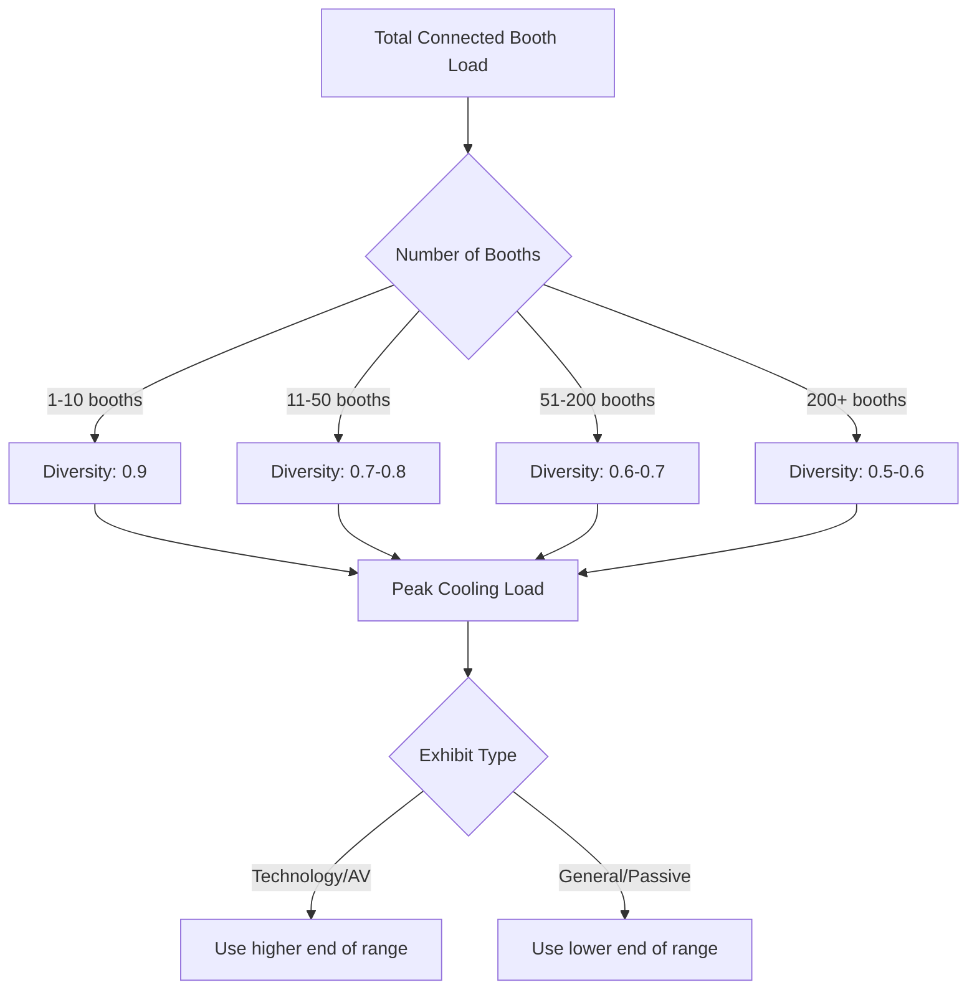
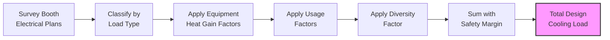

Exhibition booth heat loads represent one of the most challenging load estimation scenarios in HVAC design due to high variability, temporary installations, and concentrated heat sources. Accurate load calculations require understanding electrical power conversion to heat, diversity factors, and the physics of convective and radiative heat transfer from booth equipment.

## Booth Equipment Heat Gain Fundamentals

All electrical energy consumed within an exhibition booth ultimately converts to thermal energy within the conditioned space, governed by the first law of thermodynamics. The instantaneous heat gain from electrical equipment is:

$$Q_{equip} = P_{elec} \times 3.412 \times f_{rad} \times f_{use}$$

Where:
- $Q_{equip}$ = heat gain (Btu/hr)
- $P_{elec}$ = electrical power draw (watts)
- $3.412$ = conversion factor (Btu/hr per watt)
- $f_{rad}$ = radiative fraction (0.1-0.4 typical)
- $f_{use}$ = usage factor (0.3-1.0)

The radiative fraction determines the split between immediate convective cooling load and delayed radiative load absorbed by surfaces. High-intensity displays and halogen lighting have higher radiative fractions (0.3-0.4), while computers and LED systems are primarily convective (0.1-0.2).

## Typical Booth Power Densities

Exhibition booths vary dramatically in power consumption based on booth type and exhibit category:

| Booth Type | Power Density | Typical Load | Primary Heat Sources |
|------------|---------------|--------------|---------------------|
| Standard 10×10 | 5-15 W/ft² | 500-1,500 W | LED displays, laptops, brochure lighting |
| Technology/AV | 20-40 W/ft² | 2,000-4,000 W | Multiple monitors, servers, demo equipment |
| Automotive Display | 30-50 W/ft² | 3,000-5,000 W | High-intensity lighting, vehicle systems |
| Food Service Demo | 50-150 W/ft² | 5,000-15,000 W | Cooking equipment, refrigeration, exhaust |
| Large Interactive | 25-60 W/ft² | 10,000-25,000 W | Video walls, VR systems, gaming stations |

These densities assume full electrical load operation. Actual cooling loads require application of diversity and usage factors.

## Display and Lighting Loads

Modern exhibition lighting has shifted from incandescent and halogen to LED technology, significantly reducing heat loads:

**Incandescent/Halogen (Legacy):**
- Efficacy: 10-20 lumens/watt
- Heat conversion: 90-95% of input power
- 500W halogen → 1,706 Btu/hr heat gain

**LED Systems (Current):**
- Efficacy: 80-120 lumens/watt
- Heat conversion: 65-75% of input power (driver losses)
- 100W LED → 256 Btu/hr heat gain

The heat gain from LED fixtures includes both the LED junction heat and power supply losses:

$$Q_{LED} = P_{input} \times 3.412 \times (1 - \eta_{driver})$$

Where $\eta_{driver}$ typically ranges from 0.85-0.92 for quality LED drivers.

## Computer and Display Equipment

Computer equipment and monitors constitute the primary continuous load in technology-focused exhibitions:

| Equipment Type | Typical Power | Heat Gain (Btu/hr) | Diversity Factor |
|----------------|---------------|-------------------|------------------|
| Laptop (active) | 30-60 W | 102-205 | 0.7 |
| Desktop workstation | 100-200 W | 341-683 | 0.6 |
| 27" LCD monitor | 35-50 W | 119-171 | 0.8 |
| 55" LED display | 100-150 W | 341-512 | 0.9 |
| 85" video wall panel | 250-400 W | 853-1,365 | 1.0 |
| Server/demo rack | 800-1,500 W | 2,730-5,118 | 0.8 |

Modern computers employ dynamic power management, reducing actual power draw during periods of low activity. ASHRAE Research Project RP-1482 provides detailed measurement data for IT equipment diversity.

## Cooking Demonstration Loads

Food service demonstrations generate the highest concentrated heat loads in exhibition environments, combining sensible and latent heat from cooking processes:

$$Q_{cooking} = Q_{sensible} + Q_{latent} + Q_{radiation}$$

Typical cooking equipment heat gains:

| Equipment | Power (W) | Sensible (Btu/hr) | Latent (Btu/hr) | Usage Factor |
|-----------|-----------|-------------------|-----------------|--------------|
| Induction cooktop (2-burner) | 3,000 | 6,500 | 1,500 | 0.5 |
| Electric griddle | 3,600 | 8,200 | 2,000 | 0.6 |
| Convection oven | 5,000 | 10,500 | 3,500 | 0.4 |
| Espresso machine | 2,500 | 5,800 | 2,200 | 0.7 |

Cooking demonstrations require local exhaust ventilation, typically removing 60-80% of sensible heat and 90-95% of latent heat before it enters the conditioned space. The net cooling load becomes:

$$Q_{net} = Q_{sensible}(1-\eta_{exhaust,s}) + Q_{latent}(1-\eta_{exhaust,l})$$

## Vehicle Display Considerations

Automotive and machinery displays introduce unique thermal considerations. Stationary vehicles with operating systems generate heat from:

1. **Interior lighting:** 200-500 W per vehicle
2. **Multimedia displays:** 300-800 W for integrated screens
3. **Climate control demonstration:** 1,500-3,000 W if HVAC operates
4. **Engine block heaters (cold climate shows):** 1,000-1,500 W

Vehicle displays typically operate at 20-30% of these maximum loads, as climate systems cycle and engines remain off. The thermal mass of the vehicle body creates a lag between electrical input and space heat gain, with time constants of 30-60 minutes.

## Diversity Factors for Exhibition Halls

Diversity factors account for the statistical reality that not all booths operate at maximum electrical load simultaneously. ASHRAE applications handbook provides guidance, but exhibition-specific factors are:

The aggregate diversity factor for a large exhibition hall with mixed booth types:

$$DF_{total} = \frac{\sum Q_{actual,peak}}{\sum Q_{connected}} = 0.5 \text{ to } 0.7$$

This relationship holds because:
- Exhibitor setup/teardown reduces simultaneous operation
- Meal breaks and presentation schedules create cyclic usage
- Equipment idle modes reduce continuous power draw
- Not all booth power circuits carry design loads

## Load Calculation Methodology

The total exhibition booth cooling load calculation proceeds as:

**Step-by-step process:**

1. **Inventory connected loads:** Sum all booth electrical capacity from power distribution plans
2. **Categorize equipment:** Group by lighting, computing, AV, cooking, other
3. **Apply category factors:** Use equipment-specific conversion and radiative fractions
4. **Apply usage factors:** Account for duty cycles and operating patterns
5. **Apply diversity:** Use booth count and type-based diversity factors
6. **Add safety margin:** Include 10-15% for unforeseen loads and measurement uncertainty

For a 200-booth exhibition with average 2,000W/booth connected load:

$$Q_{design} = 200 \times 2000W \times 3.412 \times 0.65_{diversity} \times 1.15_{margin}$$
$$Q_{design} = 510,000 \text{ Btu/hr (42.5 tons)}$$

## Coordination with Temporary Power

Thermal load calculations must coordinate with electrical power distribution. The electrical demand does not equal the cooling load due to:

- Power factor differences (electrical kVA vs thermal kW)
- Losses in transformers and distribution (typically 2-4%)
- Diversity factors applied differently by electrical engineers

Verify that HVAC diversity assumptions align with electrical load calculations to prevent undersizing. Electrical demand diversity typically runs 0.6-0.7, closely matching thermal diversity for resistive loads.

## Load Variation by Exhibit Type

Different exhibition categories exhibit distinct load profiles:

**Technology shows:** High baseline loads with moderate diversity (0.65-0.75) due to continuous demonstration equipment operation.

**Consumer goods:** Low baseline loads with high diversity (0.50-0.60) as booth activity correlates with attendee traffic patterns.

**Food and beverage:** Very high peak loads with moderate diversity (0.60-0.70) as cooking demonstrations cycle throughout the day.

**Automotive:** Moderate loads with high diversity (0.50-0.65) as vehicle systems operate intermittently for demonstrations.

Understanding these patterns allows designers to size systems appropriately for the expected exhibition programming rather than using conservative worst-case assumptions that lead to oversized, inefficient systems.

---

**Reference Standards:**
- ASHRAE Handbook - HVAC Applications, Chapter 5: Places of Assembly
- ASHRAE RP-1482: Energy Consumption Characteristics of Commercial Building IT Equipment
- NFPA 70: National Electrical Code (temporary power requirements)