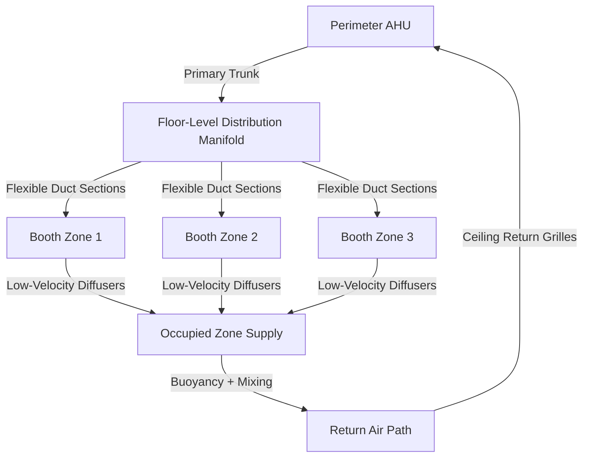
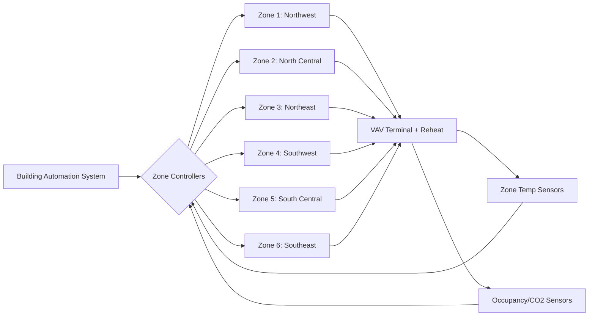

## Engineering Challenge

Exhibition halls present a unique thermal design problem: the same physical space must accommodate vastly different layouts, occupant densities, and heat loads depending on event configuration. A 100,000 ft² hall may host a sparse trade show with 50 booths one week and a dense consumer expo with 500 booths the next. The HVAC system must deliver consistent thermal comfort across all configurations without permanent ductwork constraining floor layouts.

## Thermal Load Variability

The fundamental challenge stems from the wide range of heat generation scenarios:

$$Q_{total} = Q_{occupants} + Q_{lighting} + Q_{equipment} + Q_{envelope}$$

Where each component varies by orders of magnitude:

| Load Component | Sparse Configuration | Dense Configuration | Ratio |
|----------------|---------------------|---------------------|-------|
| Occupant density | 100 ft²/person | 20 ft²/person | 5:1 |
| Sensible heat | 250 Btu/hr·person | 250 Btu/hr·person | — |
| Equipment load | 1-3 W/ft² | 8-15 W/ft² | 5:1 |
| Lighting load | 0.8-1.2 W/ft² | 2-3 W/ft² | 2.5:1 |

The total cooling load can swing from 35 Btu/hr·ft² to 95 Btu/hr·ft², requiring HVAC systems sized for peak conditions while maintaining acceptable performance at partial loads.

## High-Bay Air Distribution Strategies

Traditional ceiling-mounted diffusers in exhibition halls face two competing requirements:

1. **Throw distance**: Air must project 40-60 ft horizontally before dropping to occupied zones
2. **Temperature differential**: Supply air temperature depression ($\Delta T$) affects throw and comfort

The relationship between throw and temperature differential follows:

$$L = K \cdot \sqrt{\frac{Q}{v_{terminal}}}$$

Where:
- $L$ = throw distance (ft)
- $K$ = diffuser constant (dimensionless)
- $Q$ = airflow rate (cfm)
- $v_{terminal}$ = terminal velocity at occupied zone (fpm)

For high-bay applications (25-40 ft ceiling height), specify high-induction linear diffusers with throw ratios of 3.5-4.5. Supply air temperature should be 8-12°F below space temperature to maintain adequate throw without causing drafts at floor level.

### Stratification Management

Vertical temperature gradients in high-bay spaces follow:

$$\frac{dT}{dz} = \frac{Q_{internal}}{A \cdot \rho \cdot c_p \cdot ACH \cdot h}$$

Where:
- $dT/dz$ = temperature gradient (°F/ft)
- $A$ = floor area (ft²)
- $h$ = ceiling height (ft)
- $ACH$ = air changes per hour

Without destratification, temperature differentials of 15-25°F between floor and ceiling are common. Implement ceiling fans operating at 50-100 fpm or continuous air curtains along perimeter walls to limit gradients to 5-8°F.

## Floor-Level Supply Systems

Floor-level air distribution eliminates throw distance constraints and provides direct conditioning at occupied zones. Two primary configurations exist:

### Underfloor Air Distribution (UFAD)

Raised access flooring (12-24 inches) serves as a pressurized plenum. Supply air enters at 63-68°F and exits through floor diffusers at booth locations. Key design parameters:

- Plenum pressure: 0.05-0.15 in. w.g.
- Supply airflow: 0.8-1.2 cfm/ft²
- Diffuser spacing: 6-10 ft on center
- Discharge velocity: 50-150 fpm

Advantages:
- Reconfigurable diffuser placement
- Reduced fan energy (lower static pressure)
- Natural stratification assists cooling
- Direct ventilation to breathing zone

Challenges:
- Higher installation cost ($15-25/ft² premium)
- Plenum cleaning and maintenance access
- Cable management conflicts with airflow paths

### Floor-Mounted Duct Systems

Modular duct sections installed on finished flooring connect to perimeter air handling units. Common in retrofit applications or temporary installations.

## Modular Utility Distribution

Exhibition booths require flexible connections for:

- Electrical power (120V, 208V, 480V)
- Compressed air (90-125 psi)
- Data/telecommunications
- Chilled water (for large exhibit cooling loads)

### Temporary HVAC Connections

For exhibits with concentrated heat loads (demonstration equipment, server racks, cooking demonstrations), provide quick-connect utilities at grid locations:

**Floor service boxes** (typical spacing: 20 ft × 20 ft grid)
- 480V/3-phase power: 60-100A capacity
- Chilled water supply/return: 1-2 inch connections
- Compressed air: 3/4 inch quick-disconnect
- Communication/data: CAT6 or fiber terminations

**Booth-level conditioning units**
Portable or semi-permanent units serving individual exhibits:

$$Q_{booth} = 1.08 \cdot CFM \cdot \Delta T + 0.68 \cdot CFM \cdot \Delta W \cdot h_{fg}$$

Size units for 400-1200 cfm based on booth dimensions (10×10 ft to 20×30 ft). Use water-source heat pumps connected to building chilled/condenser water loops for maximum flexibility.

## Zoning and Control Architecture

Divide exhibition floor into 2,000-5,000 ft² zones, each with independent temperature control. Zone boundaries should align with structural bays and utility grid.

### Control Sequence for Variable Density

ASHRAE Standard 62.1 requires ventilation based on occupancy, but exhibition spaces lack fixed occupancy schedules. Implement demand-controlled ventilation using:

1. **CO₂-based occupancy estimation**: 1 person ≈ 0.3 cfm rise per 100 ppm above ambient
2. **Multiple sensor averaging**: 1 sensor per 2,500 ft² minimum
3. **Gradual setpoint adjustment**: 15-minute moving average to prevent hunting

Minimum outdoor air fraction:

$$Y = \frac{V_{ot}}{V_{ot} + V_{recirc}} = \frac{R_p \cdot P_z + R_a \cdot A_z}{CFM_{supply}}$$

Where ASHRAE 62.1 specifies $R_p$ = 5 cfm/person and $R_a$ = 0.06 cfm/ft² for exhibition spaces.

## Equipment Staging and Capacity Modulation

Match supply capacity to load variation through:

**Multiple smaller air handlers** rather than single large units:
- (4) 30-ton units instead of (1) 120-ton unit
- Enables 25% capacity increments
- Redundancy during maintenance

**Variable speed drives on all fans**:
- Fan power: $P \propto (CFM)^3$
- 50% airflow reduction = 87.5% energy savings
- Minimum speed: 30-40% of design to maintain adequate mixing

**Economizer operation**:
Exhibition halls benefit significantly from free cooling due to high internal loads and large outdoor air requirements per ASHRAE 62.1.

## Design Checklist

- Size HVAC for peak occupancy configuration (per fire code maximum)
- Provide utility grid at 20 ft × 20 ft or 30 ft × 30 ft spacing
- Specify high-throw diffusers (throw ratio > 3.5) for ceiling heights above 20 ft
- Include destratification fans for ceiling heights above 25 ft
- Design raised floor plenum for 0.10 in. w.g. or less
- Provide isolation valves for booth-level chilled water at each service box
- Install CO₂ sensors: 1 per 2,500 ft² minimum
- Configure BAS for zone-level scheduling independent of building operation
- Ensure minimum 30% turndown on all air handling equipment
- Specify quick-disconnect fittings compatible with common rental equipment

## References

- ASHRAE Standard 62.1-2022: Ventilation for Acceptable Indoor Air Quality
- ASHRAE Handbook—HVAC Applications, Chapter 5: Places of Assembly
- ASHRAE RP-1515: Thermal Environmental Conditions for Human Occupancy