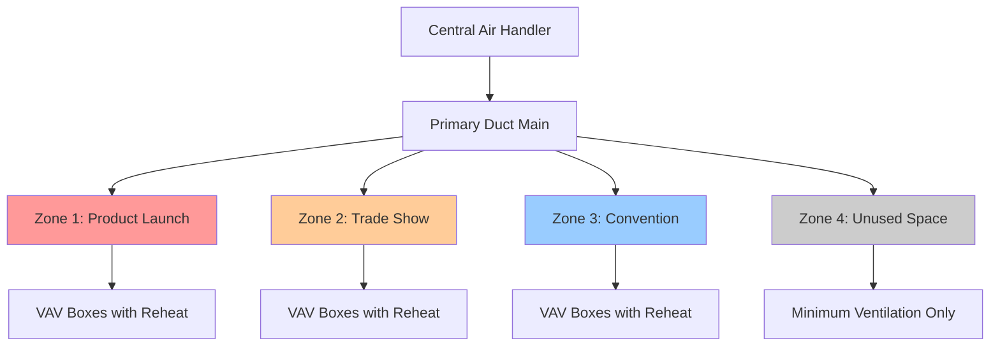
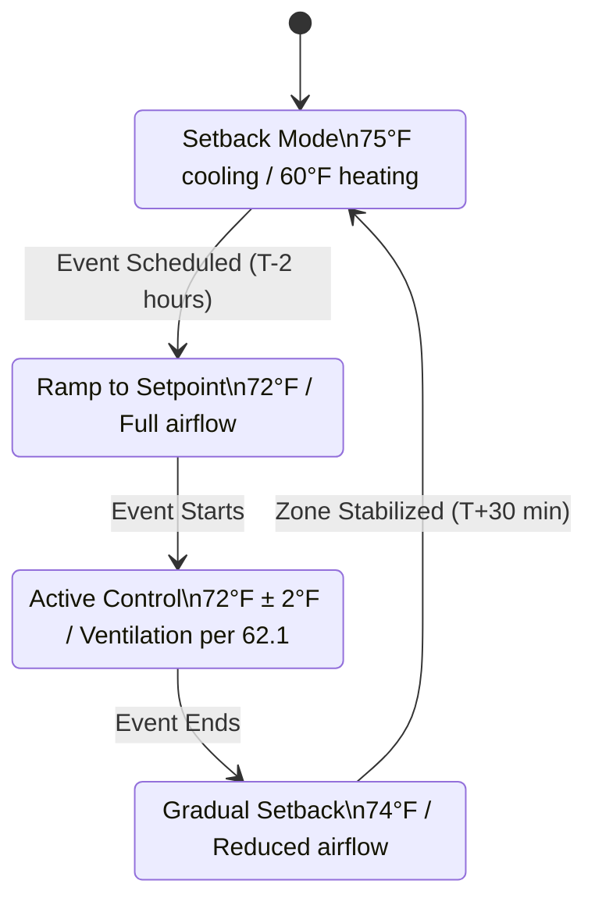

## Fundamental Zoning Principles for Exhibition Halls

Exhibition halls present unique HVAC challenges due to variable occupancy densities, simultaneous events with different thermal requirements, and rapidly changing heat loads. Zoned systems partition large spaces into independently controlled thermal regions, enabling energy-efficient operation while maintaining comfort across diverse activities occurring concurrently.

The fundamental heat transfer equation for a single zone is:

$$Q_{zone} = Q_{sensible} + Q_{latent} = \dot{m} \cdot c_p \cdot (T_{supply} - T_{zone}) + \dot{m} \cdot h_{fg} \cdot (\omega_{supply} - \omega_{zone})$$

Where $\dot{m}$ represents airflow rate, $c_p$ is specific heat, $T$ is temperature, $h_{fg}$ is latent heat of vaporization, and $\omega$ is humidity ratio. Each zone maintains independent setpoints by modulating supply air parameters.

## Multi-Zone Air Handler Architecture

Large exhibition facilities typically employ dedicated air handlers serving multiple zones through separate ductwork branches. This configuration provides:

**System Design Advantages:**
- Independent temperature control for simultaneous events
- Load diversity exploitation (diversity factor typically 0.6-0.8)
- Selective operation of inactive zones
- Fault isolation preventing total system failure

**Airflow Distribution Strategy:**

The total system capacity follows the diversity principle:

$$Q_{total} \neq \sum_{i=1}^{n} Q_{zone,i}$$

Instead, the actual required capacity is:

$$Q_{total} = DF \cdot \sum_{i=1}^{n} Q_{zone,peak,i}$$

Where $DF$ is the diversity factor (0.6-0.8 for exhibition halls per ASHRAE Fundamentals Chapter 18).

## VAV Systems with Zone Reheat

Variable Air Volume (VAV) systems with terminal reheat offer optimal zoning flexibility for exhibition spaces. The VAV damper modulates airflow in response to zone temperature while reheat coils provide heating when cooling airflow falls below minimum ventilation requirements.

**Operational Sequence:**

1. **Cooling Mode:** VAV damper opens to increase cold air supply
2. **Transition:** Damper reaches minimum position (typically 30-40% for ventilation)
3. **Heating Mode:** Reheat coil activates while maintaining minimum airflow

The energy balance for a VAV terminal with reheat is:

$$Q_{terminal} = \dot{m}_{min} \cdot c_p \cdot (T_{supply} - T_{zone}) + Q_{reheat}$$

Where $\dot{m}_{min}$ satisfies ASHRAE 62.1 ventilation requirements:

$$\dot{m}_{min} = V_{oz} = R_p \cdot P_z + R_a \cdot A_z$$

With $R_p$ as per-person ventilation rate (5-7.5 cfm/person for assembly spaces), $P_z$ as zone population, $R_a$ as area ventilation rate (0.06 cfm/ft²), and $A_z$ as zone area.

| Zone Condition | VAV Damper Position | Reheat Coil Output | Energy Efficiency |
|----------------|---------------------|-------------------|-------------------|
| High Load (crowded event) | 100% open | 0% | Optimal |
| Medium Load | 50-70% open | 0% | Good |
| Low Load (sparse attendance) | Minimum (30-40%) | 0-50% | Moderate |
| Heating Required | Minimum (30-40%) | 50-100% | Lower (simultaneous heat/cool) |

## Modular Cooling Approach

Modular cooling systems for exhibition halls utilize multiple smaller-capacity units rather than single large systems. This approach provides:

**Capacity Staging Benefits:**
- Partial load operation at higher efficiency
- Redundancy during equipment failure
- Phased installation matching facility expansion
- Improved part-load performance

The coefficient of performance (COP) for modular systems operating at partial load typically exceeds single large systems:

$$COP_{modular} = \frac{Q_{cooling}}{W_{compressor}} \times \left(1 + k \cdot \left(1 - \frac{Q_{actual}}{Q_{design}}\right)\right)$$

Where $k$ is a system-specific constant (0.2-0.4) representing efficiency gain at part load. ASHRAE 90.1 requires integrated part-load value (IPLV) calculations accounting for operation at 25%, 50%, 75%, and 100% capacity.

## Zone-by-Zone Scheduling and Control

Exhibition halls frequently host simultaneous events requiring independent environmental control. Zone-by-zone scheduling minimizes energy consumption while maintaining comfort.

**Scheduling Control Logic:**

The precool/preheat energy requirement follows:

$$E_{precool} = \frac{m \cdot c_p \cdot \Delta T}{\eta_{system} \cdot t_{ramp}}$$

Where $m$ is the zone thermal mass, $\Delta T$ is temperature change, $\eta_{system}$ is system efficiency, and $t_{ramp}$ is ramp time (typically 1-2 hours for exhibition zones).

## Simultaneous Event Management

Managing multiple simultaneous events with differing thermal requirements demands sophisticated control algorithms. The Building Automation System (BAS) coordinates zone interactions to prevent negative pressure differentials and maintain proper ventilation.

**Inter-Zone Pressure Relationships:**

For adjacent zones with different supply flows, the pressure differential is:

$$\Delta P = \frac{\rho \cdot v^2}{2} \cdot \left[\left(\frac{\dot{V}_1}{A_1}\right)^2 - \left(\frac{\dot{V}_2}{A_2}\right)^2\right]$$

ASHRAE 62.1 requires maintaining pressure differentials below 0.02 in. w.c. between exhibition zones to prevent air migration.

**Comparison of Zoning Strategies:**

| Strategy | Capital Cost | Operating Cost | Flexibility | Maintenance | Best Application |
|----------|--------------|----------------|-------------|-------------|------------------|
| Single-Zone System | Low | High | Low | Simple | Small halls (<10,000 ft²) |
| Multi-Zone Air Handler | Medium | Medium | Medium | Moderate | Medium halls (10,000-50,000 ft²) |
| VAV with Zone Reheat | High | Low-Medium | High | Complex | Large halls (>50,000 ft²) |
| Modular Distributed | Highest | Low | Highest | Modular | Premium facilities, retrofit |

## Load Diversity and Energy Management Zones

Exhibition halls benefit significantly from load diversity. When multiple zones operate simultaneously, peak loads rarely coincide. ASHRAE Application Handbook recommends applying diversity factors based on zone count and event correlation.

The effective system capacity considering diversity is:

$$Q_{effective} = Q_{largest} + DF \cdot \sum_{i=2}^{n} Q_{zone,i}$$

Where $Q_{largest}$ is the single largest zone load and $DF$ ranges from 0.5-0.8 depending on event independence.

Energy management zones aggregate similar-use areas for optimized control:
- **Perimeter zones:** High solar/envelope loads, 15-20 ft depth
- **Interior zones:** Occupancy-dominated loads, minimum 400-500 ft² per zone
- **Special zones:** Kitchens, storage, loading docks with unique requirements

ASHRAE 90.1 mandates separate zones for spaces exceeding 2,500 ft² with requirements differing from adjacent spaces by more than 10°F or 20% airflow.

## Implementation Considerations

Successful zoned system implementation requires:

1. **Load Calculation Precision:** Block load calculations per ASHRAE Handbook Fundamentals with safety factors limited to 10-15%
2. **Sensor Placement:** Temperature sensors at 5 ft height, away from supply diffusers and heat sources
3. **Commissioning:** Airflow verification at minimum and maximum positions, reheat sequencing validation
4. **Control Tuning:** PID loop optimization for stable operation without hunting

The properly designed zoned system reduces energy consumption by 25-40% compared to constant volume approaches while improving occupant comfort through localized control tailored to actual exhibition hall usage patterns.
