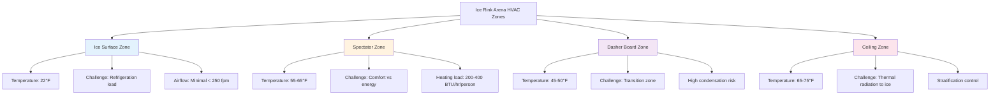

Ice rink and arena HVAC systems represent one of the most challenging climate control applications, requiring precise coordination between ice surface refrigeration, aggressive dehumidification, and spectator comfort. The fundamental challenge lies in maintaining ice temperatures between 16°F and 24°F while providing acceptable thermal conditions for occupants at 50°F to 65°F, all within an envelope prone to severe condensation issues.

## Ice Sheet Heat Load Fundamentals

The refrigeration system must remove heat continuously from the ice sheet to maintain surface temperature. Total heat load consists of conduction through the slab, radiation from ceiling and lighting, convection from air, and latent heat from resurfacing operations.

**Conduction Load Through Slab:**

$$Q_{cond} = \frac{A \cdot k \cdot (T_{ground} - T_{ice})}{L}$$

Where:
- $A$ = ice sheet area (ft²)
- $k$ = soil thermal conductivity (BTU/hr·ft·°F)
- $T_{ground}$ = ground temperature (°F)
- $T_{ice}$ = ice surface temperature (°F)
- $L$ = insulation thickness (ft)

**Radiation Load from Ceiling:**

$$Q_{rad} = A \cdot \varepsilon \cdot \sigma \cdot (T_{ceiling}^4 - T_{ice}^4)$$

Where:
- $\varepsilon$ = emissivity of ice surface (0.95-0.98)
- $\sigma$ = Stefan-Boltzmann constant (0.1714×10⁻⁸ BTU/hr·ft²·R⁴)
- Temperatures in Rankine (°F + 459.67)

**Convection Load:**

$$Q_{conv} = h \cdot A \cdot (T_{air} - T_{ice})$$

Where:
- $h$ = convection coefficient (0.5-2.0 BTU/hr·ft²·°F, depending on air velocity)
- $T_{air}$ = air temperature above ice (°F)

**Total Refrigeration Capacity:**

$$Q_{total} = Q_{cond} + Q_{rad} + Q_{conv} + Q_{lights} + Q_{resurfacing} + Q_{misc}$$

For a standard NHL hockey rink (200 ft × 85 ft = 17,000 ft²), total refrigeration loads typically range from 300 to 450 tons, with design ice surface temperature of 22°F and arena air temperature of 55°F.

## Ice Rink Type Requirements

Different ice activities require specific ice hardness, temperature, and environmental conditions.

| Rink Type | Ice Surface Temp | Ice Hardness | Arena Air Temp | Relative Humidity | Air Velocity Over Ice |
|-----------|-----------------|--------------|----------------|-------------------|---------------------|
| Hockey | 20-22°F | Hard | 55-60°F | 40-50% | < 300 fpm |
| Figure Skating | 24-26°F | Medium-soft | 58-63°F | 40-50% | < 200 fpm |
| Curling | 21-22°F | Medium | 45-50°F | 40-45% | < 150 fpm |
| Speed Skating | 16-18°F | Very hard | 50-55°F | 35-45% | < 250 fpm |
| Multi-use | 22-24°F | Medium | 55-60°F | 40-50% | < 250 fpm |

## Dehumidification Strategy

Moisture control represents the critical HVAC challenge. Warm, humid air contacting cold surfaces causes condensation on the ice, ceiling structure, and building envelope. Ice surface fog occurs when air dewpoint exceeds ice temperature.

**Dewpoint Control Equation:**

The maximum allowable dewpoint to prevent ice fog:

$$T_{dp,max} = T_{ice} + 2°F$$

For 22°F ice, maintain dewpoint below 24°F, requiring air at approximately 55°F and 40% RH.

**Required Dehumidification Capacity:**

$$\dot{m}_{moisture} = \frac{Q_{latent}}{h_{fg}}$$

Where:
- $Q_{latent}$ = latent load (BTU/hr)
- $h_{fg}$ = enthalpy of vaporization (1060 BTU/lb at typical conditions)

Typical arena dehumidification systems remove 1,000 to 3,000 pounds of moisture per day. Desiccant dehumidification systems often outperform conventional cooling-based systems in this application due to low temperature requirements.

## Thermal Zone Management

Ice arenas contain distinct thermal zones requiring different treatment strategies.

## Air Distribution Design

Conventional overhead supply systems create excessive air movement across the ice surface, increasing refrigeration load. Preferred strategies include:

1. **Displacement ventilation**: Low-velocity air introduced at spectator seating level, rising naturally
2. **Perimeter supply**: Horizontal discharge along boards, above spectator heads
3. **Radiant heating panels**: In spectator areas to provide comfort without air motion
4. **Destratification fans**: Low-speed ceiling fans to reduce thermal stratification (controversial due to ice load impact)

**Air Change Requirements:**
- Spectator areas: 6-8 air changes per hour minimum
- Ice surface zone: 1-2 air changes per hour maximum
- Total building ventilation: Per IMC occupancy requirements (typically 15 CFM/person)

## Spectator Comfort Balance

The thermal comfort challenge involves maintaining acceptable conditions for sedentary spectators in a cold environment. Mean radiant temperature (MRT) significantly impacts comfort.

$$MRT = \frac{T_{ceiling} + T_{walls} + T_{ice} + T_{equipment}}{4}$$

Even with 60°F air temperature, spectators experience discomfort if MRT drops below 50°F due to radiant heat loss to the ice surface. Mitigation strategies include:

- Radiant heating panels in seating areas (surface temperature 100-120°F)
- Insulated seat backs to reduce body heat loss
- Higher air temperature in upper seating areas (65-68°F vs 55-58°F at ice level)
- Vestibules and air curtains at entrances to reduce infiltration

## ASHRAE Guidelines Reference

ASHRAE Refrigeration Handbook (Chapter 44: Ice Rinks) provides comprehensive design guidance including:

- Refrigerant piping layout and flow rates
- Brine system design (calcium chloride, ethylene glycol)
- Secondary coolant selection and freeze protection
- Concrete slab thermal analysis and insulation requirements
- Heat recovery from refrigeration systems for building heating

Standard refrigeration system capacity provides 30-40 tons per 1,000 ft² of ice surface for initial pulldown, with 20-25 tons per 1,000 ft² for steady-state operation.

## Critical Design Considerations

**Vapor Retarder Placement**: Continuous vapor barrier on warm side of all building envelope insulation prevents interstitial condensation. Failures result in insulation degradation and structural damage.

**Ice Slab Insulation**: Minimum R-10 perimeter insulation extending 10 feet beyond ice edge, with R-20 recommended for energy efficiency. Under-slab insulation must resist moisture and loading.

**Lighting Heat Load**: LED lighting reduces heat load by 60-70% compared to metal halide, decreasing from 3-5 watts/ft² to 1-2 watts/ft². This translates to 50-70 ton refrigeration load reduction for a standard rink.

**Refrigeration Heat Recovery**: Condenser heat rejection (400-600 tons for typical facility) provides economical heating for spectator areas, lobbies, and domestic hot water. Recovery efficiency of 30-50% common.

Ice rink HVAC system success depends on integrated design addressing refrigeration, dehumidification, and comfort heating as interconnected systems rather than isolated components. Proper commissioning and operator training ensure systems maintain design parameters throughout variable occupancy and event schedules.
