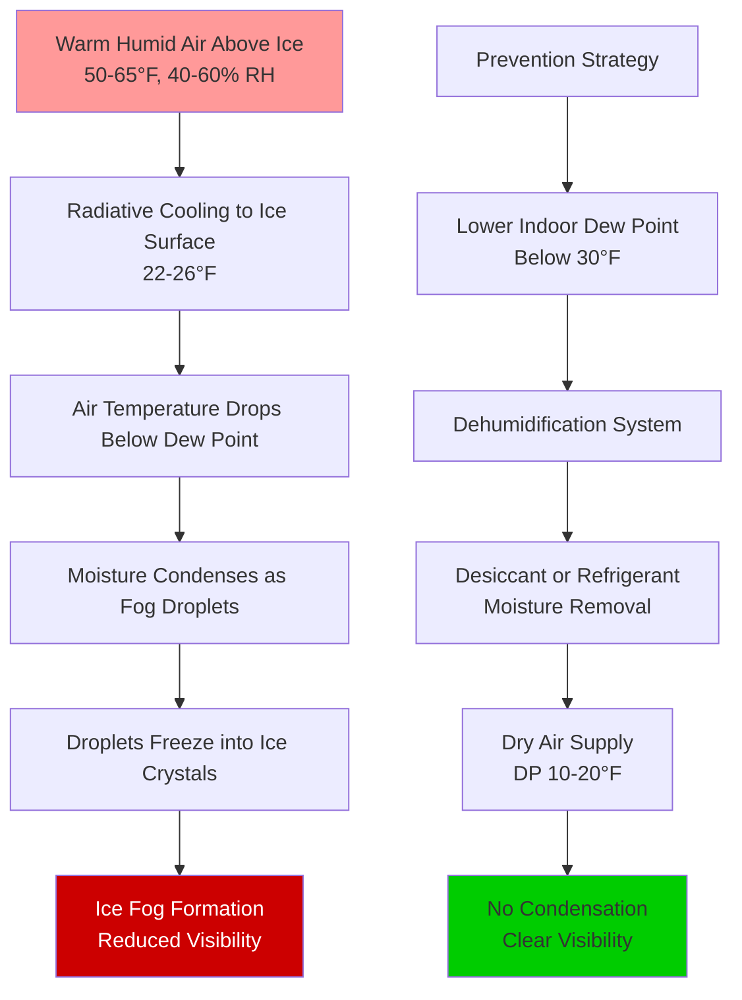

Ice rinks present unique dehumidification challenges due to the extreme temperature differential between the ice surface (typically 22-26°F) and the indoor air (50-65°F). Without proper moisture control, condensation occurs on the ice surface, ceiling structure, and building envelope, leading to ice fog formation, structural deterioration, and compromised visibility.

## Physical Principles of Ice Rink Moisture Control

The fundamental challenge stems from the psychrometric behavior of air near subfreezing surfaces. When humid air contacts the ice surface or enters the thermal plume above it, moisture condenses and freezes, creating ice fog that obscures visibility and degrades ice quality.

The latent load from spectators, ice resurfacing, and infiltration must be continuously removed. For a typical arena, the moisture generation rate is:

$$\dot{m}_{moisture} = N_{occupants} \cdot g_{latent} + A_{ice} \cdot q_{sublimation} + Q_{infiltration} \cdot \Delta \omega$$

Where:
- $N_{occupants}$ = number of occupants
- $g_{latent}$ = 200-300 g/hr per person (activity dependent)
- $A_{ice}$ = ice surface area (ft² or m²)
- $q_{sublimation}$ = sublimation rate from ice surface (0.5-1.5 lb/hr per 1000 ft²)
- $Q_{infiltration}$ = infiltration airflow rate (cfm or L/s)
- $\Delta \omega$ = humidity ratio difference (lb moisture/lb dry air)

ASHRAE recommends maintaining indoor dew point below 25-30°F to prevent condensation on the ice surface. This requires removing approximately 0.15-0.25 pounds of moisture per person-hour for spectators, plus sublimation and infiltration loads.

## Ice Fog Formation Mechanism

Ice fog forms through a radiative and convective heat transfer process between warm, humid air and the ice surface.

The critical parameter is maintaining the indoor air dew point sufficiently below the ice surface temperature. The required dew point depression depends on air velocity over the ice, radiant heat gains, and ceiling height.

## Dehumidification System Comparison

| Parameter | Desiccant Dehumidification | Refrigerant Dehumidification | Combined System |
|-----------|---------------------------|------------------------------|-----------------|
| Dew Point Capability | -20°F to +20°F | +35°F to +50°F | -10°F to +20°F |
| Energy Consumption | High (regeneration heat) | Moderate | Moderate-High |
| Capital Cost | High | Moderate | Highest |
| Maintenance | Filter + desiccant replacement | Refrigerant circuit service | Both systems |
| Low Load Performance | Excellent | Poor below 40°F DP | Good |
| Typical Application | Competition arenas | Practice rinks, mild climates | Large multi-use facilities |
| Moisture Removal Rate | 50-300 lb/hr | 30-150 lb/hr | 100-400 lb/hr |
| Reactivation Energy | 1200-1800 Btu/lb H₂O | 1100-1400 Btu/lb H₂O | 1100-1600 Btu/lb H₂O |

## Desiccant Dehumidification for Ice Rinks

Desiccant systems use hygroscopic materials (silica gel, molecular sieve, or lithium chloride) to adsorb moisture from the air through a rotating wheel or fixed bed design. The desiccant is regenerated using heat (gas-fired, electric, or recovered heat from refrigeration).

For ice rinks requiring dew points below 30°F, desiccant dehumidifiers are the standard solution. The moisture removal capacity is calculated as:

$$q_{dehumid} = \dot{m}_{air} \cdot (\omega_{inlet} - \omega_{outlet})$$

Where:
- $q_{dehumid}$ = moisture removal rate (lb/hr)
- $\dot{m}_{air}$ = process air mass flow rate (lb/hr)
- $\omega_{inlet}$ = inlet humidity ratio (lb/lb)
- $\omega_{outlet}$ = outlet humidity ratio (lb/lb)

ASHRAE Application Handbook recommends sizing desiccant systems for 150-200% of calculated peak latent load to provide rapid moisture pulldown after doors open or ice resurfacing events.

## Refrigerant Dehumidification Limitations

Standard refrigerant-based dehumidification cools air below its dew point to condense moisture. However, coil surface temperatures must remain above 32°F to prevent ice formation on the coil. This limits achievable dew points to approximately 35-40°F.

The condensation rate on a refrigerant coil is:

$$\dot{m}_{condensate} = \dot{V} \cdot \rho_{air} \cdot (\omega_{db,in} - \omega_{sat,coil})$$

Where:
- $\dot{V}$ = volumetric airflow rate (cfm)
- $\rho_{air}$ = air density (lb/ft³)
- $\omega_{db,in}$ = entering air humidity ratio
- $\omega_{sat,coil}$ = saturation humidity ratio at coil surface temperature

Refrigerant systems are applicable only in mild climates or practice facilities where moderate dew point control (35-45°F) suffices.

## Ceiling Condensation Prevention

The ceiling structure in ice rinks is particularly vulnerable to condensation because it forms the warm side of the building envelope. Inadequate vapor barriers or thermal bridges allow moisture migration into insulation, where it condenses and freezes.

The vapor pressure differential drives moisture migration:

$$\dot{m}_{vapor} = P_{vapor} \cdot \frac{A_{ceiling}}{\mu \cdot t_{insulation}} \cdot (p_{indoor} - p_{cold})$$

Where:
- $P_{vapor}$ = vapor permeability of materials
- $A_{ceiling}$ = ceiling area
- $\mu$ = vapor resistance factor
- $t_{insulation}$ = insulation thickness
- $p_{indoor}, p_{cold}$ = vapor pressures

ASHRAE Standard 160 requires maintaining indoor relative humidity below 60% and installing continuous vapor retarders (perm rating < 0.1) on the warm side of insulation to prevent condensation.

## System Design Considerations

Effective ice rink dehumidification systems incorporate:

- **Dedicated outdoor air systems (DOAS)** to decouple ventilation from space conditioning
- **Displacement ventilation** supplying dry air at ice level to displace humid plume
- **Heat recovery** between exhaust air and outdoor air to reduce energy consumption
- **Variable capacity control** to match fluctuating moisture loads from occupancy and doors
- **Ceiling-mounted destratification fans** to prevent warm, humid air accumulation at the ceiling

The total system energy consumption for dehumidification typically ranges from 15-30% of total ice rink HVAC energy use, making efficiency optimization critical.

## ASHRAE Design Guidelines

ASHRAE Applications Handbook, Chapter 43 (Refrigerated Facilities) provides specific guidance for ice rink dehumidification:

- Maintain indoor dew point at least 5-8°F below ice surface temperature
- Size dehumidification for peak latent loads plus 50% safety factor
- Provide rapid moisture removal capability (180-240 lb/hr per 17,000 ft² rink)
- Install continuous vapor barriers with perm rating < 0.1 perm
- Monitor and control indoor dew point as primary control parameter
- Design for seasonal outdoor air enthalpy variations affecting latent loads

Properly designed dehumidification systems eliminate ice fog, reduce structural condensation, minimize refrigeration load increases from frost buildup, and provide comfortable conditions for spectators and athletes.
