Ice surface quality control represents one of the most demanding applications in HVAC engineering, requiring precise management of temperature, humidity, and radiant heat loads to maintain optimal ice conditions. The ice sheet must remain at specific temperatures while the space above operates at comfortable conditions for spectators, creating significant thermal gradients and moisture migration challenges.

## Ice Temperature Requirements by Sport

Ice temperature directly affects hardness, friction characteristics, and performance quality. Different sports require distinct ice conditions based on blade contact dynamics and speed requirements.

| Sport | Ice Surface Temperature | Ice Hardness | Primary Requirement |
|-------|------------------------|--------------|---------------------|
| Hockey | 22-24°F (-5.6 to -4.4°C) | Hard | High speed, minimal snow buildup |
| Figure Skating | 26-28°F (-3.3 to -2.2°C) | Softer | Edge grip for jumps and spins |
| Curling | 23-25°F (-5.0 to -3.9°C) | Medium-hard | Consistent curl, pebble retention |
| Speed Skating | 18-21°F (-7.8 to -6.1°C) | Very hard | Maximum speed, minimal friction |

The refrigeration system maintains these temperatures through a network of brine or glycol pipes embedded in a concrete slab. Surface temperature uniformity within ±1°F across the entire sheet is critical for consistent performance.

## Refrigeration Capacity Calculations

Total refrigeration load comprises multiple heat sources that continuously transfer energy to the ice surface. The required capacity is calculated as:

$$Q_{total} = Q_{radiant} + Q_{convection} + Q_{lighting} + Q_{envelope} + Q_{ventilation} + Q_{resurfacing}$$

where each component is expressed in BTU/hr or kW.

### Radiant Heat Load

Radiant heat from warm building surfaces, spectators, and lighting represents the dominant load component. The net radiant exchange is:

$$Q_{radiant} = \varepsilon \sigma A (T_{ceiling}^4 - T_{ice}^4) F$$

where:
- $\varepsilon$ = effective emissivity (0.85-0.95 for typical surfaces)
- $\sigma$ = Stefan-Boltzmann constant (5.67 × 10⁻⁸ W/m²·K⁴)
- $A$ = ice surface area (ft² or m²)
- $T_{ceiling}$, $T_{ice}$ = absolute temperatures (K or °R)
- $F$ = view factor (typically 0.7-0.9)

For a typical hockey rink (200 ft × 85 ft = 17,000 ft²) with ceiling temperature of 65°F (524°R) and ice at 24°F (484°R), the radiant load approaches 400,000-500,000 BTU/hr.

### Humidity Impact on Ice Quality

Moisture migration from warm, humid air to the cold ice surface creates fog, frost formation, and ice surface degradation. The mass transfer rate follows:

$$\dot{m}_{condensation} = h_m A (W_{air} - W_{surface})$$

where:
- $h_m$ = mass transfer coefficient (ft/hr)
- $W$ = humidity ratio (lb moisture/lb dry air)

Each pound of moisture condensing on the ice releases 1,060 BTU of latent heat, adding directly to refrigeration load. At 50°F dewpoint air conditions over 24°F ice, condensation rates can exceed 50 lb/hr, contributing 50,000+ BTU/hr to the cooling requirement.

ASHRAE recommends maintaining arena air conditions at 50-55°F with 40-50% relative humidity to minimize condensation while providing reasonable spectator comfort. Dehumidification systems must remove 200-400 lb/hr of moisture in occupied arenas.

## Factors Affecting Ice Surface Quality

```mermaid
graph TD
    A[Ice Surface Quality] --> B[Thermal Loads]
    A --> C[Moisture Control]
    A --> D[Refrigeration System]
    A --> E[Operational Factors]

    B --> B1[Radiant Heat from Ceiling]
    B --> B2[Lighting Heat Gain]
    B --> B3[Building Envelope Loads]
    B --> B4[Ventilation Air Loads]

    C --> C1[Arena Air Dewpoint]
    C --> C2[Fog Formation]
    C --> C3[Frost Buildup]
    C --> C4[Dehumidification Capacity]

    D --> D1[Brine/Glycol Temperature]
    D --> D2[Flow Rate Distribution]
    D --> D3[System Capacity]
    D --> D4[Temperature Uniformity]

    E --> E1[Resurfacing Frequency]
    E --> E2[Water Temperature]
    E --> E3[Occupancy Patterns]
    E --> E4[Activity Level]
```

## Resurfacing Thermal Impact

Ice resurfacing with a Zamboni or similar machine adds hot water (140-180°F) to the surface, creating a temporary thermal shock that must be absorbed by the refrigeration system. The heat load from resurfacing is:

$$Q_{resurface} = \dot{m}_{water} c_p (T_{water} - T_{ice}) + \dot{m}_{water} h_{fg}$$

where:
- $\dot{m}_{water}$ = water application rate (150-250 gal per resurface)
- $c_p$ = specific heat of water (1.0 BTU/lb·°F)
- $h_{fg}$ = latent heat of fusion (144 BTU/lb)

A typical resurface applying 200 gallons (1,670 lb) of 160°F water to 24°F ice imposes:

$$Q = 1,670 \times 1.0 \times (160-24) + 1,670 \times 144 = 227,120 + 240,480 = 467,600 \text{ BTU}$$

This energy must be removed over 30-60 minutes, representing a transient load of 450,000-950,000 BTU/hr during recovery.

## Lighting Heat Gain

Modern LED lighting systems reduce heat gain compared to legacy metal halide fixtures, but still contribute significant radiant loads. For competition lighting at 75-100 footcandles:

$$Q_{lighting} = P_{installed} \times 3.412 \times F_{radiant}$$

where:
- $P_{installed}$ = installed lighting power (kW)
- $F_{radiant}$ = fraction reaching ice surface (0.4-0.6)

A 150 kW LED system delivers approximately 200,000-300,000 BTU/hr to the ice surface through direct and reflected radiation.

## Design Recommendations

**Refrigeration System Sizing:**
- Base load capacity: 150-200 BTU/hr per ft² of ice surface
- Peak capacity with resurfacing: 250-300 BTU/hr per ft²
- Brine/glycol supply temperature: 12-16°F
- Temperature differential: 6-8°F across ice slab

**Dehumidification Requirements:**
- Design dewpoint: 35-40°F maximum
- Capacity: 15-25 lb/hr per 1,000 ft² of ice
- Integration with refrigeration system heat recovery

**Control Strategy:**
- Ice surface temperature sensors (minimum 9 points)
- Brine temperature and flow modulation
- Arena air temperature and humidity interlocks
- Predictive control for scheduled resurfacing events

## ASHRAE Design Guidance

ASHRAE Handbook—Refrigeration Chapter 44 (Ice Rinks) provides comprehensive design criteria for ice rink refrigeration systems, including:

- Load calculation methodologies for all heat gain components
- Piping layouts and header configurations for temperature uniformity
- Refrigerant selection and system design for secondary coolant systems
- Control sequences for varying ice temperatures between events

ASHRAE design conditions specify maintaining ice surface temperature uniformity within ±1°F and minimizing thermal cycling to preserve ice quality throughout operating periods. Proper system sizing must account for both steady-state loads during events and transient peak loads during resurfacing cycles.

The thermal interaction between the cold ice surface and warm, humid arena environment creates unique challenges requiring integrated design of refrigeration, dehumidification, and ventilation systems to achieve optimal ice quality while maintaining acceptable spectator comfort conditions.
