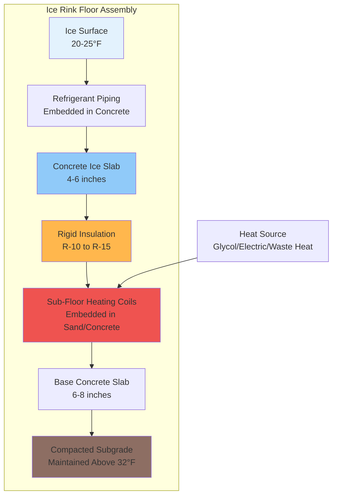

## Overview

Sub-floor heating systems installed beneath ice rink concrete slabs prevent frost penetration into underlying soil, eliminating frost heave damage and maintaining structural integrity. The heating system maintains the soil-concrete interface above freezing while the ice surface operates at 20-25°F, creating a controlled thermal gradient through the assembly.

Without sub-floor heating, continuous heat extraction through the refrigerated ice slab drives freezing temperatures deep into foundation soils. Frost-susceptible soils undergo volumetric expansion during freezing, generating heave pressures exceeding 50,000 psf that buckle concrete slabs and damage refrigeration piping networks.

## Thermal Requirements

### Frost Penetration Depth

Maximum frost depth without heating follows the modified Berggren equation:

$$Z_f = \sqrt{\frac{48 \cdot k \cdot F}{\pi \cdot L \cdot \rho}}$$

Where:
- $Z_f$ = frost penetration depth (ft)
- $k$ = soil thermal conductivity (Btu/hr·ft·°F)
- $F$ = freezing index (°F-days)
- $L$ = latent heat of fusion (144 Btu/lb for water)
- $\rho$ = soil dry density (lb/ft³)

The sub-floor system must supply sufficient heat flux to maintain the concrete undersurface at 38-45°F.

### Heat Loss Through Slab

Required heating capacity balances downward heat loss from the ice slab system:

$$q_{sf} = \frac{T_{sf} - T_{soil}}{\frac{t_{conc}}{k_{conc}} + \frac{t_{ins}}{k_{ins}} + R_{soil}}$$

Where:
- $q_{sf}$ = sub-floor heat flux (Btu/hr·ft²)
- $T_{sf}$ = sub-floor target temperature (40°F)
- $T_{soil}$ = deep ground temperature (50-55°F)
- $t_{conc}$ = concrete slab thickness (ft)
- $t_{ins}$ = insulation thickness (ft)
- $k$ = thermal conductivity (Btu/hr·ft·°F)
- $R_{soil}$ = soil thermal resistance (hr·ft²·°F/Btu)

Typical heat flux requirements range from 3-8 Btu/hr·ft² depending on refrigeration load intensity and ground conditions.

## System Configuration

The sub-floor heating coils embed in a 2-4 inch sand-cement mixture or directly in the structural base slab, positioned 2-3 inches below the bottom insulation surface. Coil spacing typically ranges from 9-18 inches on center, with tighter spacing at perimeter zones experiencing edge heat losses.

Temperature sensors embedded near heating coils enable closed-loop control maintaining the interface setpoint. Multiple control zones accommodate varying heat loss rates across the rink footprint.

## Heating System Comparison

| System Type | Heat Source | Installation Cost | Operating Cost | Efficiency | Control Precision | Maintenance |
|-------------|-------------|-------------------|----------------|------------|-------------------|-------------|
| **Glycol Loop** | Boiler/heat pump | $15-25/ft² | Moderate | 70-85% | Excellent | Low-moderate |
| **Electric Resistance** | Electrical grid | $12-18/ft² | High | 100% (site) | Good | Very low |
| **Refrigeration Waste Heat** | Condenser rejection | $18-30/ft² | Very low | 200-300% effective | Excellent | Moderate |
| **Ground-Source Heat Pump** | Earth coupling | $25-40/ft² | Low | 300-400% | Excellent | Low |

### Glycol Heating Loop

Closed-loop glycol systems (typically 25-35% propylene glycol) circulate through PEX or HDPE tubing at 45-60°F supply temperature. A heat exchanger interfaces with the facility's heating plant or dedicated boiler. Flow rates of 0.3-0.5 gpm per 100 ft² maintain adequate heat distribution.

### Electric Heat Tracing

Self-regulating or constant-wattage heat cables install at 6-12 inch spacing, controlled by embedded thermostats. Power density ranges from 3-8 W/ft² depending on climate severity and insulation R-value. Electric systems provide simplest installation but incur highest operating costs in most utility rate structures.

### Refrigeration Heat Recovery

Capturing condenser rejection heat provides the most energy-efficient solution. The refrigeration system generates 12,000-15,000 Btu/hr·ton of waste heat at suitable temperature levels (80-120°F). A heat exchanger transfers this energy to the sub-floor glycol loop, achieving heating COP values of 2.5-3.5 when accounting for parasitic pump energy.

During peak refrigeration load, waste heat often exceeds sub-floor heating demand. Surplus energy integrates into facility heating, domestic hot water preheating, or snow-melt systems.

## Design Considerations

**Insulation placement** critically affects heat flux distribution. The rigid insulation layer (typically extruded polystyrene, R-10 to R-15) must provide continuous coverage without gaps that create thermal bridges. Insulation boards lap at least 6 inches and stagger joints.

**Vapor barriers** below the insulation prevent ground moisture migration into the assembly. Moisture accumulation degrades insulation performance and can lead to concrete deterioration.

**Edge effects** at rink perimeters require increased heating capacity or tighter coil spacing. Heat losses to adjacent spaces or exterior walls create localized cold spots without compensation.

**Soil conditions** determine frost heave susceptibility. Clay soils with high moisture content present the greatest risk, while granular soils with good drainage pose minimal heave concerns. Geotechnical investigation establishes site-specific heating requirements.

## ASHRAE Recommendations

ASHRAE Applications Handbook Chapter 44 (Refrigerated Facilities) provides guidance for ice rink sub-floor heating:

- Maintain sub-slab temperature between 38-45°F
- Design for worst-case refrigeration load at peak ambient conditions
- Include redundancy for critical systems serving Olympic or professional facilities
- Monitor temperature at multiple locations across the rink footprint
- Commission systems before initial ice-making to verify uniform heat distribution

Sub-floor heating system failure leads to progressive frost heave damage requiring extensive remediation. Proper design, installation quality, and continuous monitoring ensure decades of reliable operation with minimal maintenance intervention.
