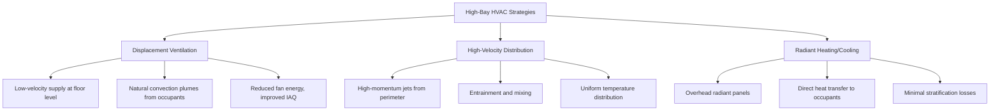
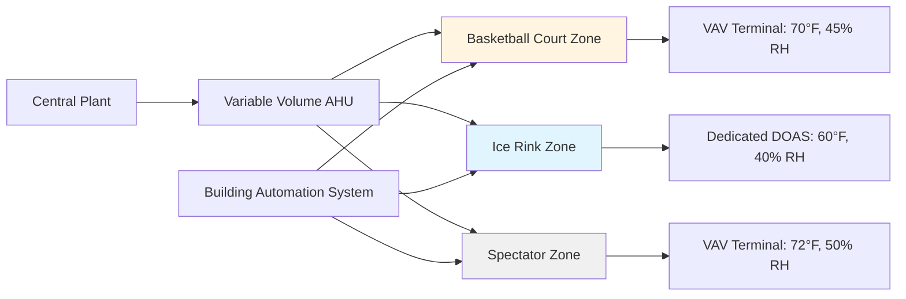

Indoor sports facilities present unique HVAC challenges requiring precise control of temperature, humidity, and air motion to satisfy both athletic performance requirements and spectator comfort. The high-bay construction, diverse activity levels, and sport-specific environmental needs demand specialized system design approaches.

## Physical Principles and Load Characteristics

The thermal environment in sports facilities is dominated by three primary heat transfer mechanisms operating at different scales.

**Convective Loads:** Athletes generate metabolic heat at rates of 400-600 W per person during intense activity, substantially higher than the 100-120 W typical of sedentary spectators. The total sensible heat gain follows:

$$Q_s = \dot{m} \cdot c_p \cdot \Delta T = \frac{CFM \cdot 1.08 \cdot \Delta T}{60}$$

where the 1.08 factor combines air density (0.075 lb/ft³), specific heat (0.24 BTU/lb·°F), and unit conversions.

**Radiant Loads:** High-intensity lighting systems for televised events and large glazing areas create significant radiant heat gains. The effective radiant temperature experienced by occupants includes both mean radiant temperature and air temperature weighted by activity level.

**Latent Loads:** Perspiration from athletes produces moisture at 0.5-0.8 lb/hr per person during vigorous activity. The required dehumidification capacity is:

$$Q_l = \dot{m} \cdot h_{fg} \cdot \Delta \omega = CFM \cdot 4840 \cdot \Delta GR$$

where $h_{fg}$ is the latent heat of vaporization (1060 BTU/lb) and $\Delta GR$ represents the grains of moisture change per pound of dry air.

## High-Bay Conditioning Strategies

Facilities with ceiling heights exceeding 30 feet require specialized air distribution to overcome thermal stratification and deliver conditioned air to the occupied zone.

**Displacement ventilation** introduces low-velocity air (50-100 fpm) at 63-67°F near floor level, allowing thermal plumes from occupants to drive upward air movement. This approach achieves ventilation effectiveness (ε) values of 1.2-1.4 compared to 1.0 for conventional mixing systems, reducing supply airflow requirements by 20-30%.

**High-velocity systems** project air at 2000-4000 fpm from perimeter nozzles, creating entrainment ratios of 10:1 to 15:1. The throw distance required to reach the activity zone without excessive terminal velocity is:

$$L = \frac{V_0 \cdot d_0}{K \cdot V_t}$$

where $V_0$ is initial velocity, $d_0$ is nozzle diameter, $V_t$ is maximum terminal velocity (typically 150 fpm for athletic areas), and $K$ is the throw constant (0.1-0.2 for turbulent jets).

## Air Velocity Control for Play

Air motion significantly impacts projectile sports including basketball, volleyball, and badminton. ASHRAE Standard 62.1 recommends maximum air velocities in the playing area:

| Sport Type | Maximum Velocity | Measurement Height |
|------------|------------------|-------------------|
| Basketball | 50 fpm | 10 ft above floor |
| Volleyball | 50 fpm | 8 ft above floor |
| Badminton | 30 fpm | 6 ft above floor |
| Tennis | 100 fpm | Court level |
| Ice Hockey | 200 fpm | Ice surface |

The drag force on a basketball traveling at 20 mph through air moving at 50 fpm is approximately 0.015 lb, sufficient to deflect the trajectory by 2-3 inches over a 15-foot shot. The drag equation governing this effect:

$$F_D = \frac{1}{2} \cdot \rho \cdot V_{rel}^2 \cdot C_D \cdot A$$

demonstrates the quadratic relationship between relative air velocity and deflecting force, making velocity control critical for precision sports.

## Sport-Specific Humidity Requirements

Different athletic activities require distinct humidity control strategies based on thermal comfort, material preservation, and safety considerations.

| Sport | Temperature (°F) | Relative Humidity (%) | Primary Concern |
|-------|-----------------|----------------------|-----------------|
| Basketball/Volleyball | 65-70 | 40-60 | Player comfort, wood floor stability |
| Ice Hockey | 55-65 | 40-50 | Ice quality, spectator comfort |
| Swimming | 78-82 | 50-60 | Comfort, condensation control |
| Gymnastics | 68-72 | 40-50 | Equipment grip, mat integrity |
| Wrestling | 65-70 | 35-45 | Mat traction, athlete cooling |

**Ice rink facilities** require dedicated dehumidification to prevent fog formation when warm humid air contacts the ice surface at 18-22°F. The dew point of supply air must remain below 40°F to avoid condensation on the ice and building envelope. The moisture removal capacity needed:

$$\dot{m}_w = A_{ice} \cdot h_{conv} \cdot (P_{sat,ice} - P_{air})$$

where convective mass transfer coefficient $h_{conv}$ ranges from 5-15 lb/hr·ft²·in Hg depending on air velocity over the ice surface.

**Wood floor facilities** require humidity control within 35-50% RH to prevent dimensional changes in the maple flooring. Wood moisture content varies with relative humidity following the sorption isotherm, with a 10% RH change producing approximately 2% dimensional change perpendicular to grain.

## Multi-Sport Facility Design

Facilities hosting multiple sport types require flexible HVAC systems capable of transitioning between setpoints while maintaining energy efficiency.

**Zoning strategies** separate playing areas from spectator zones, recognizing the 10-15°F temperature difference preferred by active athletes versus sedentary spectators. Dedicated outdoor air systems (DOAS) provide ventilation air at neutral temperature (60-65°F) to each zone, with local terminal units adding sensible heating or cooling as needed.

**Scheduling controls** adjust setpoints based on occupancy and activity type. Night setback during unoccupied periods saves 30-40% of energy consumption, while warm-up algorithms calculate the thermal mass of the building to achieve playing conditions at scheduled start times:

$$t_{warmup} = \frac{C \cdot \Delta T}{Q_{net}}$$

where building thermal capacitance $C$ includes structure, seating, and equipment mass.

## Spectator Comfort Integration

Spectator areas require coordination with playing space conditioning while addressing density variations from 5-15 ft²/person. Underfloor air distribution (UFAD) in tiered seating provides individual diffuser control and improved ventilation effectiveness. The pressure differential required across the access floor plenum:

$$\Delta P = \frac{\rho \cdot V^2}{2} + K \cdot \frac{\rho \cdot V^2}{2}$$

accounts for both velocity pressure and frictional losses through the floor panel openings, typically 0.05-0.15 in. w.c. for flows of 0.8-1.2 cfm/ft².

ASHRAE Standard 55 thermal comfort criteria apply to spectators, with predicted mean vote (PMV) targets of -0.5 to +0.5 and predicted percentage dissatisfied (PPD) below 10%. The six factors affecting thermal comfort (air temperature, radiant temperature, humidity, air velocity, metabolic rate, clothing insulation) must be balanced for the sedentary spectator condition while avoiding interference with athletic space requirements.

**Noise control** becomes critical in facilities designed for speech intelligibility during events. HVAC systems should maintain NC-35 to NC-40 levels in spectator areas, requiring low-velocity duct design (1500-2000 fpm), acoustic lining, and vibration isolation of mechanical equipment. The sound pressure level reduction through duct-mounted silencers follows:

$$IL = 1.05 \cdot P \cdot L \cdot \frac{f}{V}$$

where insertion loss (IL) depends on silencer perimeter $P$, length $L$, frequency $f$, and air velocity $V$, guiding equipment selection for acoustic performance.
