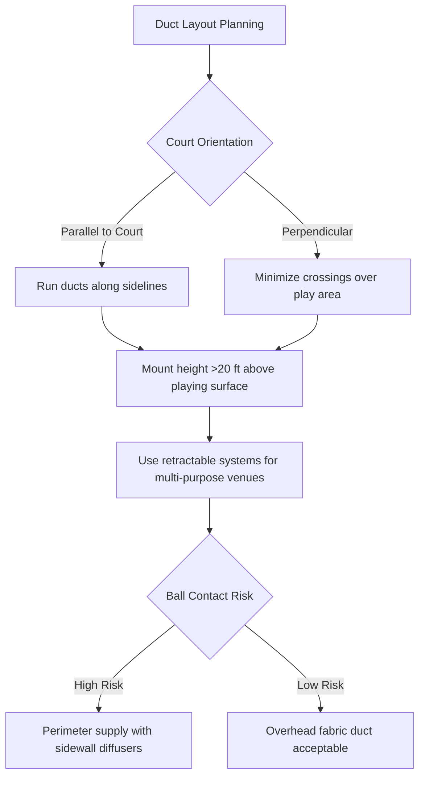
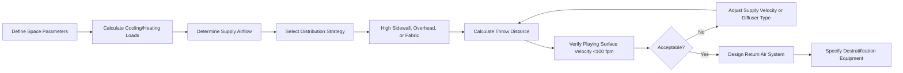

## Overview

Air distribution in indoor sports facilities presents unique engineering challenges: high ceiling heights (typically 20-50 ft), large open volumes, stringent draft limitations on playing surfaces, and potential interference with projectiles. Effective design balances occupant comfort, adequate ventilation rates, and minimal impact on athletic performance.

## Physics of Draft Formation in Sports Venues

Draft perception occurs when air velocities at the occupied zone exceed comfort thresholds while occupants are in a thermally neutral or slightly cool state. The convective heat transfer coefficient at the body surface increases with velocity according to:

$$h_c = 8.3 V^{0.6}$$

where $h_c$ is the convective heat transfer coefficient (W/m²·K) and $V$ is air velocity (m/s).

For athletes generating metabolic heat at 5-8 met (350-560 W/m²), higher velocities are tolerable. However, spectators and players at rest require protection from drafts. ASHRAE Standard 55 recommends occupied zone velocities below 0.25 m/s (50 fpm) for sedentary activities, but sports facility design targets 0.5 m/s (100 fpm) maximum at playing surface level.

### Critical Design Velocity

The playing surface velocity $V_p$ depends on throw distance $L$, supply velocity $V_0$, and diffuser characteristics:

$$V_p = V_0 \left(\frac{A_0}{A_x}\right) = V_0 \left(\frac{d_0}{K \cdot L}\right)$$

where $A_0$ is supply outlet area, $d_0$ is outlet diameter, $K$ is the throw constant (typically 5-7 for high-velocity diffusers), and $L$ is throw distance to the occupied zone.

## High-Velocity Air Distribution Systems

### Throw Distance Calculation

For overhead supply systems in gymnasiums with ceiling height $H$ and desired terminal velocity $V_t$ at the occupied zone ($6-8$ ft above floor):

$$L = \frac{V_0 \cdot d_0}{K \cdot V_t}$$

**Example Calculation:**
- Supply velocity: $V_0 = 2000$ fpm
- Diffuser diameter: $d_0 = 12$ inches
- Throw constant: $K = 6$
- Target velocity: $V_t = 100$ fpm

$$L = \frac{2000 \times 12}{6 \times 100} = 40 \text{ ft}$$

For a 30 ft ceiling height with occupied zone at 8 ft elevation, effective throw distance is 22 ft, requiring supply velocity adjustment or repositioning.

### High Sidewall Supply Strategy

Sidewall diffusers mounted 15-25 ft above floor level utilize the Coanda effect to maintain attachment to the wall surface, dissipating velocity before reaching the playing surface:

The entrainment ratio $E_r$ for a wall jet is approximately:

$$E_r = 0.055 \frac{x}{d_0}$$

where $x$ is distance along the wall. Higher entrainment ratios indicate greater mixing and velocity reduction.

## Thermal Stratification Control

Large volume spaces experience significant temperature gradients due to buoyancy-driven stratification. The temperature difference between ceiling and floor can reach:

$$\Delta T = \frac{q \cdot H}{\rho c_p Q}$$

where $q$ is internal heat gain (W), $H$ is ceiling height (m), $\rho$ is air density (kg/m³), $c_p$ is specific heat (J/kg·K), and $Q$ is ventilation rate (m³/s).

### Destratification Strategies

| Strategy | Application | Effectiveness | Energy Impact |
|----------|-------------|---------------|---------------|
| Ceiling fans (HVLS) | Heights >25 ft | Reduces ΔT by 5-10°F | Low energy, high mixing |
| High-velocity supply | All heights | Momentum-driven mixing | Increased fan power |
| Perimeter heating | Heating season | Counteracts downdrafts | Localized comfort |
| Displacement ventilation | Low-activity zones | Maintains stratification | Reduced mixing energy |

**HVLS (High Volume, Low Speed) Fan Impact:**

Ceiling fans operating at 50-100 rpm create gentle downward airflow (200-300 fpm at fan level, <100 fpm at floor) that disrupts stratification without excessive drafts. The power required is:

$$P = \frac{\rho Q \Delta P}{\eta}$$

For a 24 ft diameter fan moving 150,000 cfm against 0.1 in. w.g., power consumption is approximately 1.5 kW—far less than conditioning stratified air.

## Fabric Duct Systems for Gymnasiums

Fabric air dispersion systems offer uniform air distribution through porous textile or engineered orifices, ideal for spaces requiring draft control and aesthetic integration.

### Design Considerations

**Discharge Velocity Through Fabric:**

$$V_{fabric} = \frac{Q}{A_{fabric} \cdot P}$$

where $Q$ is airflow (cfm), $A_{fabric}$ is total fabric surface area (ft²), and $P$ is porosity coefficient (0.3-0.7).

For uniform distribution targeting $V_{fabric} = 50$ fpm at fabric surface with subsequent decay to <20 fpm at 15 ft distance:

- Required fabric area for 10,000 cfm: $A = \frac{10000}{50 \times 0.5} = 400$ ft²
- Typical duct: 24-inch diameter × 50 ft length provides $\pi \times 2 \times 50 = 314$ ft²

### Advantages for Sports Facilities

| Feature | Benefit | Technical Basis |
|---------|---------|-----------------|
| Uniform low-velocity discharge | Eliminates drafts | Large surface area reduces exit velocity |
| Lightweight suspension | Minimal structural load | 0.5-1.0 lb/ft vs. 15-25 lb/ft for metal duct |
| Aesthetic integration | Color matching to venue | Available in school colors, logos |
| Easy installation | Reduced labor costs | No heavy rigging equipment required |
| Condensation resistant | Humid environments | Permeable fabric prevents surface condensation |

### Projectile Interference Mitigation

Suspended fabric ducts present obstacles for high-trajectory balls (basketball, volleyball). Design mitigation:

**Clearance Requirements:**
- Basketball: Minimum 25 ft above court surface (FIBA standard)
- Volleyball: Minimum 23 ft above court surface (FIVB standard)
- General gymnasium: 20 ft minimum for clearance

When overhead distribution is unavoidable below these heights, retractable systems or perimeter high-sidewall designs eliminate interference.

## Return Air Configurations

Return air location significantly impacts air circulation patterns:

**High-Level Return:**
- Removes warmest air first
- Reduces heating energy in winter
- Requires more supply momentum to reach occupied zone

**Low-Level Return:**
- Better cooling season performance
- Enhances displacement ventilation effectiveness
- May require more filtration due to floor-level contaminants

**Split Return (Recommended):**
- 60-70% high-level return for stratification control
- 30-40% low-level return for occupied zone air quality
- Dampers allow seasonal optimization

## Design Process Summary

## ASHRAE References

- **ASHRAE Standard 62.1**: Ventilation rates for gymnasiums (0.3 cfm/ft² minimum)
- **ASHRAE Handbook—HVAC Applications, Chapter 4**: Places of Assembly, including sports facilities
- **ASHRAE Standard 55**: Thermal comfort criteria, air velocity limits
- **ASHRAE Handbook—Fundamentals, Chapter 20**: Space air diffusion, throw calculations

## Conclusion

Successful air distribution in indoor sports facilities requires precise engineering to balance competing demands: adequate ventilation, thermal comfort for diverse occupancy patterns, draft elimination on playing surfaces, and minimal interference with athletic activities. High-velocity supply systems with careful throw distance calculations, fabric duct systems for uniform low-velocity distribution, and active destratification measures provide effective solutions for these challenging spaces.
