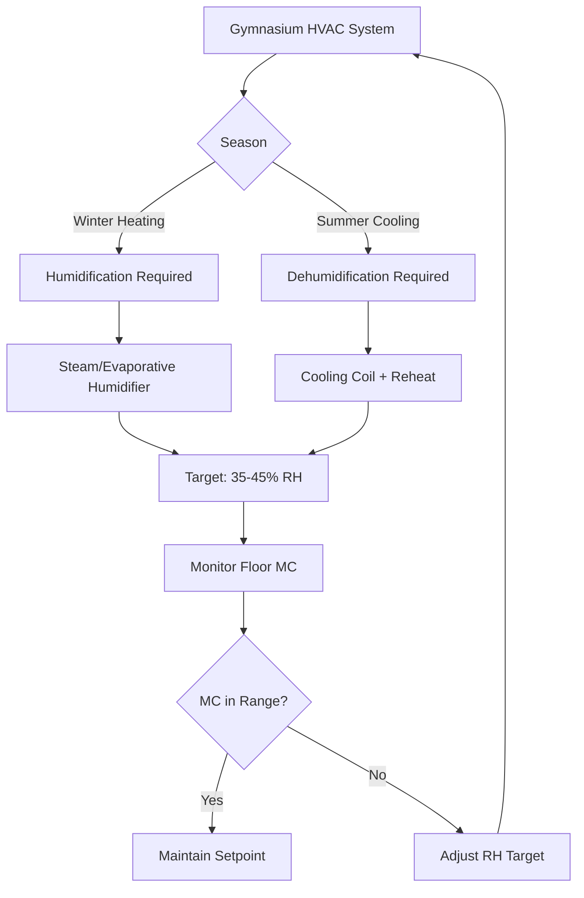
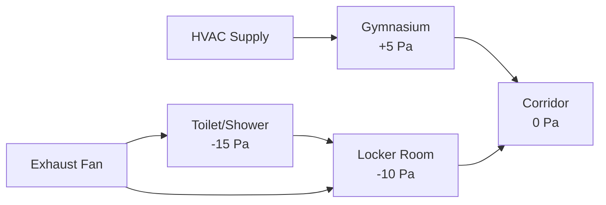

Gymnasiums present unique HVAC challenges due to high ceilings (30-40 ft), variable occupancy loads (50-500+ people), hardwood floor moisture sensitivity, and adjacency to high-exhaust areas like locker rooms. Effective design requires managing thermal stratification while protecting floor systems and maintaining occupant comfort across diverse use cases.

## Thermal Stratification in High-Bay Spaces

Temperature stratification in gymnasiums follows the relationship:

$$\Delta T = \frac{Q \cdot h}{k_{\text{eff}} \cdot A}$$

Where $\Delta T$ is the vertical temperature gradient (°F), $Q$ is the sensible heat load (BTU/hr), $h$ is the ceiling height (ft), $k_{\text{eff}}$ is the effective thermal conductance of air (BTU/hr·ft²·°F), and $A$ is the floor area (ft²).

In a typical 80 ft × 120 ft gymnasium with 35 ft ceilings, stratification can create temperature differentials of 10-15°F between floor and ceiling levels during heating mode. This results in:

- Wasted energy heating the upper air volume
- Occupant discomfort at the activity level (floor to 10 ft)
- Excessive runtime for heating equipment
- Potential condensation issues on roof structure

**ASHRAE Standard 62.1** requires breathing zone ventilation effectiveness, which stratification directly undermines. The ventilation efficiency can be calculated as:

$$\varepsilon_v = \frac{C_{\text{exhaust}} - C_{\text{supply}}}{C_{\text{breathing}} - C_{\text{supply}}}$$

Where $\varepsilon_v$ is ventilation efficiency, $C_{\text{exhaust}}$ is exhaust contaminant concentration, $C_{\text{supply}}$ is supply air concentration, and $C_{\text{breathing}}$ is breathing zone concentration. Stratification reduces $\varepsilon_v$ below the assumed value of 1.0, requiring increased ventilation rates.

## Air Distribution Strategies

| Strategy | Application | Advantages | Limitations |
|----------|-------------|------------|-------------|
| High sidewall jets | School gyms, 30-35 ft ceilings | Simple installation, good mixing | Requires adequate throw distance |
| Vertical downward displacement | Recreation facilities, cooling-dominated | Energy efficient, stratification control | Limited heating effectiveness |
| Underfloor/low-level supply | Premium facilities | Excellent floor-level comfort | High installation cost, floor space |
| Radiant + ventilation | Multi-use assemblies | Quiet operation, comfort | Complex controls, high first cost |

### High Sidewall Jet Design

The throw distance for high sidewall jets must reach 75-80% across the gymnasium width to prevent short-circuiting:

$$L = \frac{V_x}{V_0} \cdot \sqrt{\frac{A_0}{C_s}}$$

Where $L$ is throw distance (ft), $V_x$ is terminal velocity (typically 50 fpm), $V_0$ is discharge velocity (fpm), $A_0$ is nozzle area (ft²), and $C_s$ is a shape factor (0.6-0.8 for rectangular jets).

For a 120 ft wide gymnasium, supply outlets require minimum discharge velocities of 2000-2500 fpm to achieve adequate mixing. This corresponds to sound pressure levels that must be evaluated against **ASHRAE Applications Handbook** recommendations of NC 35-40 for gymnasiums.

## Hardwood Floor Humidity Protection

Hardwood floors require strict humidity control to prevent cupping, buckling, or gap formation. The moisture content equilibrium follows:

$$MC = 18.8 + 0.221 \cdot RH - 0.00145 \cdot RH^2$$

Where $MC$ is wood moisture content (%) and $RH$ is relative humidity (%). For maple hardwood, optimal moisture content is 6-9%, corresponding to 30-50% RH at 70°F.

### Seasonal Humidity Control Requirements

During winter, outdoor air at -10°F and 60% RH contains approximately 5 grains of moisture per pound of dry air. When heated to 70°F without humidification, this results in 8% RH—far below acceptable levels. The required humidification load is:

$$Q_h = \dot{m} \cdot (W_{\text{target}} - W_{\text{outdoor}}) \cdot h_{fg}$$

Where $Q_h$ is humidification load (BTU/hr), $\dot{m}$ is air mass flow (lb/hr), $W$ is humidity ratio (lb water/lb dry air), and $h_{fg}$ is latent heat of vaporization (1050 BTU/lb at 70°F).

## Locker Room Exhaust Integration

Gymnasiums typically share walls with locker rooms requiring 1.5-2.0 cfm/ft² exhaust for odor and moisture control. This creates pressure relationships that must be managed:

The pressure differential maintains directional airflow preventing moisture and odors from migrating into the gymnasium. This requires the gymnasium supply to exceed exhaust by approximately:

$$\Delta Q = \frac{\Delta P \cdot A}{\rho \cdot C}$$

Where $\Delta Q$ is excess supply (cfm), $\Delta P$ is target pressure (in. w.g.), $A$ is the leakage area (ft²), $\rho$ is air density, and $C$ is flow coefficient.

For a typical gymnasium with 3000 ft² of wall/door area shared with locker facilities, maintaining +5 Pa requires 200-400 cfm excess supply over exhaust, accounting for the building envelope and partition leakage characteristics per **ASHRAE Fundamentals Chapter 16**.

## Multi-Use Assembly Considerations

When gymnasiums serve as assembly spaces for graduations, concerts, or community events, occupancy can increase from 50 (basketball practice) to 500+ (graduation ceremony). The ventilation requirement scales with occupancy per **ASHRAE 62.1**:

- **Sports/physical activity**: 20 cfm/person
- **Assembly use**: 5 cfm/person (spectator mode)

The total outdoor air requirement must accommodate peak loads while allowing economizer operation during moderate occupancy. Variable air volume (VAV) systems with CO₂ demand control ventilation optimize energy while maintaining air quality.

The CO₂ concentration relationship is:

$$C_s = C_o + \frac{N \cdot G}{V_{oa}}$$

Where $C_s$ is space CO₂ concentration (ppm), $C_o$ is outdoor air concentration (typically 400 ppm), $N$ is occupant count, $G$ is CO₂ generation rate (0.3-0.6 cfm per person depending on activity), and $V_{oa}$ is outdoor air ventilation rate (cfm).

## Destratification Fan Systems

Ceiling-mounted destratification fans reduce stratification by creating downward airflow at 200-400 fpm, mixing the thermal layers. Fan placement follows:

| Ceiling Height | Fan Spacing | Fan Diameter | Minimum Air Movement |
|----------------|-------------|--------------|----------------------|
| 30-35 ft | 40-50 ft | 8-12 ft | 150,000 cfm per fan |
| 35-40 ft | 35-45 ft | 10-14 ft | 200,000 cfm per fan |

Energy savings from destratification in heating mode range from 20-30% by reducing thermostat setpoint requirements and improving distribution efficiency. The payback period for destratification fan installation is typically 2-4 years in cold climates.

## Design Checklist

- Verify throw calculations for high sidewall or overhead diffusers ensure coverage
- Size humidification/dehumidification for hardwood floor protection (35-50% RH year-round)
- Coordinate pressure relationships with adjacent locker room exhaust systems
- Design for peak assembly occupancy with CO₂-based demand control ventilation
- Evaluate destratification fans for facilities with >32 ft ceiling heights
- Confirm noise criteria compliance (NC 35-40) at design airflow rates
- Provide separate zones for spectator seating areas if applicable
