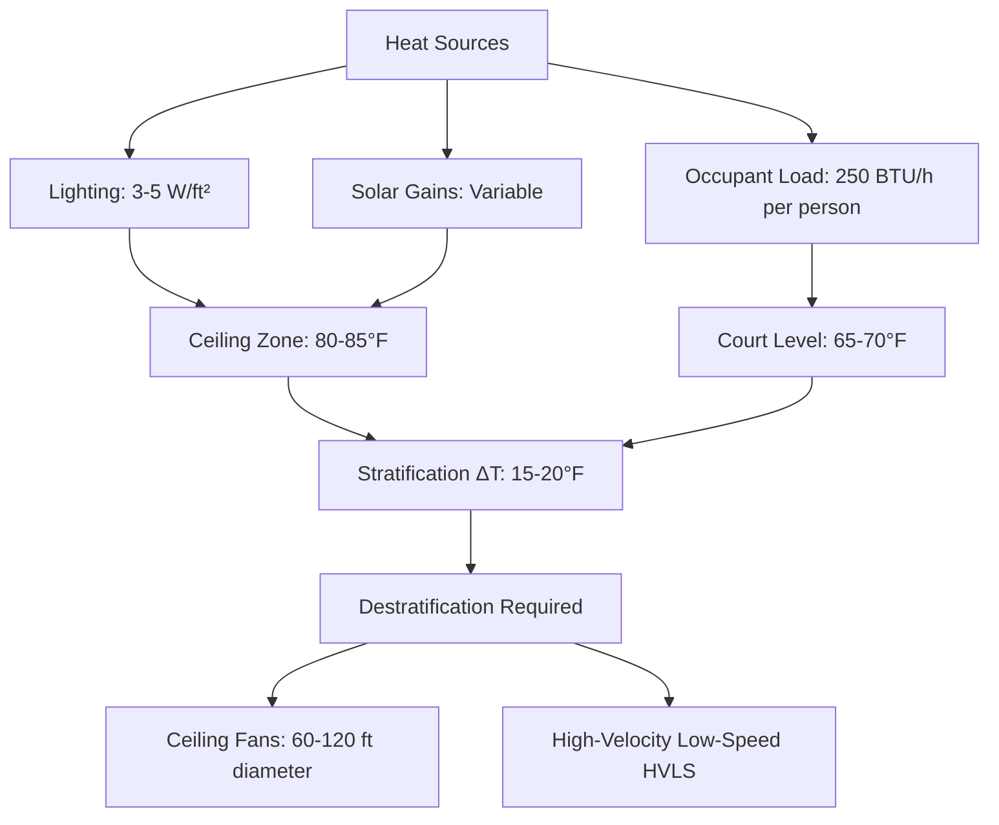
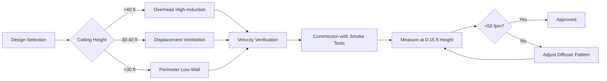

Indoor tennis facilities present unique HVAC challenges stemming from tall ceiling heights (typically 36-60 ft), stringent air velocity limits to prevent ball trajectory interference, substantial lighting heat loads from high-intensity fixtures, and the need to maintain distinct comfort zones for active players versus sedentary spectators.

## Air Velocity Limits and Ball Flight Dynamics

The primary design constraint for tennis court HVAC is air velocity at the playing surface. Horizontal air velocities exceeding 50 fpm measurably affect tennis ball trajectory, particularly during serves and baseline exchanges where the ball travels at speeds of 60-120 mph.

The aerodynamic drag force on a tennis ball follows:

$$F_d = \frac{1}{2} \rho C_d A v_{rel}^2$$

Where $\rho$ is air density (lb/ft³), $C_d$ is the drag coefficient (approximately 0.55 for a tennis ball), $A$ is the frontal area, and $v_{rel}$ is the relative velocity between ball and air. Even modest crosswinds of 50-100 fpm create lateral displacement of 6-18 inches over a 78-ft court length, significantly impacting play quality.

**Maximum Design Air Velocities:**

| Location | Maximum Velocity | Measurement Height |
|----------|------------------|-------------------|
| Active play zone | 50 fpm | 0-15 ft above court |
| Mid-height zone | 100 fpm | 15-30 ft above court |
| Upper ceiling zone | 150+ fpm | Above 30 ft |

ASHRAE Applications Handbook recommends maintaining velocities below 50 fpm in the playing zone, achieved through low-velocity displacement ventilation or carefully designed overhead systems with substantial throw distances.

## Thermal Stratification in High-Bay Spaces

The significant ceiling height in tennis facilities creates pronounced thermal stratification. The temperature gradient in a naturally stratified space follows:

$$\frac{dT}{dz} = \frac{Q}{k A}$$

Where $dT/dz$ represents the vertical temperature gradient (°F/ft), $Q$ is the heat flux, $k$ is thermal conductivity, and $A$ is the cross-sectional area. Without destratification, temperature differentials of 15-25°F between floor and ceiling are common.

## Player Comfort Requirements

Active tennis players generate 900-1,200 BTU/h metabolic heat, requiring cooler setpoints than spectator areas. The operative temperature for player comfort is:

$$T_o = \frac{T_a + T_r}{2}$$

Where $T_a$ is air temperature and $T_r$ is mean radiant temperature. For players at 4-5 MET activity levels, the target operative temperature range is 55-65°F with relative humidity maintained at 40-50%.

**Dual-Zone Climate Strategy:**

| Zone | Dry-Bulb Temp | Relative Humidity | Air Velocity | Occupancy Pattern |
|------|---------------|-------------------|--------------|-------------------|
| Court level | 60-65°F | 40-50% | <50 fpm | High metabolic rate |
| Spectator seating | 68-72°F | 40-50% | <30 fpm | Sedentary |
| Lobby/circulation | 70-74°F | 40-50% | Variable | Transitional |

## Lighting Heat Load Analysis

High-intensity metal halide or LED fixtures required for broadcast-quality illumination (75-125 footcandles) contribute 3-5 W/ft² of sensible heat gain. For a 36,000 ft² facility with four courts, this represents:

$$Q_{lighting} = 36,000 \times 4 \, \text{W/ft}^2 \times 3.412 = 491,000 \, \text{BTU/h}$$

This substantial heat load accumulates at the ceiling level, exacerbating stratification. Modern LED systems reduce this by 40-60% compared to legacy metal halide fixtures while providing superior color rendering (CRI >90).

## Air Distribution Strategies

Two primary approaches address the conflicting requirements of minimal air movement and effective heat removal:

**Overhead High-Induction Systems:**
- Supply air at 50-55°F from ceiling-mounted diffusers
- Throw distance of 80-120 ft to ensure terminal velocity <50 fpm at court level
- Requires ceiling heights >40 ft for adequate mixing length
- Cooling capacity: 400-600 CFM per 1,000 ft² court area

**Underfloor/Low-Sidewall Displacement:**
- Supply air at 60-63°F at floor level
- Relies on thermal buoyancy to lift warm air
- Minimal horizontal velocities in playing zone
- Superior for facilities with lower ceiling heights (30-40 ft)

## Ventilation Requirements

ASHRAE Standard 62.1 specifies outdoor air requirements based on occupancy density. For tennis facilities:

$$V_{oa} = R_p \times P + R_a \times A$$

Where $V_{oa}$ is required outdoor air (CFM), $R_p$ is outdoor air rate per person (7.5 CFM for sports facilities), $P$ is occupancy, $R_a$ is outdoor air rate per area (0.06 CFM/ft²), and $A$ is floor area. For a four-court facility with 200 occupants:

$$V_{oa} = 7.5 \times 200 + 0.06 \times 36,000 = 3,660 \, \text{CFM minimum}$$

## Humidity Control Considerations

Maintaining 40-50% RH prevents court surface condensation while ensuring player comfort. The moisture removal load includes:

- Occupant perspiration: 0.2-0.3 lb/h per active player
- Infiltration through entry doors: Variable, 20-40% of total
- Outdoor air ventilation: Climate-dependent

Dehumidification is typically integrated into the central cooling system, with dedicated desiccant systems employed in humid climates where latent loads exceed 30% of total cooling.

## Spectator Area Integration

Upper-level spectator seating requires separate air handling to maintain the 68-72°F comfort range without creating downdrafts that affect play. Perimeter heating at seating areas counteracts cold radiation from building envelope during heating season, calculated as:

$$q_{perimeter} = U \times A \times (T_{indoor} - T_{outdoor})$$

Where typical U-values for insulated walls range from 0.05-0.08 BTU/h·ft²·°F.
