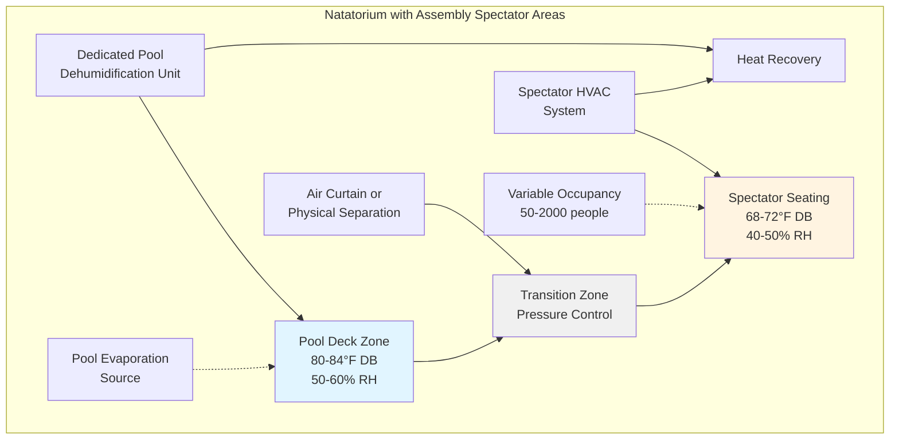

## Overview

Natatoriums with assembly spectator areas present unique HVAC challenges requiring simultaneous control of high-humidity pool environments and comfort conditioning for large variable occupant loads. Championship and competitive aquatic facilities must balance dehumidification requirements, spectator thermal comfort, IAQ demands, and energy efficiency while accommodating occupancy swings from training sessions to championship events.

## Zone Separation Strategies

Competitive natatoriums require careful consideration of zone separation between the pool deck environment and spectator seating areas due to conflicting environmental requirements.

## Combined Load Calculations

The total HVAC load for natatorium-assembly facilities requires integration of pool evaporation loads with spectator sensible and latent loads.

### Pool Evaporation Rate

$$W_p = A \times F \times (p_w - p_a)$$

Where:
- $W_p$ = evaporation rate (lb/hr)
- $A$ = pool surface area (ft²)
- $F$ = evaporation factor (0.1 unoccupied, 0.5 heavy use)
- $p_w$ = saturated vapor pressure at water temperature (in. Hg)
- $p_a$ = partial vapor pressure of room air (in. Hg)

### Total Latent Load

$$Q_{latent,total} = (W_p \times 1,050) + (N \times 200)$$

Where:
- $Q_{latent,total}$ = total latent load (Btu/hr)
- $N$ = number of spectators
- $200$ = average latent heat per spectator (Btu/hr)

### Combined Sensible Load

$$Q_{sensible,total} = Q_{envelope} + Q_{lights} + (N \times 250) + Q_{solar}$$

Where:
- $Q_{envelope}$ = transmission and infiltration loads (Btu/hr)
- $Q_{lights}$ = lighting heat gain (Btu/hr)
- $250$ = average sensible heat per spectator (Btu/hr)
- $Q_{solar}$ = solar heat gain through glazing (Btu/hr)

### Required Dehumidification Capacity

$$Q_{dehum} = \frac{Q_{latent,total}}{SHR_{target}}$$

Where $SHR_{target}$ = sensible heat ratio of dehumidification equipment (typically 0.65-0.75 for dedicated units)

## System Design Approaches

| Design Approach | Advantages | Disadvantages | Best Application |
|----------------|------------|---------------|------------------|
| **Integrated Single System** | Lower first cost, simplified controls, single equipment room | Compromised pool deck conditions, oversized for partial occupancy, higher operating cost | Small facilities (<1,000 spectators), limited events |
| **Separated Dual Systems** | Optimized conditions for each zone, independent control, energy efficient part-load | Higher first cost, larger equipment footprint, complex coordination | Championship facilities, frequent events, >1,000 spectators |
| **Dedicated Pool Unit + DX for Spectators** | Excellent pool dehumidification, conventional spectator comfort, heat recovery potential | Requires coordination between systems, moderate first cost | Most competitive facilities, 500-2,000 spectators |
| **Hybrid with Shared Ventilation** | Balanced first cost, centralized air handling, zone reheat flexibility | Requires careful design, potential humidity control issues | Multi-use facilities, educational institutions |

## Code Requirements and Standards

### ASHRAE Guidelines

**ASHRAE Standard 62.1** ventilation requirements:
- Pool deck: 0.48 cfm/ft² of pool surface area
- Assembly seating: 5 cfm/person (assuming non-smoking)
- Minimum air change rate: 4-6 ACH for natatorium spaces

**ASHRAE Applications Handbook** Chapter 6 recommendations:
- Pool deck air temperature: 2-4°F above water temperature
- Relative humidity: 50-60% RH (not to exceed 60%)
- Spectator seating: 68-72°F, 40-50% RH
- Maintain slight negative pressure (-0.02 to -0.05 in. w.g.) relative to adjacent non-pool spaces

### IMC and IBC Requirements

- Assembly occupancies (A-3, A-5) require minimum 7.5 cfm/person outdoor air
- Pool areas classified as Group A-4 (indoor swimming pools)
- Emergency ventilation systems required for chlorine storage areas
- Natatoriums exceeding 300 occupant load require independent ventilation systems

## Variable Occupancy Control Strategies

Championship events create occupancy loads 10-40 times greater than training sessions, requiring sophisticated control approaches.

### Demand-Controlled Ventilation

- CO₂ sensors in spectator seating zones (setpoint 800-1,000 ppm)
- Modulating outdoor air dampers based on occupancy
- Minimum ventilation maintained per ASHRAE 62.1

### Staged Equipment Operation

1. **Base Load (Training):** Pool dehumidification unit only, minimal spectator conditioning
2. **Moderate Events (Dual Meets):** Base load + 50% spectator HVAC capacity
3. **Championship Events:** Full system operation, all zones at design conditions
4. **Unoccupied:** Setback to 75°F pool deck, dehumidification maintains 60% RH maximum

### Pressure Relationship Control

Maintain proper pressure cascading to prevent moisture migration:
- Spectator seating: +0.02 in. w.g. (positive to exterior)
- Transition zone: neutral
- Pool deck: -0.02 to -0.05 in. w.g. (negative to spectators)

## Special Considerations for Championship Events

### Pre-Event Conditioning

- Begin spectator zone conditioning 2-4 hours before event
- Verify pool deck at optimal conditions (prevents complaints from athletes)
- Confirm dehumidification capacity adequate for anticipated occupancy

### Peak Occupancy Management

- Monitor relative humidity continuously (alarm if >65%)
- Increase outdoor air ventilation as CO₂ levels rise
- Balance spectator comfort against pool deck humidity control

### Acoustic Coordination

- Duct silencers required in spectator seating zones
- Equipment rooms isolated from competition areas
- Air handling units selected for NC-35 to NC-40 in seating areas

### Emergency Protocols

- Chemical spill exhaust systems independent of normal ventilation
- Smoke evacuation coordinated with fire alarm systems
- Manual override controls for emergency responders

## Energy Recovery Opportunities

Dedicated pool dehumidification units generate substantial heat from refrigeration condensers. Heat recovery strategies include:

- Condenser heat to pool water heating (most efficient application)
- Hot gas reheat for supply air heating (improves dehumidification)
- Heat recovery to spectator zone heating coils (reduces boiler load)
- Domestic hot water preheating for shower facilities

Annual energy savings of 30-50% achievable with properly designed heat recovery compared to once-through ventilation systems.

## Conclusion

HVAC systems for natatoriums with assembly spectator areas require sophisticated design balancing pool dehumidification, spectator comfort, variable occupancy, and energy efficiency. Separated systems with dedicated pool dehumidification units and independent spectator conditioning provide optimal performance for competitive facilities. Proper zone separation, combined load calculations accounting for both pool evaporation and spectator loads, and variable occupancy control strategies ensure successful operation from training sessions through championship events.
