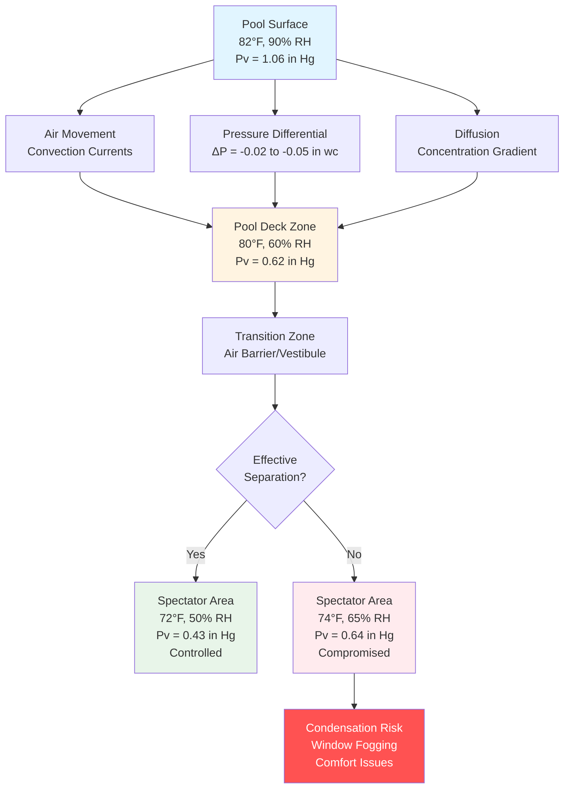

Pool evaporation represents the dominant moisture load in natatorium facilities, with spectator areas experiencing significant humidity migration challenges. The water vapor generated at the pool surface migrates toward adjacent occupied spaces through pressure differentials and concentration gradients, requiring specialized HVAC design to maintain comfort and prevent structural damage.

## Evaporation Rate and Moisture Generation

The evaporation rate from pool surfaces follows the Carrier equation modified for natatorium applications:

$$W = \frac{A \cdot Y \cdot (P_w - P_a)}{Y_p}$$

Where:
- $W$ = evaporation rate (lb/hr)
- $A$ = water surface area (ft²)
- $Y$ = activity factor (0.5 unoccupied to 1.0 highly active)
- $P_w$ = saturation pressure at water temperature (in. Hg)
- $P_a$ = partial pressure of water vapor in air (in. Hg)
- $Y_p$ = dimensionless factor (typically 95)

For a competitive natatorium with 10,000 ft² of water surface at 82°F with moderate activity ($Y = 0.65$) and spectator area conditions of 72°F, 50% RH:

$$P_w = 1.178 \text{ in. Hg (at 82°F)}$$
$$P_a = 0.427 \text{ in. Hg (at 72°F, 50% RH)}$$
$$W = \frac{10000 \cdot 0.65 \cdot (1.178 - 0.427)}{95} = 51.3 \text{ lb/hr}$$

This moisture generation creates a continuous driving force toward lower vapor pressure zones, including spectator seating areas.

## Moisture Migration Mechanisms

Moisture migrates from the pool deck to spectator areas through three primary mechanisms:

## Partial Pressure Gradient Analysis

The vapor pressure differential drives moisture migration according to Fick's first law adapted for building assemblies:

$$\dot{m} = -\frac{\delta A}{d} (P_{v1} - P_{v2})$$

Where:
- $\dot{m}$ = moisture flow rate (grains/hr)
- $\delta$ = permeability of barrier material (perms)
- $A$ = area (ft²)
- $d$ = thickness (in)
- $P_{v1}, P_{v2}$ = vapor pressures (in. Hg)

For a 1000 ft² wall section separating pool deck (80°F, 60% RH, $P_v = 0.62$ in. Hg) from spectator area (72°F, 50% RH, $P_v = 0.43$ in. Hg) with standard gypsum board ($\delta = 50$ perms, $d = 0.5$ in):

$$\dot{m} = -\frac{50 \cdot 1000}{0.5} (0.43 - 0.62) = 19,000 \text{ grains/hr} = 2.7 \text{ lb/hr}$$

This continuous moisture migration compromises spectator area conditions without adequate barriers and pressure control.

## Moisture Control Strategies

| Strategy | Effectiveness | Implementation Cost | Operating Cost Impact | Key Considerations |
|----------|--------------|---------------------|----------------------|-------------------|
| **Positive Pressure in Spectator Area** | High | Medium | Low | Requires 0.02-0.05 in. wc differential; prevents infiltration |
| **Physical Air Barrier with Vestibule** | Very High | High | Medium | Double-door entries; pressure cascade; 150-300 cfm per door |
| **Dedicated Dehumidification Systems** | High | Very High | High | Pool deck: 55°F dewpoint; Spectator: 50°F dewpoint |
| **Vapor Retarder in Separating Walls** | Medium | Low | None | 0.1 perm or less; must be continuous; detail penetrations |
| **Air Curtains at Openings** | Low-Medium | Low | Medium | 500-800 fpm discharge; supplemental only; not primary control |
| **Separate Air Handling Systems** | Very High | Very High | Medium | Independent control; prevents cross-contamination |

## Pressure Relationship Requirements

ASHRAE Applications Handbook (Chapter 6: Natatoriums) specifies pressure relationships to control moisture migration:

- Pool deck: negative 0.05 to 0.10 in. wc relative to outdoors
- Spectator areas: positive 0.02 to 0.05 in. wc relative to pool deck
- Adjacent corridors: positive 0.02 in. wc relative to spectator areas

This pressure cascade ensures moisture-laden air flows toward exhaust points rather than migrating to occupied spaces. The required pressure differential is maintained through:

1. **Supply air volume control**: Spectator areas receive 10-15% excess supply over return/exhaust
2. **Relief air pathways**: Transfer grilles or door undercuts (100-150 cfm per 1000 ft² of pool surface)
3. **Dedicated exhaust from pool deck**: 4-6 air changes per hour minimum
4. **Monitoring and control**: Differential pressure sensors with automatic damper adjustment

## Air Barrier Design Considerations

Effective separation between pool and spectator zones requires:

- Continuous air barrier with sealed penetrations (electrical, plumbing, structural)
- Vapor retarder placement on warm side (pool deck side) of insulated assemblies
- Vestibules with double-door entries maintaining intermediate pressure
- High-performance entrance systems with automatic closers and seals
- Glazing between zones: insulated units with warm-edge spacers, minimum U-0.30

The air barrier assembly must address thermal bridging and condensation potential. Interior surface temperatures should exceed dewpoint by 5°F minimum to prevent condensation at design conditions.

## Design Integration

Spectator area HVAC design for natatoriums must integrate:

- Independent air handling serving spectator zones with 72-76°F, 40-50% RH setpoints
- Exhaust/return air pathways preventing recirculation of pool deck air
- Zone separation maintaining specified pressure differentials
- Glazing systems rated for humidity exposure with condensation resistance factor (CRF) exceeding 70
- Controls monitoring temperature, humidity, and pressure at zone boundaries

Proper implementation controls moisture migration, maintains spectator comfort, prevents envelope condensation, and protects structural assemblies from moisture damage.
