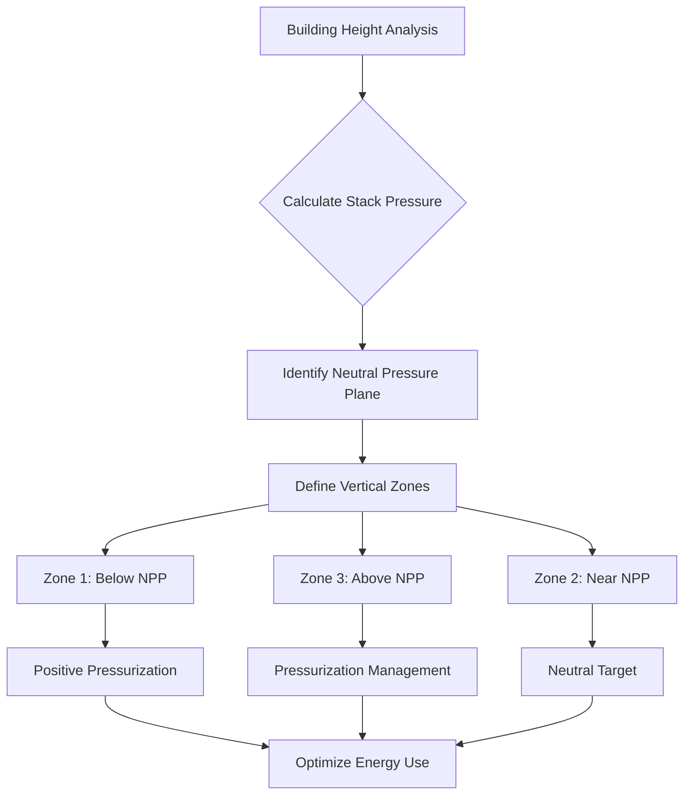
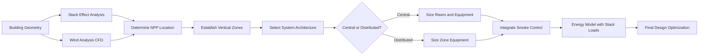

High-rise buildings—typically defined as structures exceeding 75 feet or seven stories—present unique HVAC engineering challenges absent in low-rise construction. The dominant physical forces acting on these structures fundamentally alter how air moves through the building envelope and ductwork, requiring specialized design approaches that account for stack effect, wind-induced pressures, vertical stratification, and life safety smoke control requirements.

## Physical Forces in Tall Buildings

### Stack Effect Fundamentals

Stack effect represents the most significant challenge in high-rise HVAC design. This buoyancy-driven pressure differential arises from density differences between indoor and outdoor air columns:

$$\Delta P = C_s \cdot h \cdot \left(\frac{1}{T_o} - \frac{1}{T_i}\right)$$

Where:
- $\Delta P$ = pressure difference (Pa)
- $C_s$ = stack coefficient (3460 Pa·K·m for standard atmospheric pressure)
- $h$ = vertical distance from neutral pressure plane (m)
- $T_o$ = outdoor absolute temperature (K)
- $T_i$ = indoor absolute temperature (K)

During winter heating, warm interior air creates positive pressure in upper floors and negative pressure in lower floors relative to outdoors. The neutral pressure plane (NPP)—where interior and exterior pressures equalize—typically occurs between 40-60% of building height depending on envelope tightness and HVAC system operation.

**Critical impacts:**

- **Infiltration/exfiltration**: Lower floors experience inward air leakage; upper floors experience outward leakage
- **Elevator shaft flows**: Shafts act as vertical air highways, transporting unconditioned air throughout the building
- **Door operability**: Pressure differentials can reach 50-100 Pa, creating door opening forces exceeding code-permitted 30 lbf
- **Energy penalty**: Uncontrolled stack effect can account for 20-40% of heating energy consumption in cold climates

### Wind-Induced Pressures

Wind creates dynamic pressure distributions across building facades following Bernoulli's principle:

$$P_{wind} = 0.613 \cdot V^2 \cdot C_p$$

Where:
- $P_{wind}$ = wind pressure (Pa)
- $V$ = wind velocity (m/s)
- $C_p$ = pressure coefficient (varies by facade position: +0.8 windward, -0.5 leeward)

At heights above 200m, wind velocities increase by 15-25% compared to ground level, creating pressure differentials of 100-200 Pa during high wind events. These pressures superimpose on stack effect pressures, requiring dynamic building pressurization control systems.

## Vertical Zoning Strategies

Effective high-rise HVAC design requires vertical segmentation into pressure-controlled zones. ASHRAE Guideline 36 recommends maximum zone heights of 10-15 floors to maintain manageable pressure differentials.

### Zoning Approaches

| Zoning Strategy | Application | Pressure Control | Complexity |
|-----------------|-------------|------------------|------------|
| Single-zone | Buildings <20 floors | Limited capability | Low |
| Dual-zone | 20-40 floors | Upper/lower separation | Moderate |
| Multi-zone | 40+ floors | 10-15 floor segments | High |
| Floor-by-floor | Supertall (75+ floors) | Individual floor control | Very high |

Each zone requires independent air handling equipment or pressure-regulating dampers in supply/return risers to counteract local stack pressures.

## System Architecture Options

### Central Plant Systems

Central plant configurations locate primary heating/cooling equipment in mechanical penthouses or basement plantrooms, distributing conditioned air or chilled/hot water vertically through the building.

**Advantages:**
- Consolidated maintenance access
- Economies of scale for large equipment
- Reduced tenant space requirements

**Challenges:**
- Pumping energy penalties: $W_{pump} = \frac{\dot{V} \cdot \Delta P}{\eta_{pump}}$ where vertical head contributes significantly to $\Delta P$
- Riser space requirements (6-10% of floor area)
- Extended piping/ductwork installation time

### Distributed Systems

Distributed architectures place air handling units or fan coil units on every floor or in intermediate mechanical rooms every 10-15 floors.

**Advantages:**
- Reduced vertical pressure losses
- Simplified zoning and control
- Shorter duct/pipe runs minimize leakage

**Challenges:**
- Increased equipment count and maintenance access requirements
- Reduced equipment efficiency (smaller capacity units)
- Acoustic isolation requirements for occupied floors

## Smoke Control Integration

Life safety smoke control represents a mandatory design consideration per NFPA 92 and IBC Section 909. High-rise buildings require pressurization systems that reverse normal airflow patterns during fire events.

**Key components:**

- **Stairwell pressurization**: Maintain 25-75 Pa positive pressure relative to building during fire, preventing smoke infiltration into egress paths
- **Elevator shaft control**: Pressurize elevator lobbies and shafts to 12-25 Pa to prevent smoke spread between floors
- **HVAC shutdown sequences**: Automatically shut down air handling serving fire zones while maintaining pressurization systems

$$\dot{V}_{makeup} = \frac{A_{door} \cdot V_{avg}}{\eta_{eff}}$$

Where makeup air volume ($\dot{V}_{makeup}$) must compensate for door leakage area ($A_{door}$) and average velocity through openings ($V_{avg}$, typically 1.0 m/s).

## Energy Considerations

High-rise buildings consume 15-30% more HVAC energy per unit area than low-rise equivalents due to stack effect penalties, increased distribution losses, and wind-driven infiltration. Mitigation strategies include:

- **Vestibule airlock entries**: Reduce ground floor infiltration by 40-60%
- **Compartmentalization**: Close stairwell doors, install elevator shaft vents
- **Variable-speed distribution**: Reduce parasitic pumping/fan energy
- **Heat recovery**: Capture exhaust energy from pressurization systems (30-40% energy recovery potential)

Properly designed vertical zoning combined with building pressurization control can reduce annual HVAC energy consumption by 20-35% compared to uncontrolled systems.

## Design Process Workflow

## Conclusion

Engineering HVAC systems for high-rise buildings requires rigorous application of fluid mechanics and thermodynamics principles to counteract powerful stack and wind-driven forces. Vertical zoning, building pressurization control, and integration of smoke control systems represent non-negotiable requirements. The choice between central and distributed system architectures depends on building height, architectural constraints, and operational priorities, with each approach offering distinct advantages. Successful designs balance capital cost, energy performance, and life safety requirements while maintaining occupant comfort across all vertical zones and weather conditions.

