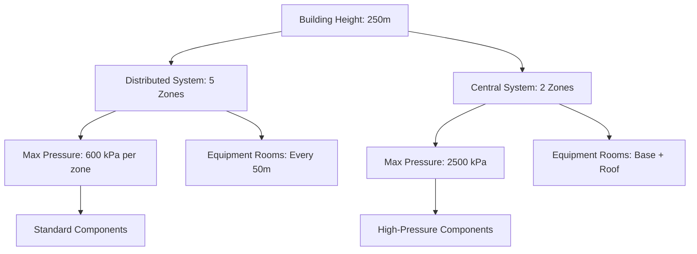

The selection between central and distributed HVAC systems represents one of the most consequential decisions in tall building design, affecting capital cost, operational efficiency, tenant flexibility, and space utilization throughout the building lifecycle. This choice fundamentally shapes mechanical room placement, piping system complexity, and pressure zone management.

## Central Plant Configuration

Central plants consolidate primary heating and cooling equipment at one or two locations, typically basement mechanical rooms and roof penthouses. This approach concentrates capital-intensive equipment where structural loads, noise, and vibration can be managed most effectively.

The fundamental physics governing central plant design involves transporting thermal energy vertically through the building. For chilled water systems, the static pressure at the base of a vertical column equals:

$$P_{static} = \rho g h$$

where $\rho$ is fluid density (typically 1000 kg/m³ for water), $g$ is gravitational acceleration (9.81 m/s²), and $h$ is vertical height. For a 200 m tall building, static pressure approaches 2000 kPa (290 psi), requiring pressure zone breaks to prevent excessive component ratings.

### Equipment Room Placement Strategy

Central plant configurations typically employ:

**Basement Location**
- Chillers, cooling towers, and primary pumps
- Structural floor designed for concentrated loads (10-15 kPa typical)
- Sound attenuation from occupied spaces
- Simplified equipment replacement via loading docks

**Penthouse Location**
- Air handling units serving upper floors
- Cooling tower placement for reduced piping runs
- Wind effects on cooling tower performance requiring analysis

The space penalty for central plants ranges from 2-4% of gross floor area, concentrated in specific locations rather than distributed throughout the building.

## Distributed System Architecture

Distributed systems place heating and cooling equipment on multiple mechanical floors throughout the building, typically every 10-20 stories. This strategy reduces piping pressure requirements and shortens distribution runs to occupied spaces.

### Pressure Zone Advantages

Each distributed mechanical floor serves as a natural pressure zone boundary. The maximum static pressure any component experiences is limited to the zone height rather than total building height:

$$P_{zone} = \rho g h_{zone}$$

For a 15-story zone (approximately 60 m), maximum static pressure reduces to 600 kPa (87 psi), allowing standard component ratings without special pressure considerations.

### Space Allocation Trade-offs

Distributed systems require mechanical rooms on multiple floors, consuming 3-6% of gross floor area but distributing this space vertically. This arrangement impacts leasable area differently than central systems:

- Reduced elevator core penetrations
- Shorter horizontal distribution runs
- Flexibility for phased construction
- Increased structural coordination

## Piping System Considerations

The pressure regime in tall buildings dictates fundamentally different piping approaches.

### Central Plant Pressure Management

Central systems require pressure zone breaks at intermediate levels. A decoupling heat exchanger separates high and low pressure zones:

$$Q = \dot{m} c_p \Delta T$$

Heat transfer occurs without fluid mixing, with separate pumping systems for each zone. The heat exchanger introduces a temperature penalty (0.5-1.5°C approach), requiring the central plant to produce slightly colder water to compensate.

### Distributed Plant Simplification

Distributed systems avoid pressure zone complexity by limiting each riser system to one or two pressure zones. The pumping energy comparison becomes:

$$W_{pump} = \frac{\dot{V} \Delta P}{\eta}$$

where $\dot{V}$ is volumetric flow, $\Delta P$ is total pressure rise, and $\eta$ is pump efficiency. Distributed systems typically show 15-25% lower pumping energy due to reduced pressure requirements and shorter piping runs.

## System Comparison Matrix

| Parameter | Central Plant | Distributed Systems |
|-----------|---------------|---------------------|
| **Capital Cost** | Lower equipment cost | Higher equipment cost |
| **Space Efficiency** | 2-4% concentrated | 3-6% distributed |
| **Piping Complexity** | High (pressure zones) | Moderate (zoned risers) |
| **Pump Energy** | Higher (tall risers) | Lower (short risers) |
| **Maintenance Access** | Centralized | Multiple locations |
| **Tenant Flexibility** | Limited | High |
| **Equipment Life** | 20-25 years | 15-20 years (smaller units) |
| **Redundancy Options** | N+1 feasible | Built-in zonal redundancy |

## Tenant Flexibility Analysis

The choice between central and distributed systems profoundly affects tenant fit-out flexibility and operating cost allocation.

### Central Plant Limitations

Central systems deliver conditioned air or water to tenant spaces through fixed distribution infrastructure. Modifications require:

- Core penetrations for new ductwork/piping
- Central plant capacity verification
- Building-wide system balancing
- Extended construction coordination

### Distributed System Adaptability

Mechanical rooms on multiple floors enable:

- Floor-by-floor tenant metering
- Independent temperature control
- After-hours operation without building-wide systems
- Reduced tenant improvement costs

For multi-tenant high-rises, distributed systems facilitate lease-specific HVAC configurations and energy billing, justifying the higher capital cost through improved leasability.

## ASHRAE Design Recommendations

ASHRAE Handbook—HVAC Applications, Chapter 4 (Tall Buildings) recommends evaluating system selection based on:

1. **Building Height**: Central plants economical below 30 stories; distributed systems advantageous above 40 stories
2. **Occupancy Type**: Single-tenant buildings favor central plants; multi-tenant buildings benefit from distributed systems
3. **Operating Schedule**: 24/7 operation suits central systems; varied schedules favor distributed approach
4. **Energy Cost Structure**: High energy costs justify distributed systems for reduced pumping penalties

## Hybrid Approaches

Many contemporary tall buildings employ hybrid strategies combining central and distributed elements:

- Central chiller plant with distributed air handling
- Primary central plant with secondary distributed heat pumps
- Central heating with distributed cooling

These configurations optimize first cost while maintaining operational flexibility, recognizing that the binary choice between fully central or fully distributed systems represents only the extremes of a design continuum.

## Decision Framework

The selection process should quantify:

**Central Plant Indicators**
- Single tenant occupancy
- Continuous 24/7 operation
- First cost constraints
- Established maintenance staff

**Distributed System Indicators**
- Multi-tenant occupancy
- Variable operating schedules
- High-rise (>150 m) construction
- Premium on tenant flexibility

The correct choice depends on building-specific factors including height, occupancy patterns, structural constraints, and ownership operational philosophy rather than universal rules.

