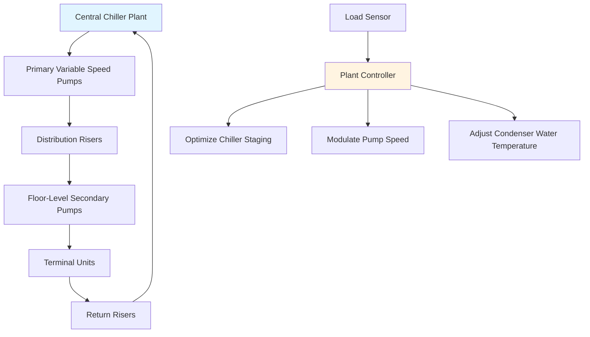
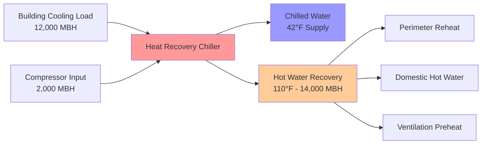

Central plant configurations deliver significant thermodynamic and operational advantages in tall buildings where total cooling loads typically exceed 500 tons. The fundamental benefit stems from scale-dependent efficiency improvements and the ability to implement sophisticated energy recovery strategies impractical with distributed systems.

## Economy of Scale

Equipment efficiency improves nonlinearly with capacity due to fundamental thermodynamic constraints. Large centrifugal chillers achieve COP values of 6.5-7.5 (kW/ton of 0.52-0.60), while distributed rooftop units plateau at COP 3.5-4.2 (EER 12-14).

The relationship between chiller efficiency and capacity follows:

$$\eta_{chiller} = \eta_{base} \cdot \left(1 + k \cdot \ln\left(\frac{Q_{actual}}{Q_{reference}}\right)\right)$$

where $k$ ranges from 0.08-0.12 for centrifugal machines, and $\eta_{base}$ represents baseline efficiency at the reference capacity.

**Capital Cost Reduction:**

| System Size | Installed Cost ($/ton) | Relative Cost |
|-------------|------------------------|---------------|
| 100-ton distributed units | $1,200-1,500 | 1.00 |
| 500-ton central chiller | $850-1,050 | 0.73 |
| 1,500-ton central chiller | $650-800 | 0.57 |

The physical basis for this cost reduction involves reduced surface-area-to-volume ratios for heat exchangers, improved motor efficiency at larger horsepower ratings, and manufacturing economies.

## Central Plant Efficiency

Large equipment operates closer to theoretical Carnot efficiency limits due to reduced irreversibilities per unit capacity. For a chiller producing 42°F leaving chilled water with 85°F condenser water:

$$COP_{Carnot} = \frac{T_{evap}}{T_{cond} - T_{evap}} = \frac{502°R}{545°R - 502°R} = 11.7$$

Actual central plant chillers achieve 55-65% of Carnot efficiency compared to 30-40% for smaller distributed units. This gap results from:

- **Larger heat exchanger approach temperatures** in small units (8-12°F vs 2-4°F)
- **Higher compressor internal irreversibilities** due to reduced manufacturing tolerances
- **Less sophisticated capacity control** (simple on/off vs variable speed drives with inlet guide vanes)

Central plants enable variable primary flow with distributed pumping, reducing pumping energy by 40-60% compared to constant flow systems:

$$P_{pump} = \frac{\dot{m} \cdot \Delta P}{\rho \cdot \eta_{pump}} \propto \dot{V}^3$$

As flow varies with building load, pump power decreases with the cube of flow rate when using VFDs.

## Maintenance Centralization

Concentrating equipment in dedicated mechanical rooms reduces maintenance labor by 50-70% compared to distributed systems requiring rooftop or tenant space access.

**Maintenance Access Comparison:**

| Factor | Central Plant | Distributed Systems |
|--------|---------------|---------------------|
| Equipment locations | 2-4 mechanical rooms | 40-80+ locations |
| Access restrictions | Minimal | Tenant coordination required |
| Parts inventory | Centralized | Distributed across building |
| Technician travel time | 5-10 min between units | 20-40 min between units |
| Specialized tool availability | On-site | Must transport vertically |

Central plants support predictive maintenance with continuous monitoring systems tracking vibration, oil analysis, refrigerant composition, and performance degradation. Data logging enables trend analysis identifying bearing wear or fouling before failure.

## Skilled Operator Access

Central plants justify dedicated operating engineers with expertise in chiller optimization, particularly in buildings exceeding 1 million square feet. A skilled operator adjusts:

1. **Chiller staging** based on real-time efficiency curves
2. **Condenser water temperature reset** to balance chiller and tower energy
3. **Chilled water temperature reset** during low-load conditions
4. **Thermal storage charge/discharge** strategies

The economic justification for full-time operators:

$$Savings_{annual} = E_{baseline} \cdot f_{reduction} \cdot C_{energy} > C_{operator}$$

where $f_{reduction}$ typically ranges 12-18% with competent operation, yielding payback periods under 2 years for buildings above 750 tons.

## Simultaneous Heating and Cooling Recovery

Central plants enable heat recovery chillers capturing condenser heat for simultaneous heating requirements. The energy balance for a heat recovery chiller:

$$Q_{heating} = Q_{cooling} \cdot \left(1 + \frac{1}{COP}\right)$$

For a 1,000-ton chiller at COP 6.0 recovering heat at 110°F:

$$Q_{heating} = 12,000 \frac{MBH}{1,000 \text{ tons}} \cdot 1,000 \text{ tons} \cdot \left(1 + \frac{1}{6.0}\right) = 14,000 \text{ MBH}$$

This recovered heat serves:
- Perimeter reheat during cooling season
- Domestic water preheating
- Ventilation air tempering
- Pool heating (mixed-use buildings)

The thermodynamic advantage stems from utilizing the otherwise-wasted condenser heat, effectively achieving heating COP values of 4-5 compared to 0.8-0.95 for conventional boilers.

## Equipment Redundancy

Central plants implement N+1 or N+2 redundancy economically due to capacity concentration. A 3,000-ton load served by three 1,200-ton chillers (N+1) provides:

- **100% capacity** with any single chiller offline
- **Maintenance flexibility** without load shedding
- **Efficiency optimization** through staging diversity

The reliability function for N+1 configuration:

$$R_{system} = 1 - (1 - R_{unit})^{N+1}$$

For individual chiller reliability $R_{unit} = 0.98$, a three-chiller plant achieves $R_{system} = 0.9999992$ (five nines availability).

## Load Diversity Benefits

Central plants leverage load diversity across multiple building zones, exposure orientations, and tenant types. The diversity factor:

$$F_{diversity} = \frac{\sum Q_{peak,individual}}{\sum Q_{coincident}}$$

Typical high-rise buildings exhibit diversity factors of 1.15-1.30, meaning a 3,000-ton coincident peak results from 3,450-3,900 tons of non-coincident individual zone peaks. Central plants size to coincident load while distributed systems must size to individual peaks, resulting in 15-30% capacity oversizing.

## Thermal Storage Opportunities

Central plants accommodate chilled water or ice thermal storage systems, shifting electrical demand from peak to off-peak periods. The storage capacity required:

$$V_{storage} = \frac{Q_{stored} \cdot t_{discharge}}{\rho \cdot c_p \cdot \Delta T \cdot \eta_{storage}}$$

For a 10,000 ton-hour storage system with 16°F temperature differential:

$$V_{storage} = \frac{10,000 \text{ ton-hr} \cdot 12,000 \frac{Btu}{ton-hr}}{62.4 \frac{lbm}{ft^3} \cdot 1.0 \frac{Btu}{lbm-°F} \cdot 16°F \cdot 0.90} = 134,000 \text{ ft}^3$$

This volume (approximately 1.0 million gallons) fits within typical central plant footprints but would be impractical to distribute across multiple locations.

**Energy Cost Savings:**

| Metric | Full Storage | Partial Storage | No Storage |
|--------|--------------|-----------------|------------|
| Peak demand (kW) | 1,200 | 1,800 | 3,000 |
| Off-peak charging (kWh/day) | 48,000 | 24,000 | 0 |
| Monthly demand charge | $18,000 | $27,000 | $45,000 |
| Annual savings vs no storage | $324,000 | $216,000 | Baseline |

## Reduced Tenant Space Impact

Central plants eliminate equipment from premium tenant areas, converting potential rental loss into revenue. For a 500,000 ft² office building:

- **Distributed system mechanical footprint:** 8,000-12,000 ft² (1.6-2.4% of total)
- **Central plant mechanical footprint:** 15,000-20,000 ft² in basement/roof (non-leasable space)
- **Net leasable area gain:** 8,000-12,000 ft²
- **Revenue impact at $65/ft²/year:** $520,000-$780,000 annually

The present value of this lease revenue over 30 years at 6% discount rate exceeds $7-11 million, often justifying central plant capital premiums of $2-4 million.

---

**References:**
- ASHRAE Handbook—HVAC Applications, Chapter 2: Tall Buildings
- ASHRAE Standard 90.1: Energy Standard for Buildings
- ASHRAE Journal: "Central vs. Distributed Chilled Water Plants"