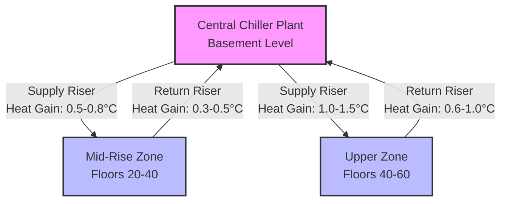
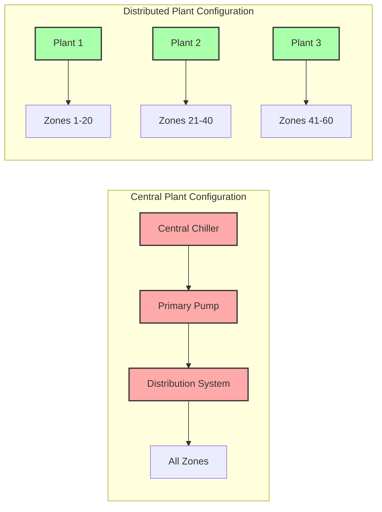

Central plant systems in tall buildings face significant physical and operational constraints that limit their effectiveness as building height increases. While centralized equipment offers advantages in maintenance accessibility and efficiency at full load, the vertical distribution required in high-rise applications introduces losses, pressure challenges, and reliability concerns that must be quantified during design.

## Static Pressure Constraints

Static pressure in vertical water distribution systems creates the primary limitation for central plant applications in tall buildings. The hydrostatic pressure at the base of a riser column is:

$$P_{static} = \rho g h$$

Where:
- $P_{static}$ = static pressure (Pa)
- $\rho$ = fluid density (kg/m³, approximately 1000 kg/m³ for water)
- $g$ = gravitational acceleration (9.81 m/s²)
- $h$ = vertical height (m)

For a 300 m tall building, the static pressure at the base exceeds 2940 kPa (426 psi), which surpasses the pressure ratings of standard commercial piping components (typically rated to 1034-2068 kPa or 150-300 psi). This necessitates pressure-reducing stations, specialized high-pressure piping, or distributed plant configurations.

### Pressure Zone Requirements

Buildings exceeding 100-150 m typically require multiple pressure zones to maintain component integrity. The transition between zones introduces:

- Heat exchanger inefficiencies (typically 1-3°C approach temperature difference)
- Additional pumping energy for each zone
- Increased control complexity
- Multiple points of potential failure

**Comparison: Single-Zone vs. Multi-Zone Pressure Management**

| Parameter | Single Central Plant | Multi-Zone Central Plant |
|-----------|---------------------|--------------------------|
| Maximum Building Height | ~100 m | 300+ m |
| Pressure Reducing Stations | 0 | 2-4 per riser |
| System Efficiency Loss | Baseline | 5-12% |
| Component Complexity | Low | High |
| First Cost Premium | Baseline | +15-30% |

## Distribution Energy Losses

Thermal losses in vertical distribution increase proportionally with riser length and inversely with insulation effectiveness. The heat transfer through insulated piping follows:

$$Q_{loss} = \frac{2\pi k L (T_{fluid} - T_{ambient})}{\ln(r_o/r_i)}$$

Where:
- $Q_{loss}$ = heat loss rate (W)
- $k$ = thermal conductivity of insulation (W/m·K)
- $L$ = pipe length (m)
- $T_{fluid}$ = fluid temperature (°C)
- $T_{ambient}$ = ambient temperature (°C)
- $r_o$ = outer insulation radius (m)
- $r_i$ = inner pipe radius (m)

For a 200 m vertical riser carrying 7°C chilled water through a 150 mm pipe with 50 mm fiberglass insulation (k ≈ 0.04 W/m·K) in a 24°C shaft, the heat gain approaches 450-600 W per riser. Over 8760 annual operating hours, this represents 3940-5260 kWh of additional cooling load per riser pair (supply and return).

## Pumping Energy Requirements

Pumping power in central systems increases with the cube of flow velocity and linearly with pressure differential. The theoretical pumping power is:

$$P_{pump} = \frac{Q \Delta P}{\eta_{pump}}$$

Where:
- $P_{pump}$ = pumping power (W)
- $Q$ = volumetric flow rate (m³/s)
- $\Delta P$ = total pressure differential (Pa)
- $\eta_{pump}$ = pump efficiency (typically 0.65-0.85)

For tall buildings, the pressure differential includes static lift, friction losses (proportional to $L \cdot v^2$), and fitting losses. A central plant serving a 250 m building at 0.05 m³/s requires approximately 35-50 kW of continuous pumping power compared to 8-15 kW for distributed plants serving equivalent zones.

ASHRAE Standard 90.1 limits system power to 22 W/L/s for complex systems, which becomes challenging to achieve in central plants exceeding 200 m vertical distribution.

## Vertical Riser Space Requirements

Riser shafts for central plant systems consume valuable leasable area throughout the building height. Typical requirements:

**Riser Sizing Requirements**

| Building Height | Chilled Water Riser Pairs | Total Shaft Area per Floor | Annual Rent Loss (at $500/m²) |
|-----------------|---------------------------|----------------------------|-------------------------------|
| 100 m (25 floors) | 2-3 | 1.2-1.8 m² | $15,000-22,500 |
| 200 m (50 floors) | 3-5 | 2.0-3.5 m² | $25,000-43,750 |
| 300 m (75 floors) | 4-7 | 3.5-5.5 m² | $43,750-68,750 |

Each riser pair requires:
- Primary pipe diameter (typically 150-300 mm depending on capacity)
- Insulation thickness (50-75 mm)
- Clearance for installation and maintenance (minimum 150 mm)
- Structural support and seismic bracing

The cumulative area loss over building height represents significant economic impact compared to distributed systems with shorter horizontal distribution runs.

## Single Point of Failure Risk

Central plant configurations create vulnerability to complete system failure from single-component malfunction. The reliability of a series system follows:

$$R_{system} = \prod_{i=1}^{n} R_i$$

Where $R_i$ represents the reliability of each component in the critical path. For a central plant with chiller (R = 0.95), primary pump (R = 0.92), and controls (R = 0.98), the system reliability is approximately 0.857, meaning 14.3% probability of failure over the evaluation period.

Distributed systems with redundant plants achieve higher reliability through parallel configurations:

$$R_{parallel} = 1 - \prod_{i=1}^{n} (1 - R_i)$$

Three distributed plants each with R = 0.90 provide system reliability of 0.999, representing 99.9% uptime.

## Complex Zoning Requirements

Central systems in tall buildings require sophisticated zoning to accommodate:

- **Thermal stratification**: Temperature variations of 3-8°C between lower and upper floors due to stack effect and solar exposure
- **Occupancy diversity**: Varying schedules across tenants and functions
- **Pressure zone transitions**: Multiple breaks requiring heat exchangers or pressure-reducing valves
- **Perimeter vs. core loads**: Different supply water temperatures for envelope-dominated vs. internal zones

Each zone requires dedicated control valves, sensors, and controllers. A 60-story building may require 180-240 control zones with central distribution, compared to 80-120 zones with distributed plants serving smaller floor groupings. The control complexity increases commissioning time by 40-70% and ongoing operational adjustments.

ASHRAE Guideline 36 (High Performance Sequences of Operation) recommends distributed systems for buildings exceeding 40 stories specifically to reduce control complexity and improve response time.

## Economic Analysis

The lifecycle cost comparison between central and distributed systems shifts as building height increases. Central plants show economic advantage below approximately 30-35 stories, while distributed configurations become favorable above this threshold due to:

- Reduced pumping energy (30-45% savings)
- Eliminated riser heat losses (15-25% cooling load reduction)
- Improved reliability reducing downtime costs
- Simplified zoning reducing commissioning and operational costs

The crossover point varies with local energy costs, rental rates, and specific building design parameters, requiring project-specific analysis using present-worth lifecycle costing per ASHRAE Standard 90.1 Appendix G methodology.
