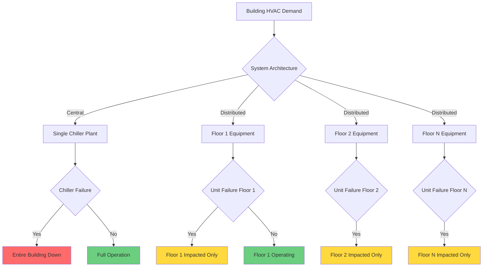
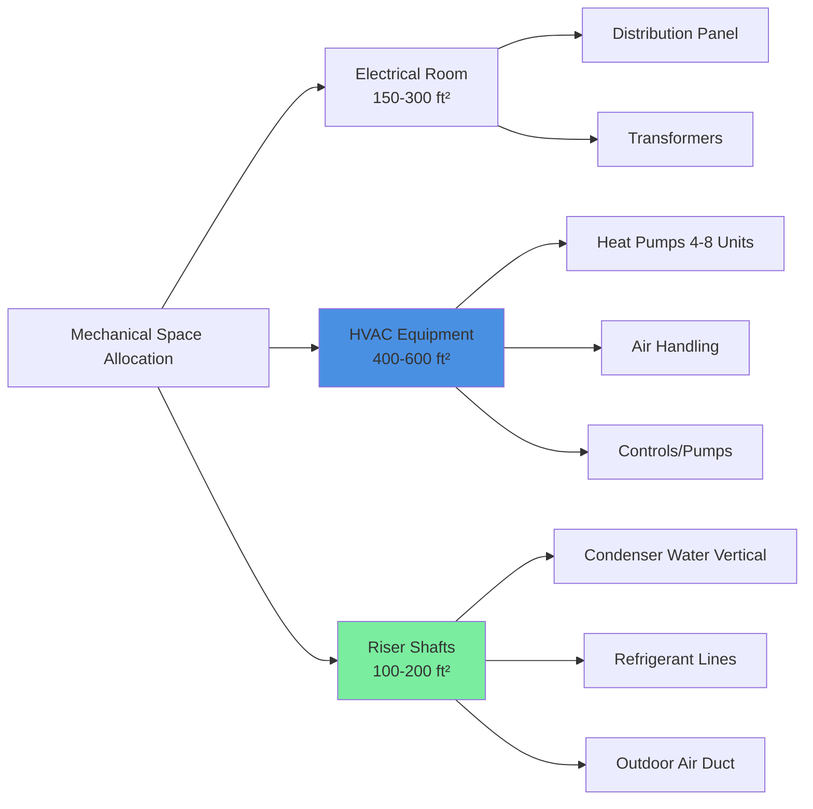

## Overview

Distributed HVAC systems locate primary heating and cooling equipment on each floor rather than in centralized mechanical penthouses. This architecture fundamentally alters energy transport mechanisms, shifting from fluid distribution (air or water over long vertical distances) to localized refrigerant cycles or compact hydronic loops. The approach offers distinct advantages in construction flexibility, operational redundancy, and tenant customization.

## System Configurations

### Water-Source Heat Pump Arrays

Water-source heat pumps (WSHPs) represent the most common distributed approach for high-rise buildings. Each floor contains multiple packaged units connected to a two-pipe condenser water loop maintained between 60-90°F.

**Energy Balance Principle:**

The condenser loop acts as a heat sink and source simultaneously. During mixed heating and cooling loads:

$$Q_{reject} = Q_{cooling} + W_{compressor,cooling}$$

$$Q_{extract} = Q_{heating} - W_{compressor,heating}$$

Net loop temperature is maintained by:

$$\dot{m}c_p\Delta T = (Q_{reject} - Q_{extract}) \pm Q_{tower/boiler}$$

Where tower or boiler operation activates only when building-wide imbalance exceeds loop capacity.

**ASHRAE Standard 90.1** requires heat recovery capabilities when simultaneous heating and cooling occur, making WSHPs inherently compliant through their shared loop architecture.

### Variable Refrigerant Flow (VRF) Systems

VRF systems position outdoor condensing units on each floor (rooftop, mechanical terrace, or exterior) with refrigerant distributed to indoor fan coils. Advanced systems support heat recovery between zones:

$$COP_{system} = \frac{Q_{cooling} + Q_{heating}}{W_{compressor} + W_{fans}}$$

Heat recovery VRF can achieve system COP values exceeding 4.0 by transferring rejected heat from cooling zones directly to heating zones via refrigerant piping, eliminating intermediate heat rejection.

**Refrigerant line pressure drop** becomes critical:

$$\Delta P = f \frac{L}{D} \frac{\rho v^2}{2}$$

For R-410A at typical velocities (liquid: 3 ft/s, vapor: 30 ft/s), vertical risers under 200 ft maintain acceptable pressure drops below 5 psi, preserving expansion device authority.

### Floor-by-Floor Packaged Units

Dedicated outdoor air systems (DOAS) paired with hydronic or electric heating allow packaged rooftop units or split systems per floor. Outdoor air ducted vertically requires careful static pressure management:

$$\Delta P_{static} = \rho g h$$

A 300 ft vertical duct creates 1.3 in.w.g. static pressure differential that must be accommodated through damper control or fan speed modulation to prevent over-pressurization of lower floors.

## Comparative Analysis

| Characteristic | Distributed Systems | Central Systems |
|----------------|---------------------|-----------------|
| Vertical riser space | Minimal (2-4" pipes/refrigerant) | Extensive (24-48" ducts/pipes) |
| Single point failure impact | Limited to one floor | Entire building affected |
| Tenant customization | Independent control per floor | Restricted by central schedules |
| Equipment redundancy | N+0 per floor, building-wide N+50 | N+1 centralized |
| Maintenance access | Requires floor entry | Centralized mechanical room |
| Distribution energy loss | 2-5% (short runs) | 15-25% (long vertical transport) |
| First cost | Higher (multiple units) | Lower (economy of scale) |

## Energy Transport Efficiency

**Heat Loss in Distribution:**

Centralized systems transporting chilled water vertically experience losses:

$$Q_{loss} = UA\Delta T_{lm}$$

For a 500 ft uninsulated riser (12-inch pipe, U=0.8 Btu/hr·ft²·°F, ΔT=30°F):

$$Q_{loss} = 0.8 \times (\pi \times 1 \times 500) \times 30 = 37,700 \text{ Btu/hr}$$

With 2-inch insulation (U=0.15), losses reduce to 7,000 Btu/hr, but still represent parasitic load.

Distributed systems eliminate this through localized generation. Refrigerant or condenser water pipes have lower thermal mass and reduced temperature differentials to ambient.

## Redundancy and Reliability

Distributed systems provide inherent N+50 redundancy at the building level. A single equipment failure affects only 2-4% of building area (one floor), whereas central system failures cascade to all floors until repair.

## Tenant Flexibility and Metering

Individual floor systems enable:

- **Independent scheduling:** Tenants control operating hours without affecting other floors
- **Direct metering:** Electrical consumption measured at floor distribution panel
- **Custom setpoints:** Temperature preferences vary by tenant without compromise

This flexibility increases marketability in multi-tenant buildings. ASHRAE Standard 189.1 encourages individual tenant metering for energy accountability.

**Thermal response time** improves with distributed systems:

$$\tau = \frac{mc_p}{UA}$$

Smaller air volumes per floor (thermal mass) combined with localized equipment placement reduce time constants from 2-4 hours (central VAV) to 15-30 minutes (distributed), enabling faster response to occupancy changes.

## Space Requirements

Each floor requires 650-1,100 ft² for mechanical and electrical infrastructure (8-12% of typical 10,000 ft² floor plate). This sacrifices leasable area but eliminates large central penthouse requirements and reduces core structural loading.

Equipment rooms distribute weight across floor slabs rather than concentrating loads. A 300-ton central chiller weighs 30,000 lb; ten 30-ton WSHPs weigh 6,000 lb total distributed across ten floors.

## Maintenance Considerations

**Access Challenges:**

Technicians must access occupied tenant spaces for routine maintenance, requiring coordination and potential after-hours work. Centralized systems allow 24/7 mechanical room access without tenant disruption.

**Parts Inventory:**

Multiple identical units enable on-site spare parts stocking. A building with 120 WSHPs can stock 2-3 compressors, providing rapid repair capability versus waiting for chiller compressor replacement.

**Filter Maintenance Frequency:**

ASHRAE Standard 62.1 requires MERV 8 minimum filtration. Distributed units with smaller filter areas (24"×24" vs. 96"×48" central AHU) necessitate monthly filter changes across multiple locations rather than quarterly central changes.

## Acoustic and Vibration Control

Equipment proximity to occupied spaces demands rigorous vibration isolation. Spring isolators with 90% isolation efficiency (natural frequency = 0.2 × forcing frequency) are minimum:

$$f_n = \frac{1}{2\pi}\sqrt{\frac{k}{m}}$$

For 800 lb heat pump on springs: achieve $f_n$ < 5 Hz to isolate from compressor operation at 3,600 RPM (60 Hz).

Acoustic requirements per ASHRAE Applications Handbook recommend NC-35 for private offices, requiring equipment sound levels below 55 dBA at 5 feet with proper enclosure treatment.

## Outdoor Air Management

Each floor requires dedicated outdoor air intake, creating multiple façade penetrations. Pressurization control becomes critical:

**Building Pressurization:**

$$Q_{OA,total} - Q_{exhaust,total} = Q_{exfiltration}$$

Coordinating outdoor air across 30+ floors requires Building Management System (BMS) integration to maintain slight positive pressure (0.02-0.05 in.w.g.) preventing infiltration while avoiding excessive pressurization causing door opening difficulty.

---

**References:**
- ASHRAE Standard 90.1-2019: Energy Standard for Buildings
- ASHRAE Standard 62.1-2019: Ventilation for Acceptable Indoor Air Quality
- ASHRAE Handbook—HVAC Applications, Chapter 40: Tall Buildings
