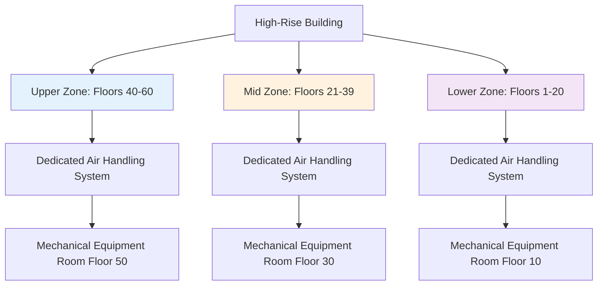
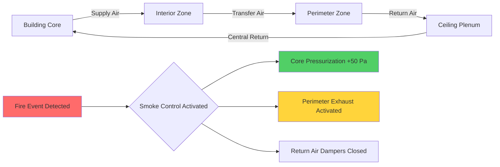
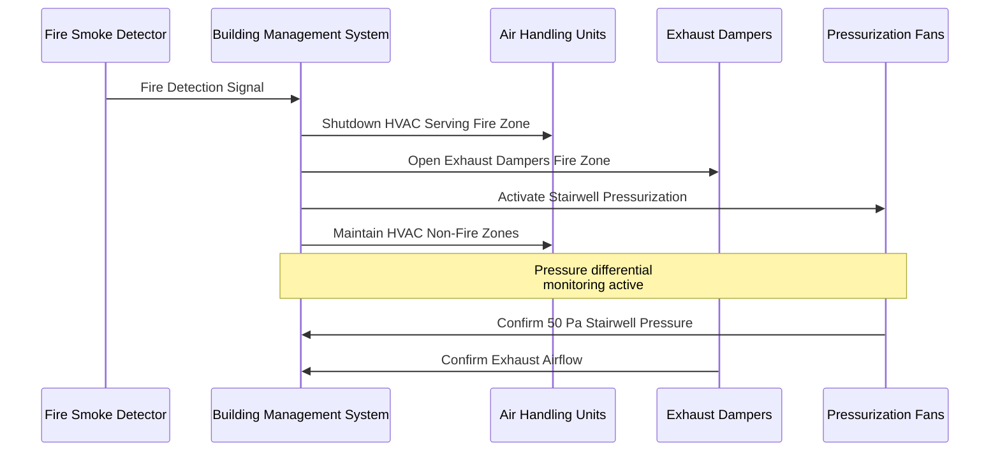

## Physical Principles of Compartmentalization

Compartmentalization in high-rise buildings divides the structure into discrete fire and pressure zones to limit smoke migration, control airflow patterns, and facilitate occupant egress during emergencies. The fundamental physics governing compartmentalization centers on differential pressure maintenance across barriers and the buoyancy-driven flow of heated gases.

The pressure difference required to prevent smoke infiltration through a barrier is governed by:

$$\Delta P = \rho g h \frac{T_h - T_c}{T_c}$$

Where $\Delta P$ is the pressure difference (Pa), $\rho$ is air density (kg/m³), $g$ is gravitational acceleration (9.81 m/s²), $h$ is the height of the opening (m), $T_h$ is the hot gas temperature (K), and $T_c$ is the cold ambient temperature (K). For effective smoke control, NFPA 92 requires maintaining minimum pressure differentials of 25 Pa across smoke barriers, increasing to 50 Pa for stairwell pressurization.

## Code Requirements and Standards

### NFPA and IBC Provisions

The International Building Code (IBC) Section 403 mandates specific compartmentalization requirements for high-rise buildings (structures exceeding 75 feet or 23 meters in height). IBC Section 403.4.6 requires smoke control systems designed in accordance with Section 909, which directly references NFPA 92 for design methodology.

NFPA 92 establishes performance-based criteria for compartmentalization:

- Pressure differentials of 25-35 Pa for horizontal smoke barriers
- Minimum 50 Pa across stairwell doors during pressurization
- Maximum 133 Pa to ensure door operability
- Leakage area calculations based on construction quality

IBC Section 716 specifies fire-resistance ratings for vertical and horizontal assemblies, typically requiring 2-hour fire barriers between major compartments in high-rise structures.

## Vertical Compartmentalization Strategies

Vertical zoning divides the building into stacked compartments, typically spanning 15-25 floors per zone. This strategy addresses the stack effect pressure gradient that scales with building height:

$$\Delta P_{stack} = \rho_o g h \left(1 - \frac{T_o}{T_i}\right)$$

Where $\rho_o$ is outside air density, $h$ is vertical distance between points, $T_o$ is outside temperature, and $T_i$ is inside temperature.

### Floor-to-Floor Barriers

Each floor assembly constitutes a horizontal fire and smoke barrier. The leakage area through floor penetrations critically affects compartmentalization effectiveness:

$$Q = C A \sqrt{2\Delta P/\rho}$$

Where $Q$ is volumetric airflow (m³/s), $C$ is discharge coefficient (typically 0.65), and $A$ is total leakage area (m²). For a typical floor with 0.01 m² equivalent leakage area and 25 Pa pressure difference, approximately 0.13 m³/s transfers between floors.

### Mechanical Shaft Compartmentalization

Vertical shafts housing HVAC risers, elevator hoistways, and service penetrations represent significant leakage paths. Strategies include:

**Fire dampers at floor penetrations**: Self-closing dampers rated for 1.5 or 3-hour fire resistance per UL 555
**Shaft pressurization**: Maintaining positive pressure in mechanical shafts relative to adjacent spaces
**Compartmentation at mechanical floors**: Creating pressure-relief zones at equipment levels

## Horizontal Compartmentalization

Horizontal compartmentalization divides individual floors into separate smoke zones, particularly critical for large floor plates exceeding 20,000 ft² (1,860 m²).

| Compartmentalization Strategy | Typical Application | Pressure Differential | Code Reference |
|-------------------------------|---------------------|----------------------|----------------|
| Tenant separation barriers | Multi-tenant floors | 12-25 Pa | IBC 403.4.6 |
| Stairwell enclosures | Egress protection | 50-75 Pa | NFPA 92, Section 4.6 |
| Elevator lobby barriers | Elevator bank separation | 25-35 Pa | IBC 3007.7 |
| Refuge area barriers | Accessible egress | 50-60 Pa | IBC 1009.6 |

### Core-to-Perimeter Zoning

Modern high-rises typically employ core-to-perimeter compartmentalization, creating pressure zones that account for differing thermal loads and occupancy patterns:

The physics of core pressurization relies on the orifice flow equation. For a door opening of area $A_d$ = 2 m² with 50 Pa pressure differential:

$$Q_{door} = 0.65 \times 2 \times \sqrt{\frac{2 \times 50}{1.2}} = 11.9 \text{ m}^3/\text{s} = 25,200 \text{ CFM}$$

This represents the supply airflow required to maintain pressurization with one door open during evacuation.

## Interfloor Leakage Control

Uncontrolled interfloor leakage compromises compartmentalization effectiveness. Dominant leakage paths include:

**Curtain wall systems**: Pressure equalization chambers require sealing at each floor
**Vertical cable and pipe penetrations**: Firestopping per ASTM E814/UL 1479
**HVAC ductwork**: Fire/smoke dampers at rated barriers per NFPA 90A
**Elevator hoistway doors**: Gasketing to achieve leakage rates below 0.3 m³/s per door at 75 Pa

### Leakage Quantification

Total interfloor leakage is calculated by summing component leakage areas:

$$A_{total} = A_{construction} + A_{penetrations} + A_{doors} + A_{dampers}$$

For tight construction, $A_{total}$ ranges from 0.005-0.015 m² per 100 m² of floor area. For standard construction, this increases to 0.02-0.04 m² per 100 m².

## Integration with HVAC System Design

Compartmentalization strategy directly influences HVAC system topology:

**Dedicated outdoor air systems (DOAS)**: Serve individual compartments with isolated distribution
**Return air systems**: Configured to prevent smoke recirculation between zones
**Smoke evacuation**: Provision for 6-10 air changes per hour from fire zone
**Makeup air**: Supply to adjacent zones to maintain pressure differentials

### Fire Mode Operation Sequence

## Design Considerations and Best Practices

**Pressure monitoring**: Continuous differential pressure measurement across critical barriers
**Makeup air coordination**: Size makeup air systems to replace exhausted smoke volumes
**Door force analysis**: Verify door opening forces remain below 133 N (30 lbf) per IBC 1010.1.3
**Leakage testing**: Commission systems using door fan testing per ASTM E779
**Redundancy**: Provide backup pressurization fans on emergency power

The effective area of leakage for a well-sealed compartment boundary should not exceed:

$$A_{effective} = \frac{Q_{design}}{\sqrt{2 \Delta P_{design}/\rho}}$$

For a design airflow of 10 m³/s at 50 Pa pressure differential, the maximum allowable leakage area is approximately 0.77 m².

## Performance Verification

NFPA 92 Section 4.6.4 requires testing and verification of installed compartmentalization systems. Testing protocols include:

- Pressure differential measurement across all barriers under design conditions
- Door opening force testing with pressurization systems active
- Smoke tracer testing to verify flow patterns
- System response time verification from alarm to full pressurization

Acceptance criteria mandate achieving design pressure differentials within 30 seconds of system activation and maintaining differentials for minimum 2-hour duration on emergency power.

Compartmentalization represents the foundation of fire-safe high-rise design, integrating architectural barriers with mechanical pressurization systems to control smoke migration and protect egress paths. Rigorous attention to construction quality, leakage minimization, and system coordination ensures reliable performance during fire emergencies.
