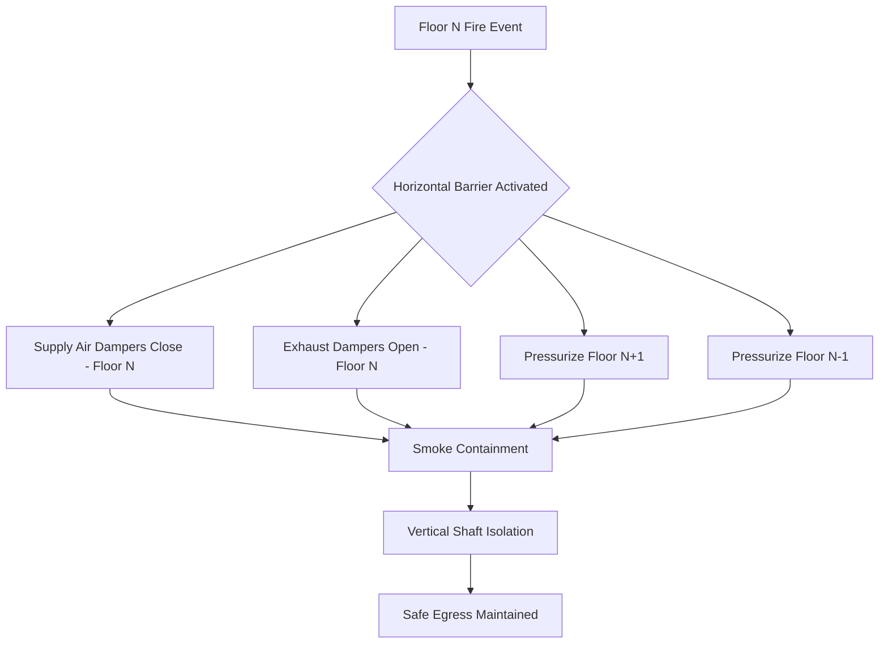
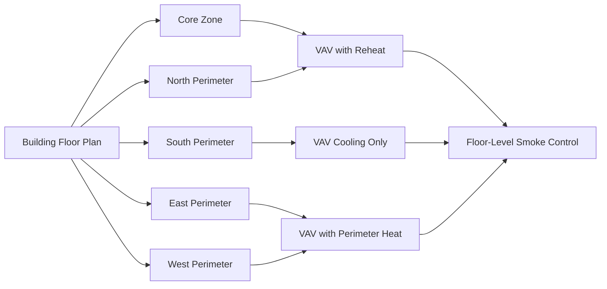

## Physical Basis of Horizontal Compartmentalization

Horizontal compartmentalization in tall buildings creates discrete pressure zones at each floor level to control smoke movement during fire events. The fundamental principle relies on maintaining pressure differentials across horizontal barriers to prevent buoyancy-driven smoke migration through vertical shafts.

The stack effect pressure difference between floors is governed by:

$$\Delta P = \rho_o g h \left(\frac{1}{T_o} - \frac{1}{T_i}\right)$$

Where $\Delta P$ is pressure difference (Pa), $\rho_o$ is outside air density (kg/m³), $g$ is gravitational acceleration (9.81 m/s²), $h$ is height above neutral plane (m), $T_o$ is outside temperature (K), and $T_i$ is inside temperature (K).

Effective horizontal zoning must overcome this naturally occurring pressure gradient to maintain compartment integrity during both normal operation and emergency conditions.

## Floor-by-Floor Isolation Requirements

### IBC Compartmentation Standards

IBC Section 403.2 requires fire-resistance-rated floor assemblies in high-rise buildings to be not less than 2 hours. Each floor functions as a horizontal fire compartment with specific HVAC system integration requirements:

- **Floor-ceiling assemblies**: Minimum 2-hour fire resistance rating
- **Penetrations**: Fire-stopped per IBC Section 714
- **HVAC ductwork**: Fire/smoke dampers at rated barriers
- **Maximum compartment area**: Typically 22,500 ft² (2090 m²) per IBC Table 707.3.10

### Pressure Boundary Maintenance

To maintain compartment integrity, the pressure differential across floor slabs must exceed the stack effect pressure by a safety margin:

$$\Delta P_{required} = 1.5 \times \Delta P_{stack} + 12.5 \text{ Pa}$$

This ensures minimum 12.5 Pa (0.05 in. w.g.) pressure differential under design conditions with a 50% safety factor against naturally occurring buoyant forces.

## Horizontal Smoke Barrier Design

### Barrier Performance Criteria

Horizontal smoke barriers must resist smoke passage while accommodating structural deflection and thermal expansion. The leakage rate through barriers is calculated using:

$$Q = C_d A \sqrt{2 \Delta P / \rho}$$

Where $Q$ is volumetric flow (m³/s), $C_d$ is discharge coefficient (0.6-0.7 for gaps), $A$ is leakage area (m²), and $\rho$ is air density (kg/m³).

| Barrier Component | Max Leakage Rate | Fire Rating | Damper Type |
|-------------------|------------------|-------------|-------------|
| Floor slab penetrations | 0.05 m³/s at 75 Pa | 2-hour | Combination fire/smoke |
| Curtain wall interfaces | 0.10 m³/s at 75 Pa | 1-hour | Smoke only |
| HVAC shaft openings | 0.02 m³/s at 75 Pa | 2-hour | Motorized fire/smoke |
| Door assemblies | 0.03 m³/s at 75 Pa | 1.5-hour | Self-closing smoke |

### Damper Coordination

Fire/smoke dampers at horizontal barriers require specific actuation sequences. Damper closure time must not exceed 4 minutes per NFPA 105, with fail-safe positioning upon power loss. The pressure transient during damper closure follows:

$$\frac{dP}{dt} = \frac{\dot{m} R T}{V}$$

Where $\dot{m}$ is mass flow rate change, $R$ is specific gas constant, $T$ is absolute temperature, and $V$ is compartment volume. Rapid damper closure can create pressure spikes exceeding 100 Pa, requiring pressure relief provisions.

## HVAC Zoning by Floor

### Single-Floor versus Multi-Floor Zones

Floor-by-floor HVAC zoning provides maximum compartmentalization control but increases system complexity and equipment count. The decision matrix considers:

| Criteria | Single-Floor Zones | Multi-Floor Zones (3-5 floors) |
|----------|-------------------|-------------------------------|
| Smoke control effectiveness | Excellent (100% isolation) | Good (requires sequential dampers) |
| Equipment count | High (1 AHU per floor) | Moderate (1 AHU per 3-5 floors) |
| Ductwork complexity | Low (no vertical risers) | High (vertical shafts required) |
| Energy recovery efficiency | Lower (smaller equipment) | Higher (larger equipment) |
| First cost | 15-25% higher | Baseline |
| Fire-fighting access | Better (each floor independent) | Moderate (sequential shutdown) |

### Perimeter versus Core Zoning

Horizontal zoning divides each floor into thermal zones based on solar load and occupancy patterns:

**Perimeter zone depth calculation**:

$$D_{perimeter} = \frac{Q_{solar} \times A_{glazing}}{q_{cooling} \times W_{floor}}$$

Where $D_{perimeter}$ is perimeter zone depth (m), $Q_{solar}$ is peak solar heat gain (W/m²), $A_{glazing}$ is window area per linear meter (m²/m), $q_{cooling}$ is cooling capacity per floor area (W/m²), and $W_{floor}$ is floor width (m).

Typical perimeter zone depths range from 4-6 m (12-20 ft) depending on glazing performance and building orientation.

## Fire Compartment Sizing

### Area Limitations

IBC Table 707.3.10 establishes maximum fire compartment areas based on construction type and sprinkler protection. For high-rise buildings (Type I construction with sprinklers):

- **Maximum single compartment**: 22,500 ft² (2090 m²)
- **Aggregate floor area**: Unlimited with 2-hour horizontal assemblies
- **Atrium spaces**: Special smoke control per IBC Section 404.5

The heat release rate within a compartment determines required ventilation:

$$\dot{m}_{exhaust} = \frac{\dot{Q}}{c_p (T_{smoke} - T_{ambient})}$$

Where $\dot{m}_{exhaust}$ is exhaust mass flow rate (kg/s), $\dot{Q}$ is heat release rate (kW), $c_p$ is specific heat (1.005 kJ/kg·K), and $T_{smoke}$ is smoke layer temperature (typically 400-600°C for design).

### Tenant Separation Requirements

Multi-tenant floors require horizontal fire barriers between tenant spaces exceeding 2,500 ft² (232 m²) per tenant. HVAC system implications include:

- Independent zone control for each tenant (min. 1 VAV box)
- Fire/smoke dampers at all barrier penetrations
- Return air pathway isolation (no shared return plenums across barriers)
- Dedicated exhaust for high-hazard tenant uses

## Refuge Floor Design

### Purpose and Frequency

Refuge floors provide safe areas for building occupants during evacuation and fire-fighting staging areas. IBC Section 403.6.2 requires refuge areas in buildings exceeding 420 feet (128 m) in height, located at maximum intervals of 30 stories.

### HVAC System Requirements for Refuge Floors

Refuge floors require enhanced environmental control with the following provisions:

| Parameter | Normal Operation | Emergency Operation |
|-----------|------------------|---------------------|
| Pressurization | 2.5-5 Pa positive | 12.5-25 Pa positive |
| Air changes per hour | 6-8 ACH | 15-20 ACH (makeup air) |
| Temperature control | 20-24°C (68-75°F) | 15-29°C (60-85°F) acceptable |
| Smoke exhaust capacity | N/A | 0.05 m³/s·m² floor area |
| Backup power | 100% systems | 100% systems + 24hr fuel |
| Fire rating separation | 2-hour minimum | 2-hour minimum |

The pressurization airflow for refuge floors is calculated as:

$$Q_{press} = \frac{A_{leakage} \times 2540 \times \sqrt{\Delta P}}{C_d}$$

Where $Q_{press}$ is pressurization airflow (cfm), $A_{leakage}$ is total leakage area (ft²), $\Delta P$ is design pressure difference (in. w.g.), and $C_d$ is discharge coefficient (0.65).

### Open Floor Plan Considerations

Open floor plans without full-height partitions present challenges for horizontal compartmentalization:

- **Smoke detection coverage**: Spacing reduced to 0.7× standard per NFPA 72 for smooth ceilings above 3.6 m (12 ft)
- **Temporary barriers**: Deployable smoke curtains at predetermined locations
- **Air distribution**: Underfloor or overhead systems must not create horizontal smoke transport paths
- **Pressurization uniformity**: CFD modeling required to verify pressure distribution across open areas

The mixing time constant for smoke in open floor plans is:

$$\tau = \frac{V_{compartment}}{Q_{exhaust} + Q_{makeup}}$$

Where $\tau$ is time constant (seconds) for smoke layer descent. Design target: maintain smoke layer above 6 feet (1.8 m) for minimum 20 minutes to ensure safe egress.

## Integration with Building Systems

Horizontal compartmentalization requires coordination between architectural, structural, and HVAC systems. Key integration points include:

- **Building Management System (BMS)**: Monitors floor-level pressure differentials and damper positions
- **Fire Alarm System**: Initiates smoke control sequences based on detector activation zone
- **Elevator recall**: Coordinates with HVAC pressurization to prevent smoke entry into elevator shafts
- **Stairwell pressurization**: Works in conjunction with floor-level smoke control to maintain clear egress paths

Successful horizontal zoning achieves compartmentalized smoke control while maintaining energy efficiency and occupant comfort during normal building operation.
