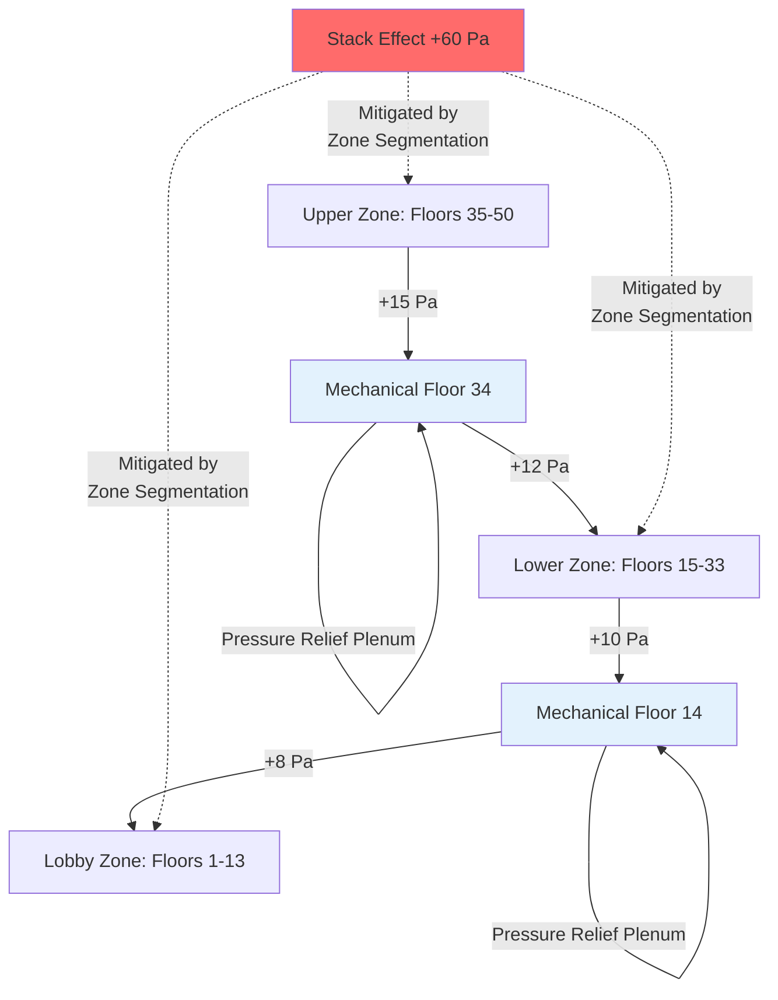
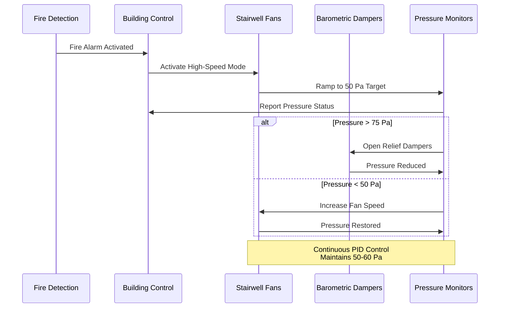
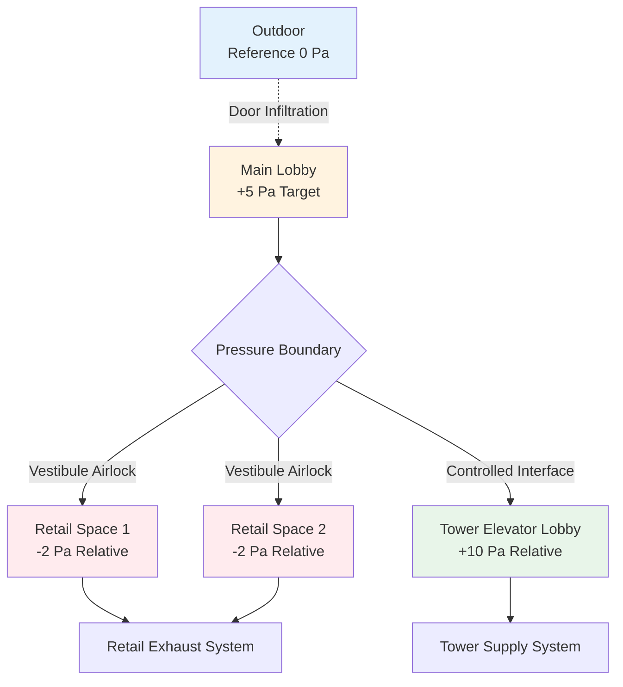
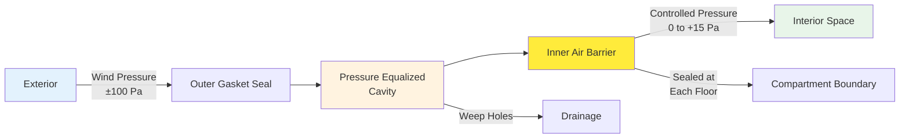

## Fundamentals of Pressure Boundary Design

Pressure boundaries in tall buildings establish controlled pressure zones that resist stack effect forces, prevent uncontrolled air migration, and support fire safety objectives. A pressure boundary comprises physical barriers combined with mechanical pressurization systems to maintain specified pressure differentials across compartment interfaces.

The pressure difference across a boundary is maintained by the net airflow balance:

$$\Delta P = \left(\frac{\rho}{2C^2 A^2}\right) Q^2$$

Where $\Delta P$ is pressure differential (Pa), $\rho$ is air density (1.2 kg/m³), $C$ is flow coefficient (0.6-0.7), $A$ is total leakage area (m²), and $Q$ is net airflow rate (m³/s). This relationship demonstrates that maintaining pressure boundaries requires both minimizing leakage area and providing sufficient airflow to overcome inherent leakage.

## Defining Pressure Zones

### Vertical Zone Segmentation

Tall buildings subdivide into vertical pressure zones to manage stack effect magnitude. The stack effect pressure at any height is:

$$\Delta P_{stack} = 3460 \cdot h \cdot \frac{(T_i - T_o)}{T_o}$$

Where $h$ is height difference (m), $T_i$ is interior temperature (K), and $T_o$ is outdoor temperature (K). For a 300-meter building with $T_i$ = 293K and $T_o$ = 268K (-5°C), the total stack pressure exceeds 350 Pa.

Breaking this into three 100-meter zones reduces maximum stack pressure per zone to approximately 117 Pa, allowing effective pressure control with standard mechanical systems.

| Building Height | Recommended Zone Count | Zone Height | Maximum Stack Pressure (Winter) |
|-----------------|------------------------|-------------|----------------------------------|
| 50-100 m | 1-2 | 50-100 m | 50-120 Pa |
| 100-200 m | 2-3 | 50-75 m | 60-90 Pa per zone |
| 200-300 m | 3-4 | 60-80 m | 70-95 Pa per zone |
| >300 m | 4+ | 60-85 m | 75-100 Pa per zone |

### Zone Transition Design

Pressure zone transitions typically occur at mechanical equipment floors or interstitial spaces. The transition floor serves as a pressure-relief plenum that buffers between zones:

The mechanical floor must maintain pressure between adjacent zones:

$$P_{mechanical} = \frac{P_{upper} + P_{lower}}{2} \pm 5 \text{ Pa}$$

This arrangement prevents large pressure gradients across mechanical floor penetrations while allowing independent control of each zone.

## Shaft Enclosure Pressurization

### Elevator Shaft Boundaries

Elevator shafts penetrate all pressure zones, creating significant leakage paths. The volumetric flow through elevator shaft doors is:

$$Q_{shaft} = C \cdot A_{door} \cdot \sqrt{\frac{2\Delta P}{\rho}}$$

For a typical elevator with four doors per floor at 2.5 m² per door, with 30 Pa pressure difference and leakage coefficient of 0.7:

$$Q_{floor} = 0.7 \times (4 \times 2.5) \times \sqrt{\frac{2 \times 30}{1.2}} = 49.5 \text{ m}^3/\text{s} = 105,000 \text{ CFM}$$

This massive leakage requires shaft pressurization systems that neutralize the pressure differential between shaft and adjacent floors.

**Shaft Pressurization Strategies:**

- **Neutral pressurization**: Maintain shaft at average building pressure (±2 Pa relative to floors)
- **Slight positive pressure**: +5 to +10 Pa to prevent smoke infiltration during fire scenarios
- **Relief dampers**: Automatic pressure relief at 15-20 Pa to prevent excessive buildup
- **Supply air injection**: Continuous low-volume supply (0.5-1.0 air changes per hour) at mid-shaft height

### Stairwell Pressure Boundaries

Stairwells require independent pressurization for egress protection. IBC Section 909.20 and NFPA 92 mandate minimum 50 Pa pressure differential in fire mode, with maximum 75 Pa to ensure door operability.

Under normal conditions, stairwells operate at slight positive pressure (+5 to +12 Pa) to prevent odor and contaminant infiltration. During fire mode:

Stairwell pressurization airflow requirements depend on door opening scenarios:

$$Q_{total} = n \times A_{door} \times v_{door} + Q_{leakage}$$

Where $n$ is number of simultaneously open doors (typically 1 or 2), $A_{door}$ is door area (2 m²), $v_{door}$ is velocity through open door (2.5-3.0 m/s to prevent smoke backflow), and $Q_{leakage}$ is background leakage through closed doors.

## Lobby Isolation and Pressurization

### Multi-Story Lobby Challenges

Multi-story lobbies present unique pressure boundary challenges due to their volume, multiple entry points, and vertical openness. The lobby acts as a massive pressure-relief zone that can compromise compartmentalization if not properly controlled.

**Design Considerations:**

- **Volume effects**: Large lobbies require substantial airflow for pressure control due to high leakage at grade-level doors
- **Revolving door pressurization**: Revolving doors reduce infiltration by 60-80% compared to swinging doors but introduce rotating seal leakage
- **Vestibule design**: Double-entry vestibules create pressure-lock zones that minimize outdoor air infiltration

The pressurization airflow for a lobby with significant outdoor exposure is:

$$Q_{lobby} = \frac{A_{doors} \times v_{avg} \times 3600}{E}$$

Where $A_{doors}$ is total door opening area during peak traffic (m²), $v_{avg}$ is average door velocity (1.5 m/s), and $E$ is door sealing effectiveness (0.3 for revolving, 0.8 for standard swinging doors).

### Lobby-to-Tower Pressure Interface

The boundary between multi-story lobby and tower floors requires careful pressure management:

| Interface Location | Pressure Strategy | Typical Differential | Control Method |
|--------------------|-------------------|----------------------|----------------|
| Elevator lobby separation | Positive tower pressure | +8 to +12 Pa | Supply air bias to tower |
| Main lobby ceiling | Pressure-neutral | 0 to +5 Pa | Return air plenum |
| Mechanical mezzanine | Positive pressure | +10 to +15 Pa | Dedicated pressurization |
| Lobby-level loading dock | Negative pressure | -5 to -10 Pa | Dedicated exhaust |

### Retail and Public Space Integration

Ground-floor retail spaces penetrate the lobby pressure boundary. These require independent HVAC systems with dedicated pressure control:

Maintaining retail spaces at slight negative pressure (-2 to -5 Pa) relative to lobby prevents cooking odors, refrigerant leaks, and other contaminants from migrating into primary building circulation.

## Mechanical Room Pressurization

### Equipment Room Pressure Control

Mechanical equipment rooms require positive pressurization (+10 to +25 Pa) to prevent smoke infiltration and maintain clean equipment operating environments. The pressure differential is achieved through supply-exhaust air balance:

$$Q_{supply} = Q_{exhaust} + Q_{pressurization}$$

Where $Q_{pressurization}$ is calculated from the room leakage characteristics:

$$Q_{pressurization} = C \cdot A_{leakage} \cdot \sqrt{\frac{2\Delta P_{target}}{\rho}}$$

For a mechanical room with 500 m² surface area and typical construction leakage of 0.04 m² per 100 m² (0.20 m² total), targeting +15 Pa:

$$Q_{pressurization} = 0.65 \times 0.20 \times \sqrt{\frac{2 \times 15}{1.2}} = 0.65 \text{ m}^3/\text{s} = 1,375 \text{ CFM}$$

### Interstitial Space Design

Interstitial spaces between occupied floors house mechanical distribution systems and provide service access. These spaces establish critical pressure boundaries:

**Pressurization Functions:**

1. **Duct leakage containment**: Positive pressure prevents unconditioned air infiltration into distribution systems
2. **Condensation prevention**: Pressurization reduces outdoor air infiltration and maintains dewpoint control
3. **Fire barrier support**: Mechanical spaces serve as fire-rated separation between vertical zones
4. **Maintenance access**: Sufficient height (2.4-3.0 m minimum) for service access

The interstitial space pressure must exceed adjacent occupied spaces by:

$$\Delta P_{interstitial} = 10 + 0.5(P_{upper} + P_{lower})$$

This ensures the interstitial space remains the dominant pressure source, preventing pressure-driven airflow between vertical zones through mechanical penetrations.

### Dedicated Outdoor Air Integration

Interstitial spaces often house dedicated outdoor air system (DOAS) equipment. The DOAS intake location critically affects pressure boundary performance:

**Optimal intake locations ranked by pressure boundary effectiveness:**

1. **Shaft with independent intake louvers**: Isolates outdoor air from building pressure field
2. **Equipment room with dedicated intake**: Allows pre-filtration and conditioning before distribution
3. **Interstitial space with compartmentalized intake**: Provides staging area for pressure control
4. **Direct floor-by-floor intakes**: Maximum isolation but high installation and maintenance cost

## Air Barrier System Construction

### Continuous Air Barrier Principles

The air barrier system forms the physical foundation of pressure boundaries. ASHRAE 90.1 Section 5.4.3 requires continuous air barriers with maximum leakage of 0.02 m³/s per m² of envelope area at 75 Pa test pressure.

**Critical air barrier continuity locations:**

- **Floor-to-exterior wall interface**: Sealed with spray foam or pre-compressed gaskets
- **Mechanical penetrations**: Fire-stopping products with air-sealing properties (ASTM E814 and ASTM E283)
- **Window-to-wall connections**: Back-pan flashing, continuous sealant, and compression gaskets
- **Structural movement joints**: Flexible air barrier membranes rated for ±25% joint movement

### Curtain Wall Systems as Pressure Boundaries

Curtain wall systems in tall buildings must function as both weather barriers and pressure boundaries. The pressure equalization principle divides the wall cavity:

The pressure equalization cavity reduces the pressure differential across the inner air barrier seal from full wind pressure to near-zero, dramatically reducing infiltration loads.

Compartmentalization at each floor prevents cavity stack effect:

$$\Delta P_{cavity} = \frac{h_{floor}}{h_{total}} \times \Delta P_{stack,total}$$

By sealing the cavity at each floor (typically 3-4 meters), the cavity stack effect is reduced by a factor of 75-100 compared to unsealed cavity extending the full building height.

## Testing and Verification

### Pressure Boundary Commissioning

ASHRAE Guideline 1.1 and NFPA 3 require comprehensive pressure boundary testing:

**Test Protocols:**

1. **Whole-building pressurization test**: Per ASTM E779, quantify total building leakage
2. **Compartment pressurization tests**: Verify inter-zone pressure control under design conditions
3. **Tracer gas testing**: Identify unexpected air pathways using SF₆ or CO₂ tracers
4. **Differential pressure mapping**: Measure pressure field across all major boundaries during seasonal extremes

**Acceptance Criteria:**

- Achieve design pressure differentials ±15% under steady-state conditions
- Demonstrate pressure control during door opening/closing transients (recovery within 30 seconds)
- Verify door opening forces remain below 133 N (30 lbf) per IBC 1010.1.3
- Confirm pressure monitoring system accuracy ±2.5 Pa

### Continuous Performance Monitoring

Permanent pressure monitoring systems track boundary performance:

$$\text{Pressure Boundary Performance Index} = \frac{\Delta P_{measured}}{\Delta P_{design}} \times 100\%$$

Target 85-115% performance index during normal operation. Values below 75% indicate excessive leakage or system capacity degradation requiring investigation.

Monitoring points include:

- Each vertical zone transition (mechanical floors)
- Stairwell pressurization (minimum one per stairwell)
- Elevator shaft reference pressure (mid-height)
- Lobby-to-tower interface
- Mechanical room boundaries
- Interstitial space reference points

Data trending identifies seasonal performance variations, system degradation, and opportunities for control optimization. Pressure boundary systems in tall buildings represent integrated solutions combining physical barriers with active pressurization control to manage stack effect, support fire safety, and maintain environmental separation between spaces and zones.
