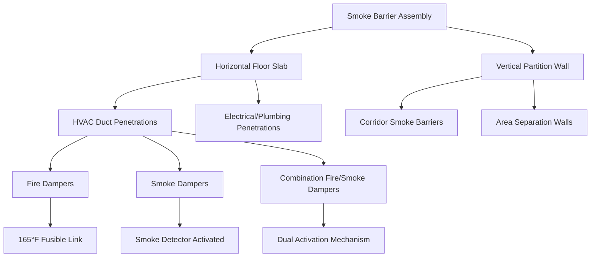
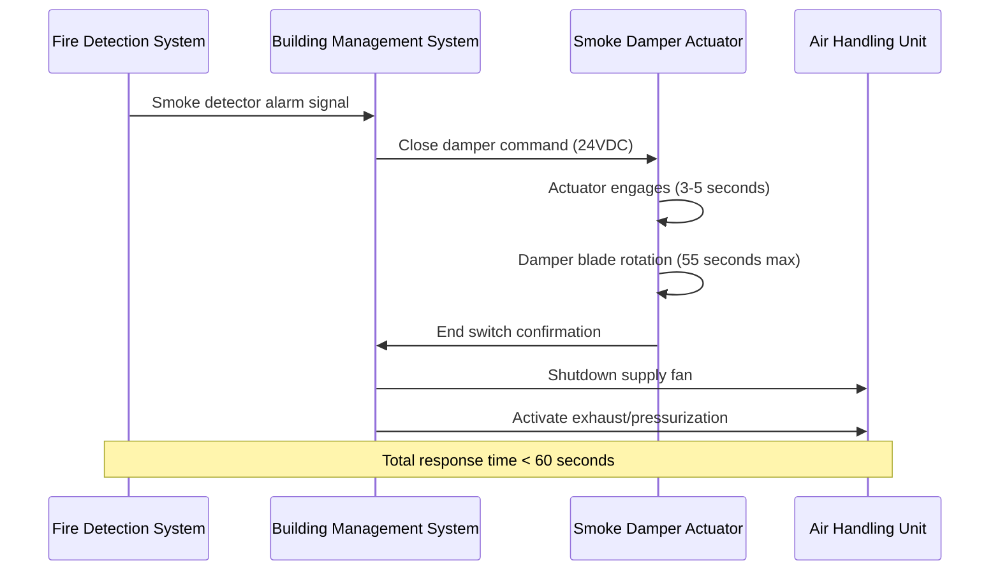

## Smoke Barrier Fundamentals

Smoke barriers constitute critical passive fire protection elements that compartmentalize tall buildings to prevent smoke migration during fire events. Unlike fire barriers that resist flame penetration, smoke barriers address the primary cause of fire fatalities in high-rise structures: smoke inhalation and visibility loss.

The physics of smoke movement in tall buildings involves buoyancy-driven flow, stack effect pressure differentials, and HVAC-induced transport. Smoke temperature typically ranges from 200-600°C at the fire source, creating significant buoyancy forces described by:

$$\Delta P = \rho_0 g h \left(\frac{T_0}{T_s} - 1\right)$$

Where:
- $\Delta P$ = pressure differential across barrier (Pa)
- $\rho_0$ = ambient air density (kg/m³)
- $g$ = gravitational acceleration (9.81 m/s²)
- $h$ = height differential (m)
- $T_0$ = ambient temperature (K)
- $T_s$ = smoke temperature (K)

In a 100m tall building with a fire generating 400°C smoke, the stack effect pressure differential reaches approximately 50 Pa, sufficient to drive smoke through unsealed penetrations at velocities exceeding 5 m/s.

## Horizontal vs. Vertical Smoke Barriers

### Horizontal Barriers

Floor assemblies serve as primary horizontal smoke barriers, rated typically for 1-hour or 2-hour fire resistance per IBC Section 403.2.1. The critical challenge involves maintaining continuity where HVAC systems penetrate these assemblies.

Horizontal barrier leakage area must not exceed 0.00065 m² per m² of barrier area (NFPA 92 requirement). For a typical 1000 m² floor plate, maximum allowable leakage equals 0.65 m², yet a single 300mm unsealed duct penetration alone provides 0.071 m² of leakage path.

### Vertical Barriers

Vertical smoke barriers divide floor plates into separate smoke compartments, limiting smoke spread horizontally. IBC Section 709 requires vertical barriers in covered mall buildings, Group I-2 occupancies, and underground buildings.

Vertical barriers must extend from floor slab to underside of the floor or roof deck above, creating complete compartmentalization. HVAC distribution often follows corridor paths, requiring numerous penetrations through vertical barriers.

## HVAC Penetration Sealing Requirements

Every HVAC penetration through a smoke barrier creates a potential smoke leakage path. Sealing systems must maintain both fire resistance rating and smoke leakage limits.

### Sealing Material Performance

| Seal Type | Fire Rating | Leakage Rate (m³/s/m²) | Temperature Limit | Application |
|-----------|-------------|------------------------|-------------------|-------------|
| Intumescent firestop | 2-hour | < 0.005 | 1093°C | Duct penetrations |
| Mineral wool with sealant | 2-hour | < 0.008 | 1093°C | Cable/pipe bundles |
| Fire-rated silicone | 1-hour | < 0.003 | 982°C | Small gaps, joints |
| Ceramic fiber | 3-hour | < 0.010 | 1260°C | Large openings |
| Mortar/grout | 3-hour | < 0.002 | 1316°C | Masonry penetrations |

Intumescent materials expand upon heating, with expansion ratios of 10:1 to 50:1. The expansion follows a temperature-dependent volume change:

$$V(T) = V_0 \left[1 + \alpha(T - T_0)\right]^n$$

Where $\alpha$ represents the expansion coefficient and $n$ typically ranges from 2-4 depending on formulation. This nonlinear expansion provides effective sealing as smoke temperatures rise.

## Fire Dampers and Smoke Dampers

### Fire Damper Specifications

Fire dampers protect duct penetrations through fire barriers and fire walls. Per IBC Section 717.3.2, fire dampers must be installed where ducts penetrate fire-resistance-rated assemblies, with specific exceptions for HVAC systems meeting performance criteria.

**Damper activation mechanisms:**
- **Static systems:** 165°F (74°C) fusible link closure
- **Dynamic systems:** 165°F or 286°F rating depending on maximum air temperature
- **Closure time:** < 4 minutes for vertical installation, < 2 minutes for horizontal

The fusible link melts when heat flux raises link temperature above rating. Heat transfer to the link follows:

$$\frac{dT_{link}}{dt} = \frac{h A_{link}}{m_{link} c_p}(T_{gas} - T_{link})$$

Where $h$ is the convective heat transfer coefficient (typically 25-50 W/m²·K for low-velocity airflow), and response time depends on link thermal mass and surface area.

### Smoke Damper Requirements

Smoke dampers respond to smoke detection signals, closing to prevent smoke migration through HVAC ducts. NFPA 105 and UL 555S establish performance standards.

**Key performance parameters:**
- Leakage class: I (4.0 m³/hr/m²), II (20 m³/hr/m²), or III (40 m³/hr/m²) at 249 Pa
- Closure time: < 60 seconds upon detection signal
- Elevated temperature rating: Class I (121°C) or II (163°C) for 2 hours

**Combination fire/smoke dampers** integrate both functions, operating either on fusible link melting or smoke detector signal, whichever occurs first. These devices reduce penetration complexity but require coordination between fire alarm and HVAC control systems.

## Smoke Barrier Continuity and Integrity

### Partition to Deck Sealing

Vertical smoke barriers must extend continuously from the floor slab to the underside of the structural deck above, even in suspended ceiling installations. IBC Section 709.4 requires smoke barriers to form an effective membrane continuous from outside wall to outside wall.

**Common integrity failures:**
- Unsealed gap between partition head and deck (typical gap: 25-50 mm)
- HVAC plenums connecting adjacent smoke compartments
- Return air paths above ceiling creating bypass routes
- Penetrations for sprinkler pipes, electrical conduit without proper firestopping

The leakage flow rate through a gap follows the orifice equation:

$$Q = C_d A \sqrt{\frac{2\Delta P}{\rho}}$$

For a 1 mm gap extending 10 m along a partition under 25 Pa pressure differential, leakage flow exceeds 0.05 m³/s, sufficient to transport smoke at dangerous concentrations.

### Testing and Verification

**Field testing methods:**

| Test Method | Pressure Differential | Acceptance Criteria | Application |
|-------------|----------------------|---------------------|-------------|
| ASTM E283 (compartment) | 75 Pa | < 0.00065 m²/m² leakage | New construction verification |
| Door fan pressurization | 25-75 Pa | Pressure differential maintained | Corridor smoke barriers |
| Smoke pencil visualization | Natural convection | No visible smoke migration | Penetration seal verification |
| Tracer gas (SF₆) | Operating conditions | < 5% concentration transfer | System performance validation |

**Damper testing requirements (NFPA 105):**
- Initial acceptance: 100% operational test
- Periodic inspection: Annually for hospitals, 4 years for other occupancies
- Operational test: Verify closure, check blade alignment, measure closure time
- Leakage test: After 2000 cycles or when degradation suspected

### Maintaining Barrier Integrity Through Building Life

Smoke barrier integrity degrades through building modifications, maintenance activities, and material aging. Systematic integrity management requires:

1. **Documentation:** As-built drawings showing all barrier locations and penetrations
2. **Modification control:** Permit system requiring firestopping inspection for any penetration
3. **Periodic inspection:** Visual examination of accessible seals and damper operability
4. **Performance testing:** Compartment pressurization testing every 5 years
5. **Damper maintenance:** Lubrication, linkage adjustment, actuator verification

The probability of barrier failure increases with the number of unsealed penetrations following:

$$P_{failure} = 1 - (1 - p_{penetration})^n$$

Where $p_{penetration}$ represents individual penetration failure probability (typically 0.02-0.05 for properly installed systems) and $n$ equals the number of penetrations. For a floor with 50 penetrations at 3% individual failure rate, overall compartment integrity has approximately 78% reliability, emphasizing the importance of systematic maintenance.

## Code Compliance Summary

**IBC Requirements:**
- Section 403.2.1: Fire-resistance-rated floor assemblies
- Section 709: Smoke barrier construction and continuity
- Section 717: Duct and air transfer opening protection

**NFPA Standards:**
- NFPA 90A: Installation of air-conditioning and ventilating systems
- NFPA 92: Smoke control systems
- NFPA 101: Life Safety Code smoke barrier requirements
- NFPA 105: Smoke door assemblies and other opening protectives

Proper smoke barrier design and maintenance represents a critical life safety system in tall buildings, requiring coordination between architectural, structural, mechanical, and fire protection disciplines throughout the building lifecycle.
