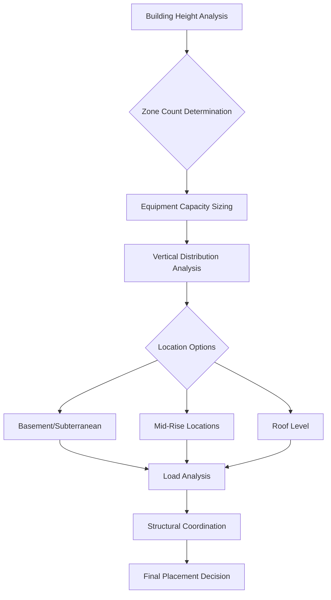

Vertical zoning represents the fundamental organizational strategy for HVAC systems in tall buildings, dividing the building height into independent mechanical zones to manage stack effect, equipment capacity limitations, and fire/life safety requirements. This approach directly addresses the physical challenges created by building height, where conventional single-zone systems become impractical above 15-20 stories.

## Physical Basis for Vertical Zoning

The primary driver for vertical zoning is the stack effect, which creates pressure differentials proportional to building height. The pressure difference between indoor and outdoor air at any height is:

$$\Delta P = \rho g h \left(\frac{1}{T_o} - \frac{1}{T_i}\right)$$

where $\rho$ is air density (kg/m³), $g$ is gravitational acceleration (9.81 m/s²), $h$ is height above neutral pressure plane (m), $T_o$ is outdoor absolute temperature (K), and $T_i$ is indoor absolute temperature (K).

For a 300 m tall building with a 30°C temperature difference, the total pressure differential reaches approximately 360 Pa (1.44 in. w.c.), creating significant infiltration, exfiltration, and door operability issues if not compartmentalized.

## Vertical Zone Configuration

Standard vertical zone heights range from 15 to 25 floors, with typical configurations:

| Building Height | Zone Strategy | Mechanical Floors | Zone Height |
|-----------------|---------------|-------------------|-------------|
| 20-40 floors | 2 zones | Mid-rise, roof | 15-20 floors |
| 40-60 floors | 3 zones | Low-rise, mid-rise, roof | 15-20 floors |
| 60-80 floors | 4 zones | Every 15-20 floors | 15-20 floors |
| 80+ floors | 5+ zones | Every 12-18 floors | 12-18 floors |

Zone height limitations stem from multiple factors:

**Duct Static Pressure Limits**: Fan discharge pressures typically limited to 6-10 in. w.c. for commercial applications. Excessive duct runs require impractical static pressures:

$$\Delta P_{total} = \Delta P_{equipment} + \Delta P_{duct} + \Delta P_{fittings}$$

**Piping Pressure Limits**: Standard hydronic equipment rated to 150-175 psig working pressure. Vertical water column pressure increases at 0.433 psi/ft (9.8 kPa/m), limiting single-zone height to approximately 300-350 ft without pressure-reducing stations.

**Fire Code Compartmentation**: IBC and NFPA 101 limit smoke control zone heights, typically requiring separation every 75 ft (23 m) or every story, whichever is less.

## Mechanical Floor Placement Strategy

Mechanical floor location follows systematic analysis of system efficiency and architectural impact:

**Basement Mechanical Floors**: Serve lower 15-20 floors. Advantages include easier equipment delivery, structural support, noise isolation. Disadvantages include flooding risk, ventilation requirements, vertical distribution challenges.

**Mid-Rise Mechanical Floors**: Optimize vertical distribution, reduce riser lengths. Typical placement at 1/3 and 2/3 building height for three-zone systems. Floor area requirement: 8-12% of served floor area for full mechanical floor, or 4-6% for partial mechanical rooms on multiple levels.

**Roof Mechanical Floors**: Standard for top zone service. Minimize vertical distribution to upper floors but complicate equipment rigging and replacement. Structural requirements increase due to equipment weight at building extremity.

## Pressure Break Floor Implementation

Pressure break floors create hydraulic separation between vertical zones, preventing excessive static pressure at lower levels. Required when total system height exceeds equipment pressure ratings:

$$P_{static} = \rho g h$$

For water at 20°C, density $\rho = 998$ kg/m³, creating 97.8 kPa (14.2 psi) pressure per 10 m of elevation.

### Heat Exchanger Configuration

Pressure break floors employ plate-and-frame heat exchangers to hydraulically separate zones while maintaining thermal continuity:

**Primary Side (Lower Zone)**:
- Design pressure: 150-175 psig working pressure
- Flow rate: $\dot{m} = \frac{Q}{c_p \Delta T}$ where $Q$ is zone load (kW)
- Approach temperature: 1-2°C typical

**Secondary Side (Upper Zone)**:
- Lower working pressure requirements
- Independent expansion tank and air separation
- Separate pumping with variable speed control

Heat exchanger effectiveness:

$$\epsilon = \frac{T_{h,in} - T_{h,out}}{T_{h,in} - T_{c,in}}$$

Target effectiveness: 0.85-0.95 for minimal temperature penalty.

### Pumping Energy Considerations

Pressure break floors increase pumping energy through added pressure drop (typically 10-20 kPa per heat exchanger) but reduce total system pressure requirements. Energy balance analysis required:

$$W_{pump} = \frac{\dot{V} \Delta P}{\eta_{pump}}$$

where $\dot{V}$ is volumetric flow rate (m³/s), $\Delta P$ is total pressure rise (Pa), and $\eta_{pump}$ is pump efficiency.

## Water System Pressure Zones

Plumbing and HVAC water systems require separate pressure zones to protect equipment and prevent component failure:

| System | Pressure Limit | Zone Height | Pressure Control |
|--------|----------------|-------------|------------------|
| Chilled water | 150 psig | 300-350 ft | Heat exchangers, PRVs |
| Hot water | 150 psig | 300-350 ft | Heat exchangers, PRVs |
| Condenser water | 150 psig | 300-350 ft | Heat exchangers |
| Domestic cold | 80 psig | 150-180 ft | PRV stations |
| Domestic hot | 80 psig | 150-180 ft | PRV stations |

Pressure-reducing valve (PRV) stations provide alternative to heat exchangers for non-thermal transfer applications. PRV sizing follows:

$$C_v = Q \sqrt{\frac{SG}{\Delta P}}$$

where $C_v$ is valve flow coefficient, $Q$ is flow rate (gpm), $SG$ is specific gravity, and $\Delta P$ is pressure drop (psi).

## Smoke Control Coordination

Vertical zoning must integrate with smoke control strategies per NFPA 92 and IBC Section 909. Each vertical zone requires independent smoke control capability:

**Pressurization Requirements**: Minimum 0.05 in. w.c. (12.5 Pa) pressure difference across smoke barrier. Supply fan capacity must overcome:

$$\Delta P_{required} = \Delta P_{design} + \Delta P_{leakage} + \Delta P_{weather}$$

**Exhaust Coordination**: Mechanical zones aligned with smoke control zones prevent cross-contamination. Exhaust fans sized for 4-6 air changes per hour in smoke zone, with makeup air provided to adjacent zones.

**Vertical Shaft Pressurization**: Stairwells, elevator shafts require minimum 0.10 in. w.c. (25 Pa) in tall buildings per NFPA 92. Pressure control dampers every 5-10 floors maintain uniform pressurization:

$$\dot{m}_{required} = \frac{A_{leakage} \sqrt{2 \rho \Delta P}}{C_d}$$

where $A_{leakage}$ is total leakage area (m²), $C_d$ is discharge coefficient (typically 0.65).

## Zone Independence Requirements

Each vertical zone must operate independently for reliability and maintenance flexibility:

- **Separate air handling systems**: No vertical air distribution between zones except dedicated shafts
- **Independent controls**: Building automation system capable of zone-level shutdown without affecting other zones
- **Redundant equipment**: Critical systems require N+1 redundancy within each zone
- **Emergency power**: Life safety systems powered within each zone independently

Zone isolation during fire events requires automatic dampers at zone boundaries rated for 1.5-hour or 3-hour fire resistance matching shaft construction per NFPA 90A and IBC Section 717.

## Design Integration Considerations

Successful vertical zoning requires coordination across disciplines:

**Structural**: Mechanical floor loading 150-250 psf typical, requiring reinforced floor construction and transfer beams for column-free equipment areas.

**Architectural**: Mechanical floor height 14-18 ft clear, with additional clearance for overhead piping and duct distribution.

**Electrical**: Dedicated electrical rooms within each mechanical floor, with separate feeders from main switchgear or zone substations.

**Plumbing**: Domestic water, sanitary, storm drainage pressure zones aligned with HVAC zones where practical to minimize vertical penetrations.

Vertical riser shaft sizing accommodates all services: 4-6% of typical floor area for combined mechanical, electrical, plumbing, and fire protection risers in modern high-rise construction.
