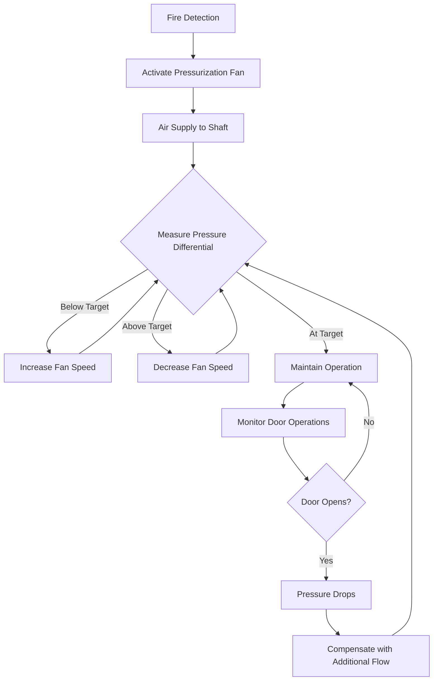
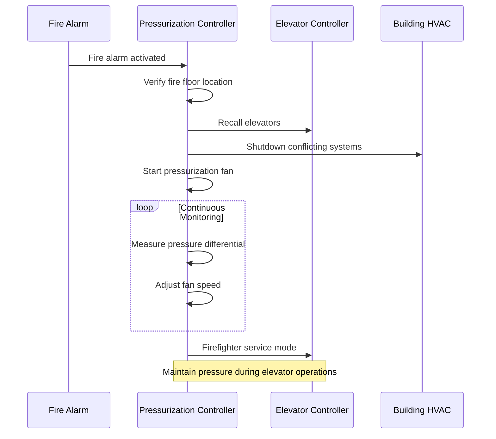

Elevator shaft pressurization represents a critical smoke control strategy in tall buildings, preventing smoke migration through vertical shafts during fire emergencies. The system maintains positive pressure within the elevator hoistway relative to adjacent building spaces, creating a physical barrier that prevents smoke infiltration and protects firefighter access routes.

## Physical Principles of Shaft Pressurization

The effectiveness of elevator shaft pressurization relies on maintaining a pressure differential that opposes buoyancy-driven smoke movement. During a fire, hot smoke generates significant buoyancy forces that drive vertical migration through any available pathway. The pressure difference required to prevent smoke penetration depends on the temperature differential between the smoke layer and the shaft air.

The minimum pressure differential to prevent smoke infiltration is:

$$\Delta P_{min} = \rho g h \left(\frac{T_s - T_{shaft}}{T_{shaft}}\right)$$

where $\rho$ is air density (1.2 kg/m³ at standard conditions), $g$ is gravitational acceleration (9.81 m/s²), $h$ is the vertical height of the smoke column, $T_s$ is the smoke temperature (K), and $T_{shaft}$ is the shaft air temperature (K).

NFPA 92 specifies minimum pressure differentials ranging from 25 Pa to 75 Pa depending on application, with 50 Pa (0.2 in. H₂O) being typical for elevator shaft protection.

## Air Supply Requirements

The air supply system must deliver sufficient volumetric flow to maintain the target pressure differential while compensating for leakage through hoistway doors, construction joints, and other penetrations. The total airflow requirement consists of leakage flow plus a safety margin for system variations.

### Leakage Flow Calculation

Door leakage follows the orifice flow equation, where flow is proportional to the square root of pressure difference:

$$Q_{leak} = C_d A \sqrt{\frac{2\Delta P}{\rho}}$$

where $Q_{leak}$ is volumetric leakage flow (m³/s), $C_d$ is the discharge coefficient (typically 0.65-0.7 for door gaps), $A$ is the total leakage area (m²), $\Delta P$ is the pressure differential (Pa), and $\rho$ is air density (kg/m³).

For elevator hoistway doors, NFPA 92 provides leakage area data based on door type and installation quality:

| Door Type | Leakage Area per Door |
|-----------|----------------------|
| Standard elevator doors | 0.056 m² (0.6 ft²) |
| Gasketed elevator doors | 0.037 m² (0.4 ft²) |
| Tight-fitting gasketed doors | 0.019 m² (0.2 ft²) |

The total supply airflow requirement is:

$$Q_{supply} = 1.25 \times \sum_{i=1}^{n} Q_{leak,i}$$

where the 1.25 factor provides a 25% safety margin for system uncertainties, construction variations, and door operations.

## Pressure Differential Maintenance

Maintaining consistent pressure differentials throughout the shaft height presents challenges due to stack effect, wind pressures, and door operations. The net pressure at any elevation is:

$$\Delta P(z) = \Delta P_{fan} + \Delta P_{stack}(z) + \Delta P_{wind}(z) - \Delta P_{friction}(z)$$

where $\Delta P_{fan}$ is the fan-generated pressure, $\Delta P_{stack}$ is the stack effect component, $\Delta P_{wind}$ is the wind-induced pressure, and $\Delta P_{friction}$ represents frictional losses in the shaft.

### Stack Effect Interaction

In cold weather, exterior stack effect generates upward pressure gradients that can either assist or oppose shaft pressurization depending on shaft location and building configuration. The stack effect pressure difference between two elevations is:

$$\Delta P_{stack} = 3460 h \left(\frac{1}{T_o} - \frac{1}{T_i}\right)$$

where $h$ is height difference (m), $T_o$ is outdoor absolute temperature (K), and $T_i$ is indoor absolute temperature (K).

For a 100 m tall building with outdoor temperature of -10°C (263 K) and indoor temperature of 20°C (293 K), the stack effect generates approximately 133 Pa of pressure difference, which can significantly affect shaft pressurization performance.

## Hoistway Door Leakage Considerations

Door leakage characteristics fundamentally influence system design and performance. The relationship between pressure and leakage is nonlinear, requiring iterative calculations for accurate system sizing.

### Multiple Door Scenarios

When multiple hoistway doors exist on a single floor (common in high-rise buildings with multiple elevator banks), the cumulative leakage area increases substantially. For a floor with three elevator shafts, each with standard doors:

$$A_{total} = 3 \times 0.056 = 0.168 \text{ m}^2$$

At 50 Pa pressure differential, the leakage flow per floor is:

$$Q_{leak} = 0.65 \times 0.168 \times \sqrt{\frac{2 \times 50}{1.2}} = 0.995 \text{ m}^3/\text{s} \approx 2100 \text{ cfm}$$

For a 30-story building, total leakage could approach 63,000 cfm (30,000 L/s), requiring substantial fan capacity.

## Design Pressure Differential Strategies

NFPA 92 recommends stratified pressure control approaches based on building height and operational requirements:

| Building Height | Recommended Pressure Differential | Control Strategy |
|----------------|----------------------------------|------------------|
| < 23 m (75 ft) | 25-50 Pa | Single-zone constant pressure |
| 23-75 m (75-250 ft) | 40-60 Pa | Two-zone variable pressure |
| > 75 m (250 ft) | 50-75 Pa | Multi-zone adaptive control |

Higher pressures provide greater safety margins but increase energy consumption, structural loads on doors, and difficulty in door operation during emergencies.

## Supply Air Distribution Methods

Air introduction methods significantly affect pressure uniformity and system performance. Three primary approaches exist:

**Top supply**: Air injected at the shaft upper terminus, relying on downward distribution. Effective for buildings under 15 stories but creates pressure gradients in taller applications.

**Bottom supply**: Air introduced at shaft base, creating upward flow. Aligns with natural buoyancy but may create excessive pressures at upper levels in very tall buildings.

**Multi-point supply**: Air injected at multiple elevations (typically every 10-15 floors), providing superior pressure uniformity across building height. Required for buildings exceeding 75 m height per NFPA 92 recommendations.

The pressure distribution for multi-point supply with injection points at elevations $z_1, z_2, ..., z_n$ can be approximated as:

$$\Delta P(z) = \Delta P_{target} - C_{friction} |z - z_{nearest}|$$

where $z_{nearest}$ is the elevation of the nearest supply point and $C_{friction}$ is the frictional loss coefficient (typically 0.1-0.3 Pa/m for elevator shafts).

## Control System Integration

Modern elevator shaft pressurization systems integrate with building fire alarm and HVAC control systems to coordinate emergency operations:

Pressure monitoring at multiple elevations enables real-time control adjustments, compensating for door operations, weather changes, and system variations. Modern systems employ variable frequency drives (VFDs) to modulate fan speed based on measured pressure differentials, maintaining target pressures within ±10 Pa tolerance.

## Testing and Commissioning

NFPA 92 requires comprehensive testing to verify system performance under various scenarios including worst-case door leakage, extreme weather conditions, and simultaneous door operations. Acceptance criteria include:

- Pressure differential maintained at all monitoring points
- Maximum door opening forces below 133 N (30 lbf)
- Recovery time under 30 seconds after door operation
- Uniform pressure distribution within ±15% of target value

Field testing typically reveals 15-25% higher airflow requirements than calculated due to construction defects, additional leakage paths, and installation variations, justifying the design safety margins.

