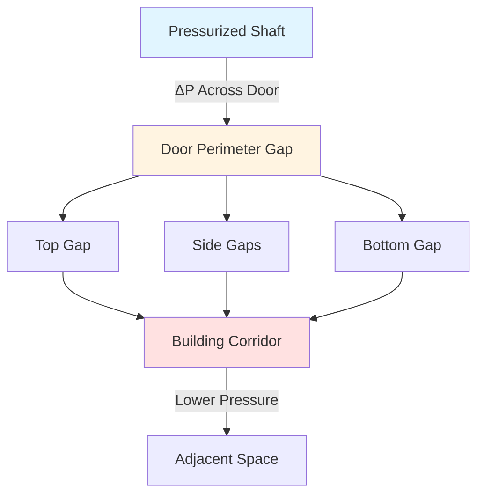
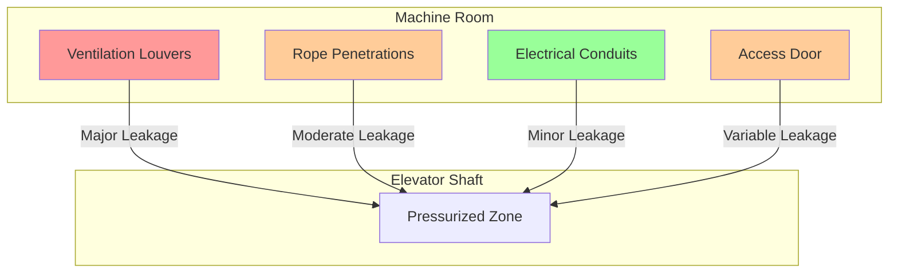

Air leakage paths in elevator shafts represent critical elements in pressurization system design and performance. Understanding the physics of air movement through these paths enables accurate system sizing and ensures effective smoke control during fire emergencies. The primary leakage mechanisms involve flow through openings governed by pressure differentials and orifice flow equations.

## Hoistway Door Leakage Physics

Elevator hoistway doors constitute the dominant leakage path in most pressurization systems. The air flow through door clearances follows orifice flow principles, where the relationship between pressure differential and volumetric flow is nonlinear.

The flow rate through a door perimeter gap is calculated using:

$$Q = C_d A \sqrt{\frac{2\Delta P}{\rho}}$$

Where $Q$ represents volumetric flow rate (cfm), $C_d$ is the discharge coefficient (typically 0.60-0.65 for door gaps), $A$ denotes the effective leakage area (ft²), $\Delta P$ is the pressure differential across the opening (lbf/ft²), and $\rho$ represents air density (lbm/ft³).

For standard conditions ($\rho = 0.075$ lbm/ft³), this simplifies to:

$$Q = 2610 \times C_d \times A \times \sqrt{\Delta P}$$

With $\Delta P$ in inches water column and $Q$ in cfm.

### Door Clearance Specifications

NFPA 92 specifies maximum allowable clearances for elevator hoistway doors in pressurized systems. The standard approach uses equivalent leakage area rather than direct gap measurements.

| Door Component | Typical Clearance | Maximum Allowable (NFPA 92) |
|----------------|-------------------|------------------------------|
| Top gap | 1/8 to 1/4 inch | Limited by total ELA |
| Side gaps (each) | 1/8 to 3/16 inch | Limited by total ELA |
| Bottom gap | 3/8 to 3/4 inch | Limited by total ELA |
| Meeting edge | 1/16 to 1/8 inch | Limited by total ELA |

The total perimeter length for a standard elevator door is:

$$L_{perimeter} = 2h + 2w + w_{meeting}$$

Where $h$ represents door height, $w$ is door width, and $w_{meeting}$ accounts for the center meeting edge on center-opening doors.

## Equivalent Leakage Area Calculations

The equivalent leakage area (ELA) provides a standardized metric for comparing and calculating total shaft leakage. It represents the area of a sharp-edged orifice that would produce the same flow rate at a reference pressure differential.

For a complete shaft with $n$ floors:

$$A_{total} = \sum_{i=1}^{n} A_{door,i} + A_{walls} + A_{penetrations} + A_{machine}$$

Each door's leakage area depends on door construction:

$$A_{door} = g_{avg} \times L_{perimeter} \times f_{gap}$$

Where $g_{avg}$ is the average gap width, $L_{perimeter}$ is total perimeter length, and $f_{gap}$ is a gap effectiveness factor (0.8-1.0) accounting for non-uniform gaps.

### NFPA 92 Leakage Area Limits

NFPA 92 establishes maximum equivalent leakage areas based on the pressurization system's ability to maintain required pressure differentials:

- Maximum door leakage: 0.10 ft² per door at 0.10 inch w.c.
- Maximum wall leakage: 0.0003 ft²/ft² of shaft wall area
- Machine room openings: Must be included in calculations or sealed

The total system flow requirement becomes:

$$Q_{total} = 2610 \sum_{i=1}^{n} A_i \sqrt{\Delta P_i} + Q_{car} + Q_{safety}$$

Where $Q_{car}$ accounts for car leakage when stationary and $Q_{safety}$ provides a safety margin (typically 10-20%).

## Machine Room Openings

Machine room penetrations represent significant leakage paths that vary with equipment configuration. Traction elevators with overhead machine rooms create different leakage patterns than hydraulic or machine-room-less designs.

### Overhead Machine Room

For traditional traction elevators:

$$A_{machine} = A_{ropes} + A_{ventilation} + A_{door} + A_{cable}$$

Typical values:
- Rope/cable penetrations: 0.15-0.30 ft² per elevator
- Ventilation louvers (if unsealed): 1.0-2.5 ft²
- Machine room access door: 0.05-0.15 ft²
- Electrical penetrations: 0.02-0.05 ft²

Machine room ventilation requires careful coordination. ASME A17.1 mandates machine room cooling, which conflicts with shaft pressurization objectives. Solutions include:

1. Dedicated sealed cooling systems for machine rooms
2. Motorized dampers that close during smoke control activation
3. Pressure relief between shaft and machine room

## Shaft Wall and Penetration Leakage

Shaft wall construction significantly impacts total leakage. Gypsum wallboard assemblies exhibit different leakage characteristics than concrete or masonry construction.

The wall leakage area scales with surface area:

$$A_{wall} = \alpha \times A_{surface}$$

Where $\alpha$ represents the leakage coefficient (ft²/ft²):
- Sealed concrete: $\alpha = 0.0001$ to $0.0002$
- Gypsum board (sealed joints): $\alpha = 0.0002$ to $0.0004$
- Unsealed gypsum: $\alpha = 0.0005$ to $0.0010$

Penetrations through shaft walls must be sealed to maintain pressurization integrity:

| Penetration Type | Typical Leakage if Unsealed | Sealing Method |
|------------------|----------------------------|----------------|
| HVAC ducts | 0.15-0.40 ft²/penetration | Fire-rated dampers with gaskets |
| Plumbing pipes | 0.05-0.15 ft²/penetration | Intumescent collars |
| Electrical conduit | 0.02-0.08 ft²/penetration | Fire-rated putty pads |
| Communication cables | 0.10-0.25 ft²/penetration | Cable transit systems |

## Leakage Testing Methods

Accurate determination of shaft leakage areas requires systematic testing procedures. NFPA 92 Annex D provides testing protocols for elevator shaft pressurization systems.

### Fan Pressurization Testing

The blower door method adapted for elevator shafts:

1. Seal one shaft opening (typically machine room)
2. Install calibrated fan at another opening
3. Pressurize shaft to multiple pressure levels
4. Measure flow rate at each pressure level
5. Calculate ELA from flow-pressure relationship

The equivalent leakage area at reference pressure $P_{ref}$ (typically 0.10 inch w.c.):

$$A_{ELA} = \frac{Q_{ref}}{2610 \times C_d \times \sqrt{P_{ref}}}$$

Data from multiple pressure levels enables validation:

$$Q = K \times (\Delta P)^n$$

Where the exponent $n$ should approach 0.5 for orifice-dominated flow. Deviations indicate unusual leakage patterns or measurement errors.

### Door Leakage Measurement

Individual door leakage testing involves:

1. Pressurize shaft to target differential (0.10-0.15 inch w.c.)
2. Measure air velocity across door perimeter using hot-wire anemometer
3. Calculate flow: $Q_{door} = V_{avg} \times A_{gap}$
4. Compare against allowable limits

The velocity profile across door gaps exhibits boundary layer effects:

$$V(y) = V_{max}\left(1 - e^{-y/\delta}\right)$$

Where $y$ represents distance from gap surface and $\delta$ is boundary layer thickness (typically 0.1-0.2 times gap width).

### Multi-Point Pressure Mapping

For tall shafts, pressure varies with height due to stack effect:

$$\Delta P(z) = \Delta P_0 - \rho g z \left(\frac{1}{T_{shaft}} - \frac{1}{T_{outdoor}}\right)$$

Where $z$ is height above reference point, $g$ is gravitational acceleration, and $T$ represents absolute temperature. Testing must account for vertical pressure gradients when determining leakage distribution.

## Design Considerations

Effective shaft pressurization design requires balancing multiple leakage paths:

1. **Door leakage dominates** - Typically 60-80% of total shaft leakage
2. **Machine room control** - Critical for achieving design pressures
3. **Wall tightness** - More important in older buildings with construction gaps
4. **Penetration sealing** - Essential for maintaining pressure boundaries

The system supply air requirement must overcome all leakage paths while maintaining minimum pressure differential (typically 0.10 inch w.c. per NFPA 92) at the most challenging door, usually the ground floor during maximum stack effect.

Accurate leakage characterization enables proper fan sizing, reduces energy consumption, and ensures reliable smoke control performance throughout the building's operational life.
