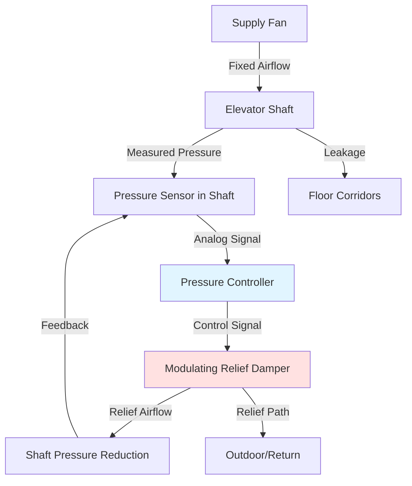

## Fundamentals of Shaft Pressure Relief

Elevator shaft pressurization systems introduce supply air to prevent smoke infiltration during fire events, but unchecked pressurization creates hazardous door opening forces. Pressure relief mechanisms regulate shaft pressure by exhausting excess air when differential pressure exceeds design thresholds.

The pressure differential across elevator doors follows:

$$\Delta P = P_{shaft} - P_{floor}$$

Where the force required to open the door is:

$$F_{door} = \Delta P \cdot A_{door} + F_{latch}$$

IBC Section 1009.3 limits maximum door opening force to 30 lbf (133 N) for egress doors. For a standard 3 ft × 7 ft (2.1 m²) elevator door, this constraint limits pressure differential to approximately 0.10 inches w.c. (25 Pa) above latch force requirements.

## Barometric Relief Dampers

### Operating Principle

Barometric dampers operate passively through aerodynamic forces. The damper blade pivots on an offset axis, creating rotational moments from both gravity and pressure differential:

$$\tau_{net} = \tau_{pressure} - \tau_{gravity}$$

When shaft pressure rises, the pressure-induced torque overcomes gravitational closing force, opening the damper. The damper modulates open proportionally to pressure differential, providing self-regulating relief without electrical controls.

### Sizing Methodology

Relief capacity must match the maximum supply airflow minus leakage through doors and shaft penetrations:

$$Q_{relief} = Q_{supply} - Q_{leakage}$$

Leakage airflow through doors follows orifice flow principles:

$$Q_{leakage} = C_d \cdot A_{gaps} \cdot \sqrt{\frac{2\Delta P}{\rho}}$$

For modern elevator doors with weatherstripping, $C_d \approx 0.65$ and total gap area ranges from 0.5 to 1.5 ft² per door.

**Barometric Damper Sizing Table:**

| Supply Airflow (CFM) | Number of Doors | Leakage (CFM @ 0.10" w.c.) | Relief Required (CFM) | Damper Size (in²) |
|----------------------|-----------------|----------------------------|-----------------------|-------------------|
| 3,000 | 8 | 450 | 2,550 | 850 |
| 5,000 | 12 | 650 | 4,350 | 1,450 |
| 8,000 | 20 | 950 | 7,050 | 2,350 |
| 12,000 | 30 | 1,300 | 10,700 | 3,570 |

Damper free area assumes 100 FPM face velocity at design pressure differential.

## Automatic Pressure Control Systems

### Control Sequence

Automatic systems employ pressure sensors and modulating dampers to maintain shaft pressure within narrow limits regardless of environmental conditions or building stack effect.



### Control Logic

The controller implements a PID algorithm:

$$u(t) = K_p \cdot e(t) + K_i \int_0^t e(\tau)d\tau + K_d \frac{de(t)}{dt}$$

Where:
- $u(t)$ = damper position command (0-100%)
- $e(t)$ = setpoint pressure minus measured pressure
- $K_p, K_i, K_d$ = proportional, integral, derivative gains

Typical setpoint: 0.08 inches w.c. (20 Pa) with ±0.02 inches w.c. deadband.

### System Response

Automatic systems respond to dynamic pressure changes from:
- Wind-induced building pressure fluctuations
- Stack effect variations with outdoor temperature
- Door opening events creating sudden pressure drops
- Adjacent shaft pressurization system activation

Response time requirements per NFPA 92 Section 5.2.3.3:
- Stabilize shaft pressure within 30 seconds of system activation
- Maintain pressure during door opening cycle (15-20 seconds)

## Relief Vent Sizing Calculations

### Step-by-Step Procedure

**1. Determine Maximum Supply Airflow**

Based on shaft volume and air change requirements:

$$Q_{supply} = \frac{V_{shaft} \cdot ACH}{60}$$

NFPA 92 recommends minimum 1 air change per minute for shafts serving underground levels.

**2. Calculate Leakage at Design Pressure**

Sum leakage through all doors and penetrations:

$$Q_{leak,total} = \sum_{i=1}^{n} C_{d,i} \cdot A_{i} \cdot \sqrt{\frac{2\Delta P_{design}}{\rho}}$$

**3. Size Relief Opening**

$$A_{relief} = \frac{Q_{relief}}{V_{relief}}$$

Where $V_{relief}$ = 500-800 FPM for gravity relief, 1000-1500 FPM for powered relief.

**4. Apply Safety Factor**

Multiply calculated area by 1.25 to account for:
- Damper blade interference (reduces free area 10-20%)
- Screen/louver resistance
- Installation imperfections

## Relief Vent Location Optimization

### Vertical Position

**Top of Shaft (Preferred):**
- Natural buoyancy assists relief flow
- Minimizes pressure gradient along shaft height
- Stack effect aids upward airflow

Pressure variation with elevation:

$$\frac{dP}{dz} = -\rho g$$

For a 400 ft shaft with 0.10 inches w.c. at bottom, natural stack pressure contributes 0.50-0.80 inches w.c. upward pressure gradient.

**Bottom Relief (Special Cases):**
- Required when top relief impossible (building configuration)
- Must overcome upward stack pressure
- Requires larger relief capacity or powered exhaust

### Horizontal Position

Locate relief points to minimize short-circuiting between supply and relief:

**Optimal Configuration:**
| Supply Location | Relief Location | Separation Distance | Short-Circuit Risk |
|-----------------|-----------------|---------------------|---------------------|
| Bottom center | Top corners (2 vents) | Full shaft height | Low |
| Mid-height | Top and bottom | 50% shaft height each | Medium |
| Bottom | Bottom opposite wall | 5-10 ft | High |

## Pressure Monitoring and Verification

### Sensor Placement

Install differential pressure sensors:
- Reference port: representative floor corridor
- Measurement port: shaft at mid-height
- Avoid locations near supply diffusers (±15 ft minimum)
- Shield from direct airflow

### Acceptance Testing

NFPA 92 Section 5.2.3.4 requires verification:

1. Measure pressure differential at each floor with all doors closed
2. Verify maximum door opening force ≤ 30 lbf
3. Test pressure recovery after door opening cycle
4. Confirm relief system activates before pressure limit

**Acceptance Criteria:**

```mermaid
graph LR
    A[System Activated] --> B{Pressure Stable Within 30s?}
    B -->|Yes| C{All Floors < 0.10" w.c.?}
    B -->|No| D[Adjust Supply/Relief]
    C -->|Yes| E{Door Force < 30 lbf?}
    C -->|No| D
    E -->|Yes| F[Test Door Opening Recovery]
    E -->|No| D
    F --> G{Pressure Recovers < 15s?}
    G -->|Yes| H[System Accepted]
    G -->|No| D
    D --> A

    style H fill:#90EE90
    style D fill:#FFB6C6
```

## Code Requirements Summary

**IBC 2021:**
- Section 1009.3: Maximum 30 lbf door opening force
- Section 909.20.5: Stairway and elevator shaft pressurization systems

**NFPA 92 (2021):**
- Section 5.2.3: Elevator shaft pressurization design
- Section 5.2.3.3: Pressure relief requirements
- Section 5.2.3.4: Acceptance testing procedures

**Design Pressure Limits:**
- Minimum: 0.05 inches w.c. (12.5 Pa) for smoke control effectiveness
- Maximum: 0.10 inches w.c. (25 Pa) to maintain door forces within limits
- Target: 0.08 inches w.c. (20 Pa) with automatic control

Relief systems bridge the critical balance between smoke control effectiveness and life safety egress requirements, requiring precise engineering to meet both objectives simultaneously.
