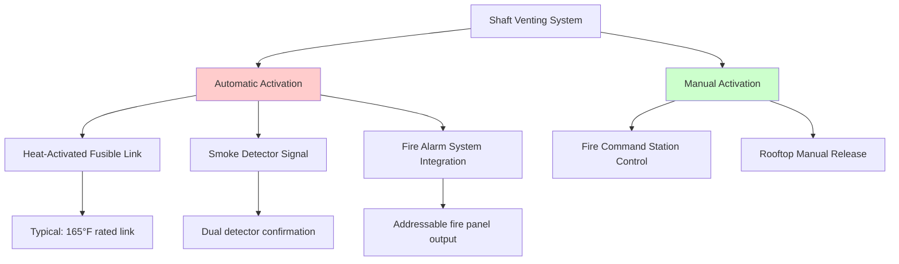
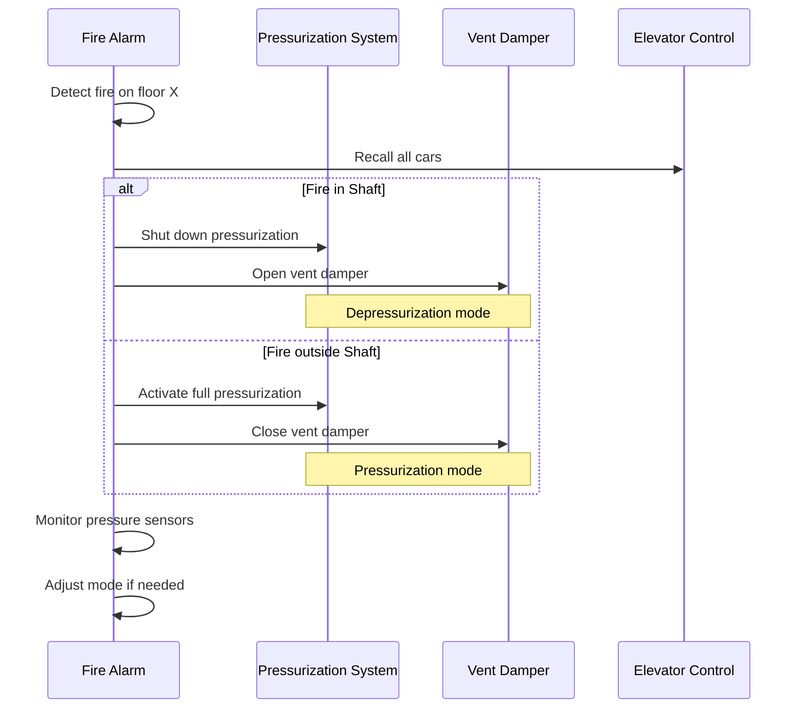

Elevator shaft venting serves dual purposes in high-rise HVAC systems: controlled smoke exhaust during fire emergencies and mitigation of stack effect-driven pressure differentials. The physics of buoyancy-driven flow and the geometric constraints of vertical shafts create unique design challenges that require careful coordination with pressurization systems.

## Fundamental Physics of Shaft Venting

The driving force for natural venting in elevator shafts stems from thermal buoyancy. When smoke enters a hoistway, the temperature differential generates an upward pressure gradient defined by:

$$\Delta P = \rho_0 g h \left(1 - \frac{T_0}{T_s}\right)$$

Where $\Delta P$ is the pressure differential (Pa), $\rho_0$ is ambient air density (kg/m³), $g$ is gravitational acceleration (9.81 m/s²), $h$ is shaft height (m), $T_0$ is ambient temperature (K), and $T_s$ is smoke temperature (K).

This buoyancy pressure must overcome flow resistance through the vent opening. The resulting volumetric flow rate through a roof vent follows:

$$Q = C_d A \sqrt{\frac{2\Delta P}{\rho}}$$

Where $Q$ is flow rate (m³/s), $C_d$ is discharge coefficient (typically 0.6-0.7 for sharp-edged openings), $A$ is vent area (m²), and $\rho$ is average density in the vent path.

## Code-Required Venting Provisions

### IBC Requirements

The International Building Code Section 3004.3 establishes baseline hoistway venting requirements:

- Vents required for elevator shafts serving four or more stories
- Minimum vent area: 3.5% of hoistway cross-sectional area
- Vent location: within 3 feet of the high point of the shaft
- Opening mechanism: either automatic heat or smoke activation, or manual operation

### NFPA 92 Smoke Control Standards

NFPA 92 provides performance-based guidance for hoistway venting systems:

| Parameter | Requirement | Rationale |
|-----------|-------------|-----------|
| Minimum vent area | Greater of code minimum or calculated exhaust requirement | Ensure adequate smoke removal capacity |
| Activation temperature | 140°F (60°C) for fusible links | Balance early activation with false alarm prevention |
| Manual override | Required from fire command station | Allow firefighter control during operations |
| Vent clear opening | 100% of rated area when fully open | Minimize flow restriction losses |

## Vent Sizing Calculations

### Design Approach

Shaft vent sizing requires analysis of three distinct scenarios:

1. **Fire emergency smoke exhaust** - Maximum anticipated smoke production
2. **Stack effect pressure relief** - Seasonal pressure differential mitigation
3. **Normal operation** - Minimal air leakage to maintain shaft cleanliness

#### Fire Emergency Sizing

The required vent area depends on the expected smoke production rate and allowable smoke layer descent velocity:

$$A_{vent} = \frac{Q_{smoke}}{v_{exit}}$$

Where $Q_{smoke}$ is smoke production rate (m³/s) and $v_{exit}$ is exhaust velocity through vent (m/s).

For typical elevator lobby fire scenarios, smoke production ranges from 2-5 m³/s per floor. The exhaust velocity through the vent depends on buoyancy pressure and can be estimated using the orifice equation.

**Worked Example:**

Consider a 30-story building with hoistway dimensions 4 m × 4 m (16 m² cross-section), total height 100 m, fire on 15th floor:

Assume smoke temperature: 500°C (773 K), ambient: 20°C (293 K)

$$\Delta P = 1.2 \times 9.81 \times 100 \times \left(1 - \frac{293}{773}\right) = 729 \text{ Pa}$$

$$v_{exit} = 0.65 \sqrt{\frac{2 \times 729}{1.2}} = 22.6 \text{ m/s}$$

For smoke generation rate of 3 m³/s:

$$A_{vent} = \frac{3}{22.6} = 0.133 \text{ m}^2$$

IBC minimum requirement: $0.035 \times 16 = 0.56$ m²

The code minimum of 0.56 m² exceeds the calculated requirement, providing margin for uncertainty in smoke production estimates.

#### Stack Effect Pressure Relief

During winter, warm building air in the shaft creates upward pressure. The vent must relieve excessive pressure to prevent door operation issues:

$$Q_{relief} = C_d A_{vent} \sqrt{\frac{2\Delta P_{stack}}{\rho}}$$

Where $\Delta P_{stack}$ is the stack effect pressure at the top of the shaft.

## Activation Systems

### Automatic Heat Activation

Fusible link systems provide fail-safe operation without power or signal wiring:

**Advantages:**
- No electrical power required
- Simple, reliable mechanism
- Self-testing (link visible for inspection)
- Inherently fail-safe (link melts in fire)

**Disadvantages:**
- Cannot be remotely closed after activation
- Single-use device requiring replacement
- Fixed activation temperature
- Slower response than electronic detection

Fusible links rated at 165°F (74°C) are standard, providing activation ahead of sprinkler operation (typically 212°F) while avoiding nuisance trips from solar heating.

### Automatic Smoke Detection

Photoelectric or ionization smoke detectors wired to motorized damper actuators enable faster response and remote control:

**Design Requirements:**
- Dual detector confirmation to prevent false activation
- Detectors located in shaft at top two floors
- Supervised circuits monitored by fire alarm panel
- Manual override capability from fire command station
- Battery backup power for actuators (4-hour minimum)

### Coordination with Pressurization Systems

Simultaneous operation of shaft pressurization and venting creates conflicting flows. The design must address this interaction:

| Scenario | Pressurization System | Vent Damper | Result |
|----------|----------------------|-------------|--------|
| Normal operation | Off | Closed | Minimal shaft airflow |
| Stack effect control | Modulated supply air | Partially open | Balanced pressure control |
| Fire - depressurization mode | Off | Open | Maximum smoke exhaust |
| Fire - pressurization mode | Full capacity | Closed | Maximum smoke exclusion |

**Control Logic:**

The fire alarm system must coordinate these modes based on fire location. Modern control sequences:

## Vent Design Details

### Vent Types

**Hinged Roof Hatch:**
- Most common configuration
- Single or double leaf construction
- Counterweighted or spring-assisted opening
- Gasket seals for weather resistance
- Typical size: 4 ft × 4 ft (1.2 m × 1.2 m)

**Louvered Penthouse Opening:**
- Provides weather protection
- Motorized damper blade control
- Higher flow resistance than open hatch
- Better aesthetic integration with penthouse architecture

**Dedicated Exhaust Fan System:**
- Mechanical exhaust overcomes wind effects
- Typical capacity: 2-4 air changes per minute of shaft volume
- Requires fire-rated power supply
- Allows closed vent during stack effect periods

### Installation Requirements

Critical details for effective vent operation:

- **Clearance:** 36-inch minimum around operable vent for maintenance access
- **Structural support:** Vent curb must support snow load plus wind uplift forces
- **Weatherproofing:** Continuous gasket seal when closed, minimum 4-inch curb height
- **Actuation force:** Maximum 25 pounds for manual release per IBC 3004.3

### Flow Resistance Minimization

The effective vent area differs from geometric area due to entry losses and friction:

$$A_{effective} = C_d \times A_{geometric}$$

Design practices to maximize $C_d$:

- Smooth transitions from shaft to vent opening
- Generous radius on sharp corners (minimum 2-inch radius)
- Full-open damper position 90° or greater
- Minimize screens or louvers in flow path

## Testing and Commissioning

Verification procedures confirm vent performance:

**Functional Testing:**
1. Manual operation test - verify 25 lb maximum force
2. Automatic activation test - simulate detector signal or heat source
3. Full-open verification - confirm 100% geometric opening achieved
4. Closing test (motorized only) - verify return to sealed position

**Performance Testing:**
- Smoke visualization - theatrical smoke to observe flow patterns
- Pressure measurement - verify pressure relief under simulated stack effect
- Activation time - measure delay from signal to full-open position

## Maintenance Requirements

Ongoing maintenance ensures reliable emergency operation:

| Component | Frequency | Procedure |
|-----------|-----------|-----------|
| Fusible links | Annual | Visual inspection, corrosion check |
| Damper operation | Semi-annual | Manual activation test, lubricate pivots |
| Smoke detectors | Annual | Sensitivity test per NFPA 72 |
| Weather seals | Annual | Inspect for damage, replace if degraded |
| Manual release cable | Annual | Operate release, check for binding |

Proper shaft venting design balances code compliance, fire safety performance, and operational considerations for stack effect control. The integration of venting with pressurization systems requires careful analysis of thermal buoyancy physics and coordinated control sequences to ensure effective smoke management across all operating scenarios.
