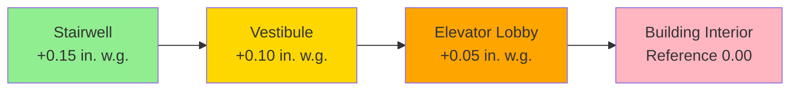
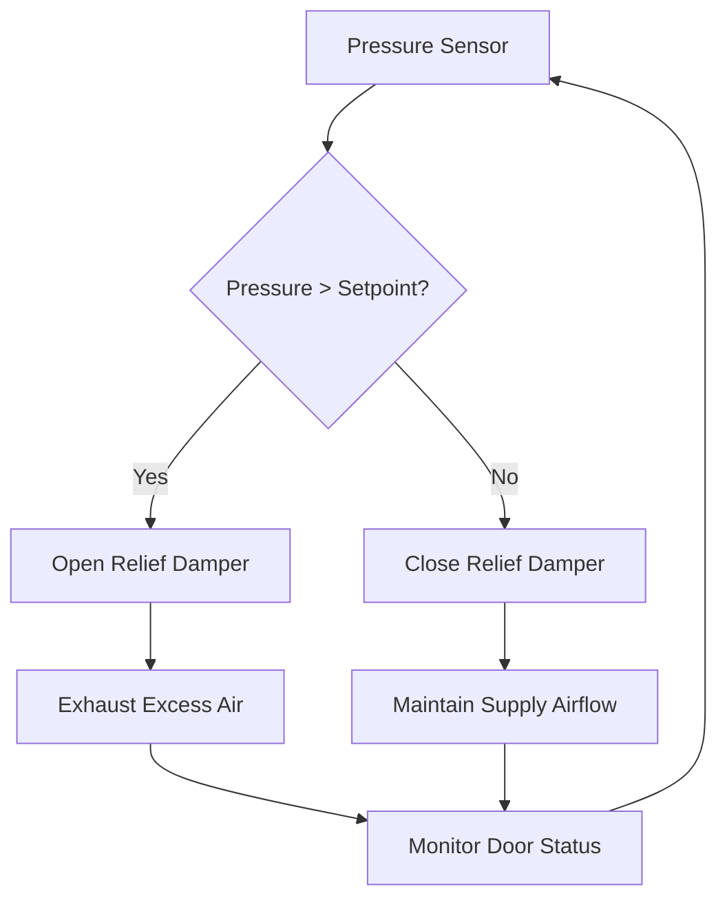

## Smoke-Proof Enclosure Fundamentals

Elevator lobby vestibules serve as critical fire safety barriers in high-rise buildings, protecting exit stairways from smoke migration while providing safe egress routes. The International Building Code (IBC Section 3008) and NFPA 92 establish prescriptive requirements for smoke-proof enclosures that connect elevator lobbies to exit stairways.

The fundamental physical principle involves creating a pressure cascade that prevents smoke infiltration. Air flows from high pressure to low pressure regions according to:

$$Q = C_d A \sqrt{\frac{2\Delta P}{\rho}}$$

where $Q$ represents volumetric airflow rate (cfm), $C_d$ is the discharge coefficient (typically 0.65 for doorways), $A$ is the flow area (ft²), $\Delta P$ is the pressure differential (in. w.g.), and $\rho$ is air density (lbm/ft³).

## Pressurization Requirements and Physics

IBC Section 3008.7 mandates minimum pressure differentials of 0.10 in. w.g. relative to adjacent spaces with all doors closed, and 0.05 in. w.g. with one door open. These values balance two competing physical demands: sufficient pressure to prevent smoke infiltration while maintaining door opening forces within acceptable limits.

The stack effect in tall buildings significantly impacts vestibule pressurization. The pressure difference due to stack effect is:

$$\Delta P_{stack} = 7.64 \times h \times \left(\frac{1}{T_o} - \frac{1}{T_i}\right)$$

where $h$ is the vertical distance (ft), $T_o$ is outdoor absolute temperature (°R), and $T_i$ is indoor absolute temperature (°R). During winter conditions in a 400 ft building with 70°F interior and 0°F exterior, this creates approximately 0.40 in. w.g. opposing the pressurization system at upper floors.

### Pressure Cascade Strategy

## Door Opening Force Analysis

NFPA 101 Section 7.2.1.4.5 limits door opening forces to 30 lbf, while ADA standards require maximum 5 lbf for interior doors. The force required to open a door against a pressure differential is:

$$F = \Delta P \times A \times k$$

where $F$ is opening force (lbf), $\Delta P$ is pressure difference (psf), $A$ is door area (ft²), and $k$ is a coefficient accounting for door geometry and hinge location (typically 0.5 for center-pivoting doors).

For a standard 3 ft × 7 ft door (21 ft²) with 0.10 in. w.g. (5.2 psf) differential:

$$F = 5.2 \times 21 \times 0.5 = 54.6 \text{ lbf}$$

This exceeds code limits, necessitating automatic pressure relief mechanisms.

## Vestibule Ventilation Configurations

NFPA 92 Section 5.2.3 recognizes three acceptable smoke-proof enclosure configurations:

| Configuration | Ventilation Method | Key Requirement | Typical Application |
|--------------|-------------------|-----------------|---------------------|
| Natural Ventilation | Open exterior balcony | Minimum 16 ft² area per floor | Mild climate zones |
| Mechanical Ventilation | Supply air pressurization | 150 cfm minimum + door leakage | High-rise buildings |
| Pressurized Stairwell | Direct stairwell injection | Maintains 0.10 in. w.g. | Most common approach |

### Mechanical Ventilation Airflow Calculation

The required supply airflow combines leakage through closed doors and makeup air for door swing:

$$Q_{total} = Q_{leakage} + Q_{door}$$

Door leakage for a standard 3 ft × 7 ft door with 0.125 in. gap and 0.10 in. w.g. differential:

$$Q_{leakage} = 0.827 \times A_{gap} \times \sqrt{\Delta P} = 0.827 \times 2.625 \times \sqrt{0.10} \approx 700 \text{ cfm}$$

Door swing compensation requires purging the volume displaced during opening:

$$Q_{door} = \frac{V_{displaced} \times N_{opens}}{60} = \frac{21 \times 0.5 \times 10}{60} = 1,750 \text{ cfm}$$

Total design airflow: $Q_{total} = 700 + 1,750 = 2,450$ cfm per floor level.

## Fire Service Access Elevator Lobbies

IBC Section 3007 imposes enhanced requirements for fire service access elevator lobbies. These spaces require:

- **Minimum 100 ft²** lobby area (IBC 3007.7.3)
- **Fire-rated separation** from other building areas (2-hour rating)
- **Independent HVAC system** that maintains pressurization during fire conditions
- **Smoke detection** integrated with building fire alarm system

The physics of maintaining pressurization with larger lobby volumes requires increased airflow capacity:

$$Q = \frac{V \times ACH}{60}$$

For a 150 ft² × 10 ft ceiling (1,500 ft³) lobby with 10 air changes per hour:

$$Q = \frac{1,500 \times 10}{60} = 250 \text{ cfm baseline}$$

Add leakage compensation and door swing allowance for final sizing.

## Pressure Relief and Control Systems

Maintaining target pressure differentials while controlling door opening forces requires active pressure relief. Three primary strategies:

**Barometric relief dampers** open automatically when pressure exceeds mechanical spring setting (typically 0.15 in. w.g.). These provide passive protection but lack precision control.

**Motorized relief dampers** with differential pressure sensors enable active control. PID control algorithms modulate damper position to maintain setpoint ±0.01 in. w.g.

**Stairwell-to-vestibule transfer** vents equalize pressure during door opening events, reducing opening force to acceptable levels while maintaining smoke protection.

## Code Alternatives and Performance-Based Design

IBC Section 3008.13 permits alternatives to prescriptive requirements when approved by the authority having jurisdiction. Performance-based smoke control design using computational fluid dynamics (CFD) can demonstrate equivalent safety with modified configurations.

Key performance criteria for acceptance:

- Smoke layer height maintained above 6 ft from floor level
- Maximum smoke temperature 200°F at breathing zone
- Tenable conditions maintained for required egress time
- Pressure differentials sufficient to prevent smoke backflow

CFD analysis must account for buoyancy-driven flows using the Froude number:

$$Fr = \frac{v}{\sqrt{g \times L \times \frac{\Delta T}{T}}}$$

where $v$ is velocity, $g$ is gravitational acceleration, $L$ is characteristic length, and $\Delta T/T$ represents relative temperature difference.

## Design Verification Testing

NFPA 92 Section 4.6 requires commissioned smoke control systems undergo testing to verify performance. Critical test points:

1. **Steady-state pressure** measurements with all doors closed
2. **Door opening force** verification using calibrated force gauge
3. **Airflow measurements** at supply and relief points
4. **Door swing simulation** testing dynamic pressure response
5. **Seasonal testing** to validate performance under stack effect conditions

Documentation must demonstrate compliance with design criteria under all anticipated operating conditions including partial system operation and adverse weather effects.
